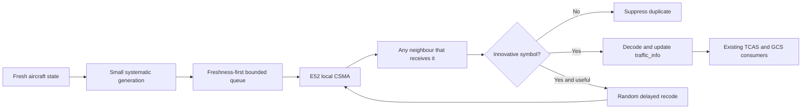
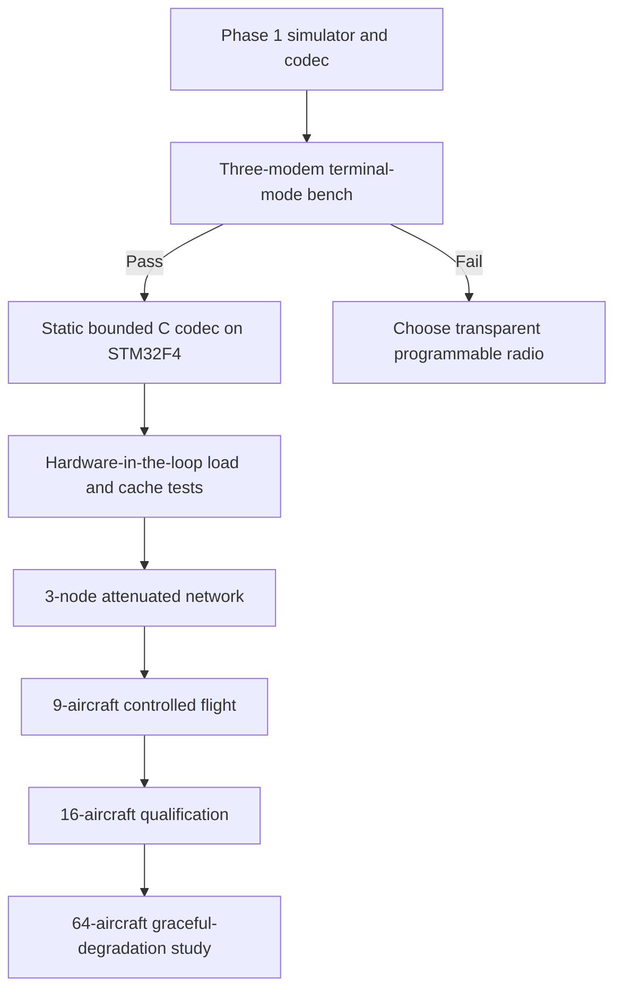

# Asynchronous Coded Mesh for Paparazzi UAV

> **Status: Phase 1 feasibility work, not flight firmware.**
>
> The codec, arbitrary-ID model, mobile-GCS model, and comparison simulator are
> implemented. The current airborne `MESH_STATE` transport still uses the
> self-organising TDMA design described in
> [mesh_network_design.md](mesh_network_design.md). Do not provision a flight
> fleet for coded mode until the three-modem gate in this guide passes.

This guide explains why an asynchronous coded mesh is being investigated, what
the EByte E52-400NW22S can realistically support, how to reproduce the current
results, and what must happen before the design can fly.

---

## Start Here

The project needs one network that behaves well across three very different
fleet sizes:

| Fleet | Design goal | Single-channel expectation |
| ---: | --- | --- |
| Up to 9 aircraft | Common case | Best freshness and useful redundancy |
| Up to 16 aircraft | Normal maximum | Qualified all-to-all traffic exchange |
| Up to 64 aircraft | Theoretical ceiling | Connected, bounded, graceful degradation |

The ground station is **AC_ID 0**, but it is not assumed to be fixed. It may be
on a car moving beside the aircraft. It receives all aircraft state and may
relay traffic just like another radio peer.

Aircraft AC_IDs are arbitrary distinct values in `1..254`. They need not be
sequential, dense, or sorted. ID `255` remains reserved for PPRZLink broadcast.

```text
Valid fleet:   0, 3, 19, 42, 101, 203, 254
Also valid:    0, 122, 7, 239, 56
Invalid:       0, 7, 7       duplicate identity
Invalid:       0, 7, 255     255 is broadcast, not an aircraft
```

### Try the experiment

From the repository root:

```bash
python3 sw/tools/mesh/mesh_coded_sim.py \
  --ac-ids 0,3,19,42,58,77,101,125,251 \
  --duration 120 --seed 7
```

The command runs two models over the same mobile geometry and fading process:

1. the current collision-free TDMA origination with E52 all-router flooding;
2. asynchronous systematic coding with local CSMA delays and software relays.

Read the **p95 Age of Information** first. It answers the operational question:
"How stale is another vehicle's state most of the time?" Packet count alone can
look excellent while the traffic table is old.

---

## Why This Design

The current mesh is robust, but GPS-synchronised slots make capacity rigid. A
small fleet cannot always use all available channel time, while GPS loss forces
a deliberately slow asynchronous fallback.

An asynchronous coded design changes the unit of reliability. A receiver does
not request a particular missing packet. It collects innovative combinations
from a small generation until that generation can be decoded.



The target is not "send every packet everywhere." The target is the freshest
useful state at every receiver with bounded airtime, memory, and CPU.

---

## What Is Implemented

### Small systematic generations

`mesh_coding.py` implements incremental Gaussian elimination over `GF(256)`.
The default generation contains two 22-byte state symbols:

1. send each original symbol systematically, so a directly received update is
   immediately useful;
2. send one sparse coded repair symbol;
3. allow a receiver to produce at most one randomized recoded symbol;
4. discard dependent symbols without forwarding them.

Generation size is deliberately small. Large generations improve coding
efficiency for bulk transfer but hold real-time state while a batch fills. For
traffic awareness, old complete data is generally less useful than newer
partial data.

### Opaque identities

`Membership` assigns dense local storage indexes in observation/configuration
order. No expression derives an index, slot, relay role, or priority from the
numeric AC_ID.

This invariant is covered by tests using deliberately irregular IDs, including
`0` and `254`. The provisioning tool also reports:

```text
TDMA slot     : learned at runtime; never derived from AC_ID
```

### Mobile GCS

The simulator moves AC_ID 0 around the perimeter of the operating area at a
configurable ground speed. The GCS:

- has the configured mast height;
- receives every aircraft source stream;
- participates in radio reception and forwarding;
- is excluded only from originating aircraft flight-state generations.

Use `--gcs-speed 0` for a stationary comparison.

### Bounded asynchronous forwarding

Every node has a five-entry software queue matching the E52 hardware cache
limit. Forwarding is controlled by:

- innovation: dependent combinations stop immediately;
- one forward per `(source, generation)` by default;
- randomized forwarding delay;
- hop TTL;
- generation expiry;
- population-adaptive forwarding probability;
- priority that places systematic source symbols before repairs and relays.

Current experimental defaults are:

| Aircraft | Source rate | Forward probability | Intended meaning |
| ---: | ---: | ---: | --- |
| 1-9 | 0.75 Hz | 0.15 | Fresh common-case operation |
| 10-16 | 0.40 Hz | 0.10 | Qualified-fleet candidate |
| 17-64 | 0.10 Hz | 0.01 | Graceful degradation only |

These are simulator inputs, not certified radio settings. They adapt by
observed/configured fleet population, never by AC_ID value.

---

## What the E52 Changes

The ideal RLNC literature often assumes that an intermediate node can receive,
inspect, recode, and transmit every hop. The current E52 setup does not expose
that control:

- `AT+TYPE=0` makes the modem itself relay broadcasts;
- every routing modem forwards a new broadcast once;
- Paparazzi cannot inspect or alter those internal relay copies;
- each modem has a five-frame transmit cache;
- cache overflow clears queued traffic;
- one 62.5 kbit/s half-duplex channel is shared by the whole fleet.

Therefore, **application-level recoding must not be enabled while every modem
also performs all-router broadcast flooding**. That combination pays both the
flood tax and the coding overhead.

A real coded transport requires E52 terminal mode (`AT+TYPE=1`) to preserve
broadcast delivery while leaving relaying to Paparazzi. This is plausible from
the modem interface, but it is not yet proven on hardware.

### Mandatory three-modem gate

Use three modems with arbitrary IDs, for example GCS `0`, aircraft `42`, and
aircraft `203`.

Preview the profiles first:

```bash
python3 sw/tools/mesh/e52_provision.py --ac-id 0   --node-type 1 --dry-run
python3 sw/tools/mesh/e52_provision.py --ac-id 42  --node-type 1 --dry-run
python3 sw/tools/mesh/e52_provision.py --ac-id 203 --node-type 1 --dry-run
```

Then test with RF attenuation or physical separation:

1. Confirm all three terminal nodes receive a direct broadcast.
2. Block the direct `42 -> 0` path and have Paparazzi on `203` rebroadcast it.
3. Confirm `0` receives the software-relayed frame and that the E52 does not
   create another hidden relay copy.
4. Measure UART-to-air latency, CSMA delay, duplicate behavior, and cache depth.
5. Inject bursts until the admission controller drops stale work; the modem
   must never report `OUT OF CACHE`.
6. Repeat with the GCS moving and with each radio acting as the middle relay.

If terminal-mode broadcast does not permit this behavior, stop. True per-hop
recoding then requires a transparent or programmable radio; endpoint-only
coding over E52 flooding will not deliver the expected multi-hop gain.

---

## Reading the Results

The simulator reports:

| Metric | Why it matters |
| --- | --- |
| Unique delivery ratio | Fraction of possible source-to-peer samples received |
| AoI p50/p95/p99 | Typical and tail state staleness |
| Mobile-GCS AoI p95 | Whether the moving ground peer remains operationally current |
| Collided receptions | Cost of asynchronous overlap and hidden terminals |
| Queue drops | Whether stale or excess work exceeds bounded buffers |
| Aggregate radio airtime | Sum of transmissions across all radios, not per-radio duty |

Example from an irregular eight-aircraft fleet plus moving GCS, seed 7, 30 s:

| Model | Delivery | p95 AoI | GCS p95 AoI | Aggregate airtime |
| --- | ---: | ---: | ---: | ---: |
| Idealized current TDMA flood | 1.000 | 3.64 s | 3.64 s | 37.8% |
| Asynchronous coded gossip | 0.933 | 2.66 s | 2.66 s | 30.0% |

This result shows a promising trade: fresher state with fewer modeled radio
transmissions, at the cost of some missing historical samples. It does **not**
prove flight readiness. The asynchronous collision model is simplified and
the E52 terminal-mode assumption remains unverified.

For 64 aircraft, the model intentionally reduces source and relay rates. A
single channel cannot provide high-rate all-to-all state for 64 sources. The
64-aircraft requirement means bounded operation and useful emergency/state
propagation, not multi-hertz service. High-rate service at that scale requires
independent channels or radios and a new RF/regulatory budget.

---

## Reproduce and Explore

Run the regression tests:

```bash
python3 sw/tools/mesh/test_mesh_coding.py -v
make -C tests/utils test
```

Compare common, normal-maximum, and theoretical fleets:

```bash
python3 sw/tools/mesh/mesh_coded_sim.py --aircraft 9  --duration 600 --seed 1
python3 sw/tools/mesh/mesh_coded_sim.py --aircraft 16 --duration 600 --seed 1
python3 sw/tools/mesh/mesh_coded_sim.py --aircraft 64 --duration 600 --seed 1
```

Prove the result is not tied to sequential IDs:

```bash
python3 sw/tools/mesh/mesh_coded_sim.py \
  --ac-ids 0,203,3,101,42,254,19 --duration 600 --seed 7
```

Useful experiments:

```bash
# Stationary versus moving GCS
python3 sw/tools/mesh/mesh_coded_sim.py --aircraft 9 --gcs-speed 0
python3 sw/tools/mesh/mesh_coded_sim.py --aircraft 9 --gcs-speed 20

# Wider operating area
python3 sw/tools/mesh/mesh_coded_sim.py \
  --aircraft 16 --width 11000 --height 11000 --duration 1200

# Explicit load sweep
python3 sw/tools/mesh/mesh_coded_sim.py \
  --aircraft 9 --source-rate 0.6 --forward-probability 0.1
```

Use several seeds and compare tail AoI, queue drops, and aggregate airtime.
Never select a profile from one favorable run.

---

## Research Ideas Kept and Rejected

The implementation borrows mechanisms, not headline claims.

### Kept because they fit the hardware

- **Random linear network coding:** receivers care about innovative rank rather
  than exact packet identity.
- **Systematic coding:** uncoded fresh state is immediately useful when direct
  reception succeeds.
- **Batched sparse coding:** small bounded batches and sparse combinations cap
  memory and arithmetic.
- **Opportunistic forwarding:** any successful receiver may help, but only
  after randomized delay and probabilistic suppression.
- **Age of Information:** optimize freshness and discard stale work instead of
  maximizing eventual packet completion.
- **Trickle-style suppression:** reduce redundant forwarding as population and
  overheard consistency increase. Phase 1 approximates this with innovation
  checks and population-adaptive forwarding probability.

### Deferred until the modem exposes enough information

- RSSI-ranked forwarder election: the current serial framing does not provide
  reliable per-packet neighbour RSSI to Paparazzi.
- Carrier-sense scheduling in flight code: E52 performs CSMA internally; no
  clear-channel assessment API is available to the autopilot.
- Per-generation rank feedback: feedback from every receiver would recreate an
  ACK storm. Compact aggregate feedback can be studied after terminal-mode
  forwarding works.
- Full BATS outer-code optimization: worthwhile for larger transfers, but the
  current traffic consists of short-lived state where batching delay dominates.
- Zenoh or NATS onboard: useful as ground-side bridges, but inappropriate in the
  STM32 flight-controller data path.

### Primary references

- T. Ho et al., *A Random Linear Network Coding Approach to Multicast*, IEEE
  Transactions on Information Theory, 2006,
  <https://doi.org/10.1109/TIT.2005.850152>.
- S. Chachulski et al., *Trading Structure for Randomness in Wireless
  Opportunistic Routing (MORE)*, SIGCOMM 2007,
  <https://people.csail.mit.edu/katabi/papers/more-sigcomm07.pdf>.
- S. Yang and R. W. Yeung, *Batched Sparse Codes*, IEEE Transactions on
  Information Theory, 2014, <https://arxiv.org/abs/1206.5365>.
- R. D. Yates et al., *Age of Information: An Introduction and Survey*, 2020,
  <https://arxiv.org/abs/2007.08564>.
- P. Levis et al., *The Trickle Algorithm*, RFC 6206,
  <https://www.rfc-editor.org/rfc/rfc6206>.

---

## Path to Flight



Before flight firmware is accepted:

- [ ] Terminal-mode software relay behavior is measured on three E52 modems.
- [ ] The codec is ported to allocation-free C with fixed compile-time bounds.
- [ ] CPU, stack, flash, and static RAM are measured on Lisa/MX STM32F4.
- [ ] Malformed coefficients, generation wraparound, and stale packets are tested.
- [ ] Priority traffic preempts diagnostics and repair symbols.
- [ ] Five-frame cache overflow remains zero under burst and partition tests.
- [ ] GCS movement and all arbitrary-ID permutations preserve behavior.
- [ ] Nine-aircraft and sixteen-aircraft multi-seed AoI gates pass.
- [ ] Legacy `mesh` mode remains available until coded mode is flight-qualified.
- [ ] Firmware and modem profiles are deployed atomically across the fleet.

The next implementation step is the three-modem gate. It decides whether the
existing E52 can support true per-hop recoding or whether the radio, rather
than the network algorithm, is the limiting abstraction.
