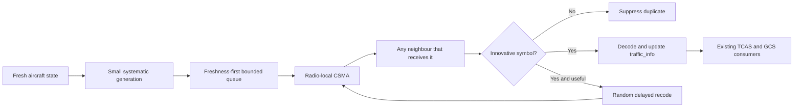
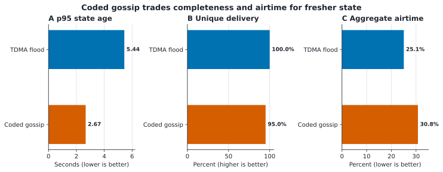
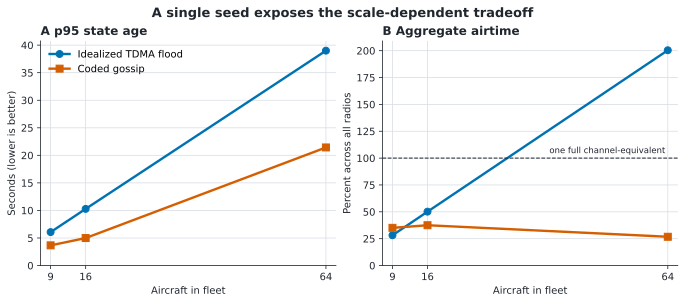
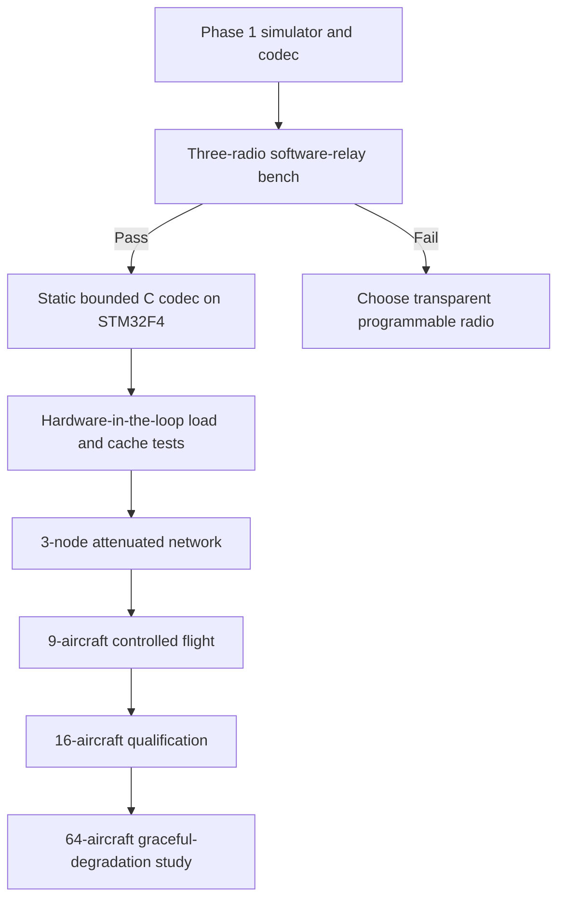

# Beyond Slots: An Asynchronous Coded Mesh for UAV Fleets

**Author:** Mr. E.van der Horst
**Project:** Paparazzi UAV broadcast mesh research
**Document status:** Phase 1 feasibility study; not flight firmware

> **Status: Phase 1 feasibility work, not flight firmware.**
>
> The codec, arbitrary-ID model, mobile-GCS model, and comparison simulator are
> implemented. The current airborne `MESH_STATE` transport still uses the
> self-organising TDMA design described in
> [mesh_network_design.md](mesh_network_design.md). Do not provision a flight
> fleet for coded mode until the three-radio gate in this guide passes.

This guide asks a deliberately ambitious question: can a fleet exchange fresher
state without relying on synchronized transmission slots? It explains the
generic coded-mesh idea, the radio capabilities it requires, how to reproduce
the current results, and what must happen before the design can fly. The present
bench plan uses EByte E52-400NW22S hardware because that is the available tested
reference, not because asynchronous coding belongs to one product family.

## Acknowledgements

This study owes its vocabulary and tools to generations of scientists working
on information theory, wireless networks, distributed algorithms, estimation,
and embedded control. Their results turn a difficult radio experiment into a
question that can at least be asked precisely, which is already considerable
progress.

Particular thanks go to the Paparazzi Autopilot developers and maintainers.
Paparazzi provides the flight architecture, message generation, simulation
environment, and open implementation surface on which this experiment rests.
The visible code is only the latest layer; the accumulated engineering beneath
it is what makes new research affordable.

In *Eve's Diary*, Mark Twain writes, “It is best to prove things by actual
experiment; then you KNOW; whereas if you depend on guessing and supposing and
conjecturing, you never get educated.” The coded mesh remains on the “finding
out” side of that distinction. A simulator may be persuasive, but it has never
had to share a real channel with twelve impatient radios.

---

## The Problem: Fresh State Without a Shared Clock

The project needs one network that behaves well across three very different
fleet sizes:

| Fleet | Design goal | Single-channel expectation |
| ---: | --- | --- |
| Up to 9 aircraft | Common case | Best freshness and useful redundancy |
| Up to 16 aircraft | Normal maximum | Candidate all-to-all traffic exchange requiring qualification |
| Up to 64 aircraft | Theoretical ceiling | Connected, bounded, graceful degradation |

The ground station is **AC_ID 0**, but it is not assumed to be fixed. It may be
on a car moving beside the aircraft. It receives all aircraft state and may
relay traffic just like another radio peer.

Aircraft AC_IDs are arbitrary distinct values in `1..254`. They need not be
sequential, dense, or sorted. ID `255` remains reserved for PPRZLink broadcast.

```text
Valid fleet:   0, 3, 19, 42, 101, 203, 254
Also valid:    0, 122, 7, 239, 56
Invalid:       0, 7, 7       duplicate identity
Invalid:       0, 7, 255     255 is broadcast, not an aircraft
```

### Run the idea before believing it

From the repository root:

```bash
python3 sw/tools/mesh/mesh_coded_sim.py \
  --ac-ids 0,3,19,42,58,77,101,125,251 \
  --duration 120 --seed 7
```

The command runs two models over the same mobile geometry and fading process:

1. an idealized collision-free TDMA origination with reference all-router flooding;
2. asynchronous systematic coding with local CSMA delays and software relays.

Read the **p95 Age of Information** first. Age of Information, or AoI, is the
time elapsed since the newest useful state at a receiver was generated. It
answers the operational question: “How stale is another vehicle's state most
of the time?” Packet count alone can look excellent while the traffic table is
quietly becoming archaeology.

---

## Why Coding Might Beat Retries

The current mesh is robust, but GPS-synchronised slots make capacity rigid. A
small fleet cannot always use all available channel time, while GPS loss forces
a deliberately slow asynchronous fallback.

An asynchronous coded design changes the unit of reliability. A receiver does
not request a particular missing packet. It collects innovative combinations
from a small generation until that generation can be decoded. This is random
linear network coding (RLNC): packets carry linear combinations over a finite
field, and every independent combination adds one useful equation. Once enough
independent equations arrive, the originals can be reconstructed. The radio
network gets several valid ways to repair loss instead of chasing one named
packet with an ACK storm.



The target is not "send every packet everywhere." The target is the freshest
useful state at every receiver with bounded airtime, memory, and CPU.

---

## What Exists Today

### Small generations, because stale perfection is still stale

`mesh_coding.py` implements incremental Gaussian elimination over `GF(256)`.
The default generation contains two 22-byte state symbols:

1. send each original symbol systematically, so a directly received update is
   immediately useful;
2. send one sparse coded repair symbol;
3. allow a receiver to produce at most one randomized recoded symbol;
4. discard dependent symbols without forwarding them.

Generation size is deliberately small. Large generations improve coding
efficiency for bulk transfer but hold real-time state while a batch fills. For
traffic awareness, old complete data is generally less useful than newer
partial data.

### Aircraft IDs are identities, not array indexes

`Membership` assigns dense local storage indexes in observation/configuration
order. No expression derives an index, slot, relay role, or priority from the
numeric AC_ID.

This invariant is covered by tests using deliberately irregular IDs, including
`0` and `254`. The provisioning tool also reports:

```text
TDMA slot     : learned at runtime; never derived from AC_ID
```

### The ground station is allowed to move

The simulator moves AC_ID 0 around the perimeter of the operating area at a
configurable ground speed. The GCS:

- has the configured mast height;
- receives every aircraft source stream;
- participates in radio reception and forwarding;
- is excluded only from originating aircraft flight-state generations.

Use `--gcs-speed 0` for a stationary comparison.

### Forward opportunistically, but with limits

Every simulated node has a five-entry software queue configured to the same
nominal depth as the reference-radio transmit cache. A different radio requires
a newly measured bound.
Forwarding is controlled by:

- innovation: dependent combinations stop immediately;
- one forward per `(source, generation)` by default;
- randomized forwarding delay;
- hop TTL;
- generation expiry;
- population-adaptive forwarding probability;
- priority that places systematic source symbols before repairs and relays.

Current experimental defaults are:

| Aircraft | Source rate | Forward probability | Intended meaning |
| ---: | ---: | ---: | --- |
| 1-9 | 0.75 Hz | 0.15 | Fresh common-case operation |
| 10-16 | 0.40 Hz | 0.10 | Qualified-fleet candidate |
| 17-64 | 0.10 Hz | 0.01 | Graceful degradation only |

These are simulator inputs, not certified radio settings. They adapt by
observed/configured fleet population, never by AC_ID value.

---

## The Radio Capability Boundary

The ideal RLNC literature often assumes that an intermediate node can receive,
inspect, recode, and transmit every hop. A suitable radio must therefore expose
received broadcast frames to Paparazzi and permit bounded software forwarding
without also creating hidden duplicate relays. The tested EByte routing profile
does not expose that control:

- `AT+TYPE=0` makes the reference radio itself relay broadcasts;
- every routing radio forwards a new broadcast once;
- Paparazzi cannot inspect or alter those internal relay copies;
- each radio has a five-frame transmit cache;
- cache overflow clears queued traffic;
- one 62.5 kbit/s half-duplex channel is shared by the whole fleet.

Therefore, **application-level recoding must not be enabled while every radio
also performs all-router broadcast flooding**. That combination pays both the
flood tax and the coding overhead.

A real coded transport requires transparent broadcast reception with relaying
left to Paparazzi. On the reference hardware, terminal mode (`AT+TYPE=1`) may
provide that service, but it is not yet proven on hardware. Another radio may
be preferable if it exposes received frames, queue state, and transmission
control directly.

### The mandatory three-radio gate

Use three radios with arbitrary IDs, for example GCS `0`, aircraft `42`, and
aircraft `203`. The commands below apply only to the EByte reference bench;
another product needs equivalent provisioning and readback.

Preview the profiles first:

```bash
python3 sw/tools/mesh/e52_provision.py --ac-id 0   --node-type 1 --dry-run
python3 sw/tools/mesh/e52_provision.py --ac-id 42  --node-type 1 --dry-run
python3 sw/tools/mesh/e52_provision.py --ac-id 203 --node-type 1 --dry-run
```

Then test with RF attenuation or physical separation:

1. Confirm all three terminal nodes receive a direct broadcast.
2. Block the direct `42 -> 0` path and have Paparazzi on `203` rebroadcast it.
3. Confirm `0` receives the software-relayed frame and that the reference radio does not
   create another hidden relay copy.
4. Measure UART-to-air latency, CSMA delay, duplicate behavior, and cache depth.
5. Inject bursts until the admission controller drops stale work; the radio
   must never report `OUT OF CACHE`.
6. Repeat with the GCS moving and with each radio acting as the middle relay.

If terminal-mode broadcast does not permit this behavior, stop. True per-hop
recoding requires a transparent or programmable radio; endpoint-only coding
over hidden hardware flooding will not deliver the expected multi-hop gain.

---

## Read Freshness First, Packet Counts Second

The simulator reports:

| Metric | Why it matters |
| --- | --- |
| Unique delivery ratio | Fraction of possible source-to-peer samples received |
| AoI p50/p95/p99 | Typical and tail state staleness |
| Mobile-GCS AoI p95 | Whether the moving ground peer remains operationally current |
| Collided receptions | Cost of asynchronous overlap and hidden terminals |
| Queue drops | Whether stale or excess work exceeds bounded buffers |
| Aggregate radio airtime | Sum of transmissions across all radios, not per-radio duty |

Example from an irregular eight-aircraft fleet plus moving GCS, seed 7, 120 s,
using the command above:

| Model | Delivery | p95 AoI | GCS p95 AoI | Aggregate airtime |
| --- | ---: | ---: | ---: | ---: |
| Idealized current TDMA flood | 1.000 | 5.44 s | 5.44 s | 25.1% |
| Asynchronous coded gossip | 0.950 | 2.67 s | 2.67 s | 30.8% |



*Figure 1. Same irregular eight-aircraft fleet plus moving GCS as the table:
seed 7, 120 s. All bars start at zero. These are outputs from the simplified
simulator, not confidence intervals or physical-radio measurements.*

This result shows a promising trade: fresher state at the cost of lower sample
delivery and greater modeled aggregate airtime. It does **not** prove flight
readiness. The asynchronous collision model is simplified and the
reference-radio terminal-mode assumption remains unverified.

For 64 aircraft, the model intentionally reduces source and relay rates. A
single channel cannot provide high-rate all-to-all state for 64 sources. The
64-aircraft requirement means bounded operation and useful emergency/state
propagation, not multi-hertz service. High-rate service at that scale requires
independent channels or radios and a new RF/regulatory budget.



*Figure 2. One 120 s run at seed 7 for each configured fleet size. Aggregate
airtime sums transmissions across radios, so values above 100% expose an
infeasible channel-equivalent load rather than a per-radio duty cycle. The
single-seed lines illustrate scaling and are not population estimates.*

---

## Reproduce It, Then Try to Break It

Run the regression tests:

```bash
python3 sw/tools/mesh/test_mesh_coding.py -v
make -C tests/utils test

# Regenerate all paper figures (SVG and PNG)
python3 sw/tools/mesh/mesh_paper_plots.py

# Build both styled, optimized PDF papers
python3 sw/tools/mesh/build_mesh_papers.py
```

Compare common, normal-maximum, and theoretical fleets:

```bash
python3 sw/tools/mesh/mesh_coded_sim.py --aircraft 9  --duration 600 --seed 1
python3 sw/tools/mesh/mesh_coded_sim.py --aircraft 16 --duration 600 --seed 1
python3 sw/tools/mesh/mesh_coded_sim.py --aircraft 64 --duration 600 --seed 1
```

Prove the result is not tied to sequential IDs:

```bash
python3 sw/tools/mesh/mesh_coded_sim.py \
  --ac-ids 0,203,3,101,42,254,19 --duration 600 --seed 7
```

Useful experiments:

```bash
# Stationary versus moving GCS
python3 sw/tools/mesh/mesh_coded_sim.py --aircraft 9 --gcs-speed 0
python3 sw/tools/mesh/mesh_coded_sim.py --aircraft 9 --gcs-speed 20

# Wider operating area
python3 sw/tools/mesh/mesh_coded_sim.py \
  --aircraft 16 --width 11000 --height 11000 --duration 1200

# Explicit load sweep
python3 sw/tools/mesh/mesh_coded_sim.py \
  --aircraft 9 --source-rate 0.6 --forward-probability 0.1
```

Use several seeds and compare tail AoI, queue drops, and aggregate airtime.
Never select a profile from one favorable run.

---

## Ideas That Survived Contact with the Constraints

The implementation borrows mechanisms, not headline claims.

### Kept because they fit bounded embedded hardware

- **Random linear network coding:** receivers care about innovative rank rather
  than exact packet identity.
- **Systematic coding:** uncoded fresh state is immediately useful when direct
  reception succeeds.
- **Batched sparse coding:** small bounded batches and sparse combinations cap
  memory and arithmetic.
- **Opportunistic forwarding:** any successful receiver may help, but only
  after randomized delay and probabilistic suppression.
- **Age of Information:** optimize freshness and discard stale work instead of
  maximizing eventual packet completion.
- **Trickle-style suppression:** reduce redundant forwarding as population and
  overheard consistency increase. Phase 1 approximates this with innovation
  checks and population-adaptive forwarding probability.

### Deferred until the radio exposes enough information

- RSSI-ranked forwarder election: the current serial framing does not provide
  reliable per-packet neighbour RSSI to Paparazzi.
- Carrier-sense scheduling in flight code: the reference radio performs CSMA internally; no
  clear-channel assessment API is available to the autopilot.
- Per-generation rank feedback: feedback from every receiver would recreate an
  ACK storm. Compact aggregate feedback can be studied after terminal-mode
  forwarding works.
- Full BATS outer-code optimization: worthwhile for larger transfers, but the
  current traffic consists of short-lived state where batching delay dominates.
- Zenoh or NATS onboard: useful as ground-side bridges, but inappropriate in the
  STM32 flight-controller data path.

## Conclusion: What Phase 1 Has Actually Answered

The opening question was whether a UAV fleet could exchange fresher state
without depending on synchronized slots. Phase 1 answers the software-model
feasibility question with a conditional **yes**. Small systematic generations, innovation-based
suppression, bounded queues, arbitrary aircraft identities, mobile-GCS support,
and Age-of-Information evaluation are implemented. Under the recorded model,
the coded approach reduces tail state age relative to the comparison TDMA flood,
while using more aggregate transmissions in the reproduced 120-second run.

It also exposes the decisive limitation: useful per-hop recoding requires a
radio interface that gives Paparazzi control of forwarding. Hidden hardware
flooding plus application-level coding pays for both mechanisms and is not the
proposed solution. The three-radio gate therefore satisfies an important part
of the problem statement by turning “perhaps the radio can do this” into a
binary, measurable engineering question.

This is a successful feasibility result, not a flight-readiness result. The
codec still needs bounded C implementation, embedded resource measurements,
real collision and queue data, and staged fleet qualification. The honest
conclusion is stronger than an optimistic one: the idea is specific enough to
test, promising enough to continue, and constrained enough to know what could
disprove it.

---

## The Evidence Still Needed Before Flight



Before flight firmware is accepted:

- [ ] Software-relay behavior is measured on three radios; the current reference bench uses EByte terminal mode.
- [ ] The codec is ported to allocation-free C with fixed compile-time bounds.
- [ ] CPU, stack, flash, and static RAM are measured on Lisa/MX STM32F4.
- [ ] Malformed coefficients, generation wraparound, and stale packets are tested.
- [ ] Priority traffic preempts diagnostics and repair symbols.
- [ ] Five-frame cache overflow remains zero under burst and partition tests.
- [ ] GCS movement and all arbitrary-ID permutations preserve behavior.
- [ ] Nine-aircraft and sixteen-aircraft multi-seed AoI gates pass.
- [ ] Legacy `mesh` mode remains available until coded mode is flight-qualified.
- [ ] Firmware and radio profiles are deployed atomically across the fleet.

The next implementation step is the three-radio gate. It decides whether the
existing reference hardware can support true per-hop recoding or whether a more
transparent radio is required. Either outcome is useful: discovering the wrong
hardware abstraction on a bench is considerably cheaper than discovering it in
formation flight.

---

## Literature and Research Foundations

These works motivate the research direction; they do not constitute evidence
that the Phase 1 design is flight-ready. The simulator, codec tests, and future
radio measurements remain the evidence for this particular implementation.

1. R. Ahlswede, N. Cai, S.-Y. R. Li, and R. W. Yeung, “Network Information
  Flow,” *IEEE Transactions on Information Theory*, vol. 46, no. 4,
  pp. 1204-1216, 2000. This paper established that coding inside a network can
  attain multicast capacity beyond routing alone.
2. T. Ho, M. Médard, R. Koetter, D. R. Karger, M. Effros, J. Shi, and
  B. Leong, “A Random Linear Network Coding Approach to Multicast,”
  *IEEE Transactions on Information Theory*, vol. 52, no. 10,
  pp. 4413-4430, 2006. It is the direct foundation for random coefficients,
  innovative rank, and probabilistic decoding in RLNC.
3. S. Chachulski, M. Jennings, S. Katti, and D. Katabi, “Trading Structure for
  Randomness in Wireless Opportunistic Routing,” *Proceedings of ACM SIGCOMM*,
  (2007). The MORE protocol joins opportunistic reception with intra-flow coding
  and is the closest classic precedent for letting any useful receiver advance
  a wireless flow.
4. S. Yang and R. W. Yeung, “Batched Sparse Codes,” *IEEE Transactions on
  Information Theory*, vol. 60, no. 9, pp. 5322-5346, 2014. Bounded batches
  and sparse combinations inform the paper's attempt to cap state, arithmetic,
  and repair cost on an embedded target.
5. S. Kaul, R. Yates, and M. Gruteser, “Real-Time Status: How Often Should One
  Update?” *Proceedings of IEEE INFOCOM*, 2012. This work develops Age of
  Information as a freshness metric, motivating the simulator's p95 AoI gate
  instead of treating delivered packet count as the objective.
6. P. Levis, T. Clausen, J. Hui, O. Gnawali, and J. Ko,
  [*The Trickle Algorithm*, RFC 6206](https://www.rfc-editor.org/rfc/rfc6206),
  March 2011. Trickle's density-aware redundancy suppression is the precedent
  for reducing repeated forwarding when peers have already heard consistent
  information.
7. T. Clausen and P. Jacquet, [*Optimized Link State Routing Protocol (OLSR)*,
  RFC 3626](https://www.rfc-editor.org/rfc/rfc3626), October 2003. Its
  duplicate sets, jittered forwarding, and multipoint-relay design provide a
  routing-based comparison to coded opportunistic dissemination.
8. Paparazzi UAV contributors, [*Paparazzi UAS documentation*](https://docs.paparazziuav.org/latest/).
  Paparazzi defines the flight and ground architecture, message transport, and
  embedded constraints within which any coded mode must eventually operate.
9. EByte, [*E52-xxxNWxxS User Manual, version 1.4*](E52-xxxNWxxS_UserManual_EN_v1.4-4.pdf).
  The manual describes the available reference hardware. It is included to
  make the three-radio gate reproducible, not to imply that hidden hardware
  flooding can perform application-level recoding.
10. Mark Twain, [*Eve's Diary*](https://www.gutenberg.org/ebooks/8525), 1906.
   Its preference for experiment over conjecture captures the paper's central
   boundary: promising simulation results justify the next measurement, not a
   flight-readiness claim.
