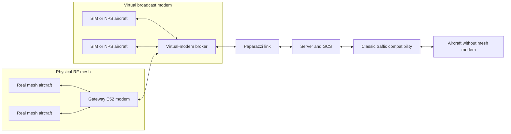

# Hybrid Real and Simulated Traffic Domain

**Project:** Paparazzi UAV broadcast mesh and TCAS integration  
**Document status:** Proposed future implementation guide  
**Audience:** Airborne, simulation, ground-segment, test, and flight-operations developers  
**Scope:** Logical transport and traffic interoperability; RF impairment modelling is optional and out of scope for the first implementation

> **Future design, not flighted behavior:** this document specifies an addition
> that has not yet been implemented or qualified. It deliberately separates
> requirements, proposed mechanisms, acceptance evidence, and open decisions.
> Nothing in this document should be represented as current flight capability
> until the corresponding acceptance gates have passed.

## Introduction

Paparazzi can run the same flight software on a physical autopilot, in the
basic simulator, or in the New Paparazzi Simulator. The remaining difference
for live cooperative traffic is the modem boundary. A real mesh aircraft sends
PPRZLink frames through a UART-connected radio; a simulated aircraft currently
sends them through a simulator-specific ground link. Those paths let each
environment work independently, but they do not yet create one shared medium
where real and simulated aircraft can discover one another and perform live
Traffic Alert and Collision Avoidance System interactions.

This guide defines a virtual broadcast modem and physical-radio gateway that
join those environments without moving mesh behavior into the simulator or
ground station. Airborne code continues to originate, receive, validate, and
act on the same PPRZLink frames. Target selection changes only the device below
that protocol:

| Build target | Default device | Medium |
| --- | --- | --- |
| Physical autopilot | UART | EByte E52 or another qualified transparent modem |
| `sim` | Virtual-modem client | Brokered local or network transport |
| `nps` | Virtual-modem client | Brokered local or network transport |

The same traffic domain can also include aircraft without a mesh modem. Those
aircraft use Paparazzi's established `ACINFO` or `ACINFO_LLA` compatibility
path through their normal ground link. Mesh-capable receivers prefer fresh
`MESH_STATE`; legacy receivers use classic traffic messages. This gives a
transition fleet useful mutual awareness without claiming that a
ground-dependent legacy link has the same availability as an onboard mesh
radio.

The intended result is simple to operate: choose AP, SIM, or NPS; assign a
unique aircraft ID; start the virtual modem when simulation is involved; and
run the normal ground services. There must be no simulation flag in airborne
traffic or TCAS logic.

## 1. Executive Overview

### 1.1 The proposal in one diagram



The virtual-modem broker owns the shared-medium behavior. Every connected
endpoint has a separate point-to-point connection to the broker. The broker
extracts complete PPRZLink frames from each input and forwards the original
frame bytes according to the endpoint role. It does not decode `MESH_STATE`,
change sender IDs, generate TCAS decisions, or rewrite checksums.

The physical-radio adapter is one endpoint. It owns the gateway modem's serial
port, converts its byte stream into complete PPRZLink frames, and presents
those frames to the broker. It also writes broker-selected outbound frames to
the modem. Only one process may own the serial port.

The Paparazzi link is another endpoint. It receives one copy of every aircraft
frame for normal telemetry processing and sends ground-originated PPRZLink
frames once to the broker. A dedicated broker mode is preferable to emulating
multiple UDP aircraft behind one address because the current UDP broadcast
path may send the same broadcast once per known aircraft.

### 1.2 Why this is the right boundary

This solution is strong because it replaces the radio, not the mesh protocol:

* Airborne `traffic_info`, TCAS, telemetry scheduling, sender identity, source
  precedence, freshness, and fail-closed behavior remain authoritative.
* AP, SIM, and NPS consume and produce the same PPRZLink frames.
* The GCS observes traffic but does not impersonate an aircraft by rebuilding
  `MESH_STATE` with a ground sender ID.
* A dedicated broker makes loop prevention, endpoint identity, queue limits,
  recording, and fault injection explicit and testable.
* Physical and simulated aircraft can interact in real time on one logical
  traffic domain.
* Existing `ACINFO` and `ACINFO_LLA` behavior provides a controlled migration
  path for aircraft without mesh hardware.
* RF modelling can be added later without changing airborne APIs or message
  semantics.

The architecture follows a useful systems-engineering rule: keep policy at
the layer that owns it and make boundaries observable. The broker owns medium
fan-out. Airborne code owns flight behavior. The server owns classic traffic
projection. The radio owns RF forwarding.

## 2. Normative Language and Abbreviations

The words **MUST**, **MUST NOT**, **SHOULD**, **SHOULD NOT**, and **MAY** are
used as described by RFC 2119 and RFC 8174 when written in uppercase. A MUST is
an acceptance condition, not a preference.

| Abbreviation | Meaning |
| --- | --- |
| AC | Aircraft |
| AC_ID | Paparazzi aircraft identity, valid for aircraft in the range 1 through 254 |
| AP | Physical autopilot build target |
| API | Application Programming Interface |
| CSMA | Carrier-Sense Multiple Access |
| FDM | Flight Dynamics Model |
| GCS | Ground Control Station |
| GNSS | Global Navigation Satellite System |
| HIL | Hardware-in-the-Loop |
| ID | Identifier |
| NPS | New Paparazzi Simulator |
| PPRZLink | Paparazzi binary message and transport protocol |
| RA | Resolution Advisory |
| RF | Radio Frequency |
| SIM | Paparazzi basic simulator target |
| SITL | Software-in-the-Loop |
| TA | Traffic Advisory |
| TCAS | Traffic Alert and Collision Avoidance System |
| TDMA | Time-Division Multiple Access |
| TOW | GNSS Time of Week |
| UART | Universal Asynchronous Receiver-Transmitter |
| UDP | User Datagram Protocol |
| VM | Virtual Modem |

## 3. Goals, Non-Goals, and Claims

### 3.1 Goals

The implementation MUST:

1. Let real mesh aircraft, SIM aircraft, and NPS aircraft exchange exact
   PPRZLink frames in real time.
2. Preserve each original PPRZLink sender ID, receiver ID, class, message ID,
   payload, and checksum.
3. Keep airborne mesh and TCAS behavior identical across AP, SIM, and NPS
   builds, apart from target-selected device and architecture code.
4. Support live TCAS interactions between physical and simulated aircraft.
5. Let aircraft without a mesh modem receive compatible traffic through their
   normal Paparazzi link.
6. Make loop prevention, source exclusion, queue bounds, endpoint identity,
   health, and failure behavior explicit.
7. Preserve ordinary non-mesh operation when the virtual modem is absent.
8. Provide reproducible tests, recordings, operational checks, and a staged
   flight-qualification path.

### 3.2 Non-goals for the first implementation

The first implementation does not need to:

* Model propagation loss, fading, antenna patterns, terrain, interference, or
  RF capture effects.
* Claim that several simulated aircraft sharing one gateway modem reproduce
  several independent airborne radios.
* Replace `MESH_STATE`, `ACINFO`, `ACINFO_LLA`, or existing TCAS algorithms.
* Create a new aircraft-position estimator in the broker or GCS.
* Make legacy, ground-dependent traffic delivery equivalent to autonomous
  air-to-air mesh delivery.
* Support accelerated simulation while connected to live aircraft.
* Provide Internet-facing operation.

### 3.3 Permitted claims after implementation

Claims MUST be tied to passed evidence:

* **Logical interoperability** means original PPRZLink frames cross physical
  and virtual media with correct source, destination, order policy, and bounded
  latency.
* **Live mixed TCAS** means wall-clock simulation and physical aircraft have
  demonstrated mutual tracks, advisories, coordinated resolution, and safe
  stale-track behavior.
* **RF fidelity** may only be claimed after independent radios, queues,
  locations, propagation, and relay behavior have been represented and tested.

## 4. Must-Have Requirements

| ID | Requirement | Verification |
| --- | --- | --- |
| VM-001 | Airborne message producers and consumers are unchanged by target | Source comparison and AP/SIM/NPS build inspection |
| VM-002 | The broker forwards original complete frame bytes | Golden-frame byte comparison |
| VM-003 | A frame is not returned to its source endpoint | Directed fan-out test |
| VM-004 | RF ingress is not retransmitted to the same RF adapter | Gateway loop test |
| VM-005 | One logical ground broadcast enters the medium once | Broadcast-count test |
| VM-006 | Duplicate AC_ID claims are rejected before data forwarding | Registration test |
| VM-007 | Endpoint queues and frame sizes are statically bounded | Review, stress test, and memory instrumentation |
| VM-008 | Disconnect and reconnect never replay stale queued traffic | Reconnect test |
| VM-009 | Invalid framing and checksum failures are counted and dropped | Parser fuzz and corruption tests |
| VM-010 | Mixed live operation requires real-time simulation and aligned GNSS TOW | Startup interlock and runbook check |
| VM-011 | Mesh-capable receivers prefer active mesh tracks over classic duplicates | Existing traffic policy regression plus integration test |
| VM-012 | Legacy receivers obtain mesh and simulated traffic through classic projection | End-to-end legacy integration test |
| VM-013 | RA coordination works across every supported medium pairing | Pairwise TCAS scenario matrix |
| VM-014 | Normal AP-only and non-mesh workflows remain unchanged | Compatibility builds and smoke tests |
| VM-015 | Physical RF transmission requires an explicit operator enable | Negative startup test |
| VM-016 | All forwarding decisions and drops are observable without payload rewriting | Metrics and recording test |
| VM-017 | No new unbounded allocation occurs in an airborne periodic or receive path | Static review and long soak |
| VM-018 | This work introduces no `memcpy`, `memmove`, or equivalent bulk-copy call in airborne mesh paths | Source check |

## 5. Architecture

### 5.1 Components and ownership

| Component | Owns | Must not own |
| --- | --- | --- |
| Airborne traffic modules | State origination, parsing, source precedence, freshness | Medium fan-out or simulator discovery |
| Airborne TCAS | Track qualification, TA/RA decisions, fail-closed behavior | Transport bridging |
| Virtual-modem client | Target-specific connection and bounded byte I/O | Mesh semantics |
| Virtual-modem broker | Endpoint registry, frame fan-out, queue policy, tracing | Aircraft state estimation or TCAS policy |
| Physical-radio adapter | Exclusive serial ownership and exact frame ingress/egress | GCS message projection |
| Paparazzi link adapter | Ground uplink/downlink connection to the broker | Peer-frame rebroadcast policy |
| Paparazzi server | Aircraft state, `MESH_STATUS` consumption, classic traffic generation | Native mesh impersonation |

### 5.2 Data plane

Each endpoint SHOULD use a dedicated full-duplex connection to the broker. A
local Unix-domain sequenced-packet socket is preferred on one host. A framed
TCP connection MAY be supported for trusted multi-host laboratories. Plain
shared-port UDP SHOULD NOT be the primary design because delivery semantics,
source exclusion, endpoint registration, and broadcast duplication become
platform-dependent.

The broker envelope is outside PPRZLink and MUST NOT alter its frame. A minimal
versioned envelope should contain:

| Field | Purpose |
| --- | --- |
| Protocol magic and version | Reject incompatible clients deterministically |
| Endpoint session ID | Distinguish reconnects and prevent stale-session delivery |
| Monotonic sequence number | Detect broker-transport loss and reordering |
| Frame length | Bound and delimit one original PPRZLink frame |
| Original frame bytes | Passed unchanged to the destination PPRZLink parser |

Broker timestamps, origin role, drop reason, and route decision belong in
local metadata or recordings. They MUST NOT be inserted into the airborne
frame.

Stream-oriented clients require an incremental PPRZLink frame extractor. It
MUST bound the advertised length before waiting for more bytes, validate the
transport checksum, recover after malformed input, and retain the original
bytes for forwarding. The implementation should use fixed-capacity ring
buffers or the repository's established link-device buffers. It must not add
whole-frame copying to airborne mesh paths.

### 5.3 Control plane

An endpoint registers before sending data:

| Registration field | Rules |
| --- | --- |
| Role | Exactly one of `aircraft`, `ground_link`, `radio`, or `observer` |
| AC_ID | Required for an aircraft; zero for the ground role; absent for passive observers |
| Instance name | Human-readable and unique within one run |
| Run ID | Prevents accidental connection to another experiment |
| Capabilities | Protocol version and optional recording or fault-injection support |
| Authentication token | Required outside local Unix-domain operation |

The broker MUST reject duplicate active AC_IDs. It MUST also reject an aircraft
frame whose PPRZLink sender ID does not match the registered AC_ID. Ground-link
sender policy must explicitly allow the configured ground ID and reject
aircraft impersonation.

Physical RF ingress is special: the radio adapter cannot prove a sender from a
connection identity because it carries frames for the complete real fleet. It
MUST preserve validated sender IDs from the received PPRZLink frames and apply
an allowlist appropriate to the operation.

### 5.4 Forwarding matrix

`Yes` means one original frame is eligible for that destination. Receiver-ID
filtering remains the responsibility of the normal PPRZLink consumer unless a
future optimization is formally specified.

| Origin | Same endpoint | Other VM aircraft | Physical radio | Ground link | Observer |
| --- | --- | --- | --- | --- | --- |
| VM aircraft | No | Yes | Yes when enabled | Yes | Yes |
| Physical radio | No | Yes | No | Yes | Yes |
| Ground link | No | Yes | Yes when enabled | No | Yes |
| Observer | No | No | No | No | No |

The broker MUST implement forwarding from endpoint provenance, not from a
message-name list. `MESH_STATE`, `TCAS_RA`, `ALIVE`, ordinary telemetry, and
future air-to-air messages then cross the same modem boundary automatically.

### 5.5 Loop prevention

The primary loop rule is structural: never send a frame back to the adapter
from which it arrived. Additional rules are:

1. Only the broker owns fan-out.
2. The ground link observes aircraft frames but does not rebroadcast received
   datalink-class `MESH_STATE` onto its uplink.
3. The server may generate `ACINFO` or `ACINFO_LLA`; it never translates a
   received state into a synthetic `MESH_STATE`.
4. A radio adapter never writes its own RF ingress back to that modem.
5. Reconnects start with empty transmit queues and a new session ID.

Some radios may return a locally transmitted broadcast after it is relayed.
Do not add heuristic deduplication unless bench evidence demonstrates this
behavior. If required, use a measured, short RF-return correlation window and
record every suppression. Repeated byte-identical commands must not be
silently mistaken for loops.

## 6. Supported Operating Scenarios

### 6.1 Simulation only

SIM and NPS aircraft connect to the broker as independent aircraft endpoints.
The ground link connects once. The radio adapter is absent and RF egress is
disabled. This is the default development mode and must work without hardware.

### 6.2 One real aircraft and one or more simulated aircraft

The broker connects virtual aircraft, the ground link, and one physical E52
gateway. A simulated `MESH_STATE` is written once to the E52; real frames are
forwarded once to every simulated aircraft. Native TCAS messages follow the
same route.

The simulation MUST run at wall-clock speed. Pausing, stepping backward, or
accelerating a simulator while RF egress is enabled MUST be prohibited or must
disconnect that endpoint immediately. Buffered catch-up traffic MUST NOT be
transmitted after a pause.

### 6.3 Mixed mesh and non-mesh fleet

Aircraft without a mesh modem remain on their normal telemetry link. The
server already creates classic traffic messages from registered aircraft
state, and each suitable link broadcasts those messages to its connected
aircraft.

The resulting paths are:

* Mesh or simulated aircraft to legacy aircraft: `MESH_STATE` reaches the GCS,
  is projected as `MESH_STATUS`, updates server state, and is emitted as
  `ACINFO` or `ACINFO_LLA` on the legacy link.
* Legacy aircraft to mesh or simulated aircraft: its normal telemetry updates
  server state, which is emitted as `ACINFO` or `ACINFO_LLA` through the mesh
  ground link and virtual modem.
* Mesh-capable receiver with duplicate sources: fresh `MESH_STATE` remains
  authoritative; classic updates for that aircraft are ignored until the mesh
  source ages beyond its configured drop horizon.

This is one traffic domain but not one physical medium. Legacy aircraft depend
on the ground station, server, and their own telemetry link. Operations and
safety cases MUST state that dependency plainly.

### 6.4 Multiple physical gateways

The broker MAY support several radio adapters in later phases. Each physical
adapter needs an explicit forwarding policy to avoid transmitting one frame
through several gateways and multiplying RF load.

A high-fidelity HIL setup can assign one physical modem to each simulated
aircraft. This reproduces independent modem source addresses and transmit
queues, although meaningful RF geometry additionally requires physically
distributed radios or a qualified channel emulator.

## 7. Logical Equivalence and RF Fidelity

### 7.1 What one gateway reproduces correctly

One gateway can reproduce:

* Original PPRZLink aircraft identities.
* Airborne message parsing and source selection.
* Traffic-table and TCAS behavior.
* Ground command and advisory routing.
* Real-time interaction between real and simulated flight software.
* Actual RF airtime consumed by frames injected through the gateway.

### 7.2 What one gateway does not reproduce

Several simulated aircraft sharing one E52 gateway appear to the RF network as
one physical modem location and one modem queue. That setup does not reproduce:

* Independent radio queues and cache pressure per simulated aircraft.
* Independent RF source addresses below PPRZLink.
* Spatially distinct propagation, fading, hidden-node, or relay behavior.
* Loss of one simulated aircraft's individual radio.
* The relay contribution that each simulated aircraft would provide in flight.

These are RF-fidelity limitations, not PPRZLink identity failures. They must be
included in test reports. Capacity tests for the production fleet still require
the multi-radio bench and flight acceptance process defined in
[A Self-Organising Broadcast Mesh for Small UAV Fleets](mesh_network_design.md).

## 8. Identity, Time, and Coordinate Contracts

### 8.1 Identity

* AC_ID values MUST be unique across real, simulated, and legacy aircraft.
* AC_ID zero remains the ground station.
* ID 255 remains reserved for broadcast and internal sentinels.
* The run configuration MUST fail before RF enable when duplicate IDs exist.
* PPRZLink sender identity remains authoritative; broker endpoint identity is a
  validation aid and route provenance, not a replacement.

### 8.2 Time

Mixed live TDMA requires every participant to share the same GNSS TOW epoch
within the existing mesh clock tolerance. The broker cannot repair incorrect
aircraft clocks without violating the architecture.

Before RF enable, the operator tooling MUST verify:

* NPS or SIM is running at a factor of exactly 1.0.
* Simulated GNSS week and TOW are aligned with live GNSS time.
* Host monotonic clocks are healthy and have not stepped.
* Measured broker and gateway latency stays inside a configured bound.
* No simulator is paused or waiting at a debugger breakpoint.

For simulation-only runs, intentionally independent clocks remain useful for
testing holdover and asynchronous fallback. Such fault injection must be
explicit and must automatically disable physical RF egress.

### 8.3 Position and altitude

Simulated and real aircraft MUST use the intended common geographic operating
area. Latitude and longitude use WGS84. `MESH_STATE` altitude is above the
ellipsoid; classic message altitude semantics remain those documented in the
message schema. Scenario tooling must validate terrain origin, geoid
conversion, and initial separation before arming.

## 9. TCAS Behavior Across Media

### 9.1 Native mesh pair

Two mesh-capable peers, whether real or simulated, exchange `MESH_STATE` and
`TCAS_RA` through the broker and RF gateway as ordinary modem frames. Each
aircraft independently computes its advisory. Existing aircraft-ID tie-breaks
and fresh peer-resolution handling remain unchanged.

### 9.2 Mesh and legacy pair

The mesh aircraft receives the legacy aircraft as `ACINFO` or `ACINFO_LLA`.
The legacy aircraft receives the mesh aircraft through the same classic
projection on its own link. When one reports `TCAS_RA`, the server's existing
ground path generates the targeted `TCAS_RESOLVE` message for the conflicting
aircraft.

### 9.3 Required advisory tests

Every supported pairing MUST demonstrate:

1. Track acquisition without a false self-track.
2. TA entry at the expected geometry.
3. RA entry and complementary vertical resolution.
4. Advisory delivery in both origin directions.
5. Altitude response in the intended simulator or aircraft test harness.
6. Resolution and return to the prior guidance state.
7. Fail-closed behavior when traffic or advisory messages become stale.
8. Safe behavior across broker, server, link, and radio disconnects.

The pairing matrix is: SIM-SIM, NPS-NPS, SIM-NPS, real-SIM, real-NPS,
mesh-legacy, and legacy-simulated. Real-real remains the established physical
baseline.

## 10. Queueing, Latency, and Back-Pressure

The broker is a real-time relay, not a durable message queue.

* Every endpoint queue MUST have a fixed byte and frame limit.
* No queue may grow with run duration or fleet size without a configured bound.
* Disconnect MUST discard queued frames for that session.
* State frames SHOULD use freshness-preserving drop policy rather than delayed
  delivery. The exact priority mapping must be documented and tested.
* Ground commands and immediate acknowledgements retain their existing
  priority over routine telemetry.
* The broker MUST expose queue high-water marks and drops by endpoint, origin,
  destination role, and reason.
* A slow observer MUST never delay an aircraft or radio endpoint.
* Radio writes MUST respect the serial driver's bounded progress and report
  stalls without blocking unrelated virtual delivery.

The first acceptance target should be comfortably below the existing TCAS
freshness window, not merely below it. Set the numerical latency budget only
after measuring the implementation on the intended host and network. Record
median, 95th, 99th, and maximum observed one-way broker latency.

## 11. Safety and Security

### 11.1 Safe defaults

* RF egress MUST be disabled by default.
* Enabling RF MUST require an explicit command-line option and named radio.
* The broker SHOULD bind only to a Unix-domain socket or loopback by default.
* Network clients MUST be allowlisted and authenticated on a trusted test LAN.
* Internet exposure is unsupported.
* Unknown roles, protocol versions, run IDs, and aircraft IDs MUST fail closed.
* Starting a second physical-radio owner MUST fail clearly.

### 11.2 Operational interlocks

The mixed-live startup gate MUST reject:

* Duplicate AC_IDs.
* Accelerated or paused simulation.
* Unaligned GNSS TOW.
* An unexpected airframe or message-schema identity.
* Missing geofence or implausible initial position.
* A stale broker session or unexpected endpoint.
* An RF adapter without explicit operator authorization.

An emergency stop must disable broker-to-radio writes immediately while
leaving receive-side recording available. This is a transport stop, not an
aircraft flight-termination command.

### 11.3 Threat model

The principal threats are accidental cross-connection, duplicate identity,
stale replay, malformed frames, unauthorized command injection, queue
exhaustion, and an operator enabling RF during a non-real-time simulation.
The design is not intended to defend an exposed public network against a
determined remote attacker. Authentication and network isolation are still
required because command injection can affect real aircraft.

## 12. Observability and Recording

The broker MUST provide machine-readable metrics and concise operator status.
At minimum, expose:

* Connected endpoints, role, AC_ID, session age, and protocol version.
* Frames and bytes received and transmitted by endpoint.
* Invalid length, checksum, identity, and protocol-version counts.
* Queue depth, high-water mark, and drops by reason.
* Sequence gaps and reconnect count.
* Broker processing and end-to-end adapter latency.
* RF ingress and egress counts.
* Current RF-enable state and the operator action that enabled it.

A binary recording SHOULD contain the original frame, monotonic and wall-clock
timestamps, endpoint provenance, route destinations, and drop decisions. It
must be possible to replay a recording into an isolated simulation broker.
Replay MUST refuse physical RF egress unless a separate, prominent test-only
override is supplied.

Logs should answer four questions quickly: what entered, where it came from,
where it went, and why it was dropped. Do not log at a rate that perturbs the
system being measured.

## 13. Configuration and Operator Experience

The normal configuration should be declarative and small. A run manifest may
contain:

```yaml
run_id: mixed-tcas-acceptance-01
mode: mixed-live
rf_egress: false
broker:
  listen: unix:/run/user/1000/pprz-virtual-modem.sock
endpoints:
  - role: aircraft
    ac_id: 122
    name: nps-haydn
  - role: ground_link
    name: paparazzi-link
  - role: radio
    name: e52-gateway
    device: /dev/ttyUSB0
    baud: 460800
```

The exact format is an implementation decision, but configuration MUST support
schema validation, duplicate-ID detection, explicit mode, and dry-run output.
Secrets do not belong in committed manifests.

Target selection should provide the device automatically:

* AP retains the configured transparent UART telemetry module.
* SIM and NPS select the virtual-modem telemetry module.
* Airframe-level mesh settings, telemetry profile, and traffic behavior remain
  shared across targets.

Avoid adding `#ifdef SITL` or target checks to `traffic_info_mesh.c`,
`traffic_info.c`, or `tcas.c` for transport routing.

## 14. Proposed Implementation Work Packages

Names below are recommendations; final names should follow repository review.

### 14.1 Work package A: protocol and decision records

1. Freeze the endpoint roles, registration fields, frame envelope, limits, and
   version-negotiation behavior.
2. Record architecture decisions for connection transport, link integration,
   queue policy, RF enable, and recording format.
3. Define compatibility promises for one previous broker protocol version.
4. Add generated or hand-written protocol tests before production clients.

### 14.2 Work package B: broker

Add a small ground-segment service, preferably near
[`sw/ground_segment/tmtc`](../../sw/ground_segment/tmtc), that provides:

* Endpoint registration and duplicate-ID rejection.
* Incremental PPRZLink framing with strict bounds.
* Provenance-based forwarding.
* Per-endpoint bounded queues.
* Metrics, structured logs, and binary recording.
* Simulation-only operation without serial hardware.
* Explicit RF-enable and emergency egress stop.

Keep the broker single-purpose. It should not depend on aircraft configuration
parsing beyond the run manifest and message-schema identity needed for safety.

### 14.3 Work package C: SIM and NPS virtual-modem client

Implement a Linux/simulator link device that satisfies the existing
`link_device` byte interface and connects to the broker. Select it through a
target-specific telemetry module. Reuse `pprz_transport` and `pprz_dl`; do not
create a second parser in traffic code.

The client must:

* Register with generated `AC_ID` and the configured run ID.
* Use fixed-capacity receive and transmit buffers.
* Reconnect with bounded backoff and a new session ID.
* Drop stale queued data on disconnect.
* Surface connection health through diagnostics without changing flight
  behavior.

### 14.4 Work package D: physical-radio adapter

Create an adapter that exclusively owns the E52 serial device. Reuse the
repository serial implementation and exclusive-open behavior. It must frame
incoming PPRZLink without changing bytes and write broker frames in priority
order.

The adapter must expose modem-device errors, serial stalls, parser errors, and
reconnects. Automatic serial reconnection may be useful for ground operation,
but it must not replay data accumulated before the reconnect.

### 14.5 Work package E: Paparazzi link integration

Add a native broker transport to
[`link.ml`](../../sw/ground_segment/tmtc/link.ml), or a similarly explicit
adapter, so one ground broadcast enters the broker exactly once. Preserve the
existing rule that received `MESH_STATE` is projected to GCS-only
`MESH_STATUS` and is not published as a datalink uplink event.

The implementation must preserve normal serial and UDP modes. `-udp` and
`-udp_broadcast` remain valid for established simulation workflows.

### 14.6 Work package F: compatibility service

Retain the existing server-generated `ACINFO` and `ACINFO_LLA` path initially.
Add tests and metrics before considering new code. Any later dedicated
compatibility service must be source-aware, must use existing message
semantics, and must not synthesize `MESH_STATE`.

### 14.7 Work package G: tooling and documentation

Provide:

* Manifest schema and examples for simulation-only and mixed-live operation.
* A preflight checker with a non-transmitting dry run.
* A broker status command and recording inspector.
* Reproducible TCAS scenarios and expected outcomes.
* User-facing startup, shutdown, emergency-stop, and troubleshooting guides.
* An update to the mesh implementation inventory after code lands.

## 15. Verification Strategy

### 15.1 Unit tests

Unit tests must cover:

* Registration acceptance and rejection.
* Duplicate IDs, invalid roles, stale sessions, and version mismatch.
* Every forwarding-matrix cell.
* Source exclusion and RF loop prevention.
* Frame fragmentation, coalescing, corruption, maximum length, and recovery.
* Queue saturation, priority, disconnect, reconnect, and stale-data discard.
* Identity mismatch between endpoint and PPRZLink header.
* Recording and deterministic isolated replay.

### 15.2 Property and fuzz tests

Useful invariants include:

* A valid input frame delivered to an eligible endpoint is byte-identical.
* No input is delivered to its source session.
* No observer can originate data.
* Memory use remains bounded for arbitrary malformed input.
* Reconnect creates no output from the previous session.
* One ground broadcast produces at most one write per eligible destination.

Fuzz the stream framer, registration decoder, and manifest parser. Preserve a
regression corpus for every discovered failure.

### 15.3 Integration tests

Build and run progressively:

1. Broker with synthetic clients and no Paparazzi process.
2. Two simulated aircraft without link or server.
3. Two simulated aircraft plus link and server.
4. SIM and NPS together.
5. One gateway modem on a bench with no airborne transmitter.
6. Gateway plus one powered, restrained real aircraft.
7. Real and simulated TCAS geometry with actuation inhibited.
8. Full controlled mixed-live test under the flight-test plan.

### 15.4 Compatibility matrix

For each relevant aircraft configuration, compile AP, SIM, and NPS targets.
Also compile and run a genuinely mesh-disabled configuration. Verify that
existing serial link, UDP simulation, non-mesh traffic, and server workflows
still start and exchange messages.

### 15.5 Performance and soak tests

Run at expected and overload fleet sizes. Measure CPU, resident memory, queue
depth, frame latency, drops, reconnects, and parser errors. Include slow
observers, stalled radio writes, rapid endpoint churn, malformed clients, and
server/link restarts. A long soak must demonstrate bounded memory and no stale
replay.

## 16. Acceptance Ladder

No single test qualifies mixed-live flight. Progress through these gates:

| Gate | Evidence | RF transmission allowed? |
| --- | --- | --- |
| 0. Design | Reviewed protocol, limits, threat model, and decisions | No |
| 1. Static | Builds, diagnostics, source constraints, documentation links | No |
| 2. Unit | Deterministic forwarding, framing, queue, and identity tests | No |
| 3. Simulation | Multi-aircraft TCAS matrix and failure injection | No |
| 4. Bench | Real modem, restrained autopilot, measured timing and loops | Controlled bench only |
| 5. HIL | Wall-clock NPS, live GNSS alignment, advisory coordination | Controlled test area only |
| 6. Flight | Approved plan, observer roles, abort criteria, incremental envelope | Yes, within approval |

Each gate produces a dated evidence record containing software revision,
configuration identity, message schema, endpoint manifest, hardware inventory,
commands, raw logs, metrics, result, and known limitations.

## 17. Failure Modes and Expected Behavior

| Failure | Expected behavior |
| --- | --- |
| Broker exits | Real mesh continues autonomously; virtual cross-medium traffic stops; clients report disconnect and do not replay |
| Ground link exits | Native real/virtual forwarding may continue; GCS and classic compatibility stop |
| Server exits | Native mesh continues; legacy projection and ground RA conversion stop |
| Radio adapter exits | Simulation continues internally; physical cross-medium traffic stops |
| One VM client stalls | Its bounded queue drops according to policy; other clients continue |
| Duplicate AC_ID connects | New registration is rejected; existing session remains explicit in status |
| Simulator pauses | Mixed-live interlock disconnects it or disables RF egress; no catch-up burst |
| GNSS TOW diverges | RF enable is refused or revoked; airborne clock fallback remains authoritative |
| Malformed frame arrives | Frame is dropped, reason counted, parser resynchronizes |
| Observer is slow | Observer frames are dropped without back-pressuring flight endpoints |
| Legacy link fails | That aircraft loses ground-projected traffic; native mesh remains available |
| RF modem echoes outbound data | Qualify behavior; add narrowly measured provenance suppression only if required |

Failure injection must verify these outcomes rather than assuming them from
code inspection.

## 18. Rollout Plan

1. Land protocol definitions, tests, and simulation-only broker support.
2. Add SIM and NPS target selection while preserving current UDP workflows.
3. Add link integration and prove one-copy broadcast behavior.
4. Validate classic compatibility with no physical modem.
5. Add the serial radio adapter behind a compile-time or startup experimental
   label, with RF disabled by default.
6. Perform bench loop, latency, queue, and restart qualification.
7. Perform restrained HIL TCAS tests with actuation inhibited.
8. Approve a limited flight envelope and expand it only from recorded evidence.

Rollback is straightforward before RF qualification: disable the virtual-modem
module and use the existing target telemetry modules. AP UART behavior must not
depend on the broker.

## 19. Operator Runbook Outline

### 19.1 Before startup

* Confirm test authorization, airspace, geofence, weather, observers, and abort
  responsibilities.
* Verify unique AC_IDs and correct airframe/message-schema identities.
* Verify simulation origin, altitude datum, initial positions, and wall-clock
  rate.
* Keep RF egress disabled.

### 19.2 Start in receive-only mode

1. Start the broker with the reviewed manifest.
2. Start link and server through the broker adapter.
3. Start simulated aircraft and confirm endpoint registration.
4. Start the physical-radio adapter in receive-only mode.
5. Confirm real-aircraft frames, sender IDs, GNSS TOW, frame rates, and queue
   health.
6. Confirm no broker frame has been written to RF.

### 19.3 Enable mixed-live transmission

Only after the preflight checker passes, enable RF egress with the named
operator action. Confirm one low-rate test frame path before enabling the full
scenario. Watch latency, queue, parser, clock, and traffic-freshness status.

### 19.4 Abort and shutdown

The first transport abort action disables RF writes. Aircraft flight safety
and termination remain governed by the approved flight plan. Stop simulated
aircraft, radio adapter, link/server adapters, and broker in an order that
preserves the final recording. Archive the manifest and evidence together.

## 20. Troubleshooting Guide

| Symptom | First checks |
| --- | --- |
| Simulated aircraft sees no real peers | Radio adapter registration, RF ingress count, forwarding matrix, PPRZ checksum errors |
| Real aircraft sees no simulated peers | RF-enable state, VM egress count, serial write progress, shared GNSS TOW, radio queue |
| GCS sees peers but TCAS does not | Message class, sender ID, receiver ID, traffic freshness, coordinate validity |
| Legacy aircraft sees no mesh peers | `MESH_STATUS` projection, server aircraft state, `ACINFO` enable, correct legacy link |
| Duplicate or oscillating tracks | Duplicate AC_ID, native/classic source age, unexpected synthetic translation |
| Repeated commands on RF | Ground-link broadcast integration sending more than once |
| Burst after reconnect | Session queue was not cleared; treat as an acceptance failure |
| TDMA collisions in mixed live run | GNSS TOW alignment, simulation rate, gateway queueing, total fleet load |
| Increasing latency | Slow destination, queue saturation, serial stall, logging overhead, host scheduling |

## 21. Open Decisions to Resolve Before Coding

Use short Architecture Decision Records for these choices:

1. Unix sequenced-packet sockets, framed TCP, or both.
2. Broker implementation language and reuse of existing PPRZLink framing.
3. Link integration API and compatibility with current command-line options.
4. Exact envelope fields, limits, versioning, and authentication.
5. Queue capacities and freshness-preserving drop policy by priority.
6. Mixed-live GNSS TOW verification source and tolerance.
7. Recording format and deterministic replay interface.
8. Whether one gateway modem is sufficient for the first approved live test.
9. Ownership of classic compatibility health and alerting.
10. Numerical latency and overload acceptance thresholds.

An Architecture Decision Record should state context, decision, alternatives,
consequences, status, owner, and evidence that could cause reconsideration.

## 22. Definition of Done

The addition is complete only when:

* All VM requirements have traceable tests or reviewed evidence.
* AP, SIM, NPS, and mesh-disabled builds pass.
* Original-frame byte identity is proven across every adapter.
* The TCAS pairing matrix passes, including disconnect and stale-data cases.
* One-copy ground broadcast and RF loop prevention are demonstrated.
* Queue and memory bounds survive overload and soak tests.
* RF remains opt-in and all mixed-live interlocks are exercised negatively.
* Operator, troubleshooting, emergency-stop, and evidence-capture procedures
  have been followed by someone other than the implementer.
* The implementation inventory and flighted mesh design clearly identify what
  is now implemented, what is qualified, and what remains experimental.
* A controlled mixed real/NPS flight has passed its approved acceptance plan
  before the feature is described as flighted.

## 23. Current Repository Anchors

The future implementation should preserve and build on these current owners:

| Concern | Current source |
| --- | --- |
| Default target device aliases | [`downlink.h`](../../sw/airborne/modules/datalink/downlink.h) |
| NPS UDP telemetry precedent | [`telemetry_nps.xml`](../../conf/modules/telemetry_nps.xml) |
| SIM Ivy telemetry precedent | [`telemetry_sim.xml`](../../conf/modules/telemetry_sim.xml) |
| Linux UDP/socket architecture precedent | [`udp_socket.c`](../../sw/airborne/arch/linux/udp_socket.c) |
| Ground link framing and routing | [`link.ml`](../../sw/ground_segment/tmtc/link.ml) |
| Ground aircraft state and classic traffic | [`server.ml`](../../sw/ground_segment/tmtc/server.ml) |
| Shared traffic parsing and source precedence | [`traffic_info.c`](../../sw/airborne/modules/multi/traffic_info.c) |
| Mesh transport and snapshots | [`traffic_info_mesh.c`](../../sw/airborne/modules/multi/traffic_info_mesh.c) |
| TCAS track and advisory policy | [`tcas.c`](../../sw/airborne/modules/multi/tcas.c) |
| Message contracts | [`messages.xml`](../../conf/messages.xml) |

## 24. Further Reading and Documentation Practice

This guide uses established documentation patterns: RFC-style normative
requirements, explicit goals and non-goals, architecture ownership, traceable
acceptance criteria, threat modelling, operational readiness, failure tables,
and staged evidence. Useful foundations include:

* RFC 2119 and RFC 8174 for requirement language.
* RFC 8085 when evaluating UDP behavior on a network rather than one host.
* The arc42 architecture template for system context, building blocks,
  runtime behavior, decisions, risks, and quality requirements.
* Architecture Decision Records for decisions whose consequences outlive one
  pull request.
* Site Reliability Engineering practices for bounded queues, observability,
  overload behavior, runbooks, and post-incident learning.
* Safety engineering practices that separate hazards, mitigations, evidence,
  assumptions, and operational constraints.

Repository-specific background and qualification guidance are in
[A Self-Organising Broadcast Mesh for Small UAV Fleets](mesh_network_design.md)
and the
[Broadcast Mesh Implementation File Inventory](mesh_implementation_file_inventory.md).

The most important documentation rule is modest but strict: say what the
system does, say how that was verified, and label everything else as a plan.
