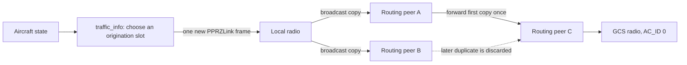
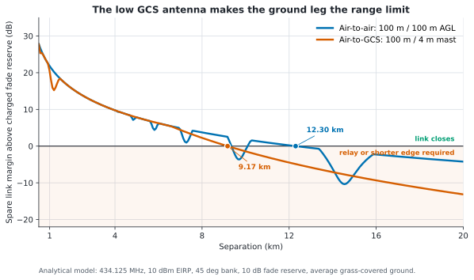
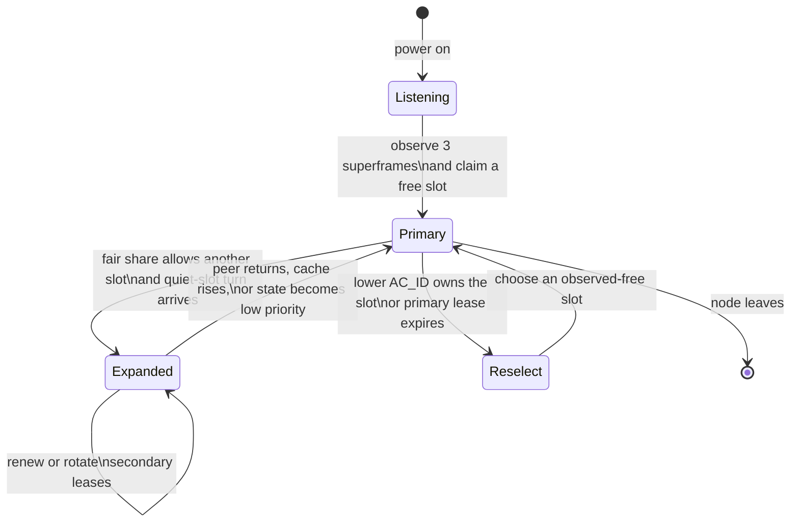
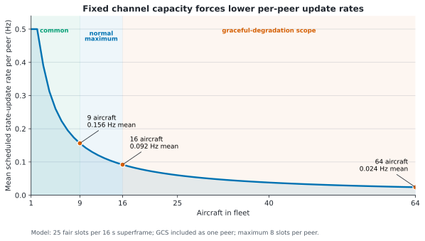
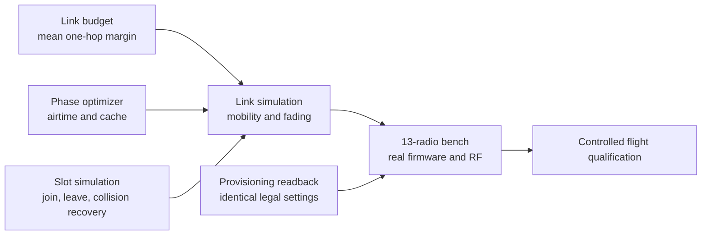
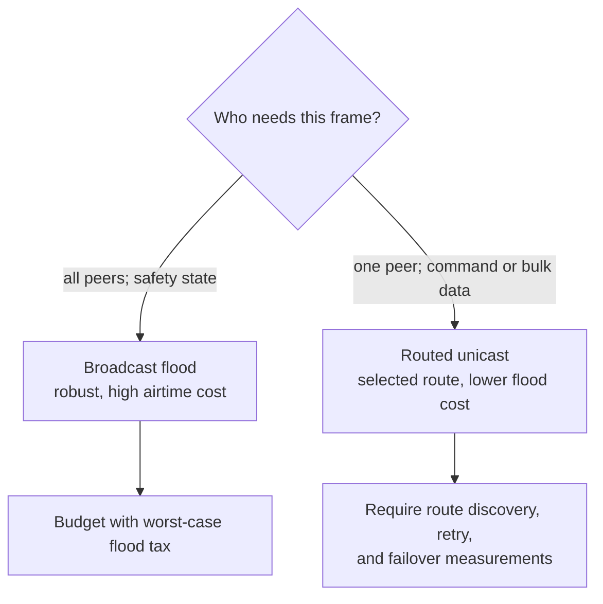
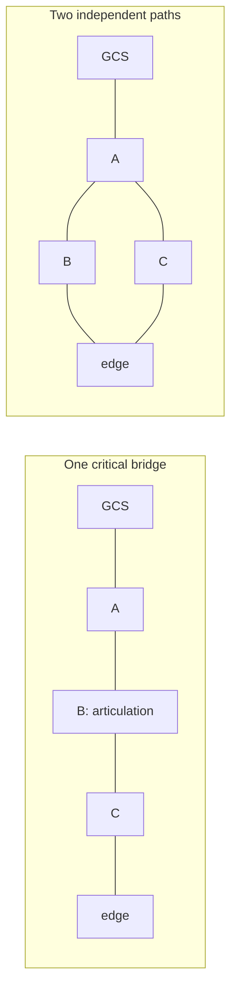

# A Self-Organising Broadcast Mesh for Small UAV Fleets

**Author:** Mr. E.van der Horst
**Project:** Paparazzi UAV broadcast mesh research and implementation
**Document status:** Flighted reference design and reproducible engineering record

> **Flighted design, portable architecture:** this document describes the
> current GNSS-assisted TDMA transport with clock holdover and GNSS-independent
> randomized fallback. The software design targets broadcast-capable mesh
> radios; the measured reference implementation uses EByte E52-400NW22S
> hardware. Product-specific numbers are labelled as reference-profile results.
> Phase 1 investigation of a fully asynchronous coded transport is
> documented separately in
> [Asynchronous Coded Mesh for Paparazzi UAV](asynchronous_coded_mesh.md).
> The coded design is currently a simulator and codec experiment; it must not
> be confused with deployed airborne behavior.

## Abstract: One Airspace, Many Tiny Aircraft

Monitoring and controlling one small drone is familiar engineering. Doing the
same for a fleet is a different problem wearing the same propellers. Every
aircraft must report fresh state, hear occasional operator commands, track its
neighbours, survive members joining or disappearing, and do all of that through
one narrow half-duplex channel. A naïve design can work beautifully with two
aircraft and then collapse at thirteen, which is an awkward time to discover
that broadcast packets are not free.

This work presents a self-organising broadcast mesh for Paparazzi UAV. Aircraft
learn transmission opportunities from received traffic instead of fixed ID
maps, retain timing through bounded GNSS outages, fall back to randomized access
when synchronized TDMA is no longer safe, and reduce their own traffic before a
radio queue overflows. Compact `MESH_STATE` reports feed traffic awareness and a
fail-closed TCAS policy. Ground-side identity recovery, process restarts, and
operator link displays are designed as part of the same system rather than as
optimistic afterthoughts.

The result is not a claim that one configuration fits every radio. It is a
repeatable method: characterize the candidate hardware, model its airtime and
forwarding behavior, solve the schedule, simulate churn and clock loss, then
verify the complete fleet on a bench before flight. The reference profile was
built and tested with EByte E52-400NW22S radios at 434.125 MHz and 62.5 kbit/s.
Another radio may be used when it satisfies the interface contract and the full
qualification procedure in this guide is repeated with its real parameters.

**Keywords:** unmanned aerial vehicles; wireless mesh networks;
self-organising TDMA; resilient telemetry; low-power lossy networks; GNSS
holdover; Age of Information; Paparazzi UAV

## Research Questions and Contributions

This work addresses four questions:

1. Can arbitrary aircraft join and leave a shared broadcast channel without a
  fixed slot-to-identity map or a continuously available coordinator?
2. Can the network preserve bounded, explicitly degraded behavior through
  short GNSS outages, longer synchronization loss, and process restarts?
3. Can channel load, queue occupancy, and state freshness be made testable
  properties rather than informal expectations?
4. Can the implementation remain portable across radios without presenting
  measurements from one product as universal evidence?

The principal contributions are a leased, observation-driven slot allocator;
a clock state machine joining GNSS TDMA, monotonic holdover, randomized
fallback, and staged recovery; population-aware telemetry and queue admission
control; a compact traffic-state path with fail-closed freshness semantics;
a restart-tolerant ground identity and health protocol; and an executable
qualification ladder separating analytical, simulated, software, hardware,
and flight evidence. The work is an engineering design study, not a controlled
comparison claiming superiority over every mesh MAC or routing protocol.

## Acknowledgements

This work stands on a long chain of scientific ideas: radio propagation,
distributed systems, estimation, control, graph theory, collision avoidance,
and the patient art of measuring what the hardware actually did. The author
thanks the scientists, engineers, reviewers, and experimenters who made those
fields usable rather than merely impressive.

Particular thanks go to the developers and maintainers of Paparazzi Autopilot.
Their open architecture, generated message system, simulation tools, flight
software, and willingness to expose the machinery made this investigation
possible. Open-source infrastructure is easy to overlook precisely because it
is already there when the difficult question arrives.

In *Eve's Diary*, Mark Twain writes, “It is best to prove things by actual
experiment; then you KNOW; whereas if you depend on guessing and supposing and
conjecturing, you never get educated.” That is a fair summary of the method
used here: model first, test repeatedly, and let the radio have the final word.
It usually does, and it has no concern for elegant slides.

## Read This First: The System in One Page

The flighted system has two cooperating layers. Paparazzi decides **when an
aircraft may originate** a compact `MESH_STATE` packet. The radio network
decides **how that packet is forwarded** across the broadcast mesh. The operator
does not choose either layer during flight: all peers use one qualified radio
profile, while aircraft automatically select `mesh_solo`, `mesh`, or
`mesh_manifold` telemetry.

`MESH_STATE` is the primary peer-presence and motion stream. `GPS_LLA` is a
slower full GPS report for the GCS. The implementation is divided as follows:

| Concern | Source of truth |
| --- | --- |
| Airborne MAC, packet encoding, traffic storage | [`traffic_info.c`](../../sw/airborne/modules/multi/traffic_info.c) |
| Public traffic and TCAS API | [`traffic_info.h`](../../sw/airborne/modules/multi/traffic_info.h) |
| TCAS freshness and fail-closed policy | [`tcas.c`](../../sw/airborne/modules/multi/tcas.c) |
| GPS, holdover, fallback, and recovery policy | [`traffic_info_mesh_clock.h`](../../sw/airborne/modules/multi/traffic_info_mesh_clock.h) |
| Reference-radio provisioning | [`e52_provision.py`](../../sw/tools/mesh/e52_provision.py) |
| Capacity and command reserve | [`mesh_phase_optimizer.py`](../../sw/tools/mesh/mesh_phase_optimizer.py) |
| Join, leave, and collision recovery | [`mesh_slot_sim.py`](../../sw/tools/mesh/mesh_slot_sim.py) |

Useful background includes the
[Paparazzi message documentation](https://docs.paparazziuav.org/latest/paparazzi_messages.html),
and [ITU-R M.1371](https://www.itu.int/rec/R-REC-M.1371/en) for the
self-organising TDMA ideas behind slot observation and timed leases. For the
tested reference hardware, also use the included
[EByte E52 user manual](E52-xxxNWxxS_UserManual_EN_v1.4-4.pdf).

**Required radio behavior:** transparent PPRZLink transport, broadcast delivery
to all reachable peers, multi-hop forwarding or a documented software-relay
path, duplicate suppression, bounded queues, and a characterized half-duplex
airtime/CSMA model. Equivalent mechanisms with different names are acceptable.

**Tested reference profile:** EByte E52-400NW22S, channel 24 (434.125 MHz),
rate 0 (62.5 kbit/s), 460800 baud UART, 10 dBm EIRP, 0 dBi antennas, all-routing
broadcast, and a five-frame transmit cache. These values are evidence for this
hardware profile, not defaults for an unknown radio.

**Fleet:** nine aircraft are common and sixteen aircraft are the normal
maximum. Sixty-four aircraft is an addressability and graceful-degradation
research target, not a real-time TCAS claim. The ground
station is AC_ID 0 and may move on the ground. Aircraft use distinct arbitrary
AC_IDs in 1..254; ID 255 remains reserved for broadcast and internal sentinels.
No ordering or sequential numbering is assumed.

**Priority:** fault tolerance and multi-hop coverage first, then the highest
state update rate that fits the qualified channel and transmit queue.

**Modeled envelope:** 13 routing peers use the `mesh` fixed-wing profile at
57.7% modeled channel utilisation. Seventeen peers (16 aircraft and GCS)
automatically use the `mesh_manifold` profile at 59.4%. Both use 32 self-organised
slots, 25 steady fair-share slots, a 16 s superframe, and a 2 s `MESH_STATE`
scheduler ceiling. These are software acceptance baselines, not substitutes
for multi-radio bench testing or flight qualification.

---

## 1. Two Layers, One Network

### 1.1 The radio contract

The flighted profile makes every radio, including the GCS, a routing peer. There
is no fixed relay aircraft and no single point of failure. A drone may land for
a battery swap, disappear, or rejoin without reconfiguring the others. The
tested EByte profile selects this behavior with `AT+TYPE=0`; another product may
call it flooding, managed broadcast, repeater mode, or something invented by a
marketing department on a Friday afternoon. The name does not matter. The
measured forwarding behavior does.

This distinction matters:

* **Paparazzi decides when a node originates a new frame.** [`traffic_info.c`](../../sw/airborne/modules/multi/traffic_info.c)
  uses GNSS-synchronised self-organising TDMA, bounded clock holdover,
  GNSS-independent randomized fallback, and radio-queue back-pressure.
* **The radio network decides how the frame is forwarded.** The required
  behavior is bounded all-to-all broadcast without an application-level ACK
  storm. On the reference hardware, `AT+OPTION=3` makes every routing peer
  forward a newly seen broadcast once and its duplicate filter stops loops.
* **Broadcast and unicast routing are different services.** A radio may offer
  RSSI-selected routes for unicast while using duplicate-suppressed flooding
  for broadcast. Qualification must measure the mode actually used by
  `MESH_STATE`; a glossy unicast range claim is not a broadcast timing model.

For position exchange, broadcast is retained because every aircraft must learn
about every other aircraft and because it continues working without a
coordinator or acknowledgement exchange. Directed, high-volume application
traffic may use a candidate radio's qualified unicast service when practical,
so one recipient does not incur an all-peer flood.

The two control layers must not be confused:



The TDMA allocator controls only the arrow from `traffic_info` to the local
radio. In the reference profile, forwarded copies are created inside the
radios and do not require a Paparazzi slot of their own. Their airtime is still
charged to the shared channel, because physics has declined every request to
support free relays. A software-relay radio can also be used, but its forwarding
work, queueing, duplicate suppression, and CPU cost must be modeled explicitly.

### 1.2 Why every reachable peer may need to help

The original 3 x 3 km area is direct-link friendly: its 4.24 km diagonal closes
with at least 7.3 dB spare margin above the already charged 10 dB fade margin.
The future operating areas are not:

| Area | Diagonal | Worst direct margin |
| --- | ---: | ---: |
| 3 x 3 km | 4.24 km | +7.3 dB |
| 11 x 11 km | 15.56 km | -14.7 dB |
| 17 x 3 km | 17.26 km | -16.9 dB |

These values come from `mesh_link_budget.py` using the exact two-ray model,
434.125 MHz, a 4 m GCS mast, 50-120 m aircraft altitude, 45 degree bank, 10 dB
fade margin, and the hard 10 dBm EIRP limit. The expanded areas need short
air-to-air hops through the swarm; a terminal-only aircraft at an edge can
partition the topology.

The deterministic design ranges from the same model are 12.30 km for an
air-to-air link at 100 m AGL and 9.17 km for an aircraft-to-GCS link with the
4 m mast. These are not universal radio ranges: they include the stated
antenna, bank, feedline, terrain-clearance, and fade assumptions. Mission
spacing must use the weaker link applicable to each edge and retain positive
margin; “all nodes route” does not make an out-of-range edge exist.



*Figure 1. Analytical spare margin after the stated 10 dB fade reserve has
already been charged. The zero crossing is a model boundary, not a measured
radio range; terrain, interference, installation, and regulation still require
site-specific qualification.*

### 1.3 Broadcast is robust, not free

All-router broadcast is expensive. One 30-byte `MESH_STATE` frame occupies
7.50 ms per RF transmission. The conservative capacity model charges one
transmission at every one of the 13 routing peers for each originated
broadcast:

$$13 \times 7.50\ \text{ms} = 97.5\ \text{ms of charged channel time}$$

An individual flood can use fewer transmissions when some peers are
unreachable or receive only duplicates, but capacity is not budgeted on that
optimistic case. The 13-transmission “flood tax” is a planning upper bound for
the connected all-router fleet, not a claim that every packet always produces
exactly 13 observable RF transmissions.

The tested radio has only five transmit-cache entries. On overflow it clears
the whole cache, creating a network-wide telemetry gap. The reference schedule
is therefore designed around measured flood cost and queue behavior, not around
the nominal 62.5 kbit/s PHY rate. A deeper queue is not automatically faster;
it may simply store a longer delay with greater dignity.

`mesh_phase_optimizer.py` proves the delivered profile:

| Check | Result |
| --- | ---: |
| Nodes / routing nodes | 13 / 13 |
| Flood tax | 13 transmissions |
| Modeled channel utilisation | 57.7% (operator ceiling 60%) |
| Flood span, mean + 3 sigma | 290.0 ms |
| Flood span, absolute modeled maximum | 357.6 ms |
| Physical slot / guarded usable gap | 500.0 / 478.0 ms (+34%) |
| Peak reference-radio cache depth | 1 of 5 |
| Cache overflow events | 0 |

The reference-radio documentation specifies no safe aggregate
channel-utilisation limit, and no hardware measurements establish one for this
network. Utilisation is
therefore reported rather than compared with a default pass/fail percentage.
The optimizer accepts an explicit `--utilisation` ceiling when an operator has
a measured limit for a particular deployment. The actual software acceptance
checks are that a flood fits its slot, generated messages do not burst together,
the modeled five-frame cache does not overflow, and slot collisions remain
bounded in the churn simulation. Applicable national limits on frequency,
bandwidth, power, and duty cycle remain separate and must be checked for the
flight location.

The optimizer's deliberately unscheduled control experiment reaches 17 cached
frames and overflows. Phase placement and TDMA are safety mechanisms, not
cosmetic tuning.

The former 375 ms slot was only the arithmetic result of dividing a 12 s
superframe into 32 physical slots; it was not derived independently from radio
flood latency. For the common 13-node reference model, one 30-byte `MESH_STATE`
transmission is 7.50 ms and the modeled flood spans are 227.6 ms mean, 290.0 ms
mean plus three standard deviations, and 357.6 ms absolute maximum.


The dense 17-node model gives 369.0 ms mean plus three standard deviations and
467.6 ms absolute maximum. The delivered 500 ms slot reserves 10 ms for the
100 Hz gate and 12 ms for clock skew, leaving 478 ms and a 10.4 ms margin over
that absolute modeled bound. Both calculations still assume
that every relay adds one independent uniform 0..20 ms CSMA delay and that the
inferred 13-byte reference-radio mesh header is correct. Hardware flood-latency
measurement is required before treating the result as a physical guarantee.

---

## 2. A Fleet That Organises Itself

### 2.1 Joining without a slot map

The superframe is 16 s with 32 slots of 500 ms. Slots are not derived from
AC_ID. A joining peer:

1. listens for three complete superframes;
2. learns slot occupancy from ordinary `MESH_STATE` arrival times;
3. claims a demonstrably free slot;
4. yields deterministically if a lower AC_ID is already using that slot;
5. leases secondary and primary slots so mutually deaf collisions eventually
   separate even when nobody can decode the collision.

`MESH_SLOT_FREE` is `0xFF`, not zero. AC_ID 0 is the GCS and is a legitimate
mesh slot owner, while aircraft IDs are limited to 1..254. The identity domain
therefore addresses at most 255 members (GCS plus 254 aircraft), so byte-sized
member counts remain sufficient without changing the over-air format. The
delivered 32-slot profile supports at most 32 simultaneous full-membership
peers. The GCS participates in routing and traffic visibility but is
deliberately excluded from TCAS collision avoidance; a future
stationary-obstacle policy could use its track explicitly.

Thirty-two slots are intentional. Thirteen peers could fit in sixteen, but the
churn test showed that sixteen slots were too tight when up to six aircraft
leave and rejoin. With 32 slots, eight deterministic 4000-frame simulations at
5% churn all pass; collision occupancy is 2.18-3.75%, every collision is
transient, and no node loses its primary slot.



There is no reservation packet. Each receiver infers the sender's slot from
GNSS-aligned or bounded-holdover arrival time. Listen-before-claim avoids
cold-start over-allocation. Round-robin expansion prevents two nodes from
grabbing the same apparently free slot in one superframe. Timed leases break
collisions that are otherwise invisible because collided frames cannot be
decoded.

When GNSS time disappears, the node retains the last GNSS-to-monotonic anchor for
up to 60 seconds instead of jumping to boot-relative time. The primary
reservation and absolute superframe phase therefore survive a short outage;
position-invalid policy contracts opportunistic slots. This requires no RTC:
the autopilot's monotonic clock carries the startup GNSS epoch while power
remains applied. The bound
assumes at most 100 ppm error per node: two worst-case clocks separate by about
12 ms in one minute. That skew and the 50 ms scheduler sampling interval fit
inside the common 13-node statistical budget, but not the dense 17-node budget.

One superframe before that bound, the denied node and peers which hear its
`HOLDOVER` advertisements clear slot authority and enter `MESH_CLOCK_ASYNC`.
This fleet-wide downgrade prevents synchronized and asynchronous MACs from
competing indefinitely during partial GNSS loss. Each peer then originates
from its monotonic local clock with randomized CSMA timing. A trusted
pre-outage membership view selects 4-8 seconds for a solo aircraft, 8-16
seconds for two to four aircraft, and 16-24 seconds for five or more aircraft.
A node that rebooted without synchronized membership always uses the
conservative 16-24 second range. Learned population never decreases during an
outage because packet loss is not proof that a peer departed. Asynchronous
frames remain valid presence traffic but never reserve a TDMA slot. GNSS-ready
fallback peers
advertise `RECOVERY` without extending the denied-peer lease. `RECOVERY` carries
a deterministic absolute GPS-frame target: every peer selects the same next
eight-frame epoch at least seven frames ahead and adopts any later target it
receives. This lets rebooted and late-joining peers converge before TDMA resumes.
At that target, two seconds of continuous valid GPS and the normal
listen-before-claim cycle are required before transmission. Coherent recovery
during early holdover preserves slots, while a correction over 10 ms clears
them.

### 2.2 Spend airtime where it matters

All radios route continuously at the network layer. Paparazzi adapts only the rate
at which a node originates its own state:

* a healthy airborne node with GNSS or bounded holdover and valid position
  receives its fair share of available slots;
* a landed or position-invalid node keeps one heartbeat slot;
* a node without bounded network time uses population-aware randomized access
  instead of pretending that boot-relative slots are synchronized;
* HOME, emergency, failsafe, and low-battery states request one extra slot;
* when the estimated radio queue reaches the high-water mark, the node gives
  up one opportunistic slot before the qualified hardware can overflow;
* when aircraft leave, healthy peers gradually claim quiet slots; when they
  return, peers contract immediately.

Of the 32 physical slots, 25 are distributed as steady-state fair share and
seven remain as headroom for joins, partitions merging, and temporarily
different membership views. For $S=25$ fair-share slots and $N$ live nodes,
each healthy node receives a baseline of
$q=\lfloor S/N\rfloor$ slots. The first $r=S\bmod N$ sorted AC_ID ranks receive
one remainder slot, so quotas differ by at most one and sum to all available
slots. The winner window advances by one rank every 81 superframes, about
21.6 minutes, giving long-term fairness without fleet-wide claim churn.

At 13 peers, twelve are entitled to two slots and one to one slot per 16 s.
The average entitlement is therefore $25/(13\times16)=0.120$ Hz instead of the
floor-only 0.0625 Hz. At the nominal nine-peer population, seven peers receive
three slots and two receive two, for an average entitlement of 0.174 Hz.
Collision-healing leases and policy contraction
can make observed rates lower than these steady-state entitlements. Sparse
fleets may now use up to `MESH_TDMA_MAX_REUSE=8` slots. The cap does not add
slots or shorten them: it lets fewer live peers use slots that would otherwise
remain empty. Theoretical steady-state entitlements are shown below; counts
include the GCS because it is a real mesh peer:

| Live peers | Reuse 4 | Reuse 8 | Improvement |
| ---: | ---: | ---: | ---: |
| 1 | 0.25 Hz | 0.50 Hz | 100% |
| 2 | 0.25 Hz | 0.50 Hz | 100% |
| 3 | 0.25 Hz | 0.50 Hz | 100% |
| 4 | 0.25 Hz | 0.39 Hz | 56% |
| 9 | 0.17 Hz | 0.17 Hz | unchanged |
| 13 | 0.12 Hz | 0.12 Hz | unchanged |

Collision-healing leases deliberately limit dense-fleet convergence, so the
measured rates are lower than the mathematical entitlement. This revision
does not weaken those leases merely to report a higher number. Emergency state
still receives priority within the same bounded channel budget.



*Figure 2. Theoretical steady-state fair-share rate from 25 slots per 16 s
superframe, with the GCS counted as a peer and reuse capped at eight. Lease
healing, synchronization loss, invalid position, and queue pressure can reduce
observed rates below this curve.*

The 2 s telemetry period is an enabling ceiling, not a promise that every
node transmits every 2 s. Actual emission remains controlled by live slot
ownership, position validity, synchronization state, and cache pressure.

### 2.3 The constants that keep everyone honest

| Parameter | Value | Reason |
| --- | ---: | --- |
| `MESH_TDMA_SUPERFRAME_MS` | 16000 | 32 absolute-model flood-safe slots |
| `MESH_TDMA_NB_SLOTS` | 32 | 13 peers plus churn headroom |
| `MESH_TDMA_FAIR_SLOTS` | 25 | steady quota; seven slots absorb membership disagreement |
| `MESH_TDMA_MAX_REUSE` | 8 | bounded sparse-fleet acceleration |
| `MESH_ENTRY_FRAMES` | 3 | listen before transmitting |
| Secondary lease | 6-13 frames | break secondary collisions |
| Primary lease | 120-239 frames | avoid healthy-fleet churn while still breaking silent primary collisions |
| Slot age | 4 frames | tolerate loss, reclaim departed nodes |
| Remainder epoch | 81 frames | rotate one rank after ageing and serialized expansion settle |
| Holdover | 60 s | preserve GPS epoch while worst-case relative drift stays bounded |
| GNSS acquisition | 2 s | reject fix flapping before entering TDMA |
| Position holdover | 16 s | allow one superframe of globalized estimator output, then fail closed |
| Asynchronous interval | 4-8 / 8-16 / 16-24 s | solo / 2-4 aircraft / larger or unknown fleet |
| Recovery epoch | 8 frames | deterministic common target beyond all fallback leases |
| Cache high water | 3 of 5 | local-only admission guard; reserve two entries for hidden relay/telemetry traffic |

The static assert in `traffic_info.c` forces the generated `MESH_STATE` period
to equal `superframe / max reuse` (16 / 8 = 2 s) in either supported telemetry
mode layout. A mismatched telemetry file therefore fails the aircraft build
instead of failing in flight.

The cap and telemetry period are a fleet-wide protocol profile. Update every
participating aircraft before using the faster profile; do not mix reuse-four
and reuse-eight firmware in one mesh.

### 2.4 One profile, three automatic operating modes

There is no operator mode selection, custom wire protocol, additional ground
application, or in-flight radio reconfiguration. Every scenario uses the same
qualified routing/broadcast profile. Aircraft start in `mesh`, then select one of
three generated telemetry modes from observed peers:

| Mode | Automatic condition | Purpose |
| --- | --- | --- |
| `mesh_solo` | GCS contact, no aircraft peer, 16 s quiet | 5 Hz direct-link state for the common <=1 km fallback |
| `mesh` | up to 11 observed aircraft peers | normal 1-12 aircraft operation |
| `mesh_manifold` | enter at 12 peers, leave at 10 | bounded 13-16 aircraft operation with hysteresis |

Telemetry starts in `mesh` so useful flight state reaches the GCS promptly.
The independent TDMA network-entry logic still listens for three superframes
before claiming slots, preventing newly powered peers from making conflicting
slot assumptions before their membership maps converge.

The OCaml link sends one targeted `PING` every five seconds to the live aircraft
that was least recently probed. The addressed aircraft returns one `PONG`.
Identity recovery is deliberately separate: an unregistered live aircraft is
sent a serialized `ALIVE_REQ` and returns one MD5-bearing `ALIVE`. This avoids
the adjacent `ALIVE`/`PONG` response burst that previously made normal health
probes less reliable. Identity requests use exponential backoff and stop when
the server's authoritative `AIRCRAFTS` snapshot contains the aircraft.
`NEW_AIRCRAFT` is only a low-latency hint; periodic snapshots make link-first
startup, server-first startup, missed Ivy events, and either process restarting
converge to the same state. Incoming `MESH_STATE` also
refreshes the ground link's live-aircraft table without being republished on
Ivy. Because broadcast traffic is heard by every reachable mesh member, each aircraft
can answer two questions locally:

* has the GCS recently pinged me;
* has the GCS recently pinged another aircraft.

The airborne selector chooses `mesh_solo` when the GCS has recently pinged this
aircraft, no recent PING targeted another aircraft, no peer owns a live mesh
slot, and no peer frame has been received for 16 seconds. A
synchronized mesh clock is deliberately not required for this one-aircraft
case: there is no peer TDMA schedule to coordinate, and requiring GPS time would
leave an indoor or GPS-denied bench test permanently on sparse telemetry. The
`MESH_STATE` canary continues using the normal GPS, bounded-holdover, or
randomized asynchronous mesh timing. A received peer `ALIVE` or `MESH_STATE`
leaves solo mode immediately for `mesh`; peer-count hysteresis independently
selects `mesh_manifold` only at the high-population threshold. `ALIVE` is weak
presence evidence only: it never creates TCAS kinematics, assigns a slot, or
shortens the three-superframe listen-before-claim interval. A manual selection
of an unrelated diagnostic mode is preserved and disables automatic switching
until a mesh mode is selected again.

The ground link probes only aircraft that are still live. Without that rule, an
aircraft which landed hours earlier would remain in the link table and suppress
solo mode forever. State from an unregistered live aircraft triggers an
immediate serialized `ALIVE_REQ`; if that request or response is lost, retries
start at four seconds and back off to at most 30 seconds. The four-second retry
floor keeps the modeled 17-node recovery envelope below the 60% operator channel
ceiling. This closes the historical deadlock where the server waited for an
`ALIVE` that could have been lost while the radio booted. Stale aircraft are not
eligible for discovery. `ALIVE` remains a discovery and configuration-identity
message, not the high-rate heartbeat. `MESH_STATE` is the authoritative aircraft
presence and motion stream.

Two `ALIVE` paths coexist intentionally. A phase-spread boot/30-second airborne
retry gives passive startup discovery, while a targeted `ALIVE_REQ` gives the
ground link deterministic recovery when that unsolicited packet was missed.
Both produce the same MD5-bearing `ALIVE`; neither changes the health-probe
contract that one `PING` produces only one `PONG`.

The only added wire message is the empty `ALIVE_REQ` datalink request (ID 195),
chosen outside IDs used by the repository's older/custom datalink schemas.
`Makefile.ac` makes aircraft generation depend on the generated PPRZLink
protocol header, so changing `conf/messages.xml` regenerates protocol headers
before computing the aircraft configuration MD5. This prevents firmware from
advertising a stale identity after message-schema changes. Fixed-wing sends
`MINIMAL_COM` at 5 Hz,
`ATTITUDE` at 2 Hz, `ENERGY` at 1 Hz, `DATALINK_REPORT` at 0.5 Hz, and `ALIVE`
at 0.2 Hz. Rotorcraft uses the same schedule with native `ROTORCRAFT_FP` instead
of `MINIMAL_COM`. `MESH_STATE` remains active as the safety/discovery canary in
both modes. The mesh transport becomes ready on the first telemetry scheduler
tick. Startup then sends one standard `ALIVE` within an AC_ID-derived 250 ms
window, waits at least one 60 ms reference-radio drain interval, and sends one registered
primary-state callback within a second 160 ms window. Thus the common single
join submits useful GCS state in under 0.5 seconds without duplicating either
firmware's state serializer. One independently spread state recovery follows
within four seconds for simultaneous fleet power-up, where the first burst may
collide. `ALIVE` is retried every 30 seconds until the first GCS PING, allowing
the normal server/link discovery cycle to start without a custom handshake.

The primary period was reduced from 250 ms to 200 ms, giving exactly 25% more
scheduled state updates and 20% less maximum update latency. The auxiliary rates
remain deliberately unchanged: the available solo-link margin is spent on the
position and motion data that benefits from freshness, not duplicated diagnostic
traffic.

With two routing radios, the repository PHY model places the complete 5 Hz
fixed-wing profile at 15.0% aggregate channel occupancy and 7.5% transmit duty
per radio. The larger rotorcraft state frame gives 17.9% aggregate occupancy and
8.9% duty. Compared with 4 Hz, the extra state frame per second costs only 1.82
percentage points of aggregate occupancy for fixed-wing and 2.40 points for
rotorcraft.

Live NPS measurements changed from 4.158 Hz to 5.006 Hz for fixed-wing
`MINIMAL_COM`, a 20.4% observed increase, and from 3.976 Hz to 5.008 Hz for
rotorcraft `ROTORCRAFT_FP`, a 26.0% increase. Mean delivered intervals were
199.76 ms and 199.68 ms respectively. In a simultaneous 5 Hz-capable
fixed-wing/rotorcraft test, both aircraft appeared in the ordinary link table
and a fully settled ten-second window contained zero solo-rate frames.

The design deliberately accepts less throughput than a custom compact packet.
In return it uses standard Paparazzi messages, standard generated telemetry
modes, the existing PING/PONG path, one small firmware-neutral selector, and no
new process for the operator to start.

### 2.5 A ground link that tells the truth

The serial layer supports 460800 baud and requests exclusive ownership with
`TIOCEXCL` where the platform provides it. This matters because two link
processes reading one radio split the byte stream and look like RF or parser
loss. A second opener now fails clearly instead. Transient `EAGAIN` is ignored;
terminal descriptor errors retire the old read watch, close the descriptor,
probe for up to 30 seconds, and re-exec the link after the device returns so no
stale parser or event-loop state survives a USB reconnect.

PING round-trip time uses `CLOCK_MONOTONIC` and is published only after a
matching PONG completes a measured normal probe. Discovery requests do not
overwrite RTT state, and delayed or unsolicited PONGs cannot create a negative
latency by being subtracted from a newer wall-clock PING.

`DATALINK_REPORT.uplink_lost_time` retains its historical wire name, but the
value is **not** a boolean loss alarm. It is the aircraft's whole-second age
since the last complete accepted primary uplink frame. The counter resets before
command-specific parsing, so a valid PING or waypoint command proves reception
even if a command later has no effect. The server forwards the value unchanged.
The cockpit therefore labels it `Uplink age [s]` and explains that a nonzero
value is normal. In `mesh_solo`, a healthy link commonly cycles around 0-5
seconds because the normal PING cadence is five seconds. A real loss alarm must
be a separate state with an explicitly chosen operational threshold.

### 2.6 Commands first, diagnostics later

The priority order is:

1. operator control and its acknowledgement: `BLOCK` -> `NAVIGATION`,
  `MOVE_WP` -> `WP_MOVED`, and `SETTING` -> `DL_VALUE`;
2. `MESH_STATE`, which supplies peer presence and compact kinematics to
  `traffic_info` and TCAS;
3. `GPS_LLA`, the slower authoritative GPS diagnostic for the GCS;
4. `ALIVE` and periodic navigation/health recovery snapshots;
5. optional diagnostics.

Control messages are event-driven and are never assigned a telemetry `phase`.
The ground link writes forwarded commands immediately, and the fixed-wing
parsers send their standard acknowledgement immediately after applying the
change. Periodic copies remain only for eventual recovery. The optimizer
reserves one worst-case command/acknowledgement pair every 20 seconds across
the fleet plus one adaptive `PING/PONG` pair every five seconds. With solved
phases the modeled radio queue peaks at one frame, so an operator command can
sit behind at most the frame already being transmitted; future periodic
traffic does not form a queue in front of it.

`phase` remains valuable for periodic traffic: generated offsets prevent a
single aircraft from presenting a multi-frame UART burst to its five-entry
radio queue. It cannot schedule or accelerate asynchronous commands.

---

## 3. Qualifying the Radio Layer

The mesh algorithm is portable; a radio profile is not. The flight-tested
profile below is for the **EByte E52-400NW22S**. It is included so the deployed
system is reproducible and so a replacement has a precise baseline to beat.
These commands are not a generic radio API:

```text
AT+PANID=250,1
AT+SRC_ADDR=1000+AC_ID,1
AT+TYPE=0                 all nodes route, including AC_ID 0
AT+RATE=0                 62.5 kbit/s only
AT+CHANNEL=24,1           434.125 MHz
AT+POWER=10,1             10 dBm conducted with 0 dBi antenna
AT+OPTION=3,1             broadcast
AT+DST_ADDR=65535,1
AT+ROUTER_SAVE=0          do not persist a moving topology
AT+ROUTER_CLR=1
AT+ROUTER_SCORE=3
AT+HEAD=0                 PPRZLink already carries framing and sender ID
AT+BACK=0                 do not inject radio status text into PPRZLink
AT+CSMA_RNG=20            manual minimum; TDMA separates originations
AT+RESET_TIME=0           no periodic RF reset in flight
AT+FILTER_TIME=3000       duplicate suppression
AT+UART=460800,8N1
AT+RESET
```

`AT+TYPE` must follow `AT+SRC_ADDR` because it rewrites the address type bit.
The provisioning tool enforces this ordering, checks every response, reopens
the serial port after changing baud, and reads the configuration back.

Program an aircraft or the GCS:

```bash
python3 sw/tools/mesh/e52_provision.py \
  --port /dev/ttyUSB0 --ac-id 129 --factory-reset

python3 sw/tools/mesh/e52_provision.py \
  --port /dev/ttyUSB0 --ac-id 0 --factory-reset
```

Both commands default to `AT+TYPE=0`. A constrained terminal/router experiment
is still possible with `--relay-ids 125`, but it is not the delivered flight
architecture.

The power rule is absolute: **10 dBm EIRP maximum**. The NW22S PA can produce
22 dBm, but that setting must never be used here. `e52_provision.py` derives
conducted power from the EIRP ceiling minus antenna gain and refuses an illegal
combination.

### 3.1 The capability contract for another radio

A candidate radio does not need EByte commands, LoRa modulation, or the same
queue depth. It does need an equivalent, measured service:

* transparent transport of complete PPRZLink frames without rewriting sender
  identity or payload;
* broadcast reception by every reachable peer, including AC_ID 0 at the GCS;
* bounded multi-hop forwarding, either inside the radio or explicitly in
  Paparazzi, with duplicate suppression and a known hop limit;
* half-duplex and carrier-access behavior whose worst and statistical delays
  can be measured;
* a documented maximum frame size, UART rate, queue depth, overflow policy,
  and reconnect behavior;
* legal frequency, bandwidth, power, duty cycle, and antenna configuration for
  the actual operating region;
* identical fleet-wide settings, or a compatibility mechanism proven under
  mixed versions.

“It has mesh in the product name” is not an acceptance test. Neither is a
point-to-point throughput screenshot. This design depends on all-to-all
broadcast timing under simultaneous routing load.

### 3.2 Porting the profile without guessing

Use this sequence when introducing another radio:

1. **Write down the forwarding model.** State whether broadcast is flooded,
  selectively relayed, source-routed, or repeated by Paparazzi. Identify what
  creates and suppresses duplicates and whether forwarded frames are visible
  to flight software.
2. **Measure one frame.** For every relevant PPRZLink length, record UART-to-air
  latency, RF time-on-air, CSMA/backoff distribution, and receive-to-forward
  delay. Repeat near sensitivity and under contention; averages alone are
  charming but insufficient.
3. **Measure the queue.** Determine usable depth, drain time, overflow policy,
  and whether hidden relay traffic shares the same queue as local traffic.
  Update `MESH_MODEM_DRAIN_MS` and `MESH_CACHE_HIGH_WATER` only from these data.
4. **Update the analytical model.** Teach `mesh_phase_optimizer.py` the new PHY
  airtime, framing overhead, flood tax, forwarding-delay distribution, queue
  depth, and operator utilisation ceiling. If the assumptions cannot be
  represented, extend the model before generating a schedule.
5. **Re-solve, do not copy.** Run the phase optimizer for every supported fleet
  size and telemetry mode. A schedule proven for a 62.5 kbit/s, five-entry
  reference queue says nothing reliable about a different radio.
6. **Repeat network simulations.** Run `mesh_slot_sim.py` because timing changes
  can alter collision recovery; run `mesh_gps_denied_sim.py` for fallback
  load; update and run `mesh_link_budget.py` and `mesh_link_sim.py` with the
  new frequency, sensitivity, power, antenna, propagation, and relay model.
7. **Create provisioning and readback.** Add a product-specific tool or adapter
  that applies one fleet profile, verifies it, and fails loudly on mismatches.
  Do not stretch `e52_provision.py` into pretending unrelated commands are the
  same abstraction.
8. **Build and bench the whole fleet.** Repeat the acceptance procedure in
  Section 6 with instrumented packet traces, joins, removals, commands, GNSS
  loss, queue stress, USB interruption, and the maximum supported peer count.
9. **Qualify in controlled flight.** Start below the claimed range and fleet
  size, compare measured latency/PDR against the model, and expand only while
  the documented margins remain positive.

Only after those steps may the new measurements replace the reference-profile
numbers in a deployment document. Until then, the software may be generic, but
the evidence is not.

---

## 4. Turn Assumptions into Executable Checks

All tools are in `sw/tools/mesh/`. Run them from the repository root. They use
Python 3 and return nonzero when an acceptance gate fails.

### 4.1 `mesh_link_budget.py`: can one hop really close?

This is the deterministic RF calculator. It uses free-space loss where valid,
two-ray propagation with a complex ground reflection coefficient, surface
roughness, bank-angle polarisation loss, fade margin, Fresnel clearance, and
radio horizon.

```bash
# Original area
python3 sw/tools/mesh/mesh_link_budget.py \
  --area-side 3000 --gcs-antenna-height 4

# Future square
python3 sw/tools/mesh/mesh_link_budget.py \
  --area-width 11000 --area-height 11000 --gcs-antenna-height 4

# Future strip
python3 sw/tools/mesh/mesh_link_budget.py \
  --area-width 17000 --area-height 3000 --gcs-antenna-height 4
```

Read **worst case margin** first. Positive margin means a direct corner-to-corner
link closes after the modeled fade reserve; negative margin means multi-hop
placement is required. A negative corner margin does not mean the mesh fails:
it means no mission plan may leave a gap between neighboring routing aircraft
larger than the applicable one-hop design range. For this profile that is at
most 12.30 km air-to-air and 9.17 km to the 4 m GCS mast, before adding any
mission-specific margin.

### 4.2 `mesh_phase_optimizer.py`: will the channel survive the fleet?

This tool parses the real PPRZLink XML, computes each message's configured PHY
airtime, multiplies it by the reference-profile flood tax, solves Paparazzi
phase offsets, replays the generated tick condition, simulates the configured
radio queue, and writes the telemetry XML. A new radio requires new model
inputs or model code before this result is meaningful.

The exact delivered `mesh` and `mesh_manifold` gates are:

```bash
python3 sw/tools/mesh/mesh_phase_optimizer.py \
  --ac-ids 0,3,19,42,58,77,101,125,140,168,203,222,251 \
  --relay-nodes 13 --nb-slots 32 --fair-slots 25 \
  --mesh-period 2 --superframe 16 --max-reuse 8 \
  --tdma-gate-frequency 100 --period-scale 1.5 --utilisation 0.60

python3 sw/tools/mesh/mesh_phase_optimizer.py \
  --ac-ids 0,3,19,42,58,77,101,125,140,168,203,222,231,237,241,247,251 \
  --relay-nodes 17 --nb-slots 32 --fair-slots 25 \
  --mesh-period 2 --superframe 16 --max-reuse 8 \
  --tdma-gate-frequency 100 --period-scale 3 --period FBW_STATUS=96 \
  --utilisation 0.60
```

The AC_ID list is deliberately irregular. Its length drives population; the
numeric values do not drive slot assignment. Do not hand-edit generated phase
values. Change the model inputs and rerun the tool.

### 4.3 `mesh_slot_sim.py`: do joins, departures, and collisions settle?

This is a line-by-line Python mirror of the airborne slot allocator. It includes
AC_ID 0, arbitrary IDs, 12 aircraft, dynamic state faults, emergency priority,
cache pressure, and random land/rejoin churn.

```bash
for seed in 1 2 3 4 5 6 7 8; do
  python3 sw/tools/mesh/mesh_slot_sim.py \
    --frames 4000 --churn 0.05 --seed "$seed" --max-reuse 8 || exit 1
done
```

Acceptance means every node retains a slot, nobody exceeds the reuse cap,
collision occupancy stays below 4%, every collision is bounded, and no
deadlock survives a lease.

### 4.4 `mesh_link_sim.py`: does motion break the promise?

This packet-level Monte Carlo simulator imports the same RF model, moves the
aircraft between waypoints, applies bank loss and correlated log-normal
shadowing, and propagates each frame through an arbitrary number of routing
hops. The reached set models the reference radio's duplicate filter.

```bash
# Nominal fleet and area
python3 sw/tools/mesh/mesh_link_sim.py \
  --ac-ids 0,3,19,42,77,101,125,168,251 \
  --width 3000 --height 3000 --duration 600 --seed 1

# Maximum fleet, future square
python3 sw/tools/mesh/mesh_link_sim.py \
  --ac-ids 0,3,19,42,58,77,101,125,140,168,203,222,251 \
  --width 11000 --height 11000 --duration 1200 --seed 7

# Maximum fleet, future strip
python3 sw/tools/mesh/mesh_link_sim.py \
  --ac-ids 0,3,19,42,58,77,101,125,140,168,203,222,251 \
  --width 17000 --height 3000 --duration 1200 --seed 7
```

The report shows direct and multi-hop PDR per aircraft, worst instantaneous
margin, and busiest-radio duty. In one 17 x 3 km baseline seed, direct fleet
PDR was 0.951 while modeled all-router multi-hop PDR was 1.000. Across the
sixteen recorded expanded-area regression runs, all modeled relayed PDRs were
1.000; this is evidence that multi-hop helps under those seeds and assumptions,
not a guarantee for arbitrary geometry or terrain.

Simulation is not a proof that every random placement is connected. Before an
expanded-area flight, run many seeds and enforce mission geometry that keeps a
chain of aircraft inside one-hop range.

### 4.5 `e52_provision.py`: is the reference hardware actually identical?

Use `--dry-run` to inspect a profile without hardware, `--verify-only` to read
back a reference radio, and `--factory-reset` before programming a known profile.

```bash
python3 sw/tools/mesh/e52_provision.py --ac-id 0 --dry-run
python3 sw/tools/mesh/e52_provision.py --ac-id 251 --dry-run
python3 sw/tools/mesh/e52_provision.py \
  --port /dev/ttyUSB0 --ac-id 251 --verify-only
```

Check that every reference radio reports a unique `SRC_ADDR=1000+AC_ID`, `TYPE=0`, rate
0, channel 24, 10 dBm conducted power for a 0 dBi antenna, broadcast option 3,
and 460800 8N1.

### 4.6 No single green checkmark proves a network

No single tool validates the network. Each removes a different failure mode:



Passing a box means only that box's assumptions held. In particular, the link
simulator assumes collision-free originations after `mesh_slot_sim.py` has
validated the allocator; it does not reproduce radio firmware timing, adjacent
channel interference, terrain blockage, UART faults, or antenna installation.

---

## 5. Inside the Flight Software

### 5.1 One compact state packet

The compact datalink message is 22 payload bytes and 30 PPRZLink wire bytes:

* flags: unified flight mode, rotorcraft, valid position, airborne, alert,
  emergency;
* clock mode: GPS, bounded holdover, or asynchronous fallback;
* latitude and longitude at 1e-7 degree;
* ellipsoid altitude in centimeters;
* packed course, ground speed, and climb rate.
* absolute recovery frame, zero outside `RECOVERY`.

The PPRZLink sender header is the source of truth for AC_ID. The payload does
not duplicate it, so a relayed frame cannot claim a different aircraft without
rewriting and rechecksumming the whole PPRZLink frame.

Message edits belong in `conf/messages_mesh_new.xml`. Do not edit
`sw/ext/pprzlink/message_definitions/v1.0/messages.xml`; it is external source,
and the active `conf/messages.xml` resolves to the mesh definition.

### 5.2 Reuse the state estimator, do not invent another one

No parallel estimator or flight-mode model was invented. `traffic_info` uses:

* current `gps.fix` and `gps_tow_from_sys_ticks()` for GNSS time; configured
  fix-grace time is deliberately excluded from clock authority;
* an anchored monotonic clock for bounded holdover;
* `stateIsGlobalCoordinateValid()` and `stateGetPositionLla_i()` for the
  estimator's position in the initialized global frame;
* `stateGetHorizontalSpeedDir_f()`, `stateGetHorizontalSpeedNorm_f()`, and
  `stateGetSpeedEnu_f()` for motion;
* `autopilot_in_flight()`, `autopilot_get_mode()`, and
  `autopilot_throttle_killed()` for flight state;
* `electrical.vsupply` and `LOW_BAT_LEVEL` where available;
* Paparazzi `Min`/`Max`, geodetic conversion, and periodic telemetry APIs.

All mesh storage is static. There is no heap allocation, recursion, or
variable-length array in the new path.

Clock validity and kinematic validity are separate. Losing GNSS does not
immediately end TDMA because holdover preserves the epoch. For 16 seconds after
the last observed 3D fix, `MESH_STATE` may continue carrying the estimator's
globalized position and local velocity. This permits short inertial, airspeed,
magnetometer, and barometer dead-reckoning gaps without freezing coordinates.
After that configurable grace, the valid-position flag clears automatically;
the packet still carries identity, flight state, and clock mode, while TCAS
refuses the stale geometry. Increase `MESH_POSITION_HOLDOVER_MS` only from
measured estimator error bounds, and never beyond the 60-second clock holdover.
An estimator that has never acquired a shared global origin cannot emit valid
mesh position. Vision, UWB, or SLAM may be used only when it supplies that
shared frame and bounded uncertainty; unrelated local coordinates must never
be encoded as LLA.

### 5.3 Back-pressure before the queue bites

`mesh_local_tx_in_flight()` is a leaky-bucket estimate of locally submitted
frames which may not yet have drained. `traffic_info_mesh_periodic()` refuses a
new `MESH_STATE` origination at depth three; state-aware reuse also contracts by
one. Reference-radio internal relay frames and ordinary generated telemetry are
not included in that estimate, and the reference command `AT+BACK=0`
intentionally suppresses radio status text on the flight UART. This is therefore
local admission control, not a physical cache-depth measurement. The separate
optimizer acceptance ceiling of three applies to modeled total depth and
reserves two of the five reference-hardware entries. The EByte manual states
that an overflow forcibly clears every buffered frame. Another radio needs its
own measured queue model and may require different bounds.

Raising either value does not add airtime or TDMA opportunities. In the dense
17-peer schedule, sweeping the optimizer acceptance ceiling from one through
five leaves the same modeled peak depth of one, 59.4% channel utilization, and
zero overflows. A higher airborne high-water mark can matter only during an
unexpected local burst, precisely when unobservable relay traffic makes the
remaining margin valuable. Change it only after bench instrumentation shows
total radio-queue occupancy and proves a repeatable delivery benefit under delayed
UART service, clustered relays, commands, and topology churn.

### 5.4 Predict briefly, then fail closed

Each valid `MESH_STATE` stores its immutable position, velocity, local monotonic
receive time, and mesh provenance in `traffic_info`. Safety consumers can ask
for a caller-owned ENU snapshot projected with constant velocity:

$$\hat{p}(t)=p_{observation}+v_{observation}\min(\Delta t,T_{prediction})$$

Repeated calls always start from the original observation, so prediction never
accumulates drift in the traffic table. Invalid-position heartbeats remain
visible to TDMA membership but invalidate old kinematics immediately. Legacy
traffic records keep their existing behavior and are never mesh-predicted.

TCAS bounds prediction and fresh decision-making to `TCAS_TAU_TA`, configured
by the active airframe. After that interval an existing TA or RA and its
altitude target are held, but no stale state opens, closes, or changes an
advisory. After two complete superframes plus one slot and one 1 Hz task
interval, currently 33.5 s, the track becomes `TCAS_UNAVAILABLE`; data loss
is never reported as geometric resolution or `TCAS_NO_ALARM`. Clock arithmetic uses local
monotonic age, while TDMA epochs use GPS week plus TOW. A synchronization
change or a GPS-to-monotonic phase correction over 10 ms clears learned slot
ownership and starts a new listen-before-claim cycle, including corrections
that remain inside the same superframe or land in exactly the next one.

This policy bridges short update gaps without pretending that constant-velocity
prediction is certain during maneuvers. It is not TCAS flight qualification.
Measured packet latency, maneuver envelopes, loss bursts, and hardware-in-the-
loop conflict scenarios remain required before operational use.

---

## 6. From Model to Flight: The Acceptance Ladder

Run these before flight after any message, telemetry, timing, routing, or radio
change:

```bash
# 1. Channel, flood span, phases, and cache
python3 sw/tools/mesh/mesh_phase_optimizer.py \
  --ac-ids 0,3,19,42,58,77,101,125,140,168,203,222,251 \
  --relay-nodes 13 --nb-slots 32 --fair-slots 25 \
  --mesh-period 2 --superframe 16 --max-reuse 8 \
  --tdma-gate-frequency 100 --period-scale 1.5 --utilisation 0.60

python3 sw/tools/mesh/mesh_phase_optimizer.py \
  --ac-ids 0,3,19,42,58,77,101,125,140,168,203,222,231,237,241,247,251 \
  --relay-nodes 17 --nb-slots 32 --fair-slots 25 \
  --mesh-period 2 --superframe 16 --max-reuse 8 \
  --tdma-gate-frequency 100 --period-scale 3 --period FBW_STATUS=96 \
  --utilisation 0.60

# 2. Dynamic topology, fair quotas, clock steps, and state-aware contraction
for seed in 1 2 3 4 5 6 7 8; do
  python3 sw/tools/mesh/mesh_slot_sim.py \
    --frames 4000 --churn 0.05 --seed "$seed" --max-reuse 8 || exit 1
done

# 2a. Automatic mesh/mesh_manifold/mesh_solo mode policy
tests/utils/test_mesh_mode_policy.run

# 2b. Optimizer parser and airtime-accounting regressions
python3 -m unittest sw/tools/mesh/test_mesh_phase_optimizer.py

# 2c. Independent clocks, bounded holdover, and randomized fallback
python3 sw/tools/mesh/mesh_gps_denied_sim.py \
  --seeds 100 --workers 32 --duration 3600 --stress-ppm 100 --denied-nodes 13
python3 sw/tools/mesh/mesh_gps_denied_sim.py \
  --seeds 100 --workers 32 --duration 3600 --stress-ppm 100 --denied-nodes 6

# 3. RF geometry and moving multi-hop delivery
python3 sw/tools/mesh/mesh_link_budget.py \
  --area-width 17000 --area-height 3000 --gcs-antenna-height 4
python3 sw/tools/mesh/mesh_link_sim.py \
  --ac-ids 0,3,19,42,58,77,101,125,140,168,203,222,251 \
  --width 17000 --height 3000 --duration 1200 --seed 7

# 4. Embedded build
make CONF_XML=conf/userconf/OPENUAS/openuas_swarm_conf.xml \
  AIRCRAFT=Haydn ap.compile
make CONF_XML=conf/userconf/OPENUAS/openuas_swarm_conf.xml \
  AIRCRAFT=Adam ap.compile

# 5. Reference-radio profiles
python3 sw/tools/mesh/e52_provision.py --ac-id 0 --dry-run
python3 sw/tools/mesh/e52_provision.py --ac-id 251 --dry-run

# 6. Regenerate the paper figures (SVG and PNG)
python3 sw/tools/mesh/mesh_paper_plots.py

# 7. Build both styled, optimized PDF papers
python3 sw/tools/mesh/build_mesh_papers.py
```

The one-hour, 100-seed gate with 13 denied nodes and +/-100 ppm oscillator
error produced 505720 originations, 6.915% collisions, no radio-queue flushes,
and no unrecovered nodes. Denying six of 13 nodes produced 6.804% collisions,
48.358 s worst fallback convergence, no cache flushes, and no unrecovered
nodes. Sparse-fleet runs averaged 5682, 2864, 1489, and 684 originations per
node per hour for one, two, four, and nine nodes respectively. These are model
results, not RF qualification; rerun the commands after changing any interval,
flood span, clock, or recovery constant.

The slot simulator also checks 32-bit frame rollover, GPS-week rollover,
same-frame and next-frame phase corrections, and GPS synchronization loss and
reacquisition before each churn run.

Bench acceptance must also verify all thirteen radios together. Start them in
different orders, remove up to six aircraft radios, restore them, and confirm:

* all present AC_IDs continue updating;
* the GCS (AC_ID 0) can transmit and route;
* no reference radio returns `OUT OF CACHE`;
* removing any one routing node does not partition the remaining connected
  topology;
* radio readback matches the provisioning profile.

Record packet timestamps, source AC_ID, duplicate count where observable,
end-to-end latency, and radio errors. A pass/fail result
without these traces cannot distinguish RF loss, a slot collision, UART loss,
cache flushing, or a topology partition.

## Results and Evidence Summary

The table consolidates the quantitative claims and, critically, identifies the
kind of evidence behind each one. Analytical and simulated outcomes are not
reported as physical-radio measurements.

| Question | Result | Evidence class | Interpretation |
| --- | --- | --- | --- |
| Does the nominal profile fit the operator ceiling? | 57.7% modeled utilization for 13 peers | Analytical replay of generated telemetry | Passes the configured 60% ceiling under the reference flood model. |
| Does the dense profile fit the operator ceiling? | 59.4% modeled utilization for 17 peers; modeled peak queue depth 1 | Analytical optimizer and queue model | Passes narrowly; radio timing changes require re-solving. |
| Do leased slots recover under churn? | 2.18-3.75% collision occupancy across the recorded 5% churn runs; all collisions bounded | Discrete-event slot simulation | Supports convergence of the allocator model, not RF collision behavior. |
| Does fallback recover under severe clock loss? | 505720 originations, 6.915% collisions, no modeled queue flushes or unrecovered nodes for 13 denied nodes | 100-seed, one-hour-per-seed simulation at +/-100 ppm | Supports bounded degraded operation under the modeled clocks and traffic. |
| Does partial denial recover? | 6.804% collisions and 48.358 s worst convergence with 6 of 13 nodes denied | 100-seed clock-loss simulation | Supports mixed synchronized/asynchronous recovery in the software model. |
| Can relaying improve expanded-area delivery? | Direct PDR 0.951 versus modeled relayed PDR 1.000 in one 17 x 3 km seed; relayed PDR 1.000 in 16 recorded expanded-area runs | Mobility and propagation simulation | Demonstrates benefit under sampled assumptions, not universal connectivity. |
| Does ground recovery work on the exercised hardware path? | Approximately 5 s PONG cadence, correct ALIVE MD5, registration after server restart, and convergence after link restart | Hardware-in-the-loop integration observation | Confirms the identity/health recovery path that was exercised. |
| Is the complete physical fleet qualified? | Not yet | Thirteen-radio bench and staged flight evidence pending | No claim of full-fleet RF qualification or TCAS certification is made. |

No null-hypothesis significance test is appropriate for the deterministic
acceptance gates. Stochastic tools instead expose seeds, duration, fleet size,
and explicit thresholds so distributions and worst observed values can be
reproduced. Future radio campaigns should report confidence intervals for PDR,
latency, outage duration, and convergence time rather than only pass/fail totals.

---

## 7. What This Design Does Not Promise

1. **The reference broadcast has no selective relay election.** All reference
  `TYPE=0` peers forward a new broadcast once. Its automatic RSSI route
  selection applies to unicast, not to this broadcast state stream. Another
  radio may select relays, but its timing and failure modes must be modeled.
2. **Connectivity still depends on geometry.** All-router capability cannot
   bridge an empty 17 km gap. The mission planner must keep a connected chain
   of aircraft with adequate one-hop margin.
3. **Dense-fleet update rate is deliberately lower.** At 16 aircraft plus the
  GCS, the 25 fair slots provide one or two `MESH_STATE` updates per peer per 16 s.
  TCAS fails closed when a track exceeds its prediction horizon; this profile
  does not claim uninterrupted 16-aircraft collision-avoidance coverage.
4. **The GCS command tail is unslotted.** Commands and adaptive PINGs remain
  rare CSMA traffic. Airtime is reserved for control and immediate responses,
  but a half-duplex radio cannot preempt a frame already on air.
5. **The RF model is terrain-agnostic.** The 10 dB fade reserve covers generic
   shadowing, not a ridge, building, or forest wall. Survey the real site.
6. **All nodes must share protocol constants and message layout.** The clock
  and recovery fields make `MESH_STATE` 30 bytes on wire. Mixed firmware
  can decode shifted fields incorrectly, so rebuild and deploy the whole fleet
  atomically. A mixed 16-slot/32-slot fleet will also collide.
7. **Asynchronous fallback is degraded operation.** It preserves low-rate
  discovery without false TDMA authority; it does not guarantee collision-free
  delivery. The 100-seed software gate must be followed by thirteen-radio HIL.
8. **No RTC is required, but oscillator drift remains bounded.** Continuous
  power lets local monotonic time preserve the startup GNSS epoch for short
  holdover and drive randomized access indefinitely. It cannot preserve
  collision-safe TDMA phase indefinitely without oscillator calibration.
9. **Dead reckoning is deliberately time-limited.** IMU, airspeed,
  magnetometer, and barometer inputs can bridge a short GNSS outage, but their
  unbounded drift cannot support indefinite TCAS geometry. Presence and command
  transport continue after the valid-position flag expires.
10. **Sixty-four aircraft is graceful-degradation research scope.** AC_IDs and
  software membership support the range, but the present 32-slot all-router
  channel cannot provide collision-free 64-aircraft state or real-time TCAS.
  Do not advertise 64-aircraft flight safety from this profile.

The design preference is explicit: when speed and redundancy conflict, keep
the all-routing topology and reduce originated telemetry first. The optimizer
is the authority for that trade, and it must exit zero before flight.

## Threats to Validity

**Construct validity.** Channel utilization, queue depth, collision occupancy,
PDR, and convergence time are proxies for network usefulness. They do not by
themselves establish safe separation, command availability, or acceptable
operator workload. TCAS certification is explicitly outside the claim.

**Internal validity.** Several tools share constants and assumptions with the
implementation. Agreement can therefore reproduce the same modeling error.
Independent packet traces, radio queue instrumentation, and a channel emulator
are needed to break that dependency. The propagation model omits terrain,
installation-specific antenna patterns, external interference, and unmodeled
radio firmware behavior.

**External validity.** Quantitative results apply to the stated fleet sizes,
traffic profiles, geometry, oscillator bounds, and E52 reference measurements.
They do not transfer automatically to another radio, regulatory region,
airframe, antenna installation, or mission. Section 3 defines the required
requalification.

**Reliability and repeatability.** Seeded simulations and generated telemetry
make software results repeatable, but the recorded hardware observations are
not yet a statistically powered fleet experiment. The pending thirteen-radio
bench must publish raw traces, environmental conditions, firmware revisions,
and repeated-run dispersion.

---

## 8. Flying It Without Becoming the Network Scheduler

No radio reprovisioning between scenarios, additional application, or manual
telemetry-mode change is needed. Build and flash aircraft with a telemetry
profile containing `mesh`, `mesh_manifold`, and `mesh_solo`, then start the normal
link/server/GCS session. Every peer keeps the same qualified broadcast profile.
For the tested EByte deployment, that means all-routing broadcast at
62.5 kbit/s with a 460800-baud UART.

The aircraft starts in `mesh` and changes to `mesh_solo` after GCS contact and
the 16-second peer-quiet interval. Starting another aircraft immediately leaves
solo mode; joining and departing aircraft move the fleet between `mesh` and
`mesh_manifold` with 12-peer/10-peer hysteresis. All transitions are automatic
and invisible to the operator.

The supplied fixed-wing profiles use the generated `Ap` process. The dedicated
`openuas_rotorcraft_mesh.xml` profile uses `Main` and native `ROTORCRAFT_FP`, so
the selector itself is firmware-neutral. The delivered mesh profiles define
all three modes. Downstream two-mode profiles remain compatible and continue
using `mesh` telemetry where a specialized mode is absent.

Validation includes fixed-wing and rotorcraft builds, pure mode-policy tests,
mesh churn and GPS-loss simulations, single-aircraft rate measurements, and a
two-aircraft fallback run through the standard OCaml link. The final identity
and health protocol was also exercised on hardware: PONG remained approximately
five seconds apart, ALIVE carried the expected MD5, server restart recovered
registration, and link restart converged from the server's `AIRCRAFTS` snapshot.

---

## 9. Conclusion: Closing the Loop

The abstract began with a practical problem: a fleet of small aircraft must
share fresh state and occasional commands over one constrained channel while
members join, leave, lose GNSS, or restart. The implementation addresses each
part of that problem with a bounded mechanism rather than an assumption:

* learned, leased slots replace fixed aircraft-ID schedules;
* fair-share quotas, phase solving, and radio-queue back-pressure bound channel
  and buffer demand as the fleet changes;
* GNSS TDMA, monotonic holdover, fleet-wide asynchronous fallback, and staged
  recovery prevent an invalid clock from masquerading as synchronization;
* compact state snapshots and fail-closed freshness rules prevent old geometry
  from being interpreted as current collision-avoidance evidence;
* separate health and identity exchanges, durable registration snapshots, and
  restart-safe serial handling make the ground system converge after loss;
* executable RF, airtime, queue, churn, and clock-loss models turn radio
  assumptions into repeatable acceptance checks.

The resulting system therefore satisfies the abstract's engineering objective
within the documented 13/17-peer reference envelope: it provides automatic,
fault-aware broadcast state exchange without static slot maps or an operator
acting as network coordinator. Hardware tests and representative builds support
that conclusion. The claim remains deliberately bounded. It is not universal
radio compatibility, unrestricted fleet scaling, or TCAS flight certification.
Those require the requalification ladder in Sections 3 and 6. In other words,
the problem is fixed by making uncertainty explicit and testable, not by
declaring that wireless networks have finally agreed to behave.

## 10. Where the Work Goes Next

These are the three highest-value next steps. They are deliberately not
described as current capabilities.

### 10.1 Put the complete fleet on the bench

The software models now agree, but the largest remaining uncertainty is radio
firmware itself: forwarding jitter, duplicate-filter behavior, cache flushes,
UART buffering, CSMA interaction, and recovery after a radio resets. Build a
repeatable thirteen-radio test fixture before increasing area or traffic rate.

The fixture should use conducted RF paths, attenuators or a channel emulator
where possible, rather than thirteen nearby antennas at full signal. Exercise:

* simultaneous and staggered power-up;
* one through six node removals and rejoins;
* asymmetric links and a forced three- or four-hop chain;
* fading near receiver sensitivity;
* emergency-state bursts, GCS commands, and sustained maximum telemetry;
* UART interruption, radio reset, and duplicate-filter expiry.

Acceptance should bound per-node PDR, 95th and 99th percentile latency, longest
outage, convergence time after churn, cache high-water events, and recovery
without manual reprovisioning. Use the measured forwarding-delay distribution
to rerun `mesh_phase_optimizer.py`; replace the current statistical slot
assumption only after the hardware data supports it.

### 10.2 Broadcast safety, unicast everything else

Keep compact safety state on broadcast because every peer needs it and it must
survive without a coordinator. Move traffic with one intended recipient, such
as commands, parameter exchange, logs, or bulk telemetry, toward a candidate
radio's qualified unicast path so it can avoid paying the 13-way broadcast
flood tax.



This is an architectural experiment, not a provisioning-only change. Determine
first whether the chosen radio can switch destination and service safely at
runtime at the required rate. If mode changes disrupt routing state or duplicate filters,
use time-separated traffic classes or a second radio rather than rapidly
rewriting radio configuration. Add sequence numbers, delivery policy, and
bounded retries at the application layer; never allow bulk unicast to starve
`MESH_STATE` or emergency traffic. Re-run airtime, cache, churn, and hardware
tests for the mixed profile.

### 10.3 Know when one aircraft holds the network together

All-router flooding provides a forwarding opportunity, but connectivity is a
property of the instantaneous RF graph. In a long strip, one aircraft can be
an articulation node: removing it divides the graph even though every remaining
radio is configured as a router.



A future topology service should estimate link quality, construct the live
connectivity graph, identify articulation nodes and weak edges, and expose a
margin-to-partition warning to the GCS and mission planner. Position-derived
range is a useful first estimate, but measured RSSI/PDR history is preferable
because antenna shadowing and interference are not visible in geometry alone.

The response must match what the current radio can actually control. In the
reference broadcast design Paparazzi cannot elect which radio forwards a
packet. It can:

* warn or constrain mission geometry before a critical bridge disappears;
* protect the state-update opportunity of aircraft that maintain connectivity;
* request repositioning or loiter points that create a second path;
* feed route quality into the future unicast traffic class.

The target is at least two node-disjoint GCS paths for safety-critical mission
regions where geometry permits. When that is impossible, the system should
report the single-node failure explicitly instead of treating “all nodes route”
as proof of redundancy.

---

## Reproducibility and Data Availability

The implementation, configuration, protocol definitions, simulators, tests,
and exact acceptance commands are contained in this repository. Sections 4
and 6 specify executable entry points and parameters. Stochastic tools accept
explicit seeds; generated telemetry must be regenerated from model inputs
rather than edited manually. The tested reference-radio manual is archived in
this documentation directory so provisioning claims can be checked against the
same revision.

The numerical results reported here are generated summaries. Raw multi-radio
packet traces and a complete environmental dataset are not yet available
because the thirteen-radio campaign remains future work. Any archival release
should include source revision, tool and Python versions, command lines, seeds,
generated configurations, radio firmware and readback, antenna and power setup,
geometry, weather or channel-emulator settings, and timestamped packet-level
data. These are minimum provenance requirements for independent replication.

## Declarations

**Author contributions:** Mr. E.van der Horst performed the conception,
software and protocol design, implementation, investigation, validation, and
writing described in this engineering record. Paparazzi contributors are
acknowledged for the pre-existing platform and infrastructure.

**Funding:** No external funding is declared in this document.

**Competing interests:** No competing interests are declared in this document.

**Ethics and safety:** The reported work concerns software, simulation, and
engineering hardware tests and includes no human or animal subjects. Flight use
remains subject to applicable aviation, spectrum, institutional, and operational
safety approvals. Nothing in this paper constitutes certification of the mesh
or TCAS behavior.

---

## 11. Literature and Engineering Sources

This is an annotated reading list, not a claim that the implementation conforms
to every protocol cited. Each source either supplies a design precedent, defines
an interface used by the implementation, or records evidence for the tested
reference profile.

1. International Telecommunication Union, [*Recommendation ITU-R M.1371:
  Technical characteristics for an automatic identification system using time
  division multiple access in the VHF maritime mobile frequency band*](https://www.itu.int/rec/R-REC-M.1371/en).
  Its self-organising TDMA mechanisms provide the principal precedent for
  observing slots, announcing use, and expiring leases without a central
  scheduler. This paper adapts the ideas; it does not implement AIS.
2. P. Levis, T. Clausen, J. Hui, O. Gnawali, and J. Ko,
  [*The Trickle Algorithm*, RFC 6206](https://www.rfc-editor.org/rfc/rfc6206),
  March 2011. Trickle is the standard reference for suppressing redundant
  transmissions while reacting quickly to inconsistency, a useful comparison
  for membership and future dissemination work.
3. T. Clausen and P. Jacquet, [*Optimized Link State Routing Protocol (OLSR)*,
  RFC 3626](https://www.rfc-editor.org/rfc/rfc3626), October 2003. OLSR
  formalizes duplicate-aware flooding, multipoint relays, link hysteresis, and
  topology maintenance in mobile ad hoc networks; it frames the selective-relay
  alternative to the reference radio's all-router broadcast.
4. T. Winter et al., [*RPL: IPv6 Routing Protocol for Low-Power and Lossy
  Networks*, RFC 6550](https://www.rfc-editor.org/rfc/rfc6550), March 2012.
  RPL is relevant for its treatment of constrained, unstable links, freshness,
  repair, monitoring, and explicit separation of protocol goals from link-layer
  behavior.
5. Paparazzi UAV contributors, [*Paparazzi UAS documentation*](https://docs.paparazziuav.org/latest/).
  Paparazzi supplies the flight architecture, generated messages, telemetry,
  simulation, and ground segment into which this mesh is integrated; repository
  source remains authoritative for the exact version described here.
6. EByte, [*E52-xxxNWxxS User Manual, version 1.4*](E52-xxxNWxxS_UserManual_EN_v1.4-4.pdf).
  This local manual is the evidence source for commands, queue behavior, power,
  and forwarding features of the E52-400NW22S tested reference hardware. Its
  product-specific properties are not requirements of the generic architecture.
7. M. Haenggi, *Stochastic Geometry for Wireless Networks*, Cambridge
  University Press, 2012. The text provides broader foundations for reasoning
  about spatial wireless connectivity and interference beyond a single
  deterministic link budget.
8. D. B. West, *Introduction to Graph Theory*, 2nd ed., Prentice Hall, 2001.
  Articulation vertices and node-disjoint paths give the precise language used
  in Section 10.3 to distinguish configured forwarding from actual topological
  redundancy.
9. Mark Twain, [*Eve's Diary*](https://www.gutenberg.org/ebooks/8525), 1906.
  The acknowledgements quote its argument for experiment over conjecture. Here
  that principle is operational: simulations, builds, traces, and radio
  readback are acceptance evidence, while untested radio substitutions are not.
10. I. F. Akyildiz, X. Wang, and W. Wang, “Wireless mesh networks: a survey,”
  *Computer Networks*, vol. 47, no. 4, pp. 445-487, 2005.
  [doi:10.1016/j.comnet.2004.12.001](https://doi.org/10.1016/j.comnet.2004.12.001).
  This foundational survey covers mesh architectures, protocol layers,
  self-healing topologies, and the research challenges against which this
  deliberately narrower airborne broadcast design can be compared.
11. A. Raniwala and T. C. Chiueh, “Architecture and algorithms for an IEEE
  802.11-based multi-channel wireless mesh network,” in *Proceedings of IEEE
  INFOCOM 2005*, vol. 3, pp. 2223-2234, 2005.
  [doi:10.1109/INFCOM.2005.1498511](https://doi.org/10.1109/INFCOM.2005.1498511).
  The Hyacinth architecture demonstrates distributed channel assignment and
  load-balanced routing for multi-interface nodes. It is a future
  multi-channel comparison, not a description of the present single-radio
  profile.
12. D. S. De Couto, D. Aguayo, J. Bicket, and R. Morris, “A high-throughput
  path metric for multi-hop wireless routing,” in *Proceedings of the 9th
  Annual International Conference on Mobile Computing and Networking
  (MobiCom '03)*, pp. 134-146, 2003.
  [doi:10.1145/938985.939000](https://doi.org/10.1145/938985.939000).
  Expected Transmission Count (ETX) replaces hop count with measured delivery
  probability. It supports the proposed use of PDR history when estimating
  weak links and live topology.
13. K. Uemura, L. Barolli, and M. Takizawa, “A Delaunay edges and simulated
  annealing-based integrated approach for mesh router placement optimization
  in wireless mesh networks,” *Sensors*, vol. 23, no. 3, article 1050, 2023.
  [doi:10.3390/s23031050](https://doi.org/10.3390/s23031050).
  Its geometric and stochastic optimization of router placement is relevant to
  mission planning for connected formations, although moving aircraft add
  dynamics absent from static router placement.
14. D. Benyamina, A. S. Hafid, and M. Gendreau, “Wireless mesh networks
  design—A survey,” *IEEE Communications Surveys & Tutorials*, vol. 14,
  no. 2, pp. 299-310, 2012.
  [doi:10.1109/SURV.2011.031811.00073](https://doi.org/10.1109/SURV.2011.031811.00073).
  This survey organizes gateway placement, backbone topology, and cost-versus-
  quality optimization, providing context for the geometry and redundancy
  requirements in Section 10.3.
15. J. Tang, A. Sen, and X. Zhang, “Cross-layer optimization for throughput
  maximization in multi-channel wireless mesh networks,” *IEEE Transactions
  on Wireless Communications*, vol. 5, no. 6, pp. 1506-1516, 2006.
  [doi:10.1109/TWC.2006.1638666](https://doi.org/10.1109/TWC.2006.1638666).
  Its joint channel-assignment, scheduling, and routing formulation illustrates
  why these concerns cannot be optimized independently when a future platform
  adds multiple channels.
16. P. Kyasanur and N. H. Vaidya, “Capacity of multi-channel wireless
  networks: Impact of number of channels and interfaces,” *IEEE Transactions
  on Mobile Computing*, vol. 5, no. 5, pp. 471-487, 2006.
  [doi:10.1109/TMC.2006.1613854](https://doi.org/10.1109/TMC.2006.1613854).
  The capacity bounds clarify that additional channels help only in relation to
  the number of usable interfaces. They prevent assuming that spectrum alone
  removes a single-radio switching bottleneck.
17. P. Gupta and P. R. Kumar, “The capacity of wireless networks,” *IEEE
  Transactions on Information Theory*, vol. 46, no. 2, pp. 388-404, 2000.
  [doi:10.1109/18.825799](https://doi.org/10.1109/18.825799).
  This landmark analysis establishes fundamental multi-hop scaling limits. Its
  central lesson applies directly here: fleet growth consumes per-node capacity
  even when routing and scheduling are well designed.
18. A. Salama, A. Stergioulis, S. A. Zaidi, and D. McLernon,
  “Decentralized federated learning
  on the edge over wireless mesh networks,” *arXiv preprint arXiv:2311.01186*,
  (2023). [doi:10.48550/arXiv.2311.01186](https://doi.org/10.48550/arXiv.2311.01186).
  This work studies decentralized learning over interference-limited multi-hop
  meshes. It is relevant to possible distributed adaptation, but learned
  control is outside the current deterministic flight implementation.
19. L. H. Binh and T. V. T. Duong, “A novel and effective method for solving
  the router nodes placement in wireless mesh networks using reinforcement
  learning,” *PLoS ONE*, vol. 19, no. 4, article e0301073, 2024.
  [doi:10.1371/journal.pone.0301073](https://doi.org/10.1371/journal.pone.0301073).
  Its reinforcement-learning treatment of router placement offers a possible
  future approach to formation geometry, subject to hard safety constraints
  and validation outside the learning loop.
20. R. Draves, J. Padhye, and B. Zill, “Routing in multi-radio, multi-hop
  wireless mesh networks,” in *Proceedings of the 10th Annual International
  Conference on Mobile Computing and Networking (MobiCom '04)*, pp. 114-128,
  (2004). [doi:10.1145/1023720.1023732](https://doi.org/10.1145/1023720.1023732).
  Weighted Cumulative Expected Transmission Time (WCETT) combines link quality,
  rate, and intra-flow interference. It is a useful metric precedent if the
  future unicast path gains multiple radios or channels.
21. P. Bahl, R. Chandra, and J. Dunagan, “SSCH: Slotted seeded channel hopping
  for capacity improvement in wireless LANs,” in *Proceedings of the 10th
  Annual International Conference on Mobile Computing and Networking
  (MobiCom '04)*, pp. 216-230, 2004.
  [doi:10.1145/1023720.1023742](https://doi.org/10.1145/1023720.1023742).
  SSCH shows how a single radio can exploit non-overlapping channels through
  coordinated hopping. Such a design would require a new synchronization,
  rendezvous, and failure analysis before use in this mesh.
22. Y. Watanabe, A. Fujiwara, and N. Kato, “A novel routing control method
  using federated learning in large-scale wireless mesh networks,” *IEEE
  Transactions on Wireless Communications*, vol. 22, no. 12, pp. 9291-9300,
  (2023). [doi:10.1109/TWC.2023.3269785](https://doi.org/10.1109/TWC.2023.3269785).
  The paper applies federated learning to distributed routing and congestion
  control. It belongs to the longer-term adaptive-routing literature rather
  than the evidence base for the present bounded algorithms.
23. P. H. Pathak and R. Dutta, “A survey of network design problems and joint
  design approaches in wireless mesh networks,” *IEEE Communications Surveys
  & Tutorials*, vol. 13, no. 3, pp. 396-428, 2011.
  [doi:10.1109/SURV.2011.060710.00062](https://doi.org/10.1109/SURV.2011.060710.00062).
  Its review of placement, power control, scheduling, and routing supports the
  paper's qualification philosophy: changing one layer requires re-evaluating
  the coupled airtime, connectivity, queue, and safety constraints.
