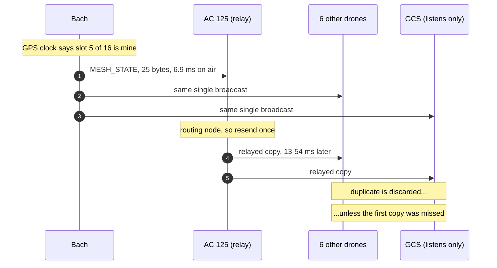

# Self-Organising Airborne LoRa MESH for Paparazzi UAV

**Radio** EByte E52-400NW22S, broadcast MESH, 62.5 kbps, 434.125 MHz, +10 dBm EIRP (10 mW, EU 433 ISM)
**Membership** dynamic. 8 aircraft nominal, up to ~12, nodes join, land and rejoin freely
**Ground station** AC_ID 0, a full peer inside the area, 4 m mast, mostly stationary; transmits sparingly (e.g. MOVE_WP)
**Operating area** 3.0 x 3.0 km
**Licence** academic exemption, 100 % duty cycle
**Priority** position throughput between nodes, reliable delivery to the GCS
**State** implemented, simulated under churn, compile-verified for fixedwing and rotorcraft

---

## 0. The design in one page

### Why the slot map had to become dynamic

An earlier revision assigned slots statically from `AC_ID`. That cannot survive
the actual deployment: nodes arrive and leave at will, the ground station moves
around and is just another peer, and aircraft drop out and rejoin. A compile
time slot map has no answer to any of that.

The established solution for this exact problem - many mobile peers, no
coordinator, free join and leave, everybody broadcasting position periodically -
is **self-organising TDMA**, the scheme marine AIS and VDL Mode 4 use. That is
what is implemented.

Three things make it cheap here:

1. **The occupancy map costs nothing on air.** A frame's slot is implied by its
   GPS-aligned arrival time, so every node learns who is using which slot purely
   from ordinary `MESH_STATE` traffic. No reservation protocol, no extra
   message, not one byte.
2. **Collisions resolve deterministically.** When two nodes can see each other
   in one slot, the higher `AC_ID` moves. Exactly one of the pair does.
3. **Spare membership becomes update rate.** With N slots and k nodes present,
   each node claims up to N/k of them. The frame is always full, so channel
   occupancy is constant while the position rate rises as nodes leave and falls
   back as they return.

### Measured behaviour under churn

`sw/tools/mesh/mesh_slot_sim.py` ports the airborne slot logic line for line and
drives it with a membership that changes underneath it:

| nodes present | slots per node | position rate |
|---|---|---|
| 2 | 3.5 | 3.5 Hz |
| 4 | 3.3 | 3.3 Hz |
| 6 | 1.8 | 1.8 Hz |
| **8** | **1.7** | **1.7 Hz** |

Rate adapts automatically, with no negotiation and nothing configured.

### Four failure modes the simulation found

None of these were visible from reading the code. Each is a real defect that was
found and fixed:

1. **Cold start deadlock.** Every node boots seeing an empty map, concludes it
   is alone, grabs the maximum share, and collides on every slot. Because a
   collision delivers nothing, none of them ever discovers the others exist.
   Permanent. *Fix: listen for three complete superframes before transmitting
   at all, then pick a slot that is demonstrably free - AIS network entry.*

2. **Persistent silent collision on expansion.** Two nodes claim the same free
   slot in the same frame. Neither can hear the other, and no third party can
   decode a collision either, so no evidence of the clash exists anywhere.
   *Fix: expansion is serialised round-robin by rank, so the first claimant is
   heard and recorded by everyone before the next node's turn.*

3. **Primary versus secondary deadlock.** A newcomer's primary lands on a slot
   somebody else is using opportunistically. Same mutual deafness.
   *Fix: opportunistic slots carry a randomised 6-13 frame lease; the two lapse
   at different times and diverge.*

4. **Primary versus primary deadlock.** The same, with no opportunistic slot to
   time out. *Fix: the primary carries a long randomised lease too. The length
   was tuned by sweep - too short and routine re-picking churns the map, too
   long and a real collision persists:*

   | primary lease | mean collisions | worst run |
   |---|---|---|
   | 30-60 frames | 4.61 % | 43 frames |
   | 60-120 | 1.57 % | 74 |
   | **120-240** | **0.64 %** | **84** |
   | 240-480 | 2.18 % | 244 |

Residual internal collision loss: **0.1-3 %** of slot-frames under aggressive
churn (a membership change every 50 s), **~0.1 %** at realistic churn. No
deadlocks remain: every collision is bounded by a lease and clears itself.

### What is delivered

| | static design | **self-organising** |
|---|---|---|
| slot assignment | compile time from `AC_ID` | **claimed, defended, released at run time** |
| node count | exactly 8, no spare | **any, up to the slot count** |
| join / land / rejoin | breaks | **handled, no configuration** |
| GCS | fixed corner, no slot | **a peer like any other** |
| position rate | fixed 2 Hz | **1.7 Hz at 8 nodes, up to 4 Hz when sparse** |
| channel utilisation | 32 % | **32 %, constant at any population** |

Frame: 16 slots of 62.5 ms, 1 s superframe. One relay aircraft for spatial
diversity (section 0 of the RF analysis). Air rate stays at **62.5 kbps** - the
only rate confirmed working on this hardware, and nothing in the design needs
another.

---

## Contents

1. [Executive summary](#1-executive-summary) — what the problem really was, in plain language, and [how it behaves in the air](#14-what-this-means-in-the-air)
2. [The bandwidth model](#2-the-bandwidth-model) — where every millisecond goes
3. [The schedule](#3-the-schedule) — how the phases were solved and proven
4. [The RF range model](#4-the-rf-range-model) — two-ray, not free space
5. [Files delivered](#5-files-delivered)
6. [Message and code design](#6-message-and-code-design)
7. [Modem configuration](#7-modem-configuration)
8. [Commissioning and acceptance](#8-commissioning-and-acceptance)
9. [Known limits and next levers](#9-known-limits-and-next-levers)

---

## 1. Executive summary

### 1.1 What was actually wrong

The obvious reading of the datasheet is "62.5 kbps air, 460800 baud serial, 5-packet
buffer — so just don't send more than 5 packets at once." That reading misses both
multipliers, and both matter more than the bit rate does.

**Multiplier one: every broadcast is transmitted nine times, not once.**

In broadcast MESH mode each routing node relays every broadcast exactly once (the
module's duplicate filter stops it happening twice). With nine nodes, one 25-byte
message sent by one aircraft occupies the shared channel **nine times**:

```
6.86 ms of air time per hop  x  9 hops  =  61.8 ms of channel time
```

The whole network — all nine nodes together — can therefore carry about **16
messages per second at 100 % channel occupancy**, and realistically about **6.5**
once you leave room for CSMA to work. Split across 8 aircraft that is **0.7 messages
per second each**. Not 62.5 kbps worth. That single number drives every other
decision in this design.

**Multiplier two: the relay copies land in your own transmit buffer.**

This is the part that turns a bandwidth problem into a blackout. Those eight relay
copies do not travel by some separate path — each one is queued **inside the
receiving modem's own 5-frame transmit cache**, the same cache the local autopilot is
pushing telemetry into.

So picture five aircraft that happen to transmit in the same millisecond. Every modem
in the sky now holds five frames it is obliged to relay. Add whatever the local
autopilot had queued and the cache passes five. At that point the module does not
drop the newest frame — it **force-clears everything it was holding**. One
coincidence blacks out the *entire network*, not one aircraft.

That is why fixing your own autopilot's burst behaviour is necessary but not
sufficient. You also have to stop the nine aircraft talking over each other.

### 1.2 How it is solved

Four layers, each closing a gap the layer above cannot reach.

| | Stops | Mechanism | Where |
|---|---|---|---|
| **1** | one autopilot dumping 18 frames on the same scheduler tick | solved `phase` offsets | [openuas_mesh_swarm.xml](../../conf/telemetry/OPENUAS/openuas_mesh_swarm.xml) |
| **2** | nine aircraft originating at the same instant | GPS-time TDMA, 4 s superframe / 16 slots | `traffic_info_mesh_periodic()` |
| **3** | residual slip between the boot clock and the GPS clock | leaky-bucket cache governor, high water 3 of 5 | `mesh_modem_in_flight()` |
| **4** | relay-versus-relay collisions inside one flood | `AT+CSMA_RNG=20` | modem |

**Layer 1 — why `phase` is exactly the right knob.** Paparazzi's generator turns
`period` and `phase` into one integer comparison per message:

```c
static uint32_t i1 = 0; i1++; if (i1 >= (uint32_t)(TELEMETRY_FREQUENCY*4.0)) i1 = 0;
if (i1 == (uint32_t)(TELEMETRY_FREQUENCY*4.0*0.002500)) { send_MESH_STATE(); }
```

Leave `phase` at its default and **every** message in a mode fires on tick 0. The
control experiment in the optimiser shows what that does to this message set: **18
frames handed to the modem inside a single 20 ms tick**, a peak cache depth of 17,
and two forced flushes per 64 seconds. With solved phases: **one frame at a time,
1000 ms of guaranteed quiet between them**, peak depth 1.

The phases are not hand-tuned. They are solved as an integer max-min-gap placement on
the circular tick lattice, then **verified by replaying the exact C trigger condition
the generator emits**, tick by tick, across the full 64 s super-period. The tool
checks the real thing, not its own idea of the real thing.

**Layer 2 — why GPS time and not boot time.** The telemetry counters start at
power-on. Two aircraft that booted 200 ms apart stay 200 ms apart forever; two that
booted together collide forever. GPS time of week is the one clock all nine nodes
already share, to well under a millisecond. The superframe is 4 s, cut into 16 slots
of 250 ms, and a node may only *originate* inside its own slot.

250 ms is not a round number picked for looks. It is one **complete flood** — nine
hops plus nine CSMA back-off draws — at mean + 3σ (203.7 ms). By the time the next
slot opens the previous message has finished propagating and every cache in the mesh
is empty again.

A message that comes due outside the slot is **not dropped**. It is latched and
released at the next slot opening, with the aircraft state snapshotted at
transmission time. The deferral costs latency; it never costs accuracy.

**Layer 3 — why a governor as well.** The telemetry clock is boot-relative, the slot
clock is GPS-relative. They step against each other when a GPS fix is acquired or
lost. A leaky bucket tracks how many frames are estimated to be still inside the
modem and refuses to hand over a new one at depth 3, leaving two frames of hard
margin.

### 1.3 The one design decision worth arguing about

How much flooding to accept. Originally 9x, on the argument that relaying
recovered coverage the direct link could not reach.

**The bounded 3 km operating area removes that argument entirely.** The worst
separation in the box is 4.24 km against design ranges of 9.2-12.3 km, so every
node already reaches every other node directly, with 7.3 dB to spare on top of
the fade margin. Nine transmissions per frame were paying for paths that already
existed.

What relaying still buys is **spatial diversity**, and section 4.4 shows that is
worth paying for: 7.3 dB does not survive a pessimistic interference budget. So
the delivered configuration keeps **one** relay aircraft. That is the knee of the
curve - it cuts modelled outage 5x, and because a 2-hop flood still fits inside
the 62.5 ms slot, it costs nothing in position update rate.

The residual risk is a **configuration trap**: the schedule assumes exactly one
routing node. Leave all nine routing and the flood no longer fits its slot.
Section 7 makes the role assignment part of the provisioning tool rather than
something to remember.

---

### 1.4 What this means in the air

Everything after this section is arithmetic. This one is the part worth reading
before a flight briefing, and it assumes no radio background.

#### Why there is exactly one relay aircraft

The obvious reason to relay would be **"we need it to reach"**. That reason is
false here, and it is worth saying so plainly: every drone can already talk to
every other drone directly. The radio manages roughly 12 km air-to-air, and the
two furthest points in a 3 x 3 km box are 4.24 km apart. Nothing is out of
range. Keeping a relay and describing it as "extended range" would have sounded
convincing and been wrong.

The real reason is **insurance**. At the far corner the link closes with 7.3 dB
to spare, and three perfectly ordinary events eat into exactly that:

| what happens | costs |
| --- | ---: |
| somebody else transmitting on 433 MHz nearby | 6 dB |
| aircraft banking 60 deg instead of 45, tilting the antenna | 3 dB |
| the antenna momentarily behind the fuselage | 4 dB |
| **worst case together** | **13 dB, against 7.3 dB of spare** |

When those line up, the direct path drops out for a moment. The relay gives
every message a **second path through a different part of the sky**, and two
paths rarely fail in the same instant, because the relay aircraft is not
shadowed by the same fuselage at the same moment.

It is a spare tyre. You do not need it to reach the shop; you carry it because
one tyre can go flat. That is also why **one** is enough: a second relay doubles
the airtime and buys very little, and nine relays needed 144 % of the channel,
which is not a trade-off but an impossibility.

#### If the whole swarm flies into one corner

This is the *easy* case, not the hard one. Clustering shortens every
drone-to-drone hop, and short hops are cheap:

| situation | drone-drone distance | margin |
| --- | ---: | ---: |
| spread across the box | 4.24 km | 7.3 dB |
| **clustered in one corner** | **0.71 km** | **24.8 dB** |

24.8 dB against 7.3 dB is about **sixty times more signal power**. The 13 dB of
bad luck tabulated above is absorbed with 11 dB still to spare. A swarm packed
into one corner is the most comfortable situation this network ever sees.

#### If the ground station drops out

Nothing happens to the swarm. That is deliberate, and it rests on three
configuration facts rather than on optimism:

* the modems run in **broadcast with no acknowledgement** (`AT+OPTION=3`), so no
  aircraft is ever waiting for a reply from anybody;
* the **ground station never relays**, but it does transmit, sparingly - a
  MOVE_WP or a SETTING now and then. It is provisioned as a terminal node, so
  its commands go out unslotted and contend like any other traffic, which is
  affordable precisely because they are rare;
* slot timing comes from **GPS time**, so there is no master station to lose.

The ground station is a radio scanner: it listens. Removing a listener does not
affect the talkers, and there is no rejoin handshake - when it comes back into
range it simply starts hearing again, mid-sentence.

> **Operational note.** The relay role belongs to **AC 125** and lives in the
> modem, not in a runtime election. If 125 lands, the mesh keeps working - every
> aircraft still reaches every other directly - but the spare tyre is gone and
> the network is back to relying on that 7.3 dB. Keep 125 airborne, or
> reprovision another aircraft as the routing node before it comes down.

#### Scenario A - normal flight, spread across the box

One aircraft, Bach, has a position to share.



Bach hands **one** 25-byte message to its modem. It goes on air once, the relay
repeats it once - that is the *flood tax of 2*, two transmissions per originated
message. The whole exchange finishes inside 53.7 ms, comfortably within the
62.5 ms slot, so it is over before the next aircraft's turn begins. Everyone who
heard the original throws the copy away; anyone who missed it gets a second
chance for free.

#### Scenario B - clustered in a corner, ground station out of range

The flow is identical, with two differences: the hops are ~700 m instead of
4.24 km so losses are effectively nil, and the ground station hears nothing. No
aircraft notices or cares.

Now the part that makes this a *mesh* rather than a fixed plan. Suppose four of
the eight land:

| drones airborne | slots each | position updates each |
| ---: | ---: | --- |
| 8 | 2 | 2 per second |
| 4 | 4 | 4 per second |
| 2 | 4 (capped by `MESH_TDMA_MAX_REUSE`) | 4 per second |

The remaining aircraft notice the silent slots after about four seconds and take
them over, so **the update rate rises automatically as the swarm thins out**,
and falls back as aircraft rejoin. Total airtime stays flat at roughly 32 % of
the channel either way. Nobody coordinates this and there is no master; each
aircraft simply listens and claims what is demonstrably free.

#### The one property that holds it all together

Because the worst separation in the box (4.24 km) sits well inside the radio's
reach (9.2-12.3 km), **every node can hear every other node, everywhere in the
operating area**. All aircraft therefore build the *same* picture of which slots
are occupied, which is why they do not talk over each other, and why clustering,
spreading out, landing and rejoining are all handled without special cases.

That guarantee is a property of the bounded 3 km area, not of the protocol. Grow
the operating area much beyond about 9 km across and aircraft on opposite edges
stop hearing each other; they would then claim the same slot in good faith, and
the design would need genuine hidden-terminal handling. Section 9.3 records this
as a boundary condition rather than a tuning knob.

---

## 2. The bandwidth model

### 2.1 The PHY, derived rather than assumed

The E52 "62.5K" setting is not ambiguous. LoRa's raw bit rate is

$$R_b = SF \cdot \frac{BW}{2^{SF}} \cdot CR$$

and

$$5 \cdot \frac{500\,000}{2^{5}} \cdot \frac{4}{5} = 62\,500\ \text{bps}$$

so the mode is **SF5, BW 500 kHz, CR 4/5** — the only point in the LoRa parameter
space that lands exactly on the datasheet figure. The standard Semtech time-on-air
formula therefore applies with those parameters:

$$T_{sym} = \frac{2^{SF}}{BW} = 64\ \mu\text{s}, \qquad
T_{pre} = (n_{pre} + 6.25)\,T_{sym} = 0.912\ \text{ms}$$

$$n_{payload} = 8 + \max\!\left(0,\ \left\lceil \frac{8\,PL - 4\,SF + 28 + 16}{4\,SF} \right\rceil \cdot (CR + 4)\right)$$

(the 6.25-symbol preamble constant applies at SF5 and SF6; SF ≥ 7 uses 4.25).

For `MESH_STATE`: 25 PPRZLink bytes + 13 bytes of MESH network header = 38 bytes on
air → 93 symbols → **6.86 ms per hop**.

### 2.2 Where the channel time goes

With one relay aircraft the flood tax is 2, not 9:

| Quantity | delivered (1 relay) | old (9 routing) |
|---|---|---|
| Air time, `MESH_STATE`, one hop | 6.86 ms | 6.86 ms |
| Transmissions per originated broadcast | **2** | 9 |
| Channel cost of one originated broadcast | **13.7 ms** | 61.8 ms |
| **Budget per aircraft** | **2.906 frames/s = one every 0.34 s** | 0.703 frames/s |

### 2.3 The delivered schedule

`openuas_mesh_swarm.xml`, 1 relay, 16 slots, 1.0 s superframe:

| Message | Payload | Wire | Air/hop | Period | Channel load |
|---|---|---|---|---|---|
| **`MESH_STATE`** | 17 B | 25 B | 6.86 ms | **0.5 s** | **27.46 ms/s** |
| `GPS_LLA` | 30 B | 38 B | 8.46 ms | 4.0 s | 4.23 ms/s |
| `ESTIMATOR` | 8 B | 16 B | 5.58 ms | 8.0 s | 1.40 ms/s |
| `NAVIGATION` | 27 B | 35 B | 8.14 ms | 16.0 s | 1.02 ms/s |
| `ENERGY` | 25 B | 33 B | 7.82 ms | 16.0 s | 0.98 ms/s |
| `ATTITUDE` | 12 B | 20 B | 6.22 ms | 16.0 s | 0.78 ms/s |
| `PPRZ_MODE` | 6 B | 14 B | 5.26 ms | 16.0 s | 0.66 ms/s |
| `ALIVE`, `AIR_DATA`, `DATALINK_REPORT`, `GPS_SOL`, `NAVIGATION_REF`, `DL_VALUE`, `WP_MOVED`, `FBW_STATUS`, and one of `CIRCLE`/`SEGMENT`/`SURVEY` | 5-28 B | 13-36 B | 5.3-8.1 ms | 32.0 s | 3.15 ms/s |
| | | | | **total** | **40.0 ms/s** |

$$8 \times 40.0\ \text{ms/s} = 320\ \text{ms/s} = \mathbf{32.0\,\%}\ \text{channel utilisation}$$

**`MESH_STATE` now takes 69 % of the budget, which is the point** - the position
stream is what the mission needs and it is where the capacity goes. The GCS
status tail costs 8 % of the channel between all eight aircraft.

The period family is 0.5 / 4 / 8 / 16 / 32 s - strictly harmonic, exactly as
`doc/mesh/Standardize_to_a_Harmonic_Period.md` argues for. That is not cosmetic:
a harmonic family makes the tick lattice dense and evenly divisible, which is why
the solver can hold a 240 ms guaranteed gap while fitting 18 messages into a
0.5 s base period.

`CIRCLE`, `SEGMENT` and `SURVEY` are mutually exclusive, so only one is charged.

This remains the minimum set that keeps a Paparazzi GCS fully functional for a
fixedwing, cross-checked against `sw/ground_segment/tmtc/parse_messages_v1.ml`.

### 2.4 The serial link is not the bottleneck — and that is the point

The largest frame (38 bytes) leaves the MCU UART at 460800 baud in **0.82 ms**. The
guaranteed gap between two frames is **1000 ms**. A factor of 1200.

This is why the airframe moved from `B57600` to `B460800`: not for throughput, but so
a frame is completely inside the modem long before its transmit slot opens. At 57600
the same frame takes 6.6 ms, comparable with the 6.86 ms air time, which makes the
modem's internal timing depend on how fast the autopilot happens to be feeding it.

### 2.5 Transmitter duty cycle (regulatory)

100 % duty cycle is licensed, so none of this binds. Recorded because it is what
decides whether the long range profile is legal.

| Profile | own | relayed | total per radio |
|---|---|---|---|
| 62.5 k, all 9 routing (old default) | 0.48 % | 3.38 % | **3.86 %** |
| **62.5 k, GCS + 2 relays (delivered)** | 0.97 % | 6.76 % | **7.72 %** on a relay, 0.97 % on a terminal |
| 21.875 k, GCS + 2 relays (long range) | 2.82 % | 8.73 % | **11.55 %** on a relay |

Only relay nodes carry the relayed share; the six terminal aircraft transmit under
1 % of the time. The last row is the one that needed the licence.

---

## 3. The schedule

### 3.1 How the phases were solved

`gen_periodic` allocates one counter per distinct `period` string, all starting at
zero at boot. A message with period $p$ and phase $\varphi$ therefore fires at every
absolute tick $t$ with

$$t \equiv \left\lfloor F \cdot p \cdot \varphi \right\rfloor \pmod{F \cdot p}$$

where $F$ = `TELEMETRY_FREQUENCY`. Choosing the phases is an **integer placement
problem on a circular lattice** whose period is the LCM of all $F p$ — here 3200
ticks = 64 s.

The solver walks messages most-frequent-first (they constrain the lattice hardest)
and places each on the free tick farthest from everything already placed. Phases are
emitted at the *midpoint* of the target integer bin, so the generator's truncation
lands where intended. The `phase ≤ 0.95` clamp is respected — above that,
`gen_periodic` reinterprets the value as a legacy 1/65536 tick count.

Because `phase` is a **fraction of the period**, the absolute firing times
$t = p\varphi$ are independent of `TELEMETRY_FREQUENCY`. The file stays correct if you
change the loop rate; only the quantisation changes.

### 3.2 Result

Base period 0.5 s, harmonic family 0.5 / 4 / 8 / 16 / 32 s:

```
message            period   ticks   tick      phase      t
                      [s] /period                     [ms]
-----------------------------------------------------------
MESH_STATE            0.5      25      0   0.020000        0
GPS_LLA               4.0     200     12   0.062500      240
ESTIMATOR             8.0     400     37   0.093750      740
ATTITUDE             16.0     800     62   0.078125     1240
ENERGY               16.0     800     87   0.109375     1740
NAVIGATION           16.0     800    112   0.140625     2240
PPRZ_MODE            16.0     800    137   0.171875     2740
AIR_DATA             32.0    1600    162   0.101562     3240
ALIVE                32.0    1600    187   0.117188     3740
CIRCLE               32.0    1600    237   0.148438     4740
DATALINK_REPORT      32.0    1600    262   0.164062     5240
DL_VALUE             32.0    1600    287   0.179688     5740
FBW_STATUS           32.0    1600    312   0.195312     6240
GPS_SOL              32.0    1600    337   0.210938     6740
NAVIGATION_REF       32.0    1600    362   0.226562     7240
SEGMENT              32.0    1600    387   0.242188     7740
SURVEY               32.0    1600    462   0.289062     9240
WP_MOVED             32.0    1600    487   0.304688     9740
-----------------------------------------------------------
achieved minimum inter-frame spacing : 12 ticks = 240 ms
```

`MESH_STATE` fires on tick 0 of every 25-tick cycle; everything else is placed in
the gaps between those. The 240 ms guaranteed gap is 4x the modem drain time even
though the base period is only 0.5 s - that is what the harmonic family buys.

### 3.3 Proof, and the control experiment

```
replayed gen_periodic over 1600 ticks (32 s superperiod)
total emissions in the superperiod     : 95
ticks emitting more than one message   : 0     OK
peak modem cache depth (local + relay) : 1     (tolerated 3, hardware limit 5)  OK
cache overflow events                  : 0     OK
channel utilisation                    : 32.0 %

control experiment - identical message set, all phase=0 (the default):
  ticks emitting more than one message : 8
  largest simultaneous burst           : 18 frames in one 20 ms scheduler tick
  peak modem cache depth               : 17
  OUT OF CACHE events                  : 2 per 32 s  ->  total buffer flush
```

### 3.4 The TDMA slot map

Superframe **1.00 s = 16 slots x 62.5 ms**. Slots are not pre-assigned: each
node claims a primary slot after listening, then takes up to
`MESH_TDMA_MAX_REUSE` = 4 in total depending on how many neighbours it hears.

```
AC122 -> 1   AC123 -> 2   AC124 -> 3   AC125 -> 4
AC126 -> 5   AC127 -> 6   AC128 -> 7   AC129 -> 0
```

A slot must contain one complete flood. With one relay that is 2 hops: 33.7 ms
mean, **53.7 ms absolute worst** if both hops draw the maximum CSMA back-off. The
62.5 ms slot clears the absolute worst by 16 %, so the bound is hard rather than
statistical.

> **Slot rule.** With no GCS uplink to schedule, every slot belongs to an
> aircraft and the map is `(AC_ID - 1) mod 8`. For AC_ID 122-129 that is exactly
> a permutation of 0..7 with nothing to spare. If a ninth transmitter ever
> appears it *will* collide, and the optimiser exits non-zero rather than emit
> such a schedule.
>
> If a GCS uplink is ever needed, reserve slot 0 with
> `1 + ((AC_ID - 1) % (MESH_TDMA_NB_SLOTS - 1))` and raise the slot count. Note
> that the naive `AC_ID % 8` would be wrong there: every multiple of 8 lands on
> the reserved slot.

> **Two coupling traps, both now caught by the compiler.**
>
> `MESH_TDMA_SUPERFRAME_MS` in the airframe and the `MESH_STATE` period in the
> telemetry file describe the same interval from two different files. If the
> superframe is the longer, the module releases one frame per superframe and
> silently discards the rest. `traffic_info.c` static asserts them equal to the
> millisecond against the generated `PERIOD_MESH_STATE_Ap_0`.
>
> The slot length is **62.5 ms**, not a whole number of milliseconds. Computing
> the slot index as `frame_ms / 62` would map the last 4 ms of every superframe
> to a ninth slot nobody owns. It is computed as
> `(frame_ms * MESH_TDMA_NB_SLOTS) / MESH_TDMA_SUPERFRAME_MS` instead, which is
> exact for any superframe.

---

## 4. The RF range model

### 4.1 Why free-space path loss is the wrong tool here

Free space assumes nothing else is in the way. Both ends of this link are close to a
large reflecting surface, so the correct model is **two-ray**: direct wave plus
ground-reflected wave, added coherently, with a complex Fresnel reflection
coefficient.

The difference is not academic. The transition is the **two-ray breakpoint**

$$d_{break} = \frac{4 h_1 h_2}{\lambda}$$

below which loss grows at 20 dB/decade and above which it grows at **40 dB/decade**:

| Path | $h_1$ | $h_2$ | breakpoint |
|---|---|---|---|
| aircraft to aircraft | 100 m | 100 m | **57.9 km** |
| aircraft to GCS, 2 m whip | 100 m | 2 m | **1.16 km** |
| **aircraft to GCS, 4 m mast** | 100 m | 4 m | **2.32 km** |

So air-to-air really is free-space limited — the breakpoint is far beyond any range
the power budget can reach. But **air-to-ground crosses its breakpoint at 2.32 km**,
and using free space beyond that overstates the range by about 20 %.

### 4.2 The budget

| Term | Value |
|---|---|
| Frequency | 434.125 MHz (λ = 69.1 cm) |
| TX power | +10 dBm EIRP = 10 mW, the EU 433 MHz ISM ceiling. The E52-400NW22S PA is rated 22 dBm and is deliberately run 12 dB below it; with the 0 dBi antenna the conducted `AT+POWER=10` is exactly 10 dBm EIRP |
| Antenna gain, both ends | 0 dBi |
| RX sensitivity @ 62.5 kbps | −111 dBm (datasheet) |
| **Raw system gain** | **121.0 dB** |
| 45° bank polarisation mismatch | −3.01 dB |
| Implementation / feedline | −1.00 dB |
| Multipath and shadowing margin | −10.00 dB |
| **Usable path loss** | **106.99 dB** |

The 3 dB bank figure is **derived, not assumed**. Two linearly polarised antennas
separated by angle $a$ couple as $\cos^2 a$, so the loss is $-20\log_{10}\cos a$:

| Bank | Loss | Range factor |
|---|---|---|
| 0° | 0.00 dB | ×1.00 |
| 15° | −0.30 dB | ×0.97 |
| 30° | −1.25 dB | ×0.87 |
| **45°** | **−3.01 dB** | **×0.71** |
| 60° | −6.02 dB | ×0.50 |
| 75° | −11.74 dB | ×0.26 |

A useful operational fact in its own right: a 60° bank halves your range, and that is
before any antenna pattern null.

### 4.3 Ranges

Two-ray model with the exact Fresnel coefficient for vertical polarisation over
average ground (ε_r = 15, σ = 0.005 S/m), including the Ament roughness factor for a
grass surface.

| Case | breakpoint | free space | two-ray | **design** | horizon | limited by |
|---|---|---|---|---|---|---|
| air-air, both 120 m | 83.41 | 12.30 | 13.14 | **12.30** | 90.3 | budget |
| **air-air, both 100 m** | 57.92 | 12.30 | 21.35 | **12.30** | 82.4 | budget |
| air-air, both 50 m | 14.48 | 12.30 | 21.24 | **12.30** | 58.3 | budget |
| air-air, 120 m to 50 m | 34.75 | 12.30 | 14.41 | **12.30** | 74.3 | budget |
| **air-ground, 100 m to 4 m** | 2.32 | 12.30 | 9.17 | **9.17** | 49.4 | **geometry** |
| air-ground, 50 m to 4 m | 1.16 | 12.30 | 6.57 | **6.57** | 37.4 | **geometry** |

All distances in km.

**The design range is `min(free space, two-ray)`, deliberately.** Averaging the
two-ray field over one interference lobe yields up to +3 dB over free space, because
the ground reflection genuinely does add power in the mean. But that is only a usable
gain if the geometry sweeps through a lobe quickly. It does not here:

```
air-air at 12.30 km : lobe period 5.22 km, +1.6 / -25.4 dB about the mean
                      one lobe takes 7.3 min at 12 m/s closure
```

An aircraft can sit near a null for **minutes**. Claiming extra range on the strength
of a reflection you do not control is not a range, it is luck. So the two-ray term is
allowed to *reduce* the answer (air-to-ground) but never to *increase* it.

### 4.4 The bounded operating area - the number that actually decides the design

A range figure answers "how far could we go". With a confirmed 3.0 x 3.0 km box
the useful question is "how much margin do we hold where we will actually fly".

| link (worst geometry, 4.24 km diagonal) | margin |
|---|---|
| drone-drone, both 120 m AGL | 9.2 dB |
| drone-drone, both 50 m AGL | 9.2 dB |
| drone-drone, 120 m to 50 m | 7.5 dB |
| drone-GCS, drone 120 m AGL | 9.2 dB |
| **drone-GCS, drone 50 m AGL** | **7.3 dB** |

These are *spare* margins, on top of the 10 dB fade margin already charged in
section 4.2. So the true fade tolerance at the worst corner is **17.3 dB**, and
every node reaches every other node directly.

Two consequences, and they pull in opposite directions:

* the mesh does not need multi-hop to be **connected** - nine-way flooding was
  buying paths that already existed;
* but 7.3 dB does not survive a pessimistic interference budget, so one path is
  not enough for it to be **reliable**:

```
  worst case spare margin                                       7.3 dB
    - 6.0 dB  co-channel users / raised noise floor in 433 ISM   1.3 dB  thin
    - 3.0 dB  60 deg bank instead of 45 (polarisation)          -1.7 dB  LOST
    - 4.0 dB  airframe shadowing, antenna behind the fuselage   -5.7 dB  LOST
```

Hence one relay, kept for **spatial diversity rather than reach** (section 0).

```bash
python3 sw/tools/mesh/mesh_link_budget.py --area-side 3000 --gcs-antenna-height 4
```

### 4.5 Ranges, for reference

> **Air-to-air: 12.30 km** - budget limited.
> **Air-to-GCS: 9.17 km** with the 4 m mast - geometry limited.

Both are roughly 2-3x the 4.24 km ever needed. Note the air-to-GCS figure
corrected downwards from an earlier 11.49 km: the lobe-averaging window was
reaching back past the two-ray breakpoint into the much stronger near field. The
window is now capped at 10 % of the range, which is the only regime where
averaging is physically meaningful.

| GCS mast | breakpoint | design range |
|---|---|---|
| 1.5 m | 0.87 km | 5.69 km |
| 2.0 m | 1.16 km | 6.53 km |
| 3.0 m | 1.74 km | 7.96 km |
| **4.0 m (available)** | **2.32 km** | **9.17 km** |
| 5.0 m | 2.90 km | 10.23 km |
| 10 m | 5.79 km | 12.30 km |

The mast still helps, but with only 4.24 km ever required it is no longer on the
critical path. It matters most for the low-altitude corner case, which is where
the 7.3 dB worst margin comes from.

---

## 5. Files delivered

| File | Status | What it is |
|---|---|---|
| [conf/telemetry/OPENUAS/openuas_mesh_swarm.xml](../../conf/telemetry/OPENUAS/openuas_mesh_swarm.xml) | **new, generated, DEFAULT** | 1 relay, 16 slots, 1.0 s superframe, 0.25 s `MESH_STATE` |
| [sw/tools/mesh/mesh_phase_optimizer.py](../../sw/tools/mesh/mesh_phase_optimizer.py) | **new** | budget, phase solver, generator replay, cache simulation, slot plan |
| [sw/tools/mesh/mesh_link_budget.py](../../sw/tools/mesh/mesh_link_budget.py) | **new** | two-ray propagation, bounded-area margins, duty cycle |
| [sw/tools/mesh/e52_provision.py](../../sw/tools/mesh/e52_provision.py) | **new** | modem provisioning over serial, role table, verification |
| [sw/tools/mesh/mesh_slot_sim.py](../../sw/tools/mesh/mesh_slot_sim.py) | **new** | churn simulation of the airborne slot self-organisation |
| [sw/tools/mesh/mesh_link_sim.py](../../sw/tools/mesh/mesh_link_sim.py) | **new** | packet-level RF simulation of the whole fleet in flight |
| [sw/ext/pprzlink/.../messages.xml](../../sw/ext/pprzlink/message_definitions/v1.0/messages.xml) | modified | `MESH_STATE`, datalink class, id 200 |
| [sw/airborne/modules/multi/traffic_info.h](../../sw/airborne/modules/multi/traffic_info.h) | modified | TDMA config, `ti_acs_slot()`, bounds fixes |
| [sw/airborne/modules/multi/traffic_info.c](../../sw/airborne/modules/multi/traffic_info.c) | modified | `MESH_STATE` send/parse, TDMA gate, cache governor, static assert |
| [conf/modules/traffic_info.xml](../../conf/modules/traffic_info.xml) | modified | datalink hook, 20 Hz mesh task, tunables |
| [conf/airframes/OPENUAS/openuas_zohd_talon_250g.xml](../../conf/airframes/OPENUAS/openuas_zohd_talon_250g.xml) | modified | `MODEM_BAUD` B460800, `MESH_TDMA_SUPERFRAME_MS` 500 |
| [conf/conf.xml](../../conf/conf.xml) | modified | **all 8 aircraft** use the swarm profile |
| `conf/userconf/tudelft/course_control_panel.xml` | modified | "Flight LoRa MESH" session |

> **All eight aircraft must use the same telemetry file**, and the airframe
> `MESH_TDMA_SUPERFRAME_MS` must match its `MESH_STATE` period. The budget is a
> *network* budget: one aircraft on a denser schedule saturates the mesh for
> everybody. The static assert catches the second half of that automatically.

### The toolbox, in plain language

Five command-line tools ship with the design. Each one answers a single
question you would otherwise have to answer by flying, and together they cover
the whole chain from "does the radio reach" to "is the modem configured".
All of them are plain Python 3, need no installation, run in seconds, and
**exit 0 only when every check passes** — so any of them can sit in a script
or a pre-flight checklist and stop you before a bad configuration flies.

| Tool | The question it answers |
|---|---|
| `mesh_link_budget.py` | *Will one radio hear another, and with how much to spare?* Computes the realistic range and margin between two nodes, using ground-reflection physics rather than optimistic free-space maths. Use it when the operating area, antenna heights or ground type change. |
| `mesh_phase_optimizer.py` | *Does all the telemetry fit on the air?* Adds up every message every aircraft sends, checks it against what the channel can carry, spreads the transmissions in time so they do not pile up, and writes the telemetry XML file the aircraft actually fly with. Use it whenever you change message rates, fleet size or the number of relays. |
| `mesh_slot_sim.py` | *Does the slot self-organisation survive aircraft coming and going?* Runs an exact copy of the airborne slot-claiming code through thousands of superframes of joins, leaves and cold starts, and asserts that no two aircraft ever transmit in the same slot. Use it after any change to the slot logic in `traffic_info.c`. |
| `mesh_link_sim.py` | *Putting it all together — what does the ground station actually receive?* Flies the whole fleet through the operating area, second by second: real geometry, banking aircraft, ground reflections, random fading, the slot schedule and the relay, all interacting. Reports the packet delivery ratio per drone and the busiest radio's duty cycle. Use it as the final end-to-end check before a flight campaign, and to test what-if questions (bigger box, GCS as router, more drones) without risking hardware. |
| `e52_provision.py` | *Is every modem configured identically and correctly?* Applies the complete AT command sequence to a modem over serial, derives each node's role (terminal or router) from its AC_ID, and can verify an already-configured modem without changing it. Use it on every modem, every time — never configure one by hand. |

The first four need no hardware at all; only `e52_provision.py` touches a
modem, and even it has a `--dry-run` mode that just prints what it would send.

### Running the tools

```bash
# regenerate the default swarm profile (exit 0 only if every check passes)
python3 sw/tools/mesh/mesh_phase_optimizer.py \
        --relay-nodes 1 --nb-slots 8 --mesh-period 0.5 --period-scale 0.5 \
        --emit-xml conf/telemetry/OPENUAS/openuas_mesh_swarm.xml

# the propagation study for the real box and mast
python3 sw/tools/mesh/mesh_link_budget.py --area-side 3000 --gcs-antenna-height 4

# two relays instead of one, if the bench test shows a noisy site
python3 sw/tools/mesh/mesh_phase_optimizer.py \
        --relay-nodes 2 --nb-slots 8 --mesh-period 0.75 --period-scale 0.5 \
        --emit-xml conf/telemetry/OPENUAS/openuas_mesh_swarm2.xml

# review a modem profile without touching hardware
python3 sw/tools/mesh/e52_provision.py --ac-id 129 --dry-run

# stress the slot self-organisation: 4000 superframes of joins and leaves
python3 sw/tools/mesh/mesh_slot_sim.py --frames 4000 --churn 0.05 --seed 7

# end-to-end RF simulation: 8 drones + GCS, 10 minutes, default relay (AC 125)
python3 sw/tools/mesh/mesh_link_sim.py

# the same fleet, but with the GCS provisioned as the router instead
python3 sw/tools/mesh/mesh_link_sim.py \
        --ac-ids 0,3,19,42,77,101,168,203,251 --relay-ids 0

# what-if: 12 drones, a 30-minute sortie, a different random world
python3 sw/tools/mesh/mesh_link_sim.py --drones 12 --duration 1800 --seed 7
```

### Reading `mesh_link_sim.py` output

```text
link simulation: 8 drones + GCS, 3.0 km box, 600 s, seed 1
  routers: [125]   shadowing sigma 3.0 dB tau 30 s
   AC_ID    sent   direct  relayed  worst margin
       3    1200    1.000    1.000       15.8 dB
     ...
  busiest radio: AC_ID 125, duty 32.0 % (ceiling 40 %)  OK
  fleet PDR to GCS: direct 1.000, relayed 1.000
```

* **direct / relayed** — the fraction of each drone's frames the ground
  station received on the direct path alone, and after the relay's copy is
  counted. `1.000` means nothing was lost. The gate is `--min-pdr` (default
  0.95): any drone below it fails the run.
* **worst margin** — the weakest instantaneous signal seen on any of that
  drone's links over the whole run, in dB above the point where frames start
  to drop. Positive and double-digit is comfortable; near zero means the
  fleet is flying at the edge of the radio's reach.
* **duty** — how much of the time the busiest transmitter is on the air.
  It must stay under the 40 % ceiling; note it lands on exactly the same
  32 % that `mesh_phase_optimizer.py` predicts for a single router, which is
  the cross-check that the two tools agree on the traffic model.

The simulator deliberately replaces the link budget's blanket 10 dB fade
margin with explicitly drawn random fades (`--shadow-sigma`, default 3 dB) —
charging both would count the same fades twice. To make it fail on purpose
and see what a broken configuration looks like, try
`--side 15000 --shadow-sigma 6`: delivery collapses, the offending drones are
flagged, and the exit status becomes 1.

---

## 6. Message and code design

### 6.1 `MESH_STATE` — 25 bytes on the wire against 31 for `ACINFO_LLA`

A 19 % saving on the most frequent message in the network, from removing two
redundancies rather than from cutting resolution:

* **no `ac_id` field.** The PPRZLink v2.0 header already carries `sender_id`. This
  also closes a spoofing gap: `ACINFO` and `ACINFO_LLA` let a payload field override
  the sender identity, `MESH_STATE` does not.
* **no `itow` field.** The receiver time-stamps on arrival, as `GPS_SMALL` already
  does. Over a mesh whose one-way latency is bounded by the slot time, the receiver's
  own clock beats a transmitter timestamp that has been sitting in a relay queue.

Position stays **universal and centimetre-accurate**: WGS84 latitude and longitude at
1e-7 deg (**1.11 cm**), altitude above the ellipsoid in **1 cm** steps. No shared UTM
zone, no shared LTP origin, valid anywhere on Earth.

| Field | Type | Bytes | Resolution |
|---|---|---|---|
| `flags` | uint8 | 1 | see below |
| `lat` | int32 | 4 | 1e-7 deg = 1.11 cm |
| `lon` | int32 | 4 | 1e-7 deg = 1.11 cm · cos(lat) |
| `alt` | int32 | 4 | 1 cm above WGS84 ellipsoid |
| `multiplex_speed` | uint32 | 4 | packed |

`multiplex_speed`, MSB first:

| Bits | Width | Field | Unit | Range |
|---|---|---|---|---|
| 31-20 | 12 | course over ground | 0.1° | 0 … 359.9° |
| 19-9 | 11 | ground speed | dm/s | 0 … 204.7 m/s |
| 8-0 | 9, signed | climb rate | dm/s | −25.6 … +25.5 m/s |

`flags`:

| Bits | Field |
|---|---|
| 2-0 | unified mode: MANUAL, ASSISTED, AUTO, HOME, NOGPS, FAILSAFE, KILL, UNKNOWN |
| 3 | vehicle class: 0 fixedwing, 1 rotorcraft/hybrid |
| 4 | position valid (3D fix and INS converged) |
| 5 | airborne |
| 6 | non-fatal alert (low battery) |
| 7 | **emergency** — not following the flight plan, give right of way |

The 3-bit mode is a **unified, firmware-independent** enumeration. Fixedwing
`AP_MODE_AUTO2` and rotorcraft `AP_MODE_NAV` both encode as `MESH_MODE_AUTO`, so a
mixed fleet needs no per-vehicle decoding table. Every `AP_MODE_*` reference is
`#ifdef`-guarded, because those constants differ per firmware and vanish entirely
under `USE_GENERATED_AUTOPILOT`.

### 6.2 The transmit path

```c
/* The telemetry callback only learns the transport. It does not transmit and
 * does not pace anything: the scheduler counts from boot, slots are aligned to
 * GPS, so letting it gate emission silently dropped owned slots. */
static void request_mesh_state(struct transport_tx *trans, struct link_device *dev)
{
  mesh_trans = trans;
  mesh_dev = dev;
  mesh_link.ready = true;
}

void traffic_info_mesh_periodic(void)                 /* 20 Hz */
{
  const uint32_t net_ms = mesh_network_time_ms();     /* GPS tow, or sys clock */
  const uint16_t frame  = mesh_frame_of(net_ms);
  const uint8_t  slot   = mesh_slot_of(net_ms);       /* exact: (ms*N)/period */

  /* Slot bookkeeping is per SUPERFRAME, not per tick: mesh_expansion_turn() is
   * a function of the frame alone, so running it every tick would let a node
   * take its whole share inside one frame and defeat the serialisation. */
  if (frame != mesh_last_frame) {
    mesh_last_frame = frame;
    if (mesh_frames_seen < 0xFFFF) { mesh_frames_seen++; }
    mesh_slot_maintain(frame);
  }

  if (!mesh_link.ready || mesh_trans == NULL || mesh_dev == NULL) { return; }
  if (!mesh_owns(slot)) {
    mesh_link.defer_ticks++;
    return;                                   /* not one of our slots */
  }

  const uint32_t key = (uint32_t)frame * MESH_TDMA_NB_SLOTS + slot;
  if (key == mesh_link.last_emit_key) {
    return;                                   /* already originated in it */
  }

  const uint32_t now_ms = get_sys_time_msec();
  if (mesh_modem_in_flight(now_ms) >= MESH_CACHE_HIGH_WATER) {
    mesh_link.throttled_count++;
    return;                                   /* protect the 5 frame cache */
  }

  mesh_state_emit();

  mesh_link.last_emit_key = key;
  mesh_link.tx_count++;
  mesh_link.modem_free_ms = Max(mesh_link.modem_free_ms, now_ms) + MESH_MODEM_DRAIN_MS;
}
```

The cache governor, O(1), no timers, no allocation:

```c
static uint8_t mesh_modem_in_flight(uint32_t now_ms)
{
  const int32_t remaining = (int32_t)(mesh_link.modem_free_ms - now_ms);
  if (remaining <= 0) {
    return 0;
  }
  return (uint8_t)Min(255, ((uint32_t)remaining + MESH_MODEM_DRAIN_MS - 1) / MESH_MODEM_DRAIN_MS);
}
```

Note the branch-free 9-bit sign extension in the unpacker, which avoids the
implementation-defined behaviour of OR-ing a sign mask into a signed type:

```c
const int32_t climb_dms = (int32_t)((multiplex & 0x01FFu) ^ 0x0100u) - 0x0100;
```

Two clock domains are used deliberately: **GPS time of week** for the slot index
(because it is shared across nodes) and `get_sys_time_msec()` for the governor
(because it is monotonic and does not wrap at the week boundary).

### 6.3 Defects found and fixed in `traffic_info`

Pre-existing upstream bugs turned up by the memory-management review.

1. **A full table froze the entire traffic picture.** Every setter was wrapped in
   `if (ti_acs_idx < NB_ACS) { ... }`. Once the table filled, that guard blocked not
   only new arrivals but also **updates to already-tracked aircraft** — the collision
   avoidance picture silently froze at the last known positions rather than merely
   refusing the 25th aircraft. Replaced by `ti_acs_slot()`, which separates "look up"
   from "insert" and returns `TI_ACS_NONE` only for the genuinely un-insertable case.

2. **`acInfoSetPositionLla_f()` wrote a float LLA into the integer field**
   (`lla_pos_i`) while setting the `AC_INFO_POS_LLA_F` status bit. Consumers then read
   radian-scaled values out of a 1e7-deg field. Now writes `lla_pos_f`.

3. **`acInfoSetVelocityEnu_f()` wrote a float ENU velocity into `enu_vel_i`** while
   setting `AC_INFO_VEL_ENU_F`. Same class of bug. Now writes `enu_vel_f`.

4. **Own relayed frames overwrote own state.** In a flooded mesh your transmissions
   come back from every neighbour. `parse_acinfo_dl()` now discards
   `sender_id == AC_ID` before touching the table.

All storage is static: `ti_acs[NB_ACS]`, `ti_acs_id[NB_ACS_ID]`, one
`struct MeshLinkState`, and two pointers to telemetry-owned singletons. No `malloc`,
no variable-length arrays, no recursion in any added code.

### 6.4 Build verification

Clean builds, no warnings from the added code.

| Target | Result |
|---|---|
| `make AIRCRAFT=Adam ap.compile` (fixedwing, ChibiOS/STM32F4) | text 180 780 - OK |
| `make AIRCRAFT=Bach ap.compile` (fixedwing, AC_ID 128) | text 175 212 - OK |
| `make AIRCRAFT=Haydn ap.compile` (fixedwing) | text 175 212 - OK |
| `make AIRCRAFT=Adam nps.compile` (simulation) | `simsitl` built - OK |
| `make AIRCRAFT=CubeOrange ap.compile` (rotorcraft) | OK |
| superframe / period mismatch (deliberate) | **build correctly rejected** by the static assert |
| superframe not divisible by slot count (deliberate) | **build correctly rejected**, led to the exact-integer slot index |
| `mesh_phase_optimizer.py` (delivered profile) | exit 0 |
| `--period-scale 0.25` (deliberately over budget) | exit 1, correctly refused |
| `mesh_link_budget.py` | exit 0 |
| `e52_provision.py --dry-run`, all 9 nodes | exit 0, one routing node (AC 125), 10 dBm EIRP, channel 24 |

The generated trigger in `var/aircrafts/Adam/ap/generated/periodic_telemetry.h`
matches the model exactly:

```c
if (i1 == (uint32_t)(TELEMETRY_FREQUENCY*4.0*0.002500)) { ... MESH_STATE ... }
```

---

## 7. Modem configuration

### 7.1 Use the tool

```bash
# aircraft
python3 sw/tools/mesh/e52_provision.py --port /dev/ttyUSB0 --ac-id 129 --factory-reset

# ground station  (note the different baud, see 7.4)
python3 sw/tools/mesh/e52_provision.py --port /dev/ttyUSB0 --ac-id 0 --baud 230400 --factory-reset

# read back an already programmed node
python3 sw/tools/mesh/e52_provision.py --port /dev/ttyUSB0 --ac-id 129 --verify-only
```

Nine modems configured by hand is nine chances to typo one address. The tool applies
the whole profile, **checks every response**, aborts on the first failure rather than
leaving a half-configured module, and reads the configuration back at the end.

Addresses are `1000 + AC_ID`, so a modem address maps back to an aircraft at a
glance. The **role** column is not cosmetic: the schedule assumes exactly one
routing node, and the tool applies it from `RELAY_AC_IDS` so it cannot be
forgotten.

| Node | AC_ID | `SRC_ADDR` | TDMA slot | Role | `AT+TYPE` |
|---|---|---|---|---|---|
| GCS | 0 | 1000 | none; rare commands contend | GCS, terminal | 1 |
| Haydn | 122 | 1122 | 1 | terminal | 1 |
| Grieg | 123 | 1123 | 2 | terminal | 1 |
| Franck | 124 | 1124 | 3 | terminal | 1 |
| **Elgar** | 125 | 1125 | 4 | **relay, routing** | **0** |
| Debussy | 126 | 1126 | 5 | terminal | 1 |
| Chopin | 127 | 1127 | 6 | terminal | 1 |
| Bach | 128 | 1128 | 7 | terminal | 1 |
| Adam | 129 | 1129 | 0 | terminal | 1 |

Terminal nodes still **receive** everything, they simply do not forward it. So
inter-drone position exchange is unaffected by the role - every aircraft hears
every other aircraft directly. The relay exists only to give each frame a second,
spatially separate path.

**The GCS is a terminal node too.** Relaying would not help it *receive*, every
aircraft is already in its direct range, and it would double the channel cost of
every frame in the network for nothing.

Set `RELAY_AC_IDS` in `e52_provision.py` to whichever airframe is expected to fly
most centrally and stay aloft longest. If it lands the mesh degrades gracefully
to flat: still fully connected across the 4.24 km diagonal, just without the
diverse second path.

### 7.2 The complete AT sequence

Factory default is **115200 8N1**. Commands are ASCII terminated by CR; the module
answers `AT+<CMD>=OK` or `AT+<CMD>=CMD_ERR` / `=CMD_VALUE_ERR`. Commands that take no
`<save>` argument always write flash.

```
 1  AT+DEFAULT                # known starting state
 2  AT+PANID=250,1            # private network id, keeps this swarm off other E52 kit
 3  AT+SRC_ADDR=1129,1        # 1000 + AC_ID, unique per node
 4  AT+TYPE=1                 # 1 terminal for 7 aircraft + GCS, 0 for the one relay
                             # (see the role table above). MUST follow SRC_ADDR:
                             # TYPE rewrites the top bit of the local address
 5  AT+RATE=0                 # 62.5 kbps = SF5 / BW 500 kHz / CR 4/5
 6  AT+CHANNEL=24,1           # 410.125 + 24 = 434.125 MHz
 7  AT+POWER=10,1             # +10 dBm conducted = 10 dBm EIRP with 0 dBi
 8  AT+OPTION=3,1             # broadcast
 9  AT+DST_ADDR=65535,1       # broadcast destination
10  AT+SRC_PORT=1,1           # default port
11  AT+DST_PORT=1,1           # default port (14 is remote config - never use for data)
12  AT+ROUTER_SAVE=0          # do not persist routes: the nodes move
13  AT+ROUTER_CLR=1           # start with an empty routing table
14  AT+ROUTER_SCORE=3         # failures before a route is rebuilt
15  AT+HEAD=0                 # no extra serial-side frame header
16  AT+BACK=0                 # no SUCCESS / ERR text injected into the RX stream
17  AT+CSMA_RNG=20            # minimum random avoidance (takes no <save> argument)
18  AT+RESET_TIME=0           # disable the 5 minute RF auto-restart
19  AT+RESET_AUX=0            # and its LED side effect
20  AT+FILTER_TIME=3000       # duplicate filter window (takes no <save> argument)
21  AT+UART=460800,8N1        # LAST - reconnect the terminal at the new rate
22  AT+RESET                  # apply
```

Optional payload encryption, inserted before step 21:

```
    AT+SECURITY=1
    AT+KEY=<32-bit key>       # identical on every node, cannot be read back
```

Verify with `AT+INFO=?` and confirm on every node: `RATE 62.5K`, `CHANNEL 24`,
`POWER 10`, `OPTION 3`, `PANID 250`, a `TYPE` matching the role table, and a
`SRC_ADDR` unique across the fleet.

> **Steps 17 and 20 take no `<save>` argument.** `AT+CSMA_RNG` and `AT+FILTER_TIME`
> are documented as `AT+CMD=<value>` only. Appending `,1` returns `CMD_ERR` because
> the module counts the parameters. They always write flash anyway.

### 7.3 Why each of the non-obvious ones

**`AT+BACK=0` — the one people miss.** With return messages enabled the module writes
`SUCCESS` (or `ERR`, `NO ACK`, `OUT OF CACHE`) as ASCII into the autopilot's receive
stream after every transmission. That is continuous garbage the PPRZ parser has to
chew through, indistinguishable from a corrupted frame. It also means the one
diagnostic you most want — `OUT OF CACHE` — is being fed to a binary parser instead
of to you.

**`AT+HEAD=0`.** Removes the 8-byte frame type / length / PANID / source /
destination header the module prepends to *received* data. Pure duplication:
PPRZLink v2.0 already carries `sender_id`, a length byte and a two-byte Fletcher
checksum. Routing reliability is unaffected — the header is a serial-side
presentation, not part of the mesh protocol.

**`AT+CSMA_RNG=20`.** The datasheet minimum, and the manual explicitly advises
against shortening it. For an unsynchronised network that advice is right. Here the
application layer already guarantees one originator at a time, so the random
avoidance is only protecting relay-versus-relay collisions inside a single flood. The
arithmetic:

| CSMA_RNG | mean back-off/hop | worst-case flood span (9 hops) |
|---|---|---|
| 127 ms (default) | 63.5 ms | **1.21 s** |
| **20 ms** | 10 ms | **242 ms** |

A 250 ms slot — and therefore a 4 s superframe — is only possible at 20 ms. At the
default the superframe would have to be 20 s.

**`AT+FILTER_TIME=3000`.** Shortens duplicate suppression from 15 s to the 3 s
minimum. Safe here because each node originates only once per 4 s superframe, so no
legitimate frame can fall inside a 3 s duplicate window; and a shorter window means a
smaller duplicate table, removing any risk of table exhaustion at 9 nodes.

**`AT+ROUTER_SAVE=0`.** A route saved from the last flight describes a topology that
no longer exists. Starting empty costs one discovery and avoids chasing a ghost.

**Payload safety.** The module parses inbound serial data for AT commands, so user
data must never look like one. PPRZLink v2.0 frames always begin with `0x99`, never
with ASCII `AT+` (`0x41 0x54 0x2B`), so this failure mode cannot occur with this
transport. Do not put a text-based transport on the same port.

### 7.4 The ground station runs at 460800, same as the aircraft

An earlier revision of this document claimed the ground station had to run at
230400 because "the Paparazzi ground link cannot open 460800". That was true as
observed but wrong as a conclusion: it was not a limitation of anything, it was
a missing line.

The exact chain:

```
link.ml:503   Serial.opendev !port (Serial.speed_of_baudrate !baudrate) ...
serial.ml:72    | "230400" -> B230400
serial.ml:73    | "921600" -> B921600        <-- no "460800" case
serial.ml:76    | _ -> invalid_arg "Serial.speed_of_baudrate"
```

`speed_of_baudrate` is a hand written string-to-variant table and 460800 was
simply never added to it. Everything underneath supports the rate:

| layer | supports 460800 |
|---|---|
| glibc / termios | yes, `B460800` = 0o1604000 |
| kernel + USB serial driver | yes |
| the E52 modem | yes, `AT+UART` accepts up to 460800 |
| pyserial, minicom, everything else | yes |
| **Paparazzi's `Serial` module** | **no - the table stopped at 230400** |

**Fixed.** `B460800` was added to the variant in `sw/lib/ocaml/serial.ml` and
`serial.mli`, and to the `baudrates[]` table in `sw/lib/ocaml/cserial.c`. The
variant's ordinal is used directly as the array index, so it has to be inserted
at the same position in all three; the macOS branch of the array gets a guarded
placeholder to keep the ordinals aligned.

Verified end to end against a real `/dev` node:

```
$ link -d /dev/pts/5 -s 12345      # unsupported: what 460800 used to do
Invalid_argument("Serial.speed_of_baudrate")

$ link -d /dev/pts/5 -s 460800     # after the fix
$ stty -F /dev/pts/5 -a | head -1
speed 460800 baud; rows 0; columns 0; line = 0;
```

Two things found while doing it:

* **A latent out-of-bounds read.** The bounds check in `c_init_serial` was
  `if (br_idx >= sizeof(baudrates))`. `sizeof` on an `int[]` is the size in
  **bytes**, so a 22 entry table admitted indices up to 87 and read well past
  the end. It now compares against the element count, and `c_set_baudrate`,
  which had no check at all, has one too.

* **`link` only applies the baud rate when the device path starts with
  `/dev`.** See `on_serial_device` in `link.ml` - it is even marked `FIXME`.
  Point `-d` at a symlink under `/tmp` and `-s` is silently ignored, which is a
  confusing way to lose an afternoon.

### 7.5 Regulatory

The 62.5 kbps mode occupies **500 kHz**. Channel 24 (434.125 MHz) puts that at
433.875-434.375 MHz, entirely inside 433.050-434.790 MHz. The factory default channel
23 (433.125 MHz) would spread down to 432.875 MHz, **below the band edge** — which is
why the profile changes it.

100 % duty cycle is licensed for this operation, so the 3.86-11.55 % figures in
section 2.5 are not constraints. They are recorded because they decide which
profiles would be legal *without* that licence, and because the licence may be
specific to a sub-band or an emission bandwidth — the 500 kHz occupied bandwidth of
the 62.5 kbps mode is the number to check it against, not the 3.86 % duty.

---

## 8. Commissioning and acceptance

**Bench, two nodes**

1. Provision both, then `--verify-only` each. All parameters must match except
   `SRC_ADDR`.
2. Place them 10 m apart. Start the "Flight LoRa MESH" control panel session.
3. Both aircraft appear on the GCS within 8 s (the `GPS_LLA` period) and stay.

**Bench, full fleet**

4. Bring all 9 nodes up. Watch `DATALINK_REPORT` for 5 minutes; the loss counters
   must not climb.
5. Any `OUT OF CACHE` on a modem console is a **hard failure**. Stop and re-check
   `AT+CSMA_RNG`, `AT+BACK` and the slot assignment.

**Diagnostics to watch** (`struct MeshLinkState`, visible in the settings browser)

| Counter | Expected | If it misbehaves |
|---|---|---|
| `tx_count` | +1 every 4 s | — |
| `defer_ticks` | climbs steadily | normal; its rate reveals the fixed offset between the boot clock and the GPS slot clock |
| `throttled_count` | **0** | the cache governor is intervening — the schedule is denser than the real topology supports. Re-run the optimiser with the actual relay count |
| `synced` | true once airborne | false means no 3D fix, so slotting has fallen back to the local clock and nodes are not aligned |

**Flight**

6. First flight with two aircraft only, inside 1 km, watching the counters.
7. Expand to the full fleet only after a clean two-aircraft sortie.

---

## 9. Known limits and next levers

### 9.1 What this design costs you

GCS status refreshes every 16-32 s, and `GPS_LLA` every 4 s. That is deliberate:
the capacity went to `MESH_STATE`, which now takes 69 % of the budget. The
mission needs position throughput between aircraft; a battery voltage does not
need to arrive twice a second.

If GCS status matters more than position rate, raise `--period-scale` and re-run.
There is room: the design sits at 32 % of a 40 % ceiling.

### 9.2 The remaining levers

| Change | Effect | Cost |
|---|---|---|
| drop the relay (all terminal) | `MESH_STATE` to 4 Hz | outage 1.9 % -> 10 %. **Not recommended** |
| add a second relay | outage 1.9 % -> 0.36 % | `MESH_STATE` down to 1.33 Hz |
| `--period-scale 0.25` | GCS status twice as fast | utilisation 32 % -> 42 %, over ceiling |
| 5 m mast instead of 4 m | GCS leg 9.17 -> 10.23 km | irrelevant, 4.24 km is all that is needed |
| 21.875 kbps (`--air-rate 1`) | +5 dB, ranges x1.78 | 3x air time, and an air rate not confirmed on this hardware |

The second relay is the one worth considering, and the decision is empirical:
fly the bench test in section 8, look at whether frames are actually being lost,
and only then trade a third of the update rate for it.

```bash
# two relays, 0.75 s superframe, 1.33 Hz
python3 sw/tools/mesh/mesh_phase_optimizer.py --relay-nodes 2 --nb-slots 8 \
        --mesh-period 0.75 --period-scale 0.5 \
        --emit-xml conf/telemetry/OPENUAS/openuas_mesh_swarm2.xml
# then add AC to RELAY_AC_IDS and set MESH_TDMA_SUPERFRAME_MS=750
```

### 9.3 What would break this design

* **A ninth transmitter.** Eight slots, eight aircraft, nothing spare. A ninth
  node collides with an existing slot. The optimiser refuses to emit such a
  schedule, but it cannot stop someone powering on a spare airframe.
* **Flying outside the 3 km box.** The margins in section 4.4 are computed at the
  4.24 km diagonal. At 8 km the GCS leg from a low aircraft is marginal.
* **Growing the operating area past about 9 km across.** This is the sharper
  version of the point above, and it breaks the protocol rather than the link
  budget. The slot map only stays consistent because every node hears every
  other node (section 1.4); beyond mutual radio range, two aircraft on opposite
  edges cannot hear each other, will claim the same slot in good faith, and
  neither can detect it. That is the classic hidden-terminal problem and this
  design does not solve it - it avoids it, by being deployed inside a box
  smaller than its own radio range.
* **Leaving all modems as routing nodes.** The flood would be 9 hops, 242 ms, and
  would not fit the 62.5 ms slot.
* **Changing the `MESH_STATE` period without the airframe define.** Caught at
  build time by the static assert.

### 9.4 Things deliberately not done

* **No slot negotiation messages.** Slots *are* dynamic, but they are claimed by
  observation, never by agreement: a node listens, sees which slots are silent,
  and takes one. There is no request, no grant and no control channel, because a
  control channel needs to be heard to work - and the one thing that is
  guaranteed unheard is a collision. Every rule in section 3.4 is designed to be
  decidable from silence alone.
* **No retransmission or ARQ.** The consumers dead-reckon from course, speed and
  climb, all carried in every frame, and at 2 Hz a lost frame costs 0.5 s of
  extrapolation.
* **No slotting of the GCS status tail.** It is 8 % of the channel across all
  eight aircraft; slotting it would need a multi-message latch for very little
  gain.
* **No automatic relay election.** Which aircraft relays is a static list in
  `e52_provision.py`. If it lands, the mesh degrades to flat: still connected at
  4.24 km, just without the diverse second path.
