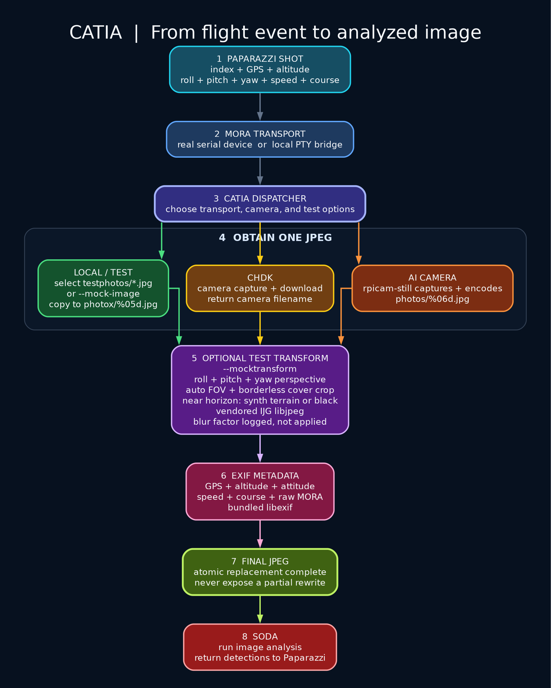
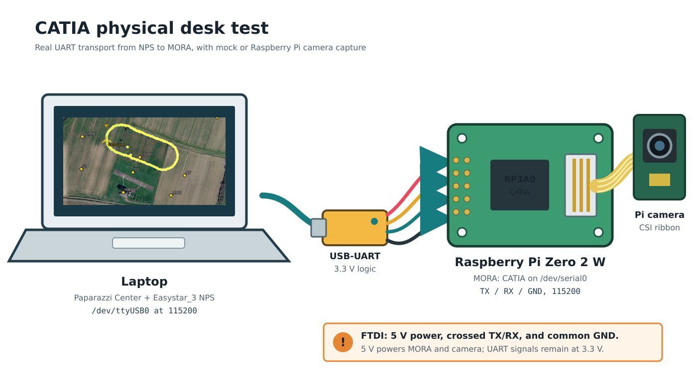
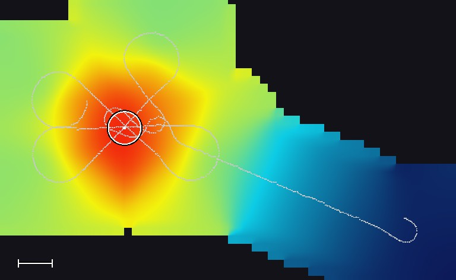

# CATIA Camera Pipeline

**CATIA (Camera Application Triggering Image Analysis)** runs on the MORA
companion board. It receives camera commands from the flight controller,
captures images, adds flight metadata to EXIF, and passes images to SODA for
analysis.

**Deploying a board? Start with [Deploy to MORA](#deploy-to-mora).**
For hardware checks after deployment, continue with the
[physical desk test](#start-here-physical-desk-test-with-mora).
For development without a board, use [local simulation](#start-here-local-simulation).

**Doc Maintainers:** edit this `README.md`, `catia-flow.dot`, or
`desk-test-setup.svg`, then run `./update-documentation.sh`. The rendered PNGs,
flow SVG, and HTML page are generated files.



[Documentation Hub](index.html) |
[AI Camera](raspberry_pi_ai_camera.html) |
[LWIR Calibration](lwir-calibration.html) |
[EARcam Guide](earcam-loudest-spot-explained.html) |
[EARcam Data Flow](earcam-dataflow.html) |
[Mission 2 Plan](mission2-score-first.html)

## Deploy to MORA

This is the complete deployment procedure. Commands below run on the
**development PC from the Paparazzi repository root**, unless marked otherwise.
The default board is `air@theatre`; substitute your SSH destination consistently.
Deploy only while the aircraft is disarmed and on the bench: activation stops
and restarts the camera service.

### 1. Know what is installed

The supported installation directory is **`/home/air/digital_cam`**. The supplied
systemd unit requires this path and the `air` account; changing only the script's
destination directory is not supported.

| Built on the PC | Installed on MORA | Purpose |
| --- | --- | --- |
| `catia-arm64` | `catia` | UART protocol, capture coordination and metadata |
| `soda-arm64` | `soda` | Image analysis |
| `lwircam-arm64` | `lwircam` | Tiny 1-C thermal camera |
| `earcam-arm64` | `earcam` | Acoustic capture and detection |
| Visible and thermal mock JPEGs | `mock_image_01.jpg`, `mock_lwir_01.jpg` | Hardware-free checks |
| `catia.service` | Runtime copy and `/etc/systemd/system/catia.service` | Boot startup |
| `99-tiny1c.rules` | Runtime copy and `/etc/udev/rules.d/99-tiny1c.rules` | USB permissions |

AIcam and CHDK are compiled into CATIA, not separate executables. Raspberry Pi
camera support also needs `rpicam-still` installed on MORA. CHDK needs the external
control script configured in `chdk_pipe.c`. Deployment does not install these
external tools, flash flight-controller firmware, configure the board OS/UART,
or copy this manual. It does not remove photos or EARcam logs.

The supplied service starts **LWIRcam and EARcam**, with EARcam band
`2400,3200` Hz. It does not enable AIcam or CHDK. Review `catia.service` before
deploying; deployment replaces the main unit, while existing systemd drop-ins
can still override it. The default service requires the Tiny 1-C and a working
`/dev/serial0` for startup. A missing microphone is reported but is not fatal.

### 2. Prepare the PC and board once

PC requirements: GNU Make, C/C++ compilers, CMake, `pkg-config`, `file`, SSH,
`rsync`, GNU AArch64 C/C++ compilers, `readelf`, `strip`, and native plus ARM64
ALSA development files. On Debian/Ubuntu, the cross-compiler packages are
`gcc-aarch64-linux-gnu` and `g++-aarch64-linux-gnu`. ALSA development packages
are `libasound2-dev` and `libasound2-dev:arm64` with the appropriate multiarch
repositories configured. A separate sysroot can instead use `ARM64_SYSROOT`
and `ARM64_PKG_CONFIG_LIBDIR`.

MORA requirements: a **64-bit ARM Linux userspace**, Bash, `flock`, systemd,
udev, `rsync`, `pgrep`, ARM64 `libasound.so.2`, and an `air` account with
`dialout` and `plugdev` membership. ALSA utilities provide `amixer` for microphone
gain setup. The account needs writable installation storage and sudo permission
for the deployment helper's installation, backup, systemd, and udev commands.
Passwordless sudo is optional: for password-protected accounts, authenticate
with `sudo -v` and run the staged helper in the same interactive SSH terminal
as shown in step 4. Never put a sudo password into a script or chat.

#### Get the OS to work with the UART port

On the Raspberry Pi Zero 2 W MORA (`theatre`), disable Bluetooth and dedicate
the full UART to CATIA. Wi-Fi remains enabled. This is a one-time board setup,
not something to repeat for every application deployment.

Connect from the development PC:

```sh
ssh air@theatre
```

Run the following steps **on MORA**. Enter sudo passwords directly in that
terminal.

1. Open the boot configuration:

   ```sh
   sudo nano /boot/firmware/config.txt
   ```

   Under the existing `[all]` section, add or update these settings:

   ```ini
   enable_uart=1
   dtoverlay=disable-bt
   ```

   NOTE: Remove `dtoverlay=miniuart-bt` if present; it is the alternative setup that
   retains Bluetooth. Do not leave both overlays enabled. Save and exit.

1. Disable the Bluetooth services:

   ```sh
   sudo systemctl disable --now hciuart.service bluetooth.service
   ```

   If either service is absent, skip that service and disable the one that
   exists. An absent Bluetooth service does not prevent UART setup.

1. Configure the serial port:

   ```sh
   sudo raspi-config
   ```

   Choose **Interface Options > Serial Port**. Set **Login shell over serial**
   to **No** and **Serial hardware enabled** to **Yes**, then finish.

1. Reboot to apply the configuration:

   ```sh
   sudo reboot
   ```

   The SSH connection closes. Once MORA is reachable again, reconnect from
   the PC with `ssh air@theatre`.

1. Verify the devices on MORA:

   ```sh
   ls -l /dev/serial0 /dev/ttyAMA0
   ```

   Expected mapping for this board configuration:

   ```text
   /dev/serial0 -> ttyAMA0
   ```

   Confirm that `/dev/ttyAMA0` is a character device accessible to `air`
   through its `dialout` group. Do not create a manual symlink to compensate
   for missing OS configuration.

MORA TX remains **GPIO14, physical pin 8**; RX remains **GPIO15, physical pin 10**.
No PC-side FTDI configuration change is needed. Cross TX/RX, use a common
ground and **3.3 V UART logic**, and configure both ends for **115200 baud**.
See the desk-test wiring below for power and camera connections.

Related board-setup reference:
[OpenUAS Raspberry Pi OS setup](https://www.openuas.org/intranet/webapps/pmwiki/index.php?n=Howto.Getyourraspberrypiosfullysetup#_toc).

#### Check board readiness

Check the target before building:

```sh
ssh -o BatchMode=yes -o ConnectTimeout=10 air@theatre \
   'hostname; uname -m; id; ls -l /dev/serial0; df -h /home/air'
ssh -o BatchMode=yes air@theatre \
   'sudo -n systemctl show catia.service -p LoadState -p ActiveState -p UnitFileState'
```

Expected architecture: `aarch64`. `LoadState=not-found` is normal on a new
board. A `sudo: a password is required` response means you need the interactive
activation procedure below, not a sudoers change. Missing UART must be fixed
before activation; uploading and mock validation can happen first. Failed SSH
authentication or lack of sudo authorization must be resolved. Inspect existing overrides with
`ssh air@theatre 'systemctl cat catia.service'` on an already configured board.
Do not deploy over a manually launched CATIA, LWIRcam, or EARcam process.

### 3. Build and validate the current sources

For a normal update, the deployment command in step 4 incrementally rebuilds
all four ARM64 release executables from the current working tree. It does not
fetch source changes or require a commit.

For an explicitly fresh rebuild of every native and ARM64 program and bundled
build output, stop any local development runs, then execute:

```sh
make -C sw/airborne/modules/digital_cam/catia clean
make -C sw/airborne/modules/digital_cam/catia -j32 all
bash sw/airborne/modules/digital_cam/catia/tests/build_layout_test.sh
bash sw/airborne/modules/digital_cam/catia/tests/deploy_upload_test.sh
bash sw/airborne/modules/digital_cam/catia/tests/deploy_mora_test.sh
```

Cleaning removes local executables and build caches, not source files, board
files, photos, or logs. Rebuilding bundled OpenCV can take substantially longer
than an incremental update. Lower `-j32` on machines with less RAM/CPU capacity.
The tests check architecture/runtime paths and exercise upload/rollback logic
without contacting hardware. They do not prove physical camera capture.

### 4. Deploy and activate

```sh
BUILD_JOBS=32 sw/airborne/modules/digital_cam/catia/deploy_mora.sh air@theatre
```

Use this top-level script for the complete family, not the separate EARcam-only
deployment helper. No manual `scp`, renaming, or separate service installation
is needed. Native PC executables are preserved by the deployment command.

The script builds optimized, stripped ARM64 binaries, runs native EARcam tests,
checks binary architecture/debug sections, and uploads to a unique directory
such as `/home/air/digital_cam/.deploy.XXXXXXXX`. On MORA it then:

1. Locks deployment and runs staged EARcam self-tests and LWIR mock processing.
2. Records prior service state and backs up files, the unit, and the USB rule.
3. Stops the old service and refuses unmanaged camera processes.
4. Installs programs and fixtures, validates the unit, and reloads systemd/udev.
5. Configures microphone gain when available, enables boot startup, and starts CATIA.
6. Requires the service to be enabled, active, and running before reporting success.

Success ends with `MORA CATIA: deployment complete`. Keep the printed
`.deploy.XXXXXXXX/backup` path until the board has passed the checks below.
This is initial startup validation, not proof of sustained operation or capture.

#### When sudo requires your password

The upload does not need sudo. If automatic activation stops with
`sudo: a password is required`, use the staging path printed by that deployment;
do not rebuild or upload again just to authenticate. Connect from the PC:

```sh
ssh air@theatre
```

Then run these commands **on MORA in that same terminal**, replacing
`.deploy.XXXXXXXX` with the exact directory printed by your upload:

```sh
stage=/home/air/digital_cam/.deploy.XXXXXXXX
test -s "$stage/deploy_mora_remote.sh" && sudo -v && \
   bash "$stage/deploy_mora_remote.sh" /home/air/digital_cam "$stage"
```

Enter the password only at the terminal's sudo prompt. `sudo -v` authorizes
the helper's subsequent `sudo -n` calls in this terminal; authentication in a
different SSH session does not necessarily carry over. Wait until the UART and
Tiny 1-C are ready before activation. This runs the same validation, backup,
installation, startup, and rollback procedure as automatic deployment. Continue
with step 5 afterward. No passwordless-sudo configuration is required.

**Exact example: release staged on 11 September 2026.** For that upload only,
after `/dev/serial0` works and Tiny 1-C is connected, connect with
`ssh air@theatre`, then run on MORA:

```sh
sudo -v
bash /home/air/digital_cam/.deploy.nsYYiABi/deploy_mora_remote.sh \
   /home/air/digital_cam \
   /home/air/digital_cam/.deploy.nsYYiABi
```

This installs the staged CATIA, SODA, LWIRcam, and EARcam release and starts
CATIA. Check the result in the same terminal:

```sh
systemctl --no-pager --full status catia.service
```

For later uploads, use their newly printed staging directory instead of
`.deploy.nsYYiABi`. Uploading alone does not install or activate a release.

### 5. Verify the installed release

```sh
ssh air@theatre \
   'systemctl show catia.service -p ActiveState -p SubState -p UnitFileState -p NRestarts -p ExecStart'
ssh air@theatre 'journalctl --no-pager -u catia.service -n 80'
sha256sum sw/airborne/modules/digital_cam/catia/{catia,soda,lwircam,earcam}-arm64
ssh air@theatre \
   'cd /home/air/digital_cam && sha256sum catia soda lwircam earcam'
```

The four hashes must match pairwise despite the filename suffix difference.
Expect `ActiveState=active`, `SubState=running`, and `UnitFileState=enabled`.
Repeat the status check after a real capture; increasing `NRestarts` indicates
failure even if a snapshot briefly says active. Review the actual `ExecStart`
for unexpected overrides. Follow logs with:

```sh
ssh air@theatre 'journalctl -fu catia.service'
```

Trigger a photo from the flight controller or NPS, inspect the newly written
file in `/home/air/Pictures`, and confirm successful metadata and SODA
processing. Use the [desk-test procedure](#start-here-physical-desk-test-with-mora)
to isolate UART and individual cameras. A successful mock test is not a hardware
camera test. Upgrade MORA to this mask-capable protocol before operating newly
built flight-controller firmware that sends `CATIA_SHOOT_MASK`.

### 6. Maintenance and failure recovery

The service owns the UART and Tiny 1-C exclusively. Before any foreground test:

```sh
ssh air@theatre 'sudo -n systemctl stop catia.service'
ssh -t air@theatre \
   'exec /home/air/digital_cam/catia --debug --mocktransform --test'
```

Stop the foreground process with `Ctrl+C`, then restore normal operation:

```sh
ssh air@theatre 'sudo -n systemctl start catia.service'
ssh air@theatre 'systemctl --no-pager --full status catia.service'
```

| Symptom | Action |
| --- | --- |
| SSH fails | Check hostname/network/key login; do not disable host-key checking. |
| `sudo -n` needs a password | Use the same-terminal `sudo -v` activation procedure in step 4. |
| User is not authorized for sudo | Have the board administrator grant the needed installation permissions. |
| Missing `/dev/serial0` | Configure the board UART and remove the serial console; verify device permissions. |
| EARcam loader error | Install the matching ARM64 ALSA runtime on the board. |
| Unmanaged camera process | Stop that foreground run deliberately, then retry deployment. |
| Tiny 1-C startup failure | Check USB power, enumeration, rule/group permissions, and exclusive ownership. |
| Active but no photos | Check selected backends, camera mask, UART RX logs, and flight-controller triggering. |
| Repeated restarts | Inspect the journal and startup dependencies; do not treat `active` alone as healthy. |

For handled activation failures, the helper attempts to stop the new service,
restore backed-up files and prior enablement, and restart the old service only
if it was previously active. It reports rollback failures. On a first install
there is no old release to restore. An unmanaged process leaves CATIA stopped
to avoid hardware contention. Masked or unusual service states are rejected.

After an interrupted SSH session, power loss, or failed rollback, inspect the
journal, actual service state, and retained staging/backup directory before
retrying. Installation is not an atomic multi-file transaction. Backups use
numeric entries corresponding to the `destinations` array in
`deploy_mora_remote.sh`; preserve the whole staging directory and its helper
when recovering. Do not blindly copy numbered files into the runtime directory.
Remove old staging directories deliberately only after validating the release.

To intentionally take CATIA out of service across reboots, use
`sudo -n systemctl disable --now catia.service` on MORA. Restore boot operation
with `sudo -n systemctl enable --now catia.service`.

## Start Here: Local Simulation

This is the simplest way to verify the complete chain without camera hardware.
Run these commands from the Paparazzi repository root.

### 1. Build CATIA

```sh
make -C sw/airborne/modules/digital_cam/catia
```

The default builds both native and ARM64 programs. For development-PC-only
work without a cross-toolchain, use `make native`. From this directory:

```sh
make -j32          # native and ARM64, in parallel
make -j32 native   # development machine only
make -j32 arm64    # MORA only, native executables unchanged
```

All outputs are in this top-level directory:

| Application | Native executable | ARM64 executable | Installed on MORA |
| --- | --- | --- | --- |
| CATIA | `catia` | `catia-arm64` | `catia` |
| SODA | `soda` | `soda-arm64` | `soda` |
| LWIRcam | `lwircam-native` | `lwircam-arm64` | `lwircam` |
| EARcam | `earcam-native` | `earcam-arm64` | `earcam` |

The native camera suffix avoids colliding with the existing `lwircam` and
`earcam` source directories. Their standalone builds remain independent.
Native CATIA launches the top-level native camera executables. ARM64 CATIA
uses `/dev/serial0` and `/home/air/digital_cam` runtime paths, with unsuffixed
program names. Native objects use `.build/project` and ARM64 objects use
`.build/arm64/project`; JPEG and EXIF objects are also separate. Never override
`CC`/`CXX` on the default dual build: use `native` or `arm64` targets instead.

Every `arm64` build appends `-g0` to the optimization flags and runs
`$(CROSS_COMPILE)strip --strip-all` on all four ARM64 executables after a
successful build, including incremental builds. The default remains `-O2`
for execution speed; no size-optimization flags are added. Native builds are
unaffected. Stripping removes debug information and static symbol tables, not
runtime error messages or the optional CATIA `--debug` diagnostics. Static
libraries still contribute to executable size.

AIcam and CHDKcam are backends linked into both CATIA executables, not separate
programs in this source tree. `make aicam chdkcam` builds the containing native
CATIA. AIcam requires the external `rpicam-still` runtime; CHDK uses its existing
external control script (currently the hard-coded `SHELL` path in
`chdk_pipe.c`). Building these backends does not install those external tools
or validate their hardware operation.

Prerequisites for the full build: native C/C++ compilers, GNU Make,
`pkg-config`, native ALSA development files, GNU AArch64 C/C++ compilers and strip, and
ARM64 ALSA development files. Configure `ARM64_SYSROOT` and
`ARM64_PKG_CONFIG_LIBDIR` for a separate sysroot; the default uses host-installed
ARM64 multiarch packages. `CROSS_COMPILE` defaults to `aarch64-linux-gnu-`.
Missing cross dependencies fail the full build; `make native` remains available.
CATIA, SODA, and default LWIRcam are static; EARcam links the ALSA runtime.

`bash tests/build_layout_test.sh` checks architectures, native preservation,
backend symbols in native executables and ARM64 objects, runtime paths, and
absence of debug/static symbol sections in ARM64 executables. `bash tests/deploy_upload_test.sh`
checks ARM64-to-runtime upload names without contacting MORA.

### 2. Start the local camera service

```sh
sw/airborne/modules/digital_cam/catia/run_local_demo.sh
```

The script builds CATIA, creates the local serial bridge, and starts CATIA with
the bundled mock image. It also enables `--debug`. Leave this terminal running
while NPS is running.

The important startup line is:

```text
Started OK
```

CATIA and a simulated Paparazzi aircraft may start in either order. On `sim` and
`nps`, `digital_cam_uart` checks its endpoints every 200 ms. It prefers the local
CATIA PTY `/tmp/catia-sim`; if that PTY is unavailable, it uses the desk FTDI at
`/dev/ttyUSB0`. Starting local CATIA switches a running simulation from FTDI to
the local PTY, and stopping CATIA switches it back without interrupting flight.
Buffered bytes and parser state are cleared at each switch so a partial frame
cannot cross endpoints.

The private build settings `DIGITAL_CAM_UART_LOCAL_DEVICE` and
`DIGITAL_CAM_UART_FALLBACK_DEVICE` override these defaults when a different test
path is needed. `SITL_SERIAL` and the hardware `CAMERA_PORT` are not used for this
simulation selection; hardware firmware continues to use `CAMERA_PORT` normally.

### 3. Trigger a photo from Paparazzi

Start the aircraft simulation and trigger `DC_SHOOT`, for example through the
camera flight-plan block. Simulation sends the shot index, position, altitude
attitude, speed, and course to CATIA.

For every completed capture, CATIA prints debug info is enabled:

```text
Photo take 6
```

The corresponding local images somewhere like:

```text
sw/airborne/modules/digital_cam/catia/photos/m000006.jpg
```

### 4. Confirm the complete chain

A healthy local capture ends with messages similar to:

```text
Shooting: got image .../photos/m000006.jpg
Shooting: EXIF metadata added
Photo take 6
SODA: I looked at the image. Cool, right?
Shooting: soda return 0 ...
```

Stop CATIA with `Ctrl+C`. CATIA also stops the local `socat` bridge that it
created.

## Start Here: Physical Desk Test With MORA

Use this setup to test the deployed CATIA binary on, for example, a Raspberry Pi Zero 2 W
while simulation runs on a local PC. The USB-to-UART link carries the same CATIA camera
messages used by the aircraft.

First complete [Deploy to MORA](#deploy-to-mora). **Stop `catia.service` before
the foreground commands below** using step 6 of that guide; otherwise two
processes compete for the same UART/camera. Restart the service after testing.

### Naming: CATIA service, MORA board

**MORA** (Magic Onboard Recognition Apparatus) is the companion compute board with
one or more cameras. **CATIA** is the camera service running on that board or, for
local tests, on the development PC. Deploy binaries to MORA; send camera commands
to CATIA; restart the CATIA service on MORA.

Camera IDs, masks, messages and protocol helpers use `CATIA_*`, `catia_*`, or
`Catia*`, for example `CATIA_CAMERA_MASK_AICAM` and `parse_catia()`. Hardware and
deployment names such as `MORA_INSTALL_DIR`, `deploy_mora.sh`, and the board-clock
field `mora_boot_id` retain MORA. The protocol-symbol rename changes no message
IDs, bit values, payload layouts or checksums, so existing deployed CATIA binaries
remain wire-compatible. Source callers must use the renamed symbols when rebuilt.



### 1. Connect the desk hardware

1. Connect the Raspberry Pi camera to MORA with its CSI ribbon cable and validate it works
2. Connect a **3.3 V logic** USB-to-UART adapter to the laptop.
3. Cross the UART data lines: adapter TX to MORA RX, and adapter RX to MORA TX.
4. Connect adapter GND to MORA GND.
5. Connect the FTDI cable 5 V power output to MORA's 5 V input. The FTDI supply must
   provide enough current for the Raspberry Pi Zero 2 W and its camera. Do not
   connect the adapter's 3.3 V power output; 3.3 V refers only to UART signal
   levels in this setup.

On the local PC the adapter device is likely `/dev/ttyUSB0`. On MORA, CATIA uses the
`/dev/serial0` device. Both ends run at 115200 baud. The example `Easystar_3` simulated airframe
already configures these local PC-side settings. See the
`<module name="digital_cam_uart">` block of the airframe.

Do not swap `SITL_SERIAL` between local and desk tests. Set it once to the local
PC's FTDI device. Running `run_local_demo.sh` creates `/tmp/catia-sim`, which is
selected automatically; stopping local CATIA makes the simulation return to the
FTDI device. This selection changes only the PC-side simulation UART and does not
change MORA's `/dev/serial0` service configuration.

### 2. First run: real UART with a mock image

Start CATIA from the laptop and keep the SSH terminal open:

```sh
ssh -t air@theatre \
   'exec /home/air/digital_cam/catia --debug --mocktransform --test'
```

This first run exercises the physical UART, CATIA framing, attitude transform,
EXIF metadata, and SODA while keeping the physical camera out of the test. Wait
for:

```text
CATIA:  serial device: /dev/serial0
Started OK
CATIA DEBUG:  waiting for CATIA camera messages on /dev/serial0
```

Start `Easystar_3` NPS on the laptop and trigger `DC_SHOOT`. A successful shot
progresses through these diagnostics:

```text
received CATIA frame start
accepted CATIA message id 1
photo trigger received
Shooting: got image ...
Shooting: EXIF metadata added
Shooting: soda return 0 ...
```

Inspect the generated images from another laptop terminal:

```sh
ssh air@theatre 'ls -lh /home/air/Pictures/m*.jpg'
```

### 3. Second run: Raspberry Pi camera

Stop the mock-image run with `Ctrl+C`, then start CATIA with the physical camera:

```sh
ssh -t air@theatre \
   'exec /home/air/digital_cam/catia --aicam --debug'
```

Trigger another `DC_SHOOT`. Physical-camera images are written as
`/home/air/Pictures/aNNNNNN.jpg` before EXIF and SODA processing
completes.

### 4. Third run: Tiny 1-C LWIR camera

Connect the Tiny 1-C USB camera and start CATIA with the LWIR backend:

```sh
ssh -t air@theatre \
   'exec /home/air/digital_cam/catia --lwircam --debug'
```

Trigger `DC_SHOOT` again. CATIA starts the deployed `lwircam` executable in
one-shot mode, waits for a usable thermal frame, and writes a numbered JPEG as
`/home/air/Pictures/lNNNNNN.jpg`. CATIA then inserts the same flight
EXIF metadata used by the other camera backends and invokes SODA.

A successful capture includes these diagnostics:

```text
CATIA-N: requesting image from lwircam backend
selected camera index=0 vid=0bda pid=5840 name=USB Camera
LWIR CAPTURE: saved /home/air/Pictures/l00000N.jpg (256x192)
CATIA-N: Shooting: EXIF metadata added
CATIA-N: Shooting: soda return 0 ...
```

The deployment script installs a udev rule for USB device `0bda:5840`. The
vendor SDK needs read/write access to the raw `/dev/bus/usb/...` node in
addition to access to the V4L device. The rule assigns the raw USB node to the
`plugdev` group with mode `0660`.

Only CATIA should read the UART during these tests. Do not run `hexdump`,
`screen`, or another serial monitor at the same time because it will consume
bytes intended for CATIA. No manual `stty` command is needed; CATIA configures
`/dev/serial0` itself. Stop CATIA with `Ctrl+C` when the test is complete.

## Choose a Camera

CATIA separates the serial transport from the camera backend. `--local` creates
the simulator serial bridge; `--chdk`, `--aicam`, and `--lwircam` select
physical cameras.

| Goal | Command | Image source |
| --- | --- | --- |
| Complete local simulation | `catia --local` | Bundled mock JPEG |
| CHDK on the default serial port | `catia --chdk` | CHDK capture and download |
| Raspberry Pi camera | `catia --aicam` | `rpicam-still` |
| Tiny 1-C thermal camera | `catia --lwircam` | `lwircam --capture --output ...` |
| NPS transport with AI camera | `catia --local --aicam` | `rpicam-still` |
| NPS transport with CHDK | `catia --local --chdk` | CHDK capture and download |
| NPS transport with LWIR camera | `catia --local --lwircam` | Tiny 1-C one-shot capture |
| Acoustic loud-spot search | `catia --lwircam --earcam` | `earcam --server` microphone levels |

`--earcam` is additive: it runs the acoustic EARcam backend next to the selected
optical camera. EARcam does not produce a photo; it geotags filtered sound
levels and, when told to stop, returns the loudest spot.

When running `catia` directly from the repository root, use its full path:

```sh
sw/airborne/modules/digital_cam/catia/catia --aicam
```

For readability, later examples shorten this path to `catia`. Run those
examples from the CATIA directory, add that directory to `PATH`, or substitute
the full repository-relative path shown above.

Use a specific real serial endpoint with either physical camera:

```sh
sw/airborne/modules/digital_cam/catia/catia \
  --serial /dev/ttyUSB0 \
  --aicam
```

`--serial` and `--local` cannot be combined because `--local` owns its PTY
bridge.

### AI camera command

The AI-camera backend starts `rpicam-still` directly, without a shell:

```sh
rpicam-still \
   -o photos/a%06d.jpg \
  --width 4056 \
  --height 3040 \
  --hflip \
  --vflip
```

CATIA waits for the process to finish and rejects a missing, empty, or failed
capture.

### LWIR camera command

The LWIR backend starts one persistent `lwircam` process directly, without a
shell, during CATIA initialization:

```sh
/home/air/digital_cam/lwircam \
   --capture-server \
   --bare
```

LWIR uses the same CATIA shot dispatcher, EXIF writer, and SODA hand-off as
AICam. Camera ID `3` selects LWIR (`2` selects AICam); legacy untargeted shots
select the active optical backend. Each successful capture is saved as one file,
`photos/lNNNNNN.jpg`, which carries the complete Tiny1-C temperature plane
losslessly inside the JPEG as `LWIRRAW1` APP15 segments. Capture writes no
sidecar: no `.jpg.raw` companion and no `.hotspots.json` report.

Thermal detection runs exactly once, in the geolocation pass, which reads those
embedded little-endian Kelvin-times-64 samples and writes hotspot positions and
temperatures into the JPEG EXIF. The earlier capture-side detection produced no
result that geolocation did not compute again, and was removed.

For calibration or evidence work that needs the untouched combined sensor frame,
start CATIA with the option:

```sh
./catia --lwircam --lwir-raw
```

That restores the `photos/lNNNNNN.jpg.raw` companion, the unchanged Tiny1-C UVC
frame, and then the JPEG carries no embedded plane. For the CATIA systemd
service on MORA, add `--lwir-raw` to the unit's `ExecStart` line and restart
CATIA. Omit the option for the default single-file output. CATIA passes it to
the capture server as `--native-raw`, which standalone LWIRcam also accepts with
`--capture` or `--capture-server`. Existing `.raw` and
report files from earlier flights are never deleted by this change.

The detector defaults to a 100 C threshold, eight-connected regions, and a
minimum of three pixels. Each region includes its pixel count, inclusive
bounding box, centroid, peak pixel, and peak/mean Celsius temperatures.
Coordinates have a top-left origin, with x increasing right and y down.
CATIA writes the flight-provided altitude and attitude into the JPEG EXIF.

The current `soda` verifies that the image is readable and nonempty, then
dispatches to a placeholder function for the requested camera.
It does not consume hotspot JSON, geolocate hotspots, or send hotspot results
back to the flight controller. Hotspot results are read from the JPEG EXIF.

### SODA camera dispatch

SODA is built from `soda.cpp` as the executable `soda`; `make soda` builds it.
CATIA's build-time `CATIA_SODA` setting selects its path and defaults to the
executable in this directory. Deployment installs it as
`/home/air/digital_cam/soda`.

SODA accepts one optional camera selector: `--aicam`, `--chdkcam`, `--lwircam`,
or `--earcam`. Only double-dash selectors are supported. For example:

```sh
./soda --lwircam photos/l000039.jpg
```

The LWIR handler prints exactly:

```text
Now I can do nifty stuff for lwircam
```

The other handlers print the same sentence with their camera name. CATIA adds
the selector automatically, including in camera test mode. EAR sound pictures
always use `--earcam`, independently of the active optical camera. Calls without
a selector retain the generic legacy behavior used by local-only captures.

The image argument remains required. The ten optional positional int32 shot
values retain their existing order: number, latitude, longitude, altitude,
roll, pitch, yaw, ground speed, course, and ground altitude. Selectors may appear
before or after these arguments. Unknown options, duplicate/conflicting camera
selectors, incomplete metadata, and out-of-range integers return status 2.
Missing/unreadable/empty images return status 1 without running a handler.
`--help` displays the application name, version, build Git SHA and option
descriptions without requiring an image. `--version` prints only the version
line. `--local` selects development-PC mode and logs that choice to stderr;
the placeholder handlers still operate on the supplied local image, without
hardware or remote connections. CATIA forwards this flag when running with
local transport. For example, `./soda --local --lwircam photos/m000039.jpg`.
`--` ends option parsing for filenames beginning with
a dash. The handlers currently print only; they do not perform image analysis.

Run `bash tests/soda_test.sh` from the CATIA directory for CLI tests. The
`tests/lwir_integration_test.sh` regression also checks all four CATIA-to-SODA
camera selectors.

### Application versions

CATIA, SODA, LWIRcam, and EARcam support `--help` and `--version` without opening
camera, microphone, or serial hardware. Version resources are `version.h` in
CATIA (CATIA/SODA), `lwircam/version.h`, and `earcam/version.h`. Each currently
declares `v1.0`. The Makefiles embed a 12-character Git HEAD SHA from the owning
repository when building. CATIA/SODA share a repository revision; standalone
LWIRcam and EARcam use their own repositories. The SHA identifies the base
commit, not uncommitted changes. If Git metadata or a commit is unavailable,
the revision is explicitly `unknown`, including EARcam's current uncommitted
repository. Direct compiler builds without the Makefile also default to
`unknown`. A release built from a source archive can supply `CATIA_GIT_SHA`,
`LWIRCAM_GIT_SHA`, or `EARCAM_GIT_SHA` as a Make command-line variable.

CATIA logs its version after successful startup; LWIRcam includes its version
in its existing startup banner. EARcam's server stdout protocol remains
unchanged; query its version with `earcam --version`.

### EARcam acoustic backend

For a non-specialist explanation of why a single USB microphone was chosen,
how far it can hear a motionSCOUT alarm and what the loudest-spot fusion does
step by step, read [EARcam Explained](earcam-loudest-spot-explained.md)
(rendered as `earcam-loudest-spot-explained.html`).

The EARcam backend starts one persistent `earcam --server` process during CATIA
initialization. `earcam` (source in `earcam/`, symlinked to the
`get_maxsoundlevel_app` repository) samples the USB microphone (default
`--device auto`: the first USB-Audio card with a capture PCM, any vendor or
device id; the PCM2902 codec used on MORA and other look-alike dongles all work) at
48 kHz, applies the 1.8-3.2 kHz motionSCOUT band-pass and tone detector, and
prints one `SAMPLE` line every 50 ms with level, tone frequency, contrast,
trend, and clipping flags. CATIA keeps only the newest line.

The flight controller selects cameras with an optional camera id:

| Id | Camera |
| --- | --- |
| `0` | All available cameras (legacy `DC_SHOOT` behaviour) |
| `1` | CHDK |
| `2` | AI camera |
| `3` | Tiny 1-C LWIR |
| `4` | EARcam |

A `CATIA_SHOOT_TARGETED` frame for id `4` copies the newest microphone
measurement together with the shot position, AGL, and altitude into a bounded
session buffer and appends it to `earlogs/ear_<date>.csv`. Recording is a
memory copy and does not occupy a capture worker. A `CATIA_STOP_TARGETED` frame
for id `4` (or `0`) runs `calculated_loudestspot()` and answers with
`CATIA_EAR_RESULT` containing latitude, longitude, AGL, altitude, level,
confidence, and sample count. With 200-1000 samples the fusion completes in
well under a millisecond.

`calculated_loudestspot()` rejects clipped and silent windows, prefers windows
that passed the tone detector, removes implausibly quiet outliers with a
MAD-scaled Hampel filter, forms a power-weighted centroid of the loudest
quartile (rising trend adds weight), and refines it with a damped Gauss-Newton
fit of an inverse-distance source model using each sample's own AGL. A fit that
drifts far from the surveyed track falls back to the centroid. The confidence
combines peak prominence, spatial concentration, and sample support.

On the flight controller, `digital_cam_uart` only carries the camera id and the
generic targeted shoot/stop frames. The separate `digital_cam_earcam` module
(`earcam_ctrl.c`) owns the acoustic workflow: `earcam_start()`, `earcam_solve()`,
`earcam_stop()`, `earcam_result_valid`, the refinement helpers, and
`earcam_result_to_waypoint(WP_DROP)`; see
`conf/flight_plans/OPENUAS/talon_earcam_loudspot_demo.xml` for the
`find_loudspot` block sequence.

#### Choosing EARcam settings in Paparazzi Center

Choose how many EARcam controls you want to see in the GCS:

| Settings file | What it provides |
| --- | --- |
| `settings/earcam_tuning.xml` | 3 basic controls: sampling interval, quiet-only sampling, and propeller spin-down delay. |
| `settings/earcam_tuning_advanced.xml` | 16 additional tuning and status entries for refinement, result quality, and release height. |

Use the basic file for everyday operation. Select both files for all 19 original
EARcam settings.

1. In **Paparazzi Center**, select your aircraft, for example **Easystar_3**.
2. In the aircraft's **Settings** list, **uncheck** `modules/digital_cam_earcam.xml`.
3. Add and check `settings/earcam_tuning.xml`.
4. For the full set, also add and check `settings/earcam_tuning_advanced.xml`.
5. Save the configuration and rebuild the aircraft. After installing the rebuilt
   firmware, reload the aircraft configuration in the GCS so the setting indices match.

**Uncheck only the settings entry. Keep the `digital_cam_earcam` module enabled
in the airframe.** This does not stop EARcam; it avoids listing the three basic
controls twice. Settings you do not expose retain their configured values.

The **whole aircraft**, not just EARcam, must have at most **256 settings**.
If adding the advanced file exceeds this limit, uncheck other unused settings
groups before rebuilding; do not disable modules that the aircraft needs.

#### Search strategy: coarse survey, then star refinement

A single strip survey localizes poorly across track: for a ground source the
received level is `L0 - 20 log10(sqrt(d^2 + AGL^2))`, so at 40 m AGL a 10 m
lateral error costs only about 1 dB. The demo flight plan therefore uses two
stages:

1. `find_loudspot`: normal `nav_survey_poly_osam` strips with EARcam sampling.
   `earcam_solve()` requests an interim result while sampling continues.
2. `refine_*`: a star of `earcam_refine_legs` straight legs through the
   estimate at a lower AGL, joined by circle turns. Consecutive legs meet under
   180/N degrees, so the turn circle is placed as a fillet tangent to both leg
   lines: the legs end at the tangent points (`max(earcam_refine_half_length_m,
   R / tan(90/N))` from the centre, R = |nav_radius|; 97 m for 4 legs and
   R = 40 m) and the circle exits exactly onto the next leg with the right
   heading, so every pass over the estimate is a straight, wings-level run-in.
   Every pass gives an independent one-dimensional peak; their intersection
   fixes the position, and lower AGL sharpens each peak. After each star
   `earcam_solve()` fuses all samples so far and `earcam_refine_update()`
   re-centres; the loop ends when the estimate moves less than
   `earcam_refine_converge_m` or after `earcam_refine_max_iterations`.
3. `goto_loudspot`: `earcam_stop()` closes the session; the plan waits for the
   final reply (the one the sound picture shows) and moves `DROP` onto it,
   falling back to the last interim result if no reply arrives within 5 s.
   `find_loudspot_failed` (no plausible spot or no reply) rescans once, then
   holds in `Standby`.

During sampling the EAR shots advance the photo number like any camera, but
DC_SHOT telemetry is rate-limited to `EARCAM_REPORT_PERIOD_S` (1 s) so the GCS
shows the aircraft listening without flooding a slow telemetry link.

Synthetic evaluation (`test_loudestspot.c`): a 4-strip survey at 40 m AGL with
3 dB microphone noise gives 1-2 m error; at 60 m AGL with 4 dB noise, about 5 m.
One or two 4-leg stars at 20-25 m AGL bring all cases to 0.3-0.5 m.

Flight plan rule: block exceptions are evaluated before the block body, so a
block must not request a solve and test the reply in the same block. The demo
plan requests in `find_loudspot_finish` / `refine_next` and waits for
`earcam_result_fresh` in `find_loudspot_wait` / `refine_solve`;
`earcam_result_valid` stays true once any result exists and is what
`earcam_result_to_waypoint()` uses; an INVALID reply never discards it.

Robustness on MORA: a missing or unplugged microphone is not fatal. `--earcam`
starts even when `earcam` cannot open the device, the optical cameras keep
working, and `ear_cam_pipe` restarts the `earcam` server every 3 s until it
reports `EARCAM_READY`; samples taken without a microphone are rejected (and
logged at most once per second) and a stop without usable samples returns an
INVALID result. The RAM session holds 16384 samples (27 min at 10 Hz); beyond
that the oldest half is dropped.

#### Sound picture

The final `earcam_stop()` also writes one acoustic "photo"
`photos/eNNNNNN.jpg` (NNNNNN = the last EAR shot number) next to the optical
photos, with EXIF at the loudest spot and the usual SODA hand-off. It is a
north-up map of received sound power deposited under the track with a Gaussian
footprint of sigma = AGL/2: blue is quiet, red is loud, grey is the flown track,
the white ring marks the fused loudest spot. The cell size is `max(2 m, mean AGL/4)`,
so the picture never pretends to more resolution than a single microphone at
that height can deliver; the position accuracy lives in the marker, not in the
pixels.



Example from the NPS run below: approach from Standby (bottom right), the
4-leg refinement star with fillet turns (petals) crossing at the source, 50 m
scale bar.

#### Full loop in the simulator (NPS)

`--earcam-sim LAT,LON[,DB_AT_1M]` replaces the microphone by a virtual
loudspeaker: CATIA synthesizes the level from each shot's own position
(inverse-distance law, +/-1.5 dB noise) and no `earcam` process is started.
With that, the whole chain flies in NPS. `conf/conf_earcam_sim.xml` defines
`EasystarEar` (EasyStar 3 airframe, demo flight plan, earcam settings):

```sh
make CONF_XML=conf/conf_earcam_sim.xml AIRCRAFT=EasystarEar SITL_SERIAL=/tmp/catia-sim nps.compile
python3 sw/simulator/nps/nps_earcam_mission.py --aircraft EasystarEar --ac-id 235 \
    --speaker 48.81050,7.85160 --time-factor 4
```

The script starts `link`, `catia --local --earcam-sim ...` and `simsitl`,
launches, jumps to `find_loudspot` and follows the plan through the drop. It
prints the block timeline, DC_SHOT count, the DROP waypoint CATIA produced,
the position error against the loudspeaker and the closest approach of the
aircraft to DROP. Reference run: survey 54 s, one 4-leg star, 1382 EAR samples
(173 DC_SHOT reports), DROP 0.8 m from the speaker, sound picture
`photos/e001382.jpg`. The same file also defines `AdamEar` (Talon) for building
the real-aircraft firmware with the demo flight plan.

#### IMAV 2026 Mission 4 (rulebook 5.4.7)

The demo plan above does not score in Mission 4: the drop must be released
below 2 m (else no points), points fall from 50 cm (full) to 300 cm (none)
from the mannequin's navel, doubled for the mannequin wearing the motionSCOUT
K-T-R (2.6-3.0 kHz, 95 dB at 3 m), and the three mannequins lie within 25 m of
a GPS point given on the day. `easystar3_imav2026_mission4_earcam.xml`
(aircraft `EasystarM4` in the same conf) is tailored to that:

- No survey: `earcam_result_from_waypoint(WP_M4C)` seeds the star on the given
  centre (move waypoint `M4C` before the flight). Results further than 35 m
  from it are rejected (`earcam_result_within`).
- Onboard wind first (block `m4_wind`): one circle over `M4C` at 45 m while
  the `wind_circle` module (`modules/meteo/wind_circle.c`) bins the GPS
  ground speed vectors by course and fits them to a circle, the same
  constant-airspeed idea as the ground station's wind estimator
  (`tmtc/wind.ml`), but on the autopilot: no uplink, fully autonomous. The
  result goes to the state interface (`nav_drop` release point) and is
  reported in `WIND_INFO_RET`. Among the obstacle-free run-in courses the one
  nearest to the wind is taken (see the site notes below).
- Quiet star: 4 legs of 2 x 60 m through the estimate at 45 m above
  ground with 25 m fillet turns (about 22 deg bank at 10 m/s). The block
  `pre_call` `earcam_refine_leg_throttle(40, 30)` kills the throttle 40 m
  before the centre and restores it 30 m past it; with `earcam_quiet_only`
  samples are only taken once the propeller has stopped (1.5 s), so the
  alarm is heard while gliding about 13 m down over the estimate.
  Stars repeat until two estimates agree within 1.5 m (at most 3). 45 m is
  the floor at the Strasbourg site (trees, below); in NPS the loudest spot
  is still found within 0.6-1.6 m from that height.
- Release with the existing `nav_drop` module exactly as flown at the OBC 2014
  (`include_obc2014_mission.xml`): `nav_drop_compute_approach` lays out the
  base turn, START (300 m before the spot) and the
  RELEASE point from wind, speed and fall height; the plan glides
  (`vmode="glide"`) from 15 m to a level-off point 50 m before RELEASE at
  1.5 m, holds that height on the VB22A rangefinder
  (`earcam_drop_altitude`, `EARCAM_USE_AGL_DIST`, `NAV_DROP_USE_AGL_DIST`)
  and opens the hatch in the cycle the RELEASE perpendicular is crossed
  (`NAV_DROP_RELEASE_WITH_DELAY`, `approaching_time="0"`), but only at or
  below 2 m (`earcam_drop_shoot`, `earcam_drop_max_agl_m`). Too high or too
  low (`earcam_drop_too_low`, rangefinder under 0.6 m): climb out and fly
  the approach again, at most 3 approaches.
- Kit ballistics for `nav_drop`: 200 g, 100x120x40 mm, `ALPHA` 6.4e-3 kg/m,
  `MASS` 0.2 kg, `TRIGGER_DELAY` 0.3 s. Measure the delay on the real hatch
  and add the GPS position latency of the aircraft (10 Hz ublox: about
  0.1 s); every 0.1 s is 1 m along track at 10 m/s.
- The earcam band is narrowed to the K-T-R tone: `catia --earcam-band
  2400,3200` in `catia.service` (2.6-3.0 kHz plus 3 percent Doppler at
  10 m/s and unit spread).

```sh
make CONF_XML=conf/conf_earcam_sim.xml AIRCRAFT=EasystarM4 SITL_SERIAL=/tmp/catia-sim nps.compile
python3 sw/simulator/nps/nps_earcam_mission.py --aircraft EasystarM4 --ac-id 237 \
    --speaker 48.81050,7.85160 --time-factor 4 --start-block m4_search
```

Add `--wind 4,240` (m/s, direction the wind blows from) to test in wind; the
script starts the GAIA environment simulator (`sw/simulator/gaia`) with that
wind and prints the FDM truth (`wind_fdm_mps`) and the onboard estimate
(`wind_onboard_mps`, `wind_onboard_from_deg`, `wind_vector_error_mps`) next to
the release figures. Reference run at 4 m/s from 240 deg: onboard estimate
3.5 m/s from 242 deg after 80 s of circling, vector error 0.5 m/s.

The alarm is 9 m from `M4C` in this run. The script reports, besides the
localisation error, the release height and speed, and decomposes the impact
`nav_drop` expects (waypoint `_IMPACT`, downlinked at the release) against
the speaker. It also checks the flown track against the LiDAR surface model
and the geofence (next section). The offline fusion test `test_loudestspot`
covers the same geometry (`mission4:` lines, alarm 5-24 m off centre,
sub-metre after two stars).

#### The Strasbourg site: trees, lane and geofence

What looks like a ridge west of the Mission 4 point in Google Earth is
forest. The IGN LiDAR HD altimetry service (50 cm terrain, surface and object
height; `sw/simulator/nps/ign_lidar_grid.py` fetches a grid, the 10 m grid
used here is `data/terrain/imav2026_m4_ign_lidar_hd_10m.csv`) shows:

- the ground is flat, 142.5 m MSL within 1 m over 600 m (SRTM at 30 m cannot
  show any of the following);
- a forest with 12-18 m trees whose edge runs north-south 25 m WEST of the
  point, a tree row of 8-14 m 25 m EAST of it (the lane narrows to
  x = -35..+15 m 50-90 m north of the point), a hedge to the north-east and a
  tree block closing the lane 170 m north; the meadow is open to the south;
- the hard geofence (GF1..GF4 in `easystar_3_mora_camera_demo.xml`) runs
  only 142 m north of the point.

The flight plan encodes this as sectors (`M4_OW`, `M4_OE`, `M4_ON`, drawn by
the GCS) plus the fence (`M4_FENCE`, the Paparazzi `geofence_sector`,
`geofence_max_alt` 220 m = 80 m AGL) and decides every low manoeuvre against
them:

- everything but the release is flown at 45 m (27 m above the tallest tree);
- the release run-in goes SOUTH to NORTH along the lane: `earcam_place_run_in_lane`
  tries course 0 and tilts up to 20 deg (wind side first) and takes the first
  whose corridor, 8 m either side from START to 120 m past the target, touches
  neither trees nor the outside of the fence; if none exists (target within
  about 8 m of a tree line) nothing is dropped: `drop_no_corridor`, climb,
  Standby. A release above 2 m is never attempted;
- START is 300 m south at 15 m: at 10 m/s with the motor at idle the energy
  controller descends at about 0.7 m/s, so 13.5 m take 19 s, 290 m of ground
  track with a 5 m/s tailwind. The base turn is flown at 12 m/s (the 6 m/s
  ground speed floor otherwise adds power into the wind) and held until the
  START height is captured; the glide runs to 1 s before the level-off point;
- the climb-out (`earcam_place_climbout`) goes straight north at
  `M4_CLIMBOUT_RATE_MPS` (3 m/s, airframe limit raised for that block; update
  from real EasyStar 3 flights) only as far as a right-hand exit circle of
  30 m radius stays 40 m inside the fence, then circles climbing over the
  meadow before heading to Standby;
- safety net: below 25 m inside an obstacle sector at any moment = motor on,
  climb straight ahead.

`nps_earcam_mission.py` scores each run against the same data: per-block
minimum clearance above the LiDAR surface (`OBSTACLE WARNING` below 5 m),
distance to the geofence (`GEOFENCE BREACH`, and HOME mode detection), and
the overlay shades cells with objects above 3 m red. NPS results with the
final plan (speaker 8.6 m south of the point unless noted):

| case | localisation | release | impact | min tree clearance | fence |
| --- | --- | --- | --- | --- | --- |
| calm | 1.6 m | 1.52 m, 10.2 m/s | 2.1 m | 27 m (star) | 42 m |
| 4 m/s from 240 | 0.6 m | 1.55 m, 11.5 m/s | 0.8 m | 20 m | 30 m |
| 5 m/s from 200 (tailwind) | 0.6 m | 1.81 m, 14.5 m/s | 1.1 m | 20 m | 20 m |
| target 18 m west of the point | 1.7 m | no drop (no corridor) | - | 17 m | - |
| target 13 m east, 21 m north | 0.9 m | no drop (no corridor) | - | 27 m | - |

The same check on the previous plan (12 m star, upwind run-in) gave 388 fixes
below 5 m clearance and 16 m INSIDE the canopy, which is why it was changed.
`documentation/imav2026_m4_nps_overview.jpg` is the calm-air overlay:
samples, track, search circle, red tree cells, alarm and drop point.

Real-flight notes: CATIA runs on the onboard MORA, so the autonomy factor is 1.0; a 1.3 kg
EasyStar 3 gets a weight factor of about 1.87. Measure the real climb rate and
turn radius and put them in `M4_CLIMBOUT_RATE_MPS` / `M4_EXIT_TURN_RADIUS_M`;
if `M4C` moves by more than a few metres, refetch the LiDAR grid and re-check
the sectors.

Desk-test the whole loop without an autopilot:

```sh
make -C sw/airborne/modules/digital_cam/catia CATIA_EAR_CAM_DEVICE=default catia
sw/airborne/modules/digital_cam/catia/catia --local --earcam --test --debug &
python3 sw/airborne/modules/digital_cam/catia/earcam_desk_test.py
```

The offline fusion test `test_loudestspot.c` simulates strip surveys and star
refinement over a ground source and requires sub-metre agreement:

```sh
cd sw/airborne/modules/digital_cam/catia
gcc -std=c11 -Wpedantic -O2 -Wall -Wextra -Werror -I. -I../../../../ext/opencv_bebop/opencv/3rdparty/libjpeg \
    -o .build/test_loudestspot test_loudestspot.c ear_cam_pipe.c ear_heatmap.c .build/libjpeg/*.o -lpthread -lm
./.build/test_loudestspot
```

### Sound picture over satellite imagery

In flight CATIA writes `photos/eNNNNNN.jpg` on MORA (field, 1 px white sample dots with a
black ring, loudest-spot marker, 50 m bar), `eNNNNNN_field.jpg` (field only) and
`eNNNNNN.geo` (georeference). On the ground, `ear_heatmap_overlay.py` puts the
field translucently over Google satellite tiles (same source and `var/maps/Google`
cache as the GCS) and redraws the samples, the loudest-spot crosshair (magenta),
the search area given by the organisers (`--search LAT,LON[,R]`, white circle),
an optional known source (`--truth`, red diamond) and the aircraft track
(`--track`, CSV `t_s,lat_deg,lon_deg,...`) on top:

```sh
make ear_heatmap_replay                       # re-render any earlogs/*.csv session
./ear_heatmap_replay earlogs/ear_20260908_112128.csv photos/e000506.jpg
python3 ear_heatmap_overlay.py photos/e000506.jpg --log earlogs/ear_20260908_112128.csv \
    --track ../../../../../var/nps_earcam/EasystarM4_earcam_mission.track.csv \
    --search 48.81045,7.85170,25 --truth 48.8103725,7.8516981
```

`nps_earcam_mission.py` writes the track CSV and runs the overlay itself at the
end of a simulation; `--speaker-radius 25 --seed N` places the virtual speaker at
a random point inside the 25 m Mission 4 circle instead of at the given point.

## Test Any Camera Selection

Add `--test` to bypass camera hardware while retaining the selected backend in
the logs. This is useful before connecting CHDK or Raspberry Pi hardware.

```sh
catia --local --test
catia --chdk --test
catia --aicam --test
catia --lwircam --test
catia --local --chdk --test
catia --local --aicam --test
catia --local --lwircam --test
```

In all seven cases, CATIA uses a test JPEG and still performs the normal EXIF and
SODA stages. It does **not** start CHDK, `rpicam-still`, or open the USB thermal
camera. For `--lwircam --test`, it does run LWIRcam in `--mock-image` mode after
any optional attitude transform and before EXIF/SODA. A processing failure
prevents the SODA hand-off. Other camera test modes retain the image-copy path.

To test the supplied thermal image through the regular CATIA shot chain:

```sh
sw/airborne/modules/digital_cam/catia/catia --local --lwircam --test \
   --mock-image sw/airborne/modules/digital_cam/catia/lwircam/mock_lwir_01.jpg
```

Trigger a shot as usual from Paparazzi. The test writes `photos/mNNNNNN.jpg`
without a JSON sidecar. Mock temperatures come from the embedded
synthetic Kelvin-times-64 plane when available. Otherwise, decoded luminance
is mapped linearly through black (0) = 15 C, middle gray (128) = 20 C, and
very white (230 or above) = 600 C. The plane is retained as custom `LWIRSIM1`
JPEG APP15 chunks, including through CATIA's EXIF write. This is not a vendor
radiometric JPEG format. See `lwircam/README.md` for the binary layout.
Standalone mock processing preserves source EXIF/XMP without assuming an altitude.
Without an attitude transform, the replacement generated fixture produces two
regions above 100 C, with source centers `(88,78)` and `(171,119)` in a 256x192
image. Its embedded temperatures are generated independently of brightness.
JPEG brightness is not a measured temperature. `--mocktransform` discards
custom metadata while rewriting the image; LWIR then synthesizes a new plane
from the transformed image rather than retaining misaligned original pixels.
CATIA replaces source EXIF with the incoming shot metadata, as for AICam, then
invokes LWIRcam `--geolocate` to append hotspot information to EXIF UserComment.
Without camera calibration, temperatures are retained but target coordinates
are omitted with an explicit status. `--mocktransform` changes the pixel geometry
without calibrated intrinsics and is excluded from hotspot geolocation.

Run the hardware-free integration regression with GCC and the native
build dependencies installed:

```sh
bash sw/airborne/modules/digital_cam/catia/tests/lwir_integration_test.sh
```

This uses temporary output files and checks targeted CATIA dispatch, the mock
hotspot result, EXIF altitude, SODA success, and the unchanged AICam test path.
It exercises the dispatcher directly, not the physical serial link or camera.

### Use a test-photo set

Create `testphotos` beside the built `catia` executable:

```text
sw/airborne/modules/digital_cam/catia/
|-- catia
`-- testphotos/
   |-- coast.jpg
   |-- field.jpg
   `-- village.jpg
```

Then run, for example:

```sh
sw/airborne/modules/digital_cam/catia/catia --aicam --test
```

Selection rules are deliberately simple:

1. Only readable files ending in `.jpg` are candidates; matching is
   case-insensitive.
2. With one candidate, CATIA always uses that image.
3. With several candidates, CATIA randomly selects one for each shot.
4. If the directory is absent or empty, CATIA uses the compiled default image.

To force one particular file and skip test-set selection:

```sh
catia --aicam --test --mock-image /absolute/path/example.jpg
```

## Simulate Aircraft Attitude

`--mocktransform` makes an image look as though it was captured at the
aircraft attitude carried in the CATIA shot:

```sh
catia --local --aicam --test --mocktransform
```

The transform is disabled by default and requires parameter `--test`.

Near-horizon detection uses three configurable limits. Reaching any limit
activates the selected near-horizon behavior:

| C define | Make variable | Default | Meaning |
| --- | --- | --- | --- |
| `near_horizon_roll_deg` | `NEAR_HORIZON_ROLL_DEG` | `75.0` | Absolute roll limit |
| `near_horizon_pitch_deg` | `NEAR_HORIZON_PITCH_DEG` | `75.0` | Absolute pitch limit |
| `near_horizon_combined_tilt_deg` | `NEAR_HORIZON_COMBINED_TILT_DEG` | `70.0` | Optical-axis tilt derived from roll and pitch |

The default is:

```c
#define near_horizon_case_black 0
```

Alter it to `1` to skip terrain transformation and immediately generate a black
JPEG with the same dimensions. This is faster and useful when near-horizon
imagery should be treated as unavailable:

```sh
make -C sw/airborne/modules/digital_cam/catia \
   NEAR_HORIZON_CASE_BLACK=1
```

Customize thresholds at build time, for example:

```sh
make -C sw/airborne/modules/digital_cam/catia \
   NEAR_HORIZON_ROLL_DEG=70.0 \
   NEAR_HORIZON_PITCH_DEG=65.0 \
   NEAR_HORIZON_COMBINED_TILT_DEG=60.0
```

All thresholds are validated in the range `0..180` degrees.

CATIA also calculates and logs:

```text
blur_factor = ground_speed_m_s / 100
```

The blur factor is reserved for future use. No blur is currently applied.

## How the JPEG Is Saved

The answer depends on the selected source. CATIA does not use one universal
JPEG-saving function.

Camera masks select any combination of cameras. The rightmost bit selects camera
1, the next bit camera 2, and so on, up to eight slots:

Camera IDs remain **1=CHDKcam, 2=AIcam, 3=LWIRcam, 4=EARcam**; IDs 5 through 8
are reserved. The mask is a set of selected IDs, not a replacement camera ID.
For example, `00000101` selects IDs 1 and 3, not camera ID 5.

| Camera | Bit Pattern | Decimal Mask | Image Prefix |
| --- | --- | --- | --- |
| None | `00000000` | `0` | No capture |
| 1: CHDK | `00000001` | `1` | `c` |
| 2: AIcam | `00000010` | `2` | `a` |
| 3: LWIR | `00000100` | `4` | `l` |
| 4: EARcam | `00001000` | `8` | `e` on final stop |
| CHDK + AIcam | `00000011` | `3` | `c` and `a` |
| CHDK + AIcam + LWIR | `00000111` | `7` | `c`, `a`, and `l` |
| CHDK + LWIR | `00000101` | `5` | `c` and `l` |
| AIcam + EARcam | `00001010` | `10` | `a` and acoustic samples |
| All current cameras | `00001111` | `15` | All four |
| All eight slots | `11111111` | `255` | Supported cameras run |

Bits 4 through 7 (masks `16`, `32`, `64`, `128`) are reserved for cameras 5 through
8. They are accepted by the FC but logged and skipped by current CATIA; supported
bits in the same mask still run. Use decimal or hexadecimal values in XML/C;
the binary patterns above are explanatory, not zero-padded C literals (which are octal).

One `CATIA_SHOOT_MASK` message (ID 12, 44-byte payload, 49 bytes on UART) carries
the mask and shared shot pose/number. Photos from that trigger retain their
camera-specific prefixes, for example `c000042.jpg` and `l000042.jpg` for mask 5.
The normal FC photo number advances once per trigger, not once per selected camera.
Mask 0 sends no shot and does not advance that number. It does not finalize an
existing EARcam session: use the existing EARcam stop/solve command for that.

Optical jobs run in arrival order, with at most eight pending/active jobs. Within
a job, CHDK, AIcam, and LWIR capture and processing run sequentially. A full queue
rejects the new optical job with a log message; there is no unbounded backlog.
EARcam samples are recorded on receipt independently of optical work. These are
**not simultaneous or exposure-synchronized captures**: startup, capture, queued
work and analysis add latency. Existing pose metadata still describes the trigger.
Choosing a mask does not alter autoshoot cadence; choose a sustainable rate for
the selected cameras and their processing cost.

Backends initialize on demand and stay open for reuse until CATIA shuts down.
An initialization or capture error in one camera does not suppress other selected
cameras. A failed capture closes and invalidates that backend so the next trigger
can initialize it again. The persistent LWIR server monitors its CATIA parent
process and command input, not the lifetime of the individual launch thread:
Linux parent-death signals track that thread and would stop LWIR after its first
capture worker exits. This is covered by `make -C lwircam test-capture-server-lifecycle`
from the CATIA directory, using the real server loop with synthetic frames.

Photo numbers count FC trigger requests across all cameras, including failed
captures, not successful files per camera. After failed LWIR shots 9 through 113,
switching back to AIcam correctly produces `a000114.jpg`; the skipped files
indicate capture failures, not a resettable per-camera counter.

Selecting no cameras stops new requests, not
jobs already accepted. Legacy targeted messages retain camera-ID interpretation
(1=CHDK, 2=AIcam, 3=LWIR, 4=EARcam). Legacy ID 0 and untargeted CATIA_SHOOT now
request all supported cameras rather than just the last optical backend.

### Select a camera per flight block

The runtime variable is `digital_cam_uart_camera_mask`. The airframe define
`DIGITAL_CAM_UART_CAMERA_MASK` supplies its startup value only. Include this header
in your flight plan's existing `<header>` section:

```c
#include "modules/digital_cam/uart_cam_ctrl.h"
```

Use the checked setter before the first shot in each camera-specific block:

```xml
<block name="CHDK and LWIR pass">
   <call_once fun="uart_cam_ctrl_set_camera_mask(5)"/>
   <call_once fun="dc_send_command(DC_SHOOT)"/>
   <circle wp="STDBY" radius="nav_radius"/>
</block>
<block name="AIcam and EARcam pass">
   <call_once fun="uart_cam_ctrl_set_camera_mask(10)"/>
   <call_once fun="dc_send_command(DC_SHOOT)"/>
   <circle wp="STDBY" radius="nav_radius"/>
</block>
```

These examples use the demo flight plan's existing `STDBY` waypoint. The circles
remain active until another block is selected; adapt the navigation stages to your
mission. The explicit shots are optional: existing autoshoot uses the same selection
and keeps its configured period. No extra selection packet or service restart is needed.

For a literal assignment, `<set var="digital_cam_uart_camera_mask" value="10"/>`
also works. Prefer `uart_cam_ctrl_set_camera_mask()` for computed values: it rejects
negative, out-of-range, fractional, and non-finite values, returns `false`, and
retains the previous selection. Valid selections return `true` without taking a
photo or advancing its number. The GCS `camera mask` setting uses this same validation.
Selection persists across blocks and can be changed by the GCS until the next
flight-plan assignment. Named bit constants are `CATIA_CAMERA_MASK_CHDK`,
`CATIA_CAMERA_MASK_AICAM`, `CATIA_CAMERA_MASK_LWIR`, `CATIA_CAMERA_MASK_EAR`,
`CATIA_CAMERA_MASK_NONE`, and `CATIA_CAMERA_MASK_ALL`; combine them with bitwise OR.
Existing `uart_cam_ctrl_set_camera(id)` calls still accept a camera ID, convert it
to a mask, and select one camera (ID 0 selects all eight slots). Existing
`digital_cam_uart_shoot(id, report)` calls target their explicit camera without
changing the default variable, even when the normal mask is zero.

Upgrade CATIA on MORA to this mask-capable release **before** running rebuilt FC
firmware or a rebuilt simulator. Earlier CATIA versions ignore message ID 12.
Older airframe `DIGITAL_CAM_UART_CAMERA_ID` defines are converted when no mask
define is present; ID 0 defaults to all. Replace direct assignments to the removed
`digital_cam_uart_camera_id` variable with mask assignments or the ID helper.
Never treat the old ID 3 as mask 3: LWIR's mask is 4. Allow for
pending captures/processing and hardware startup when switching, especially LWIR
warm-up; block selection does not imply instantaneous sensor readiness. EARcam
index `4` records acoustic samples; its final sound picture is produced on stop.

### Local and test images

`local_pipe_shoot()` copies the chosen source JPEG to `photos/m%06d.jpg`. It uses
bounded POSIX `open()`, `read()`, and `write()` loops and handles partial writes.
The bytes are already JPEG encoded; this stage does not decode or re-encode
them.

### Raspberry Pi AI camera

`ai_cam_pipe_shoot()` uses `posix_spawnp()` to execute `rpicam-still` with a
fixed argument list. **`rpicam-still` is the component that captures and JPEG
encodes the image.** The default result is `photos/a%06d.jpg`.

### Tiny 1-C LWIR camera

`lwir_cam_pipe_shoot()` uses `posix_spawn()` to execute the configured LWIR
LWIRcam with `--capture --output <filename>`. The application owns USB acquisition,
startup-frame rejection, YUYV-to-RGB conversion, and initial JPEG encoding.
The default result is `photos/l%06d.jpg`.

### CHDK camera

`chdk_pipe_shoot()` instructs the CHDK camera to capture and download a JPEG.
CATIA moves the downloaded file to `photos/c%06d.jpg`.

### Optional transform and EXIF

After any backend returns a JPEG, the shared processing pipeline runs:

1. With `--mocktransform`, `image_mock_transform()` decodes the image, applies
   the attitude homography and borderless cover crop, then re-encodes it using
   the vendored IJG libjpeg implementation.
2. `image_exif_write()` builds metadata with bundled libexif and inserts the
   EXIF APP1 segment.
3. Both rewriting stages use a temporary file, `fsync()`, and atomic `rename()`;
   consumers never see a partially rewritten destination.
4. SODA starts only after the final JPEG and EXIF metadata are ready.

The EXIF record includes GPS coordinates, MSL and ground altitude, roll, pitch,
yaw, ground speed, course, shot index, and the original raw CATIA fields.

## Performance and Target CPUs

The default build is tuned for both modern AMD64 Linux systems and ARM64 Linux
on the Raspberry Pi Zero 2 W without embedding CPU-specific instructions:

### Cross-compile for ARM64

Cross-compilation builds Raspberry Pi executables on an AMD64 development
computer. The resulting binaries cannot run on the development computer; copy
them to an ARM64 Linux target before running them.

On you local PC with e.g. Ubuntu Linux, install the AArch64 C and C++ cross-compilers once:

```sh
sudo apt update
sudo apt install gcc-aarch64-linux-gnu g++-aarch64-linux-gnu
```

From the Paparazzi repository root, build the ARM64 family without cleaning or
overwriting native executables:

```sh
make -C sw/airborne/modules/digital_cam/catia -j"$(nproc)" arm64
```

This builds CATIA, SODA, LWIRcam, and EARcam. The LWIR build selects
the bundled AArch64 SDK archives, links them statically for headless operation on MORA.

Confirm that all four executables target ARM64:

```sh
file sw/airborne/modules/digital_cam/catia/*-arm64
```

All lines should contain `ARM aarch64`; EARcam is dynamically linked. The static
executables include their required C/C++ runtime code and bundled libraries,
but CATIA still needs its selected camera program, writable output directories,
and `soda` on the target.

CATIA embeds default file and directory paths at build time. ARM64 defaults to
`/home/air/digital_cam`. For a custom manual installation, use
`MORA_INSTALL_DIR`; the supplied service/deployment still requires its canonical
directory:

```sh
make -C sw/airborne/modules/digital_cam/catia -j"$(nproc)" arm64 \
   MORA_INSTALL_DIR=/opt/catia
```

#### Build and deploy with one command

Use the single [Deploy to MORA](#deploy-to-mora) procedure near the top of this
manual for prerequisites, clean rebuilds, installation, release verification,
service maintenance, and rollback. That procedure uses `deploy_mora.sh` to
install the complete ARM64 family, not just CATIA.

### Local LWIR Mock Processing

Test locally without a camera, from the CATIA directory:

```sh
make -j32 lwircam
./lwircam-native --mock-image lwircam/mock_lwir_01.jpg --output /tmp/lwir-opencv.jpg
xdg-open /tmp/lwir-opencv.jpg
```

The build uses headless OpenCV core/imgproc from
`lwircam/ext/opencv_bebop/opencv`, with separate native and ARM64 build directories.
CMake is required on the build machine. Mock processing draws green bounding
boxes and center crosses for up to two thermal candidates using OpenCV.
Canny stays disabled, live JPEG capture is unchanged, and `--mock-layer` adds
no overlay. Both real and mock thermal reports include the new `fire_detection`
section. Set `LWIR_OPENCV_ROOT=` at build time to disable OpenCV candidate
detection and annotation while retaining the legacy hotspot report.

### IMAV2026 Mission 2: Pixel Detection Stage

Rulebook V4-1 section 5.4.3 requires locating two thermal sources in the red
search area, reporting decimal-degree GPS positions within 5 m, no later than
five minutes after landing. They need not be fires. The general maximum is
80 m AGL. The rulebook does not specify emitter type, dimensions, or temperature.
Do not infer a particular device from the military venue. A hot plate, heater,
or burner is possible, but no evidence establishes which is most likely.
Organizer confirmation is not expected. The team's working hypothesis is a
butane-heated metal plate, approximately 0.30 x 0.30 m to 1.00 x 1.00 m.
This is an assumption, not a documented IMAV device specification.

Public-source check (9 September 2026):
[ThermBright](https://www.thermbright.com/) describes military thermal targets
that require neither power nor a heat source, and reports testing by the
British Army. This supplier evidence establishes a passive alternative, not
the target used at IMAV. The research did not substantiate a standard military
butane plate of the proposed dimensions. Search access was limited; no ranking
of actual IMAV devices can be justified from that initial material.

Further venue-focused research on the same date found:

- The [official venue page](https://2026.imavs.org/venues/) identifies the
   2nd Hussard Regiment's military camp at Haguenau, with the public address
   27 Rue du Rosenfeld. Rulebook section 5.2 places the outdoor field at
   48.806567024502456, 7.852133729228434 and assigns supervision/logistics to
   the regiment. This does not assign manufacture or supply of heat sources.
- The [official event homepage](https://2026.imavs.org/) confirms coordination
   with SIS67 and the regiment, with a fire-rescue theme. The fire-service link
   makes fire-training equipment worth considering alongside military targetry.
- [SIS67's R-HYFIE announcement](https://www.sis67.alsace/fr/actualites/un-partenariat-novateur-entre-les-sapeurs-pompiers-du-bas-rhin-et-r-gds)
   describes gas-fire training with R-GDS in Strasbourg. It documents relevant
   experience, not a portable tray inventory, IMAV supplier, or equipment at
   Haguenau. Do not confuse this public service with the private business
   named Securite Incendie Service at sis-67.com.
- [LEADER GF42](https://www.leader-group.company/fr/materiel-formation-incendie/bac-feu-generateur-de-flamme/accessoires-bac-feu/bac-feu-gf42)
   is a portable propane fire-training tray with a documented 0.42 square metre
   fire surface. That is equivalent in area to a square about 0.65 m wide,
   not a statement of its actual dimensions or its nadir LWIR footprint.
- [LEADER PYROS 3](https://www.leader-group.company/fr/materiel-formation-incendie/bac-feu-generateur-de-flamme/accessoires-bac-feu/bac-feu-pyros-3)
   documents a 0.83 square metre fire surface, equivalent to a square about
   0.91 m wide. These examples support the practicality of a sub-metre training
   source but do not establish that SIS67 or IMAV owns or uses either product.

Engineering assessment, not identification: prioritize tests for a compact
gas-heated plate or portable fire tray, while retaining an electrically heated
surface as an alternative. Propane is directly supported by the GF42 example;
butane remains the team's hypothesis, not a verified fuel. A plate covering a
burner has not been documented for IMAV. Passive military thermal targets exist,
but there is no competition-specific evidence favoring them either. No numeric
probabilities are justified. The research itself did not change configuration;
the subsequent tray-first selection requested by the team is described below.

Public competition, organization, and sponsor pages plus targeted English/French
searches did not reveal a Mission 2 device photo, supplier, or temperature
specification. Some search/product pages were inaccessible; this is not proof
that no further information exists. Rulebook history could not be inspected
reliably from the public download page; the local V4-1 remains the rule source.
The two coordinates in Table 9 are explicitly a **sample submission**, not
disclosed heat-source positions. Do not turn them into target waypoints or use
their separation to assume that two sources cannot share an image.

Practical next validation cases: physical widths 0.3, 0.5, and 1.0 m; nonuniform
plate heating; fragmented or wind-displaced flame signatures; two sources in
one frame; partially clipped sources; and warm-ground distractors. A gas flame
need not resemble a filled white square in the Tiny1-C band, and apparent
temperature need not equal flame temperature. The current connected-component
detector can split one source into several candidates, so later grouping and
multi-view consistency matter more than inferring the fuel. No threshold,
navigation, or geofence changes are warranted solely by these venue clues.

Change the working assumptions in `lwircam/fire_target_config.h`, then rebuild
with `make -j32 lwircam` (or `make arm64` for MORA). Defaults are:

| Setting | Value | Meaning |
| --- | --- | --- |
| `hypothesis` | `gas_heated_metal_plate` | Unverified physical source model |
| `fuel_hypothesis` | `butane` | Team estimate, not a detected property |
| `expected_min_side_m` | 0.30 | Expected lower side length |
| `expected_max_side_m` | 1.00 | Expected upper side length |
| `unlikely_above_side_m` | 4.00 | Soft outer size expectation |
| `verified` | false | Hypothesis has not been confirmed |
| `size_filter_enabled` | false | No metric rejection is implemented |

These values appear under `fire_detection.target_prior` in each OpenCV thermal
report. They are descriptive metadata, not active segmentation or ranking
parameters. Compile-time checks reject invalid size intervals. Enabling the
size-filter flag deliberately fails compilation until geometry-based filtering
is implemented. Detector temperature settings remain in `FireOptions` in
`lwircam/fire_detector.h`.

A gas-heated plate can have a nonuniform temperature distribution. Bare metal
can have low emissivity and reflect the sky or nearby objects: apparent LWIR
temperature is not necessarily true surface temperature. The segmented hot
footprint may be smaller than the physical plate, and its thermal centroid may
not equal the plate's geometric center. Neither a square shape nor 100 C is
required by the detector. The current 60 C floor can still miss cooler or
low-apparent-temperature sources; passive targets are not covered reliably by
this hot-source detector. Keep these failure cases in future mock/field tests.

Stage one uses the required Tiny1-C raw temperatures and OpenCV thresholding
and 8-connected components. A robust median/MAD global background threshold and
local background comparison reject ordinary warm ground. Defaults (60 C floor,
20 C global rise, 15 C local contrast) are provisional and tunable through
`FireOptions` in `lwircam/fire_detector.h`; no field performance is claimed.
Candidates have temperature-weighted centers, inclusive pixel bounding boxes,
peak/mean temperatures, and local contrast. These feed the hotspot entries that
geolocation writes into the JPEG EXIF. The original `regions` schema is
preserved for the mock and streaming report paths.

The preferred pass is now a GF42/PYROS-3-inspired fire-tray hypothesis: at least
4 hot pixels, at least 2 pixels in each bounding-box dimension, peak at least
100 C, local contrast at least 40 C, fill ratio at least 0.25, aspect ratio at
most 3, and no clipping at the image edge. These are editable `tray_*` settings
in `FireOptions`, not measured LEADER signatures. No metric fire-area matching
is possible yet without calibrated ground scale. The algorithm does not identify
a product model, fuel, or confirmed fire.

If any tray candidates qualify, rank them by integrated temperature excess above
local background, then peak contrast. Otherwise use the generic hotspots, ranked
by peak contrast then integrated excess. Retain up to two; never force two.
One tray candidate does not cause a generic candidate to fill the other slot.
Set `prefer_fire_trays=false` and rebuild for generic-only behavior.
This fallback is **per frame**, not a determination that an entire search
contains no trays. Whole-search decisions need the later multi-image stage.

JSON records `selection_pass`, `selection_scope=single_frame`,
`model_identified=false`, both `generic_candidate_count` and
`tray_candidate_count`, and the selected pass's pre-truncation `candidate_count`.
`excluded_generic_count` exposes candidates removed by tray preference;
`ambiguous` remains true whenever more than two generic candidates existed.
Candidates include `tray_like`, `fill_ratio`, and `aspect_ratio`.
Single pixels and clipped or cooler sources remain available in generic fallback.
All detections remain unconfirmed. A false tray-like region can suppress a real
generic source; one tray with separated hot patches can still count as multiple
components. Neither failure is solved by these provisional shape heuristics.

Coordinates are in the raw temperature image, with x right and y down. They
are not GPS coordinates, and rotated/mirrored images need a coordinate transform.
The replacement synthetic fixture yields two generic and two tray-like regions,
with selected centers near `(171.01,119.01)` and `(88.00,78.00)`. It represents
an idealized positive case, not identification of competition sources. The
previous smoke-test image is backed up as `lwircam/mock_lwir_01_original.jpg`.
Regenerate with `bash lwircam/tests/regenerate_fire_mock.sh` from CATIA.
The scene has nominal 0.42/0.83 square metre heated patches at 0.10 m/pixel,
textured ground, warm distractor surfaces, and temperatures peaking near 224 C.
These are invented simulation parameters, not measured LEADER signatures.
No detector thresholds were changed to fit the new image. Merged sources,
defective pixels, and diluted subpixel
signals remain limitations. Canny is not needed for radiometric segmentation.

The team's expectation that sources are unlikely to exceed 4 m is a **soft
prior**, not a rulebook limit. No metric size rejection is applied without
calibrated optics and actual AGL. Retain bounding boxes now; apply a size
plausibility check after georeferencing. Do not exclude smaller-than-30-cm sources.

For a nadir camera over approximately level ground, pixel ground spacing is
approximately `AGL * pixel_pitch / focal_length`. At 40 m, **if** the detector
pitch is confirmed as 12 micrometers, the approximate figures are:

| Lens | Ground spacing | 256x192 footprint | 0.3 m target width | 4 m target width |
| --- | --- | --- | --- | --- |
| 4.3 mm | 0.112 m/pixel | 28.6 x 21.4 m | 2.7 pixels | 35.8 pixels |
| 9.1 mm | 0.0527 m/pixel | 13.5 x 10.1 m | 5.7 pixels | 75.8 pixels |

These are conditional pinhole estimates, not verified Tiny1-C specifications.
At 80 m the spacing/footprint double and target pixel widths halve. The 9.1 mm
lens gives 2.12 times more target pixels per dimension but narrows coverage;
choose it for small-source resolution only after checking scan time, overlap,
motion blur, lens focus, and the Talon's operating envelope. Forty metres AGL
is a proposed scan altitude, not a verified safe clearance. A red search zone
is not evidence of absent trees or obstacles.

For the later 5 m position requirement, an M10N without RTK leaves a limited
error budget for GNSS bias, attitude, AGL, terrain, lens distortion, boresight,
and capture timing. Repeated views help reject false detections and random
error, but do not remove systematic GNSS bias or guarantee 5 m accuracy.
Do not change navigation or attempt target approaches based on this first-stage
candidate report alone. No hardware deployment or flight validation is included.

Test the deployed LWIR processing path without a USB camera using the bundled
mock image:

```sh
ssh air@theatre \
  'cd /home/air/digital_cam && ./lwircam \
   --mock-image mock_lwir_01.jpg \
   --output mock_lwir_processed.jpg'
```

This decodes the JPEG, converts its luminance to synthetic Y14 samples, runs the
vendor enhancement and RGB conversion functions, applies the OpenCV mock overlay,
and writes a processed JPEG.
The bundled JPEG includes a synthetic radiometric plane in custom APP15
metadata, which mock processing reads and retains. The supplied fixture uses
generated ground and source temperatures; only JPEGs without a layer use the
fallback brightness mapping (black = 15 C, gray128 = 20 C, white230+ = 600 C).
It is synthetic test data, not measured temperature or a vendor JPEG
format. Source EXIF/XMP is preserved; mock processing writes no JSON sidecar. Running
`./lwircam` without mock options retains the USB-camera workflow for hardware
testing.

### Hotspot GPS Coordinates And Center Temperatures

Production CATIA and LWIRcam read/write EXIF with bundled libexif, linked into
the native and ARM64 executables. Neither ExifTool nor Perl is required on MORA
for capture, geolocation or EXIF output. ExifTool is a development-only tool for
generating mock fixtures and independently inspecting metadata in selected tests.
The CATIA integration test runs the application with an empty tool-search PATH
and an unavailable EXIFTOOL override, and verifies hotspot metadata with libexif.

The CATIA LWIR path is capture, flight EXIF, `lwircam --geolocate`, then SODA.
EXIF UserComment contains an `LWIR_HOTSPOTS_V1` section with up to two selected
sources: center pixel, raw Kelvin-times-64 sample, Celsius temperature, estimated
latitude/longitude, ground altitude, slant range, and validity status. Camera GPS
tags remain the aircraft position. Re-analysis replaces the hotspot section;
it does not create mock JSON. UserComment is rebuilt from ImageDescription and
the new analysis section, rather than retaining unrelated previous comment text.

GPS uses the fractional-pixel temperature-excess weighted centroid, not the
hottest pixel. `projection_pixel_x` and `projection_pixel_y` retain that center
without rounding before ray projection. This avoids up to half a pixel per
axis of extra image-coordinate error; it does not remove GNSS or timing bias.
`pixel_x` and `pixel_y` still identify the nearest integer pixel used for the
actual raw temperature sample, not an interpolated temperature. Metadata reports
`center_method=subpixel_temperature_weighted_centroid` and
`temperature_sample_method=nearest_pixel`. Concave regions can have a center on cooler ground; the
`center_above_detection_threshold` field reports this without substituting a
hotter sample. Detection still uses the tray-first/generic fallback policy.

Geometry undistorts camera rays using Brown-Conrady coefficients, applies the
camera-to-body rotation and Paparazzi body-to-NED roll/pitch/yaw, then intersects
a horizontal ground plane at AGL. Yaw rotates off-center ground offsets and is
essential. NED offsets are converted through WGS84 ECEF to latitude/longitude.
GPS-to-camera offset is zero for the nearly colocated mounting; the projection
library supports a measured lever arm if needed later. Rays within about 11.5
degrees of the horizon or above it are rejected.

CATIA `groundalt` means **AGL**, not terrain altitude (Q8 metres). Fixed-wing
firmware sends aircraft altitude minus reference ground altitude; other
airframes use state AGL. Estimated ground MSL is aircraft MSL minus AGL.
The ECEF calculation approximates ellipsoidal height with MSL, without a geoid
correction. This introduces a small horizontal scale error and is not a
survey-grade vertical datum model. There is no terrain DEM intersection.

Pass `--lwir-calibration FILE` to CATIA with an absolute YAML path, or analyze
an existing flight-tagged JPEG from the CATIA directory:

```sh
./lwircam-native --geolocate photos/l000001.jpg --calibration /absolute/path/camera.yml
```

Required OpenCV YAML keys are `image_width`, `image_height`, `fx`, `fy`, `cx`,
`cy`, `k1`, `k2`, `p1`, `p2`, `k3`, `verified` (0 or 1), and a nine-element
row-major `camera_to_body` rotation. Intrinsics use pixels in the saved native
JPEG grid, with integer pixel centers. Camera axes are right/down/forward;
body axes are forward/right/down. The example mounting
`[0,-1,0, 1,0,0, 0,0,1]` means nadir with image top toward the aircraft nose.
Confirm the installed orientation; GPS proximity does not establish boresight.
Calibration dimensions must match exactly, and non-normal EXIF orientation is
rejected. Invalid/missing pose, calibration or ground intersection yields a
status instead of target coordinates.

The profiles in `lwircam/tests/mock_camera_256x191.yml` and
`mock_camera_256x192.yml` assume 4.3 mm optics, 12 micrometre pixels and zero
distortion. They are deliberately unverified and only suitable for synthetic
fixtures. Live sensor data requires verified calibration; setting a flag is
not a substitute for measuring the lens and mounting. No real calibration is
selected automatically, including when EXIF contains a focal length.

Unrotated/unmirrored live combined-mode captures save **one file**: the ordinary
JPEG with EXIF, carrying the exact 256x192 little-endian Kelvin-times-64
temperature samples in `LWIRRAW1` APP15 segments. Those are byte-identical to
the samples the SDK's `raw_data_cut()` produces during acquisition, so no
temperature measurement is lost; only the pre-JPEG display bytes are not kept.
The configured sensor endpoint remains 256x384: a 256x192 YUV422 image followed
by the 256x192 temperature plane, 196608 bytes combined. This is the combined
image/temperature mode, not a claim that every Tiny1-C mode outputs Y14.
No EXIF loader changes are required.

With CATIA's `--lwir-raw` (LWIRcam `--native-raw`), capture instead writes the
`.jpg.raw` companion containing the **unchanged native Tiny1-C UVC frame**,
without an added header or private JPEG temperature chunks, and the JPEG then
holds no embedded plane. Keep such a pair together with matching names, including
when copying, renaming, or archiving a shot. The raw file has no EXIF or
dimensions header; this reader uses the paired JPEG dimensions and requires the
exact combined-frame size. Do not pair a raw frame with an unrelated, rotated,
cropped or resized JPEG. Each file is published by rename, but two files are not
a crash-atomic transaction; after an interrupted capture, discard the incomplete
pair and recapture. Successful
capture is acknowledged only after the required writes succeed. Unsupported
capture grids store no temperature plane for geolocation.

Geolocation prefers the native companion when present, reported as
`temperature_source=tiny1c_native_frame`. An invalid companion records
`invalid_native_frame` and omits coordinates rather than falling back. Otherwise
it reads the embedded plane: `tiny1c_embedded_plane` for `LWIRRAW1` sensor
samples and `synthetic_embedded_layer` for `LWIRSIM1` mock layers, which keeps
existing files and mock tests working. These formats are not vendor radiometric
JPEGs; existing APP15-first
files may require marker normalization before the original EXIF loader can
read their metadata. EXIF updates leave
the stored temperatures untouched. Temperatures come from numerical sensor samples,
never display brightness.
Sensor values are labeled `sensor_apparent`, not guaranteed true surface
temperatures: emissivity, reflected temperature, atmospheric attenuation,
saturation, sensor calibration and mixed pixels still matter. Synthetic values
are explicitly labeled `synthetic`.

**Accuracy is not yet field-validated.** GNSS bias, AGL/terrain errors, boresight,
attitude uncertainty and motion blur remain. At 40 m, one degree of attitude
error is roughly 0.70 m near nadir and worse off-axis. The current protocol has
trigger-time pose but no exposure timestamp. Stability now accumulates continuously;
a request does not reset it. An already stable stream can use the next acceptable
frame, while startup warm-up and eight-frame recovery remain. Their necessity
and thresholds still need hardware validation; image motion can resemble instability.

Each new server response reports monotonic request-to-SDK-callback delay, excluding
validation and file-writing time. CATIA records it in EXIF. Optionally start CATIA
with `--lwir-motion-compensation` to advance live LWIR GPS using constant ground
speed/course over that interval. This is off by default and bounded to 0-2 s,
0-100 m/s and latitudes within 85 degrees. Original latitude/longitude and the
method are preserved in ImageDescription/UserComment; corrected GPS and pose
fields feed hotspot projection. Attitude, altitude and AGL are unchanged.
Unknown FC transport and sensor/USB latency are not compensated. A measured
0.32 s at 15 m/s implies 4.8 m travel, but is not a fixed correction constant.
See the [flight accuracy gate](lwir-calibration.html#11-the-flight-accuracy-gate)
for limits and validation. These estimates still state
`capture_pose_synchronized=false`, `location_status=estimated`, and
`absolute_accuracy_m=unknown`, even with verified optics.

Operational accuracy requires exposure timestamps and time-aligned FC pose,
measured lens/boresight calibration, validated target terrain height, and tests
against surveyed hot targets across bank/pitch/yaw. This implementation does
not synchronize exposures or send targets to the FC. The optional pose-evidence
message below extends the UART protocol without changing existing messages.
Analysis failure preserves the photo and records an explicit failure status.

### Pose And Image Timing Evidence

The usual four-second shot interval can remain unchanged. A separate, opt-in
10 Hz FC pose stream records how the aircraft moves between images; it does
not command photos or select a faster flight/capture pattern.

To enable this on a reviewed build, define `DIGITAL_CAM_UART_POSE_STREAM=1`
for the existing UART camera module. No provided airframe enables it by default.
`CATIA_POSE_SAMPLE` is message ID 8 with a 100-byte payload, 105 bytes including
framing. After a clock handshake, `CATIA_POSE_CLOCKED` (ID 11) adds the accepted
8-byte token: 108 payload bytes, 113 including framing. At 10 Hz these use
approximately 1.05/1.13 kB/s, or 9.1/9.8 percent of 115200-baud 8N1, excluding
clock replies and other traffic. One pose packet takes about 9.1/9.8 ms on that
wire. The sender requires **154 free bytes unclocked, 162 clocked**, leaving
capacity for one 49-byte targeted shot command. A 128-byte TX ring cannot satisfy this requirement and
will skip every diagnostic sample. Verify the actual configured UART buffer;
do not interpret an empty log as successful telemetry. This reservation is not
a guarantee for arbitrary bursts of concurrent commands.

The sequence number advances on every attempted sample, including UART skips.
Existing shot IDs, image numbering and EARcam commands are unchanged. The
message contains FC sample begin/end timestamps, the existing shot-pose fields,
NED velocity and cached GPS quality/time fields. The `next_shot_nr` field is
not an image acknowledgement or unique frame ID. Samples read several state
accessors in sequence, not a hardware-atomic pose; the begin/end interval bounds
the read duration. The timestamp is not necessarily the estimator's measurement
epoch. Cached GPS time-of-week and accuracy may refer to an older fix. A present
GPS flag is not a fresh-fix guarantee.

On MORA, create a log directory on the intended storage volume and start CATIA
with it, for example:

```sh
./catia --lwircam --pose-log /home/air/digital_cam/pose-logs
```

The directory must already exist. CATIA creates a unique
`pose-<UTC-start>-<random>.csv` per run and never overwrites an old log. The name's
UTC time is for identification only, not clock synchronization. Omitting
`--pose-log` disables logging. Opening or writing failure is reported, but normal
camera processing continues; inspect the log status before claiming evidence
was recorded. Use `--debug` for periodic counters; counters are also printed at
shutdown. These are local diagnostic files, not mock image JSON sidecars or
offboard localization used during the scored mission.

Also add `--clock-align` to enable diagnostic clock probes (default
off). CATIA attempts at most one probe per second, only when its UART output
queue is idle. ID 9 requests carry a random token; ID 10 replies echo it with
FC receive/transmit timestamps. The FC responder is enabled by the same pose
stream flag. CATIA's bounded, serialized output queue retains partial writes;
busy output defers probes rather than interleaving them with mission replies.

CSV **schema 2** retains raw pose fields and adds the token, a mapped flag,
earliest/latest MORA sample times and the four exchange timestamps. Mapping
uses an interval, not an exact offset or symmetric-delay assumption. Replies
over 100 ms round-trip and mappings older than 2 seconds are rejected; bounds
include an assumed relative clock drift of +/-1000 ppm and timestamp
quantization. Validate that assumption on the actual FC/MORA pair. Unmapped
rows retain raw evidence with zero mapped bounds. Tokens, stale-data checks
and legacy-pose invalidation prevent silently reusing an old mapping after
reset; there is still no explicit FC boot ID or GPS fix-age measurement.
Use `--debug` to retain `CATIA CLOCK` probe/accepted/rejected counters.
**Mapped intervals are diagnostic only; geolocation does not consume them.**

The serial path only validates and tries to enqueue a fixed-size record. It
does not allocate per sample, wait for SD writes or wait for queue space. A
256-record queue and a separate writer isolate normal disk delays; contention
or a full queue drops diagnostics and increments a counter. The writer takes
up to 32 records at a time, flushes and calls `fdatasync()` after each batch,
with approximately one-second flush scheduling when I/O keeps up. A 64 MiB
file limit stops logging rather than growing without bound. Disk failure or
the limit disables further recording for that run; accepted-but-not-synced
records are not certified as durable. Error and drop counters must be reviewed.
Each CSV row records cumulative queue drops so far; drops after the last saved
row are visible only in the final status. Keep that status with the log.

On normal shutdown CATIA drains and joins the writer, then closes the log. A
stalled SD write can delay shutdown even though the serial path does not block.
Do not pull power or the card while writes are pending. A crash can lose the
unsynced tail, and successful sync calls remain subject to the card/filesystem's
durability guarantees. This implementation is not protection against complete
SD-card or airframe loss.

The CSV records raw integer units to avoid conversions during serial handling:

| Field | Meaning |
| --- | --- |
| `mora_boot_id` | Linux boot identity; `unknown` if unavailable |
| `receive_monotonic_us` | MORA `CLOCK_MONOTONIC` at the return of the serial read containing the final packet bytes; a batched read can give several packets the same timestamp |
| `fc_sample_begin_us`, `fc_sample_end_us` | Raw uint32 FC uptime microseconds; wrap roughly every 71.6 minutes; use valid mapped bounds for MORA-time comparison |
| `fc_sequence` | uint32 attempted-sample sequence; gaps expose omissions and it restarts with the FC |
| `lat_e7deg`, `lon_e7deg`, `ellipsoid_alt_mm` | Existing FC state latitude/longitude and ellipsoid altitude; do not treat this as a new MSL measurement |
| Angle, speed and AGL BFP fields | Existing scales: angles /4096 radians, speeds /524288 m/s, AGL /256 m |
| `gps_tow_ms`, `gps_week`, GPS accuracy/status fields | Cached GNSS time and quality, with accuracy in cm and speed accuracy in cm/s; interpretation requires flags, validity and fix status |

New LWIR capture-server responses provide request and SDK-callback timestamps.
CATIA writes `camera_request_monotonic_us`, `frame_arrival_monotonic_us`,
`mora_boot_id`, `callback_sequence`, `callback_drops` and
`capture_time_kind=sdk_callback_not_exposure` into EXIF. These
times can be compared with pose-log receive times **only for the same MORA boot**;
valid mapped sample intervals also use that MORA clock. Raw FC timestamps
cannot be compared directly with camera timestamps. Unknown boot
identity is not enough to join files across runs. Older absolute polling responses
remain labeled `uvc_return_not_exposure`; delay-only responses do not acquire
invented absolute timestamps. Invalid,
reversed, overflowing or over-20-second absolute timing is rejected.

The callback-based still-capture path bypasses an SDK polling freshness problem:
the bundled library keeps one latest frame and a pending count, so two arrivals
can be read as the same latest frame twice. A hardware-free test reproduces this
using the actual native SDK; the ARM64 binary shows the same implementation.
No vendor code is modified. The SDK's supported callback copies into a bounded
application mailbox, timestamped at callback entry. Each delivered sequence is
consumed at most once. Old undelivered frames are replaced with the latest, not
queued for later JPEG processing. Sequence gaps reset the stability count.

For a requested shot, only callbacks timestamped strictly after request acceptance
are eligible. This means fresh **host delivery**, not proof of post-request
sensor integration. Callback lock contention drops a delivery and increments
`callback_drops`; sequence gaps also reveal overwritten deliveries. Warm-up and
request recovery use monotonic elapsed deadlines, not an assumed number of
polls at the frame rate. The server retains the five-second warm-up and eight
consecutive stable-delivery heuristic; these are not per-shot exposure delays.
The mailbox must outlive streaming, and capture shuts the SDK stream down before
destroying it. The inherited interactive preview path is not converted here.

### LWIR Integration And Effective Lag

The camera runs continuously; a four-second shot interval selects images from
that stream. At 25 Hz, frames are nominally 40 ms apart. **40 ms is not a
measured integration duration or sensor-to-host delay.** A thermal detector has
a finite response and readout interval even without a visible-camera-style
variable-exposure control. Fixed frame rate, fixed integration and fixed delivery
latency are separate claims.

Investigation of the available Tiny1-C SDK did not establish variable integration
time, nor did it provide a measured fixed integration time or exposure timestamp.
The shared SDK declares shutter-correction, gain and temporal-noise-reduction
controls; support and active settings vary by camera/mode. Their presence is
not evidence that a particular feature is enabled on this Tiny1-C or affects
the temperature samples. No camera settings were changed. Manufacturer material
could not be verified through the product site during this investigation.

A practical next model, acceptable as an explicitly labeled estimate, is:

```text
estimated_observation_time = callback_time - effective_camera_lag
position_estimate = position_at_reference_time + NED_velocity * time_difference
```

Determine the effective lag for the actual mode, including detector response,
readout, internal processing and USB delivery. Begin with a constant-lag model,
validate it across temperature, load and shutter events, and introduce additional
parameters only if residual errors justify them. Do not set the lag to 0, 20 or
40 ms merely because frames arrive at 25 Hz. At 15 m/s a 20 ms time error is
0.30 m, and a 40 ms error is 0.60 m before angular-motion effects.

After validating the diagnostic clock bounds on hardware, a later correction
can use pose interpolation from bracketing samples;
results are only retrieved after landing, so there is no need to invent a future
pose when another short processing delay can provide it. Use shortest-path
quaternion interpolation for attitude. For missing future samples, use bounded
NED-velocity prediction, and angular-rate prediction only when valid rate data
is available. Acceleration estimates need evidence before adding noise and
complexity. Reject stale inputs and propagate timing/model uncertainty to target
coordinates. The effective observation may precede request acceptance; the
time difference can therefore be negative, unlike the current partial
request-to-arrival forward correction.

Fit lag and boresight against independent stationary targets observed on
different headings and speeds, holding out passes for validation. A spatial
offset can mimic a delay at one speed; one pass is not enough. Do not tune away
GNSS bias or use blurred/flame-moving centers as precise timing truth. Exact
hardware exposure timestamps are helpful, but a validated lag estimate with
measured uncertainty can meet the mission budget without them. **This effective-lag
estimator and exposure-pose interpolation are not yet wired into runtime.**

Keep the pose CSV, shutdown status and corresponding JPEG/raw pairs together
after landing. FC reboot, timestamp wrap, gaps, unknown queue latency and camera
buffering must be checked before relying on clock bounds or interpolating an
exposure-time pose. This evidence stream is diagnostic only: it does not change
the runtime projection or prove five-metre accuracy. No new hardware, aircraft
configuration, shot rate, flight path or deployment was selected by this work.
Start with the [minimal first-test checklist](mission2-score-first.html#first-test-checklist);
lag estimation, interpolation and fusion are deferred until baseline evidence
shows what is needed.

Hardware-free tests from the CATIA directory:

```sh
make -C lwircam test-geolocation test-temperature-layer test-native-frame
make -C lwircam test-sdk-frame-polling test-frame-mailbox test-capture-feed
bash lwircam/tests/geolocation_exif_test.sh "$PWD/lwircam-native"
bash tests/lwir_integration_test.sh
bash tests/capture_motion_test.sh
bash tests/pose_sender_test.sh
bash tests/pose_log_test.sh
bash tests/clock_alignment_test.sh
```

The EXIF test needs ExifTool, ImageMagick and g++; `EXIFTOOL` can select a local
executable. Coverage includes combined attitude, distortion, lever arms,
horizon rejection, missing/malformed calibration, sensor provenance, unchanged
camera GPS/pixels, repeated analysis, and zero/one/two-source paths.
The sender harness compiles the actual FC source across stream/GPS/fixed-wing
on/off combinations with hardware stubs. The logger tests cover queue/lock
contention, CSV integrity, invalid input, storage limits and disk-full errors
with address/undefined-behaviour sanitizers. These checks do not operate a camera
or substitute for the configured Talon firmware build and bench timing tests.

Run a standalone real-camera one-shot test with:

```sh
ssh air@theatre \
   'cd /home/air/digital_cam && ./lwircam \
    --capture --output lwir_standalone.jpg'
```

To explicitly request the unfiltered image plane, add `--bare`:

```sh
ssh air@theatre \
   'cd /home/air/digital_cam && ./lwircam \
    --capture --bare --output lwir_standalone_bare.jpg'
```

For the complete CATIA, EXIF, and SODA path, use:

```sh
ssh -t air@theatre \
   'exec /home/air/digital_cam/catia --lwircam --debug'
```

After cross-compiling, restore runnable AMD64 binaries on the development
computer with a clean native build:

```sh
make -C sw/airborne/modules/digital_cam/catia clean
make -C sw/airborne/modules/digital_cam/catia -j"$(nproc)"
```

### Runtime performance

- CATIA, SODA, bundled IJG libjpeg, and bundled libexif compile with `-O2`;
- CATIA keeps the LWIR stream warm after a one-time startup qualification;
- steady-state LWIR capture takes about `0.35-0.40 s`, supporting one photo per second;
- accepted camera triggers queue instead of being discarded while a save finishes;
- the attitude warp advances its projective coordinates across each scanline;
- bilinear coordinates and weights are calculated once for all RGB channels;
- LWIR server and CHDK protocol replies are read through small buffers rather
   than one poll/read syscall pair per response byte;
- LWIR JPEG encoding uses standard precomputed Huffman tables instead of
   recomputing image-specific tables for every frame;
- EARcam precomputes its Hann analysis window once per reporting interval,
   removing per-sample cosine and division work from the 57-bin DSP loop;
- CATIA drains serial input in chunks instead of one byte per millisecond;
- `poll()` sleeps until serial or UDP work arrives, reducing idle CPU use;
- SODA starts directly with `posix_spawnp()` instead of through a shell;
- processing workers are detached, bounded, and drained before shutdown;
- CHDK reads have monotonic whole-operation deadlines and checked I/O;
- SODA is terminated and reaped during shutdown, with a bounded grace period;
- project sources compile with warnings treated as errors, while bundled
   third-party objects are isolated in the build.

On the development AMD64 system, ten `1200x899` decode-transform-encode cycles
improved from approximately `1.10 s` to `0.56 s` for a normal attitude and from
`1.41 s` to `0.75 s` for synthesized terrain: about `49%` and `47%` less wall
time respectively. The event-driven idle loop used zero measured CPU ticks in a
three-second local sample and dispatched a test trigger in under one
millisecond. These are local reference measurements, not Raspberry Pi
guarantees.

Override the portable optimization level when profiling or debugging:

```sh
make -C sw/airborne/modules/digital_cam/catia clean all OPTFLAGS=-O0
```

The repository contains an OpenCV-embedded libjpeg-turbo tree. It is not linked
directly because that component requires CMake-generated headers plus different
NASM/NEON SIMD source selection for AMD64 and ARM64. The current bundled IJG
codec remains self-contained and cross-compiles reliably. A future switch to
libjpeg-turbo should build it as a proper separate library rather than compile
its source files ad hoc.

## Output Locations

On MORA (ARM64 deployment), photos are saved to `~/Pictures/` (`/home/air/Pictures`)
and EARcam acoustic session logs plus debug data are saved to `~/usher_debug_data/` (`/home/air/usher_debug_data`).
In local development, output defaults to `photos/` and `earlogs/` beside CATIA.

| Source | Development PC | MORA board | Filename example |
| --- | --- | --- | --- |
| Local or `--test` | `catia/photos/` | `~/Pictures/` | `m000006.jpg` |
| AI camera | `catia/photos/` | `~/Pictures/` | `a000006.jpg` |
| LWIR camera | `catia/photos/` | `~/Pictures/` | `l000006.jpg` |
| CHDK | `catia/photos/` | `~/Pictures/` | `c000006.jpg` |
| EARcam photo | `catia/photos/` | `~/Pictures/` | `e000006.jpg` |
| EARcam log | `catia/earlogs/` | `~/usher_debug_data/` | `ear_20260907_213330.csv` |
| Pose debug log | `--pose-log DIR` | `~/usher_debug_data/` | `pose-20260912T...-XXXXXX.csv` |

Change paths or the camera command at build time:

```sh
make -C sw/airborne/modules/digital_cam/catia \
   CATIA_LOCAL_PHOTO_DIR=/data/photos \
   CATIA_AI_CAM_PHOTO_DIR=/data/photos \
   CATIA_AI_CAM_COMMAND=/usr/bin/rpicam-still \
    CATIA_LWIR_CAM_PHOTO_DIR=/data/photos \
    CATIA_CHDK_PHOTO_DIR=/data/photos \
   CATIA_LWIR_CAM_COMMAND=/opt/catia/lwircam \
   CATIA_EAR_CAM_COMMAND=/opt/catia/earcam \
   CATIA_EAR_CAM_DEVICE=auto \
   CATIA_EAR_CAM_LOG_DIR=/data/earlogs \
   CATIA_POSE_LOG_DIR=/data/usher_debug_data
```

## Command Reference

All behavior is steered by command-line options. CATIA and its sub-applications
read **no configuration environment variables**; the only variable used at all is
`NOTIFY_SOCKET`, which systemd itself sets to receive the service-ready
notification. Storage paths and helper command locations are build-time settings
(see [Output Locations](#output-locations)), so a running service is fully
described by its `ExecStart` line.

### Why Each CATIA Parameter Exists

| Option | What it does | Why it exists / benefit |
| --- | --- | --- |
| `--serial DEVICE` | Use a specific real serial endpoint | The flight controller link differs per board and test rig; naming it explicitly avoids capturing against the wrong port |
| `--local` | Create `/tmp/catia-sim` and `/tmp/catia-app` for local simulation | Lets the whole chain be tested on a PC with NPS, without hardware |
| `--chdk` | Select the CHDK camera backend | Chooses which camera is initialized; backends open lazily |
| `--aicam` | Select the Raspberry Pi camera backend | As above, for the IMX500 AI camera |
| `--lwircam` | Select the Tiny 1-C LWIR camera backend | As above, for the thermal camera |
| `--earcam` | Also run the acoustic EARcam backend (camera id 4) | Sound capture runs beside optical shots, so it is enabled separately from the optical backend |
| `--earcam-sim LAT,LON[,DB]` | EARcam with a virtual loudspeaker instead of a microphone | Allows acoustic testing in NPS and on boards without a microphone |
| `--earcam-band LOW,HIGH` | Tone search band in Hz | The competition's sound source has a known band; narrowing it rejects wind and motor noise |
| `--test` | Replace physical capture with a test JPEG | Exercises the real dispatch, EXIF and SODA path when no camera is attached |
| `--mock-image FILE` | Use one explicit JPEG instead of `testphotos` | Makes a test run reproducible instead of randomly selected |
| `--mocktransform` | Apply test-only roll, pitch and yaw transformation | Shows how attitude affects a frame without flying; marked unsupported for thermal results |
| `--debug` | Show serial, frame, trigger and capture diagnostics | Keeps normal output readable while still allowing deep inspection when something fails |
| `--pose-log DIR` | Record 10 Hz flight pose samples as CSV in `DIR` | Evidence for how far the aircraft moved between images; off by default so no flight writes unexpected files |
| `--clock-align` | Send clock probes to bound the FC-to-MORA time offset | Turns "the timestamps look close" into a measured interval; costs UART traffic, so it is opt-in |
| `--lwir-calibration FILE` | Camera YAML used to turn LWIR hotspots into coordinates | Without measured optics and mounting, no hotspot can become a trustworthy latitude/longitude; naming the file prevents silently using a stale or wrong calibration |
| `--lwir-raw` | Keep `photos/lNNNNNN.jpg.raw` instead of storing temperatures in the JPEG | Calibration and evidence work may want the untouched combined sensor frame; the default single file is smaller and simpler to recover |
| `--lwir-motion-compensation` | Advance LWIR GPS over the measured capture delay | Capture happens slightly after the trigger pose; this bounded correction can reduce that offset, but it is unvalidated, so it is off by default |
| `--help` / `--version` | Print help or the build version | Confirms which build is actually installed on MORA |

Defaults are deliberately the safe, lean choice: no extra files, no extra UART
traffic, no unvalidated corrections. Every option above only *adds* behavior.

### Sub-Application Parameters

CATIA starts these helpers itself and passes the matching options, so you
normally only configure CATIA. Run them directly for bench work and analysis.

**LWIRcam** (`lwircam`, thermal capture and analysis):

| Option | What it does | Why it exists / benefit |
| --- | --- | --- |
| `--capture --output FILE` | Take one thermal JPEG | Simple bench check of the camera without CATIA |
| `--capture-server` | Keep the stream warm, read output paths from stdin | The sensor needs warm-up and stable frames; reusing one process is what makes ~4 s shot intervals possible |
| `--bare` | Compatibility flag | Capture is already unfiltered; retained so existing commands keep working |
| `--native-raw` | Save `FILE.raw` instead of embedding temperatures in the JPEG | What CATIA's `--lwir-raw` selects; keeps the exact combined sensor frame for calibration evidence |
| `--geolocate FILE` | Write hotspot GPS and temperature into an existing shot's EXIF | The single detection pass that produces the mission result; separate so a photo can be re-analyzed later with a better calibration |
| `--calibration FILE` | Camera YAML for `--geolocate` | Same purpose as CATIA's `--lwir-calibration`; an explicit path makes the analysis reproducible |
| `--mock-image FILE` / `--mock-layer FILE` | Process a JPEG with a synthetic temperature layer | Hardware-free testing of detection and EXIF handling |
| `--help` / `--version` | Print help or build version | Verifies the deployed binary |

**SODA** (`soda`, per-camera post-capture dispatch) takes the image path and
camera identity from CATIA; it has no user-facing behavior options yet.

**EARcam** (`earcam`, acoustic capture) is configured through CATIA's
`--earcam*` options above, which set the device, band and simulated source.

A complete flight-style command then reads, for example:

```sh
./catia --serial /dev/serial0 --lwircam --earcam --earcam-band 2400,3200 \
  --lwir-calibration /home/air/digital_cam/calibration/tiny1c-mounted.yml \
  --pose-log /home/air/digital_cam/pose-logs
```

## Troubleshooting

### `Socket: bind: Address already in use`

Another CATIA process is already using the socket. Stop the older process
before starting another instance.

```sh
pgrep -af catia
```

### `local mode is already running`

Only one process may own the local PTY bridge. Stop the existing local CATIA
process with `Ctrl+C`, then start the demo again.

### No image appears

`run_local_demo.sh` enables `--debug` automatically. Check the log in this
order:

1. `Started OK` confirms CATIA initialized.
2. `CATIA DEBUG: waiting for CATIA data: 0 bytes, 0 valid frames, 0 rejected
   frames` means CATIA is healthy but has not received camera traffic yet. A
   reconnect-capable NPS instance will attach automatically within a short
   interval; the next camera trigger should then appear.
3. `received CATIA frame start` confirms serial bytes reached CATIA.
4. `rejected CATIA frame` indicates framing or checksum failure.
5. `accepted CATIA message id 1` and `photo trigger received` confirm a valid
   shot command.
6. `SHOT NR` shows the decoded flight and attitude data.
7. `Shooting: got image ...` confirms capture or test-copy completion.
8. `EXIF metadata added` confirms metadata insertion.
9. `soda return 0` confirms analysis completed successfully.

Enable the same diagnostics for a non-local command by adding `--debug`:

```sh
catia --aicam --debug
```

For LWIR capture diagnostics, use `catia --lwircam --debug`. If device
selection succeeds but `uvc_camera_open` reports error `-3`, inspect the raw USB
node permissions. It must be writable by `plugdev`. The bus/device numbers can
change after reconnecting; use `lsusb -d 0bda:5840` to find the current node.
Re-run `deploy_mora.sh` or reload `/etc/udev/rules.d/99-tiny1c.rules` if its
group or mode is wrong.

### Build shows libexif or libjpeg warnings

The bundled third-party sources may emit compiler warnings. A successful build
still creates the `catia` and `soda` executables. Errors reported against
CATIA-owned sources should be investigated.

## Regenerate the Diagram

The Markdown guide and Graphviz DOT file are the canonical documentation
sources. After changing CATIA behavior or commands, update both as needed and
run this from the `documentation` directory:

```sh
./update-documentation.sh
```

The script validates its dependencies, renders `catia-flow.png` and
`catia-flow.svg` with Graphviz, composites `thelaptopscreen.png` into the
Inkscape-rendered `desk-test-setup.png`, and rebuilds all HTML pages and graphics
into the `html/` directory. It then checks that every generated file is nonempty.

Required tools:

- Graphviz `dot`;
- Inkscape;
- ImageMagick `magick`;
- Python 3;
- Python package `Markdown` (`python3 -m pip install Markdown`).

Do not edit files inside `html/` directly; the next documentation update replaces them.
