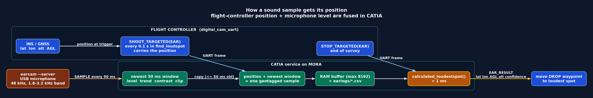

# EARcam Position and Sound Data Flow

How acoustic measurements and flight-controller coordinates are synchronized,
buffered, and solved on the MORA companion computer.

[Documentation Hub](index.html) | [Camera Pipeline](catia_camera_pipeline.html) |
[AI Camera](raspberry_pi_ai_camera.html) | [LWIR Calibration](lwir-calibration.html) |
[EARcam Guide](earcam-loudest-spot-explained.html) | [EARcam Data Flow](earcam-dataflow.html) |
[Mission 2 Plan](mission2-score-first.html)

## Synchronization Overview

The microphone never knows where it is in space. The `earcam --server` daemon
continuously samples the USB microphone and publishes loudness features every
50 ms. The flight controller sends its own navigation state (INS/GNSS position,
altitude, and attitude) with each camera trigger.

**CATIA** fuses these two streams: when a targeted shoot message arrives over
UART, CATIA stamps the flight controller's position onto the newest 50 ms audio
window.

- **Maximum alignment latency**: at most one audio window ($\le 50\text{ ms}$,
  corresponding to $\approx 0.5\text{ m}$ at $10\text{ m/s}$ groundspeed).
- **Sample rate**: determined by the flight-controller trigger frequency (e.g.
  10 Hz in search blocks), while the audio capture runs independently at 20 Hz.
- **Staleness guard**: audio windows older than 500 ms are rejected.

## Data Flow Pipeline

The acoustic localization pipeline is split into three coordinated subsystems:

### 1. Flight Controller (`digital_cam_uart` module)

During search blocks (such as `find_loudspot` in Mission 4), the autopilot emits
periodic targeted camera commands over UART at 115200 baud:

- `SHOOT_TARGETED(EAR)`: carries position (`lat`, `lon`), altitude (`alt`,
  `groundalt`), attitude (`phi`, `theta`, `psi`), groundspeed, and course.
- `STOP_TARGETED(EAR)`: signals the end of the survey leg and requests an interim
  or final loudest-spot computation.

### 2. Audio Capture (`earcam --server`)

The `earcam` process runs as a background capture daemon on MORA:

- Interfaces with the USB audio capture card via ALSA at 48 kHz.
- Computes bandpass energy over the configured frequency band (e.g. 2.4-3.2 kHz
  or 1.8-3.2 kHz for motionSCOUT alarms).
- Emits loudness window statistics every 50 ms over an internal Unix pipe.

### 3. CATIA Service on MORA

CATIA manages the lifecycle, fusion, logging, and solver execution:

- Receives UART frames and matches them to the latest loudness window.
- Records geotagged samples into an in-memory ring buffer (up to 8192 samples).
- Persists raw samples to disk in `~/usher_debug_data/ear_*.csv`.
- Executes `calculated_loudestspot()` in under 1 ms upon receiving a stop trigger.
- Transmits `EAR_RESULT` (`lat`, `lon`, `AGL`, `alt`, `confidence`) back to the
  flight controller to relocate the `DROP` waypoint.

## Sample Field Origins

| Field in Geotagged Sample | Origin | Description |
| --- | --- | --- |
| `lat`, `lon`, `alt` | Flight Controller INS/GNSS | WGS84 latitude, longitude, and MSL altitude at trigger time |
| `AGL` | Flight Controller | Height above ground reference or rangefinder measurement |
| `level_db` | `earcam --server` | Filtered band loudness in decibels |
| `trend_db` | `earcam --server` | Short-term loudness slope over sliding windows |
| `contrast_db` | `earcam --server` | Signal-to-noise ratio against background spectrum |
| `frequency_hz` | `earcam --server` | Dominant frequency peak within detection band |
| `alarm` | `earcam --server` | Boolean flag indicating active motionSCOUT alarm pattern |
| `clipped` | `earcam --server` | Boolean flag indicating ADC saturation |
| `timestamp_ms` | `earcam --server` | Monotonic millisecond timestamp of the audio window |

## Ground Tools and Replay

Session logs saved in `~/usher_debug_data/` can be re-analyzed on the ground:

1. **`ear_heatmap_replay`**: reads `ear_YYYYMMDD_HHMMSS.csv` and generates the
   north-up acoustic heatmap JPEG (`photos/eNNNNNN.jpg`) and its `.geo` sidecar.
2. **`ear_heatmap_overlay.py`**: composites the acoustic heatmap over Google
   satellite imagery tiles, drawing flight tracks, sample points, and the computed
   loudest-spot crosshair.

## Related Documentation

- [EARcam Explained](earcam-loudest-spot-explained.html): detailed algorithm,
  inverse-square loudness fitting, and search patterns.
- [CATIA Camera Pipeline](catia_camera_pipeline.html): MORA deployment, camera backends, and
  systemd service management.
- [Raspberry Pi AI Camera](raspberry_pi_ai_camera.html): IMX500 setup and
  optical capture integration.
- [LWIR Camera Calibration](lwir-calibration.html): thermal sensor calibration
  and mounting alignment.
- [Mission 2 Scoring Plan](mission2-score-first.html): competition scoring and
  flight validation.
