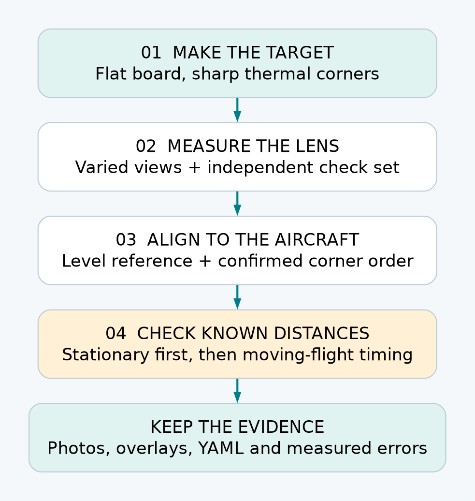
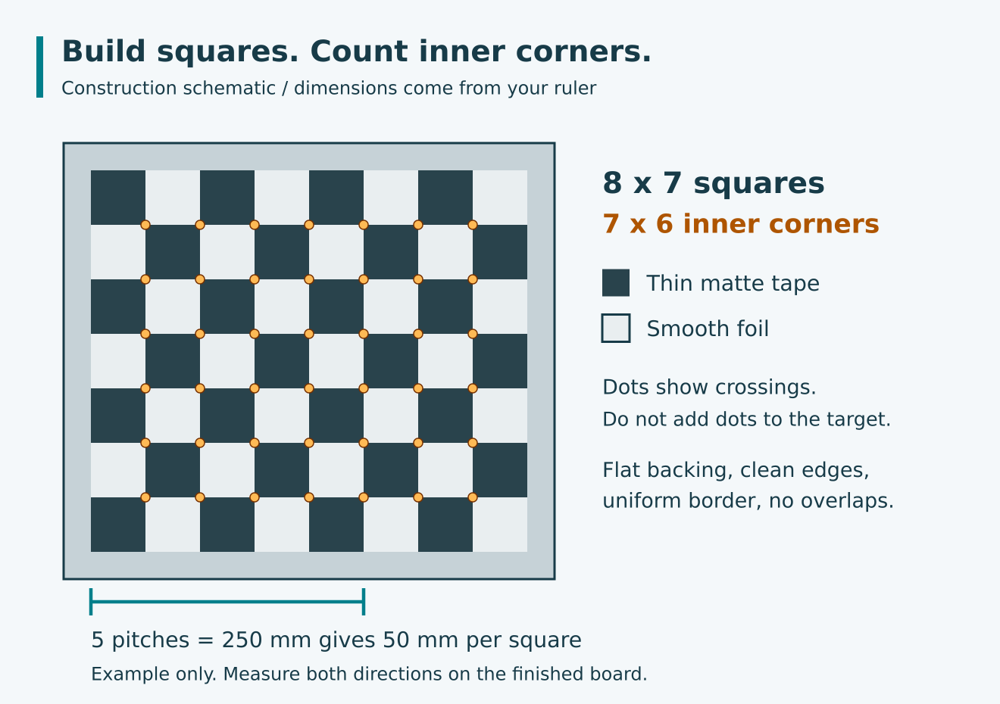
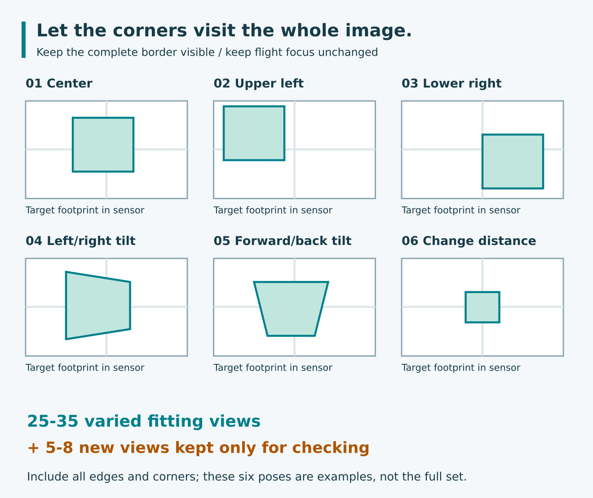
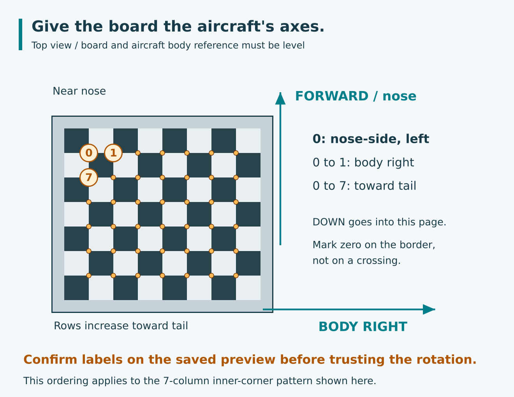

# LWIR Camera Calibration

A workshop guide for the Tiny1-C, CATIA and a fixed, downward-looking camera.

[Documentation Hub](index.html) | [Camera Pipeline](catia_camera_pipeline.html) |
[AI Camera](raspberry_pi_ai_camera.html) | [LWIR Calibration](lwir-calibration.html) |
[EARcam Guide](earcam-loudest-spot-explained.html) | [EARcam Data Flow](earcam-dataflow.html) |
[Mission 2 Plan](mission2-score-first.html)

> **The goal:** turn a hotspot pixel into a trustworthy camera direction.
> You can measure the lens and mounting with a flat homemade target, a tape
> measure, a spirit level and a computer. Accurate flight GPS also needs
> exposure-time position and attitude; calibration does not remove that requirement.

## 1. Know What You Are Calibrating

There are three different jobs. Do them in this order so that a bad temperature
reading is not mistaken for a bad lens, or a timing error for a mounting error.

| Job | What it fixes | What you will keep |
| --- | --- | --- |
| Lens geometry | Pixel direction, lens distortion and optical center | Measured intrinsics and distortion in a YAML file |
| Mounting alignment | The camera's direction relative to the aircraft | A measured `camera_to_body` rotation in that file |
| Temperature check | Whether reported surface temperatures are plausible | A separate check record, not lens coefficients |



Allow an unhurried workshop session, then a separate outdoor check. You do not
need RTK or a blackbody to measure lens geometry. You do need a traceable
temperature reference to claim calibrated absolute temperature, and a surveyed
reference to prove absolute GPS accuracy better than ordinary GNSS.

**Finish line for this guide:** a measured lens profile, a measured mounting
profile, saved evidence, and a short list of any checks still outstanding.
No file will be automatically marked verified.

## 2. Gather Ordinary Materials

- The actual camera, lens and final mounting bracket.
- A rigid flat board, preferably a smooth metal sheet with safe, covered edges.
- Thin matte tape and smooth aluminum foil tape, a ruler, square and craft knife.
- A spirit level, tape measure and string with a small plumb weight.
- Gentle warmth: a warm room, warm water container behind the board, or a
  low-temperature heating pad used according to its instructions.
- A laptop and a safe support for the camera or aircraft.
- For temperature checks: a reasonably calibrated contact probe and a matte
  high-emissivity target surface whose temperature can be measured.

**Remove the propeller and disconnect propulsion power.** Secure the aircraft;
do not balance it on loose objects. Keep liquids away from electronics. Do not
use fire, boiling water, a heat gun or a hot plate to make a calibration target.
Never point the LWIR camera at the sun or a powerful hot source.

An ordinary black-and-white printed chessboard often looks nearly uniform to
LWIR. Visible ink color is not enough. The camera needs a difference in thermal
emission or reflected long-wave infrared radiation.

## 3. Make A Target The Camera Can See

### Build one small test patch first

Put one matte square beside one smooth foil square on the same flat backing.
View it with the LWIR camera, from the intended distance and a modest tilt.
Try gentle, uniform warming if the squares merge together.

**Continue only when the boundary is sharp and stable.** Foil reflects the
thermal surroundings: your body, a radiator or the sky can change its apparent
brightness. Move yourself and warm objects away from the reflection. Neither
the displayed brightness nor the apparent foil temperature is a temperature
reference. A contrast reversal is acceptable if all corners remain clear.

If the patch only works from one angle, improve it before building the full
board. Wrinkled foil, thick tape, bowed backing and local heating make fitting
needlessly difficult. A purpose-made thermal checkerboard is the fallback if
the homemade board cannot give repeatable edges.

### Build the full checkerboard

Use **8 columns by 7 rows of squares**. That makes **7 by 6 inner corners**,
which is what the helper asks for. Add a uniform border at least half a square
wide. Cut clean edges; avoid overlaps and gaps at the crossings.



*Construction diagram, not an image captured by the camera. The colored dots
mark the internal corners; they are not objects to put on the board.*

Measure the finished square **pitch**, from one grid line to the next, not the
width of the remaining exposed foil. Measure across several squares and divide
by their count. Check both directions. For example, five pitches measuring
250 mm means 50 mm per square. If horizontal and vertical pitches differ or
the grid is visibly crooked, rebuild it rather than averaging the error away.

Do not print the illustration and assume its physical scale is correct.

### Choose a size that stays in focus

Start by finding a distance where the final flight-focus setting gives sharp
corners. **Do not refocus just to make a small indoor board usable.** A change
in focus can change the calibration; use a larger board farther away instead.

For planning only, square width in pixels is approximately:

```text
square_pixels = focal_length_pixels * square_pitch_metres / distance_metres
```

With the unverified 4.3 mm / 12 micrometre assumption, focal length is about
358 pixels. A 50 mm square at 1 m spans about 18 pixels. Eight squares span
about 143 pixels before the border. At 3 m, a 150 mm square gives the same
angular size, but needs a much bigger board. These are sizing examples, not
measured Tiny1-C specifications or instructions to change focus.

Aim for roughly 10-20 pixels per square in many of the photos; avoid tiny,
blurred squares. For a longer lens, increase distance or reduce target size
while keeping the target sharp and fully visible.

**Checkpoint:** the complete grid and border fit in the image; internal
crossings are recognizable at 100% view, including moderate tilts.

## 4. Freeze The Camera Setup

1. Choose the lens that will fly. Make separate profiles for 4.3 mm and 9.1 mm.
2. Set flight focus and secure it without moving the lens.
3. Use the final camera orientation, resolution and capture settings.
4. Let the camera settle according to its manual. Wait for automatic shutter
   correction to finish before keeping a frame.
5. Save native JPEGs. Do not rotate, crop, resize, undistort or annotate them.

Normal Tiny1-C combined capture has a 256x192 visible image and an aligned
256x192 temperature plane. Check the actual saved files. The 256x191 mock
fixture is not a reason to crop a real 256x192 capture.

On MORA, with CATIA stopped so it is not using the camera, an existing deployed
LWIRcam can capture a bench photo:

```sh
cd /home/air/digital_cam
mkdir -p calibration/photos
./lwircam --capture --bare --output calibration/photos/view01.jpg
```

Take the next photo with a new filename. `--bare` is a compatibility option;
current capture remains unfiltered. Single-shot capture may take time to warm
up. Do not start another instance before it finishes, and do not use
`--mock-image` or `--mocktransform` for real calibration photos.

Copy the finished JPEGs to the laptop using your normal file-transfer method.
Each JPEG already contains its temperature plane, so no companion file is
needed unless captures were taken with CATIA's `--lwir-raw`; then copy the
matching `.jpg.raw` files too. Keep matching filenames and do not resize or
re-encode the JPEGs, which would discard the stored temperatures. This guide
does not require ExifTool on MORA.

## 5. Take A Useful Set Of Photos

Keep the camera still and move the target for this stage. Secure the target
at each pose; do not take photos while it is moving.



*Schematic positions, not prescribed rotations. Keep the entire board visible
and its corners sharp. Edge views matter as much as the centered view.*

Collect about **25-35 usable views**, with variety rather than a burst of
nearly identical frames:

- Several central views, including one almost front-on.
- Views near each image corner and each edge, with the full target visible.
- Moderate left/right tilt and forward/back tilt, roughly 15-35 degrees if
  contrast and focus permit.
- A few changes in distance and in-plane rotation.

Set aside **5-8 additional views** as a check set. They must be genuinely new
views, not duplicates of fitting photos. Do not use them to fit the lens.

Do not pursue a target number at the expense of quality. A frame with clipped
corners, glare, a shutter event or motion blur should be retaken. The helper
skips frames where it cannot find the full pattern and prints their filenames.

**Checkpoint:** the corners have visited most of the sensor, including the
edges, and the board is not parallel to the camera in every picture.

## 6. Fit The Lens On The Laptop

### Prepare the desktop helper

The accompanying [calibration helper](lwir_calibrate.py) uses OpenCV. It runs
only on the development computer; Python, NumPy and desktop OpenCV are not
new flight-application dependencies. Its output matches CATIA's YAML keys.

From the Paparazzi repository root:

```sh
python3 -m venv .venv-lwir-calibration
.venv-lwir-calibration/bin/pip install numpy opencv-python-headless
```

Keep fitting images in `calibration/photos/`, independent check images in
`calibration/check/`, and mounting images in `calibration/mount/`. These paths
are examples relative to your current directory. Do not put annotated previews
back into the input directories.

### Run the fit

For a board with 7x6 internal corners and measured 50 mm pitch:

```sh
.venv-lwir-calibration/bin/python \
  sw/airborne/modules/digital_cam/catia/documentation/lwir_calibrate.py lens \
  --images calibration/photos --check calibration/check \
  --columns 7 --rows 6 --square-mm 50 \
  --output calibration/tiny1c-lens.yml
```

Use your measured pitch. The helper requires at least 15 detected fitting
views, rejects mixed image sizes and refuses to overwrite an existing result.
Choose a new output name for another attempt so earlier evidence stays intact.
It writes:

- The lens YAML, with a **nominal, unmeasured mounting** and `verified: 0`.
- A report giving detected/skipped images, per-view errors and check-set errors.
- Enlarged corner previews for inspection. Enlarging these previews does not
  change the calibration images or fitted pixel coordinates.

Open the preview images first. The colored corners must sit on the true
crossings all the way around the grid. A small reported error does not rescue
incorrect corner detection.

### Decide whether to keep the result

Reprojection RMS is the typical discrepancy, in pixels, between the detected
corners and the fitted model. It is **not GPS error in metres**. The check set
uses fixed lens parameters and fits only each board pose, so it is a useful
consistency check, not an independent survey of absolute accuracy.

As workshop triage, not camera specifications:

| Result | Next action |
| --- | --- |
| Fit and check errors mostly below about 0.5 pixel, with correct overlays | Continue to mounting and independent physical checks |
| Some views around 0.5-1 pixel | Inspect those frames, grid flatness and edge coverage |
| Many errors above 1 pixel or the check set much worse than fitting | Fix the target, focus or pose variety before continuing |

Do not delete difficult images just to improve the score. Remove only images
with an identifiable problem, replace them with good views of the same region,
and save the reason. A model fitted only near the image center is not validated
at the edge.

Compare two independently collected sets. Large changes in focal length,
optical center or predicted edge rays mean the setup needs attention. There
is no universal coefficient threshold that guarantees a good calibration.

**Checkpoint:** you have inspected every retained overlay and the independent
check views behave comparably to the fitting set.

## 7. Measure The Mounting Without Guessing

Lens calibration does not tell CATIA which way the camera points relative to
the aircraft. Near-zero GPS-to-camera distance removes a translation concern;
it does not remove a small angular mounting error.

### Make the board a body-axis reference

Remove the propeller. Secure the complete aircraft on a support above the
flat target, with the camera in its final bracket. Do not move that bracket
between lens fitting, mounting measurement and flight.



1. Establish the aircraft body reference using the flight controller's defined
   level attitude and correctly configured board alignment. Check the actual
   airframe datum with a level; a convenient sloping fuselage surface is not
   automatically that datum. If these disagree, resolve the FC alignment first.
2. Level the target in the same horizontal reference. The aircraft body axes
   and the board reference must agree; the helper cannot correct a tilted stand.
3. Align a board column direction with **aircraft right**. Increasing row number
   must run **toward the tail**. Use string, a square and the aircraft centerline,
   not a phone compass beside electronics.
4. Put the board on a stable support where the full pattern is sharp. It may
   be offset from directly under the camera; exact height and centering are not
   needed for the rotation fit. Keep it horizontal and aligned to the aircraft.
5. Mark the board's near-nose, aircraft-left inner corner on its border as
   the intended corner zero. Do not cover an actual checker intersection.

Misleveling by one degree is already approximately 0.70 m at 40 m AGL near
nadir. A phone level may help rough setup but is not proof of a precise datum.

### Fit and inspect one mounting view

Capture a photo without disturbing the alignment, then run:

```sh
.venv-lwir-calibration/bin/python \
  sw/airborne/modules/digital_cam/catia/documentation/lwir_calibrate.py mount \
  --image calibration/mount/mount01.jpg \
  --lens calibration/tiny1c-lens.yml \
  --columns 7 --rows 6 --square-mm 50 \
  --output calibration/tiny1c-mounted.yml
```

Inspect the numbered preview. **0 must be the near-nose, aircraft-left inner
corner; 1 must be the next inner corner toward aircraft right; 7 must be the
first corner in the next row toward the tail** for a 7-column pattern.

A checkerboard can be found in the opposite order. If it is reversed by 180
degrees, rerun with `--reverse-corners` and a new output name. If it is rotated
sideways, or the order does not match the board reference, stop and correct
the setup; do not try random signs in the matrix. Lens fitting does not need
this absolute corner orientation, but mounting measurement does.

The helper uses measured lens parameters and OpenCV `solvePnP`, with board
points expressed in body-aligned axes. It exports the inverse rotation as
`camera_to_body`. Translation is fitted only to locate the board; it does not
become a GPS lever arm. The mounting YAML still has `verified: 0`.

Repeat at least three times, repositioning the board while keeping its axes
aligned and its plane level. Compare the resulting rotations and ground-check
errors. Do not average matrix entries by hand. Nearly front-on planar pose
estimates can be sensitive to corner noise: a low reprojection error alone
does not settle their angular accuracy. If repeated results disagree beyond
your error budget, improve the target size/reference setup or have the mounting
measured with a better fixture. Keep the best-supported result, not merely the
one closest to the nominal matrix.

**Checkpoint:** corner order is physically confirmed, independent mounting
measurements agree, and the next ground check supports that alignment.

## 8. Check Distances Before Checking GPS

First test the projection in a stationary, local setup. This separates camera
geometry from ordinary GNSS errors and camera-trigger delay.

1. Secure the aircraft above a level patch with propulsion disabled. Measure
   the camera height above that patch and use a plumb line to mark its ground
   projection. Keep supports out of the image.
2. Place a few small, safely warmed matte targets at measured offsets: center,
   forward, right, and near the usable image edges. Mark their centers and
   measure offsets with a tape. They must be large enough to occupy multiple
   pixels, well separated, and within the detector's operating range.
3. Use correctly tagged stationary shots with actual position, attitude and
   AGL. Do not substitute a stale in-flight pose or the simulated 40 m EXIF.
4. Check direction first: a target to aircraft right must not project left.
   Check all four directions before interpreting small distance differences.
5. Repeat with modest supported bank/pitch angles and changed heading, keeping
   the actual pose and height known. The target coordinate should remain fixed
   within the uncertainty of your measurements.

**Practical limitation:** the production detector normally needs a sufficiently
hot target (generic minimum about 60 C, and stronger tray criteria). Do not heat
a household target dangerously just to make it pass. Lens and mounting fitting
use checker corners and do not require hotspot detection. A geometric check can
instead use recorded corner/target pixels and the same ray projection, with
help from the developer. There is currently no end-user arbitrary-pixel CLI.

For hot-target end-to-end checks, use a suitable controlled target and safe
handling procedure. The ordinary checkerboard is not automatically a fire-test
target. CATIA may report zero hotspots on it even when lens calibration is good.

Tape measurements validate relative geometry, not absolute latitude/longitude.
A non-RTK M10N fix cannot establish a sub-metre surveyed truth point. For an
absolute test, compare against an independently surveyed target, and record
the uncertainty of both reference and aircraft position.

### Read error patterns rather than chasing numbers

| Pattern | Likely place to check first |
| --- | --- |
| Error grows toward image edges | Lens fit, distortion, mismatched image size or crop |
| Similar offset everywhere that rotates with aircraft heading | Camera mounting alignment |
| Offset scales with height | Angular alignment or focal-length error |
| Error changes with speed or turn direction | Exposure/pose timing or motion blur |
| All targets share a slowly drifting displacement | GNSS bias |
| Error changes over sloping ground | AGL reference and flat-ground assumption |

These are diagnostic clues, not unique diagnoses. Check one cause at a time.

## 9. Install The Profile Deliberately

Keep the lens-only file and reports unchanged. In the final mounting profile,
change `verified: 0` to `verified: 1` **only after** you have reviewed lens
evidence, confirmed corner order and mounting axes, and passed the independent
geometry checks. This flag means you reviewed calibration; it does not mean
GPS timing or field accuracy is certified.

The runtime expects these keys:

| Key | Meaning |
| --- | --- |
| `image_width`, `image_height` | Exact native capture dimensions |
| `fx`, `fy`, `cx`, `cy` | Focal lengths and optical center in original image pixels |
| `k1`, `k2`, `p1`, `p2`, `k3` | Brown-Conrady distortion, in that order |
| `camera_to_body` | Nine row-major entries mapping camera right/down/forward to body forward/right/down |
| `verified` | Your explicit calibration-review gate, 0 or 1 |

Use the original fitted camera matrix, **not** a cropped or optimized display
matrix from an undistortion preview. Do not undistort saved images first:
LWIRcam already undistorts the ray during projection.

Transfer the reviewed YAML to MORA, for example
`/home/air/digital_cam/calibration/tiny1c-mounted.yml`, and name it on the CATIA
start command in the service's actual configuration:

```text
--lwir-calibration /home/air/digital_cam/calibration/tiny1c-mounted.yml
```

Editing a command in your interactive SSH terminal does not update a service that is
already running. Restart the relevant service through your normal deployment
procedure while the aircraft is safe on the ground. This guide does not assume
a particular service-unit name.

To analyze a copy of an existing flight-tagged JPEG on MORA:

```sh
cd /home/air/digital_cam
cp photos/l000001.jpg calibration/check-shot.jpg
./lwircam --geolocate calibration/check-shot.jpg \
  --calibration calibration/tiny1c-mounted.yml
```

Copy the JPEG as one file; its temperature plane travels with it. If the shot
was taken with `--lwir-raw`, also copy `photos/l000001.jpg.raw` to
`calibration/check-shot.jpg.raw` and keep that pair together. The raw companion
is the original combined
Tiny1-C frame, not another JPEG. The command updates the JPEG in place and
leaves the raw bytes untouched. Camera GPS remains the camera position; target
GPS and center temperature go in EXIF UserComment under `LWIR_HOTSPOTS_V1`.
Missing or unverified real-camera calibration suppresses coordinates.

Optional inspection on the development PC:

```sh
exiftool -b -UserComment calibration/check-shot.jpg
```

**ExifTool is not required by the final application.** CATIA and LWIRcam use
bundled libexif. The helper and inspection commands are workshop tools only.

## 10. Keep Temperature Checks Separate

The checkerboard measures geometry. Its foil squares deliberately exploit
reflection and must not be used to calibrate temperature.

For a basic sanity check, use a large, uniform matte surface at a safe stable
temperature, with a contact probe attached to the surface being observed.
Make the observed patch large enough to cover many pixels. Let the probe and
surface settle; check for gradients and avoid reflections of your hands.
Compare several readings at two or three safe temperatures, including ambient
and a gently warmed surface. Record distance, ambient conditions, surface
material, emissivity settings and probe uncertainty.

The temperature of water behind a plate is not automatically the temperature
of its front surface. A kitchen thermometer in that water is not a reference
for a tiny remote pixel. Shiny metal can look hot or cold because of reflected
radiation, even when a contact probe gives a different reading.

This exercise can reveal a gross problem. It cannot prove accuracy at fire
temperatures, validate saturated pixels or replace a traceable blackbody
calibration. Do not write vendor factory correction tables from this check.
For quantitative high-temperature work, use an appropriate calibrated reference
and the vendor procedure. Runtime values remain sensor-apparent temperatures,
not automatically emissivity/atmosphere-corrected true surface temperatures.

**Checkpoint:** you know what your temperature check establishes, and what it
does not. Keep that record with the geometric calibration, not inside its lens
coefficients.

## 11. The Flight Accuracy Gate

The capture server now tracks frame stability continuously, including between
requests. It no longer starts an eight-frame wait for every shot: an already
stable stream can use the next acceptable frame acquired after the request.
The startup warm-up and eight-frame recovery criterion remain after instability.
These are image-content heuristics, not a Tiny1-C exposure-ready signal. Eight
has not been established as the minimum required by hardware. Motion, texture,
or a shutter correction can still trigger recovery; verify this on the camera
before reducing or removing those remaining checks.

The server measures each request-to-selected-frame **arrival** interval using
a monotonic clock at SDK callback entry, before application copying, validation,
JPEG encoding, raw writing and analysis. Each callback delivery can be used only
once; sequence gaps reset stability. This avoids a reproduced SDK polling issue
where the same latest frame could be returned repeatedly after processing pauses.
CATIA records `request_to_frame_arrival_s` in EXIF. This is not yet the interval
from the FC pose timestamp to exposure: transport, scheduling before server
acceptance and sensor/USB buffering remain unmeasured.

The Tiny1-C runs continuously; requesting a still does not start an exposure.
At 25 Hz, the 40 ms frame period does not tell us integration time. Available
SDK evidence did not confirm variable integration time or a numerical fixed lag.
We should not assume visible-camera auto-exposure behaviour. A fixed effective
lag is a reasonable model to test, not a proven camera constant.

### Optional straight-flight position estimate

Add `--lwir-motion-compensation` to CATIA's start command to enable a
constant-ground-velocity estimate for live LWIR shots. It is off by default.
The estimate advances the reported position using ground speed, ground course
(not nose heading), and the measured server interval. WGS84 local curvature
converts north/east displacement to latitude/longitude. For illustration, a
measured 0.32 s at 15 m/s gives 4.8 m of estimated travel; this is not a fixed
delay to subtract or a claim that all shots now incur that delay.

The estimated position is written to normal GPS tags and the pose fields used
for hotspot projection. EXIF also retains `original_lat_deg`, `original_lon_deg`,
the measured interval and `position_compensation=constant_ground_velocity_estimate`.
Attitude, altitude and AGL remain unchanged. Delays outside 0-2 seconds, speed
outside 0-100 m/s, invalid inputs or latitude outside 85 degrees are not corrected.
Missing timing from an older server also leaves position unchanged.

This is a partial, explicitly labeled estimate, not exposure synchronization.
It assumes constant velocity and does not correct banking, acceleration, climb,
or unknown buffering. Test straight passes in both directions with compensation
off and on before relying on it. A smaller numerical residual on one pass is
not sufficient validation. Keep original metadata for comparison.

A practical next estimate is callback arrival minus a measured camera lag,
using time-aligned FC position and attitude. Interpolate bracketing poses when
available; reserve bounded forward prediction for cases where later samples
are missing. A 20 ms residual timing error at 15 m/s contributes 0.30 m before
rotation effects, so perfect exposure timestamps are not a prerequisite if
the measured total error stays inside the mission budget. See the
[effective-lag model](catia_camera_pipeline.html#lwir-integration-and-effective-lag).

Before relying on accurate moving-aircraft GPS, validate either exposure
timestamps or an effective-lag estimate and its uncertainty. Neither the lag
estimator nor exposure-time pose interpolation is implemented yet. Record
errors over stationary, slow and faster passes, in both directions, and across
bank/pitch/yaw. Do not tune the camera mounting to hide a timing error.

Other remaining limits include GNSS bias, terrain slope, AGL uncertainty,
motion blur and the local flat-ground model. A target on terrain higher than
the reference plane will be projected to the wrong intersection. Choose an
application error budget before deciding whether a result is acceptable.

The EXIF fields `capture_pose_synchronized=false` and
`absolute_accuracy_m=unknown` are intentional. `verified: 1` does not change them.

## 12. Quick Troubleshooting

| What you see | Try this first |
| --- | --- |
| No detectable checkerboard | Test a matte/foil patch, improve thermal contrast, check 7x6 inner-corner count |
| Only front-on photos are detected | Remove foil reflections; reduce tilt; make squares larger |
| Many corners rejected near edges | Keep the whole border visible and check focus |
| Different dimensions in one set | Separate camera modes; never resize to force a match |
| Good score but poor ground positions | Check mounting, image orientation, AGL and timing |
| Mounting result points the wrong way | Inspect labels 0, 1 and 7; correct physical board axes or reverse ordering |
| Repeated mounting results disagree | Improve leveling, corner contrast and board size; do not average matrix entries |
| `unverified_camera_calibration` | Complete the review gate; do not merely bypass it |
| `invalid_camera_calibration` | Check YAML syntax, required keys and exact capture dimensions |
| `missing_shot_pose` | Use a native-orientation JPEG with CATIA flight metadata, not an ordinary exported image |
| `no_temperature_plane` | Use the original capture JPEG with its embedded plane, or its `.jpg.raw` companion; brightness is not temperature |
| `invalid_native_frame` | Restore the original complete JPEG/raw pair; do not mix frames or change dimensions |
| `no_hotspots` on the checkerboard | Expected if it is below detector thresholds; corner calibration is a different operation |

## 13. Save A Reusable Calibration Pack

Keep one folder per camera, lens, focus and mounting combination:

```text
tiny1c-aircraft-date/
  notes.txt
  photos/             original lens-fitting captures
  check/              independent views
  mount/              mounting captures and axis photographs
  tiny1c-lens.yml
  tiny1c-mounted.yml
  *.report.txt
  *-previews/
  ground-checks.csv
  temperature-checks.txt
```

Record camera identity, lens, focus mark, image dimensions, measured board pitch,
mounting photographs, FC board alignment, software version, dates and reviewer.
Record actual errors and reference uncertainty, not just a pass label.

Repeat lens calibration after changing lens, focus or resolution. Repeat
mounting checks after moving the camera, changing the bracket, a hard landing
or changing FC alignment. Recheck temperature after relevant sensor service or
when measurements become inconsistent. Retaining the old pack makes comparison
straightforward instead of starting from memory.

## References And Scope

- [OpenCV camera calibration tutorial](https://docs.opencv.org/4.x/dc/dbb/tutorial_py_calibration.html): internal corners, multiple views, camera matrix and distortion.
- [OpenCV pose estimation](https://docs.opencv.org/4.x/d5/d1f/calib3d_solvePnP.html): object-to-camera pose convention.
- [CATIA geolocation implementation guide](catia_camera_pipeline.html#hotspot-gps-coordinates-and-center-temperatures): metadata, calibration keys and runtime limitations.

The thermal-board construction is a practical workshop approach, not a
manufacturer-certified calibration target. Photo counts and pixel-error bands
are starting points for diagnosis, not guaranteed Tiny1-C performance. The
illustrations are original schematics. No actual camera was calibrated while
preparing this guide.
