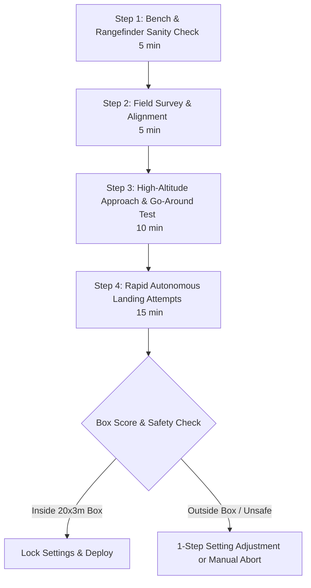

# Adam and EasyStar 3 Precision Landing Flight-Test Plan

This guide validates and tunes the autonomous precision landing developed for
the ZOHD Talon 250G aircraft **Adam** and the Multiplex **EasyStar 3**.
The primary objective is final standstill inside the 20 x 3 m box, as close to `TD`
as practical; first touch
inside the box is a preferred additional outcome, not a substitute for stopping accurately.

To accommodate varying field conditions, team schedules, and competition constraints, this document provides **two separate, complete flight-test plans**:

- **Part I: Option A — Minimal Express Test Plan (Time-Critical Protocol)**: A 4-step execution path designed for emergency field deployment when less than 30–45 minutes total remain before a flight window or competition deadline. It focuses exclusively on mandatory safety checks, simple geometry setup, one high-pass verification, and direct touchdown scoring.
- **Part II: Option B — Comprehensive Staged Validation Plan (Full Engineering Protocol)**: An 11-phase in-depth validation campaign (Phase 0 through Phase 10) for systematic sensor calibration, aerodynamic characterization, safety state-machine verification, parameter tuning, and wind envelope expansion when full testing time is available.

---

## Current development baseline, 2026-09-15

This section supersedes the earlier failed baseline below. Predictive crow no
longer fades solely because height decreases; airspeed freshness, brake caps,
mode ownership and the aircraft actuator rate limits remain enforced. The
upstream geometric aim now has an independent 20 m bound; the contact prediction
rejection boundary remains +/-8 m longitudinal and +/-1.2 m lateral.

EasyStar now uses 12 m upstream glide aim and **0 degree flare pitch**. Its
9 m/s approach, 17 m final height, 1.2 m flare height, 0.65 flare demand and
0.05 brake gain are unchanged. Adam retains its 7 m aim and +4 degree flare.
The geometric aim is neither a commanded ground-contact point nor a stopping
distance prediction. No deliberate-stall command or added ground friction is used.

| Final-source check | First contact along / across TD | Confirmed stop along / across TD | Result |
| --- | --- | --- | --- |
| Adam calm, retained defaults | -5.70 / +0.78 m | +0.64 / +0.59 m | Both inside box |
| EasyStar calm, retained defaults | -4.64 / +0.49 m | +5.24 / +0.27 m | Both inside box |
| EasyStar 1 m/s north wind | -4.78 / +0.48 m | +4.80 / +0.04 m | Both inside box; contact-model warning |
| EasyStar 1 m/s east wind | -1.39 / +0.57 m | +10.96 / +0.27 m | Stop outside box |

The east-wind run was initially mislabeled crosswind: it is predominantly
tailwind on this westbound AF-to-TD leg. No tailwind capability is established.
The controller does account for wind-induced travel through measured along-track
and cross-track ground velocity. Higher along-track groundspeed moves the contact
prediction farther downrange and increases close-range crow demand when permitted
by airspeed and brake limits. It does not predict post-contact stopping distance:
the upstream aim is fixed, not a dynamic tailwind/ground-friction correction.
The north-wind wingtip warning occurred after belly contact at 2.37 degrees bank,
3.33 m/s ground speed and approximately zero sink. It is retained as a diagnostic,
not proof of damage or a reason to discard a valid in-box stopping result.

The operator reports little sliding on sand, especially with slight nose-down
contact. The model instead uses two friction-only belly contacts, without sand
penetration resistance, and predicts roughly 10 m contact-to-stop displacement.
**That distance is not a validated prediction for the real EasyStar.** Real sand
stopping accuracy remains unverified; do not move the real touchdown point merely
to compensate for simulated sliding. Gentle near-ground settling is acceptable
for the precision score; contact diagnostics and physical inspection are separate.

The retained settings are unchanged by this surface discussion. The team's field
expectation is a short slide after slight nose-down sand contact, not the model's
roughly 10 m slide. Both calm and tested tailwind first contacts are already inside
the box; short stopping travel could therefore produce an in-box final rest, but
that remains for the team's physical tests to establish. A simulated tailwind stop
outside the box is not proof of a real-sand miss, nor is first contact inside proof
of a final-stop pass. Do not tune an earlier contact merely to fit an uncalibrated
long slide, or increase simulated friction merely to obtain a passing result.

### Developer rationale

- Keep predictive braking through the low approach: the removed altitude-only
   fade retracted crow during predicted overshoot, then required the rate-limited
   actuators to extend again for flare. Airspeed protection still overrides braking.
- Keep the 20 m geometric aim bound independent of the +/-8 m contact rejection
   limit: changing the glide target must not relax the accepted contact corridor.
- Latch commitment before processing sensor faults: noisy or missing height must
   not reopen powered abort after entering the low-altitude commitment region.
- Release outputs on mode changes and require explicit landing re-entry: stale
   brake demand must not interfere with pilot takeover or a later AUTO2 mission.
- Reject changed waypoint geometry instead of mixing a captured slope with new
   coordinates; at low or unknown height on an established final, request flare.
- Score confirmed final rest separately from predicted or measured first contact.
   Gentle foam-airframe settling is a diagnostic, not an automatic precision failure.

The final rejection check with simulation-only speed 7.5 m/s and final height
10 m climbed to 26.08 m without contact. All 33 host/generator tests passed,
including retained low-height braking, invalid-airspeed release, independent aim
validation and unchanged rejection limits. Both dedicated aircraft built for
`ap` and `nps`. Editor include-path diagnostics persist despite compiler success.
No firmware was uploaded. These checks establish a development baseline, not
measured pinpoint sand accuracy, a wind envelope or flight clearance.

Evidence directories under `var/nps_precision_landing`:
`adam_retained_default_final_20260915`, `easystar_retained_default_final_20260915`,
`easystar_retained_northwind1_final_20260915`,
`easystar_retained_crosswind1_final_20260915` (actually tailwind), and
`easystar_retained_rejection_final_20260915`.

## Earlier landing integration check, 2026-09-15 (superseded)

**Adam passed this calm-air NPS check; EasyStar 3 did not. Neither result is
hardware or flight clearance.** These runs used the current dedicated landing
configurations with no nominal parameter overrides. Final standstill, not merely
first contact or smoothness, determines the precision result.

| Aircraft | First touch along / across TD | Confirmed stop along / across TD | Stop distance from TD | Result |
| --- | --- | --- | --- | --- |
| Adam | -5.77 / +0.77 m | +0.59 / +0.58 m | 0.83 m | First touch and stop inside box |
| EasyStar 3 | +10.22 / +0.15 m | +18.52 / -0.09 m | 18.52 m | First touch and stop outside box |

Positive longitudinal error means beyond TD. Evidence is retained under
`var/nps_precision_landing/adam_landing_focus_20260915` and
`var/nps_precision_landing/easystar_landing_focus_20260915` as CSV, contact logs
and JSON. These are simulated CG positions, not physical contact footprints.

EasyStar entered its normal flare near the configured 1.2 m AGL, with zero
commanded throttle and approximately +4 degrees commanded pitch. The 2.5 m
no-powered-abort latch did not prematurely trigger flare. It then floated beyond
TD and travelled another 8.30 m between contact and standstill. One gentle wingtip
settling contact was recorded; the failed precision result is the out-of-box stop,
not a claim of damage. The current predictor estimates contact from height and
sink rate; it does not predict the final stop or account for the subsequent flare
and surface-dependent rollout. **EasyStar's nominal precision baseline remains
unaccepted and needs separate, controlled performance work.** No limits, gains,
surface friction or aircraft defaults were changed to obtain these results.

The separate EasyStar rejection test used NPS-only overrides
`landing_airspeed=7.5` and `final_height=10` with `--expect-go-around`. It passed,
climbing to 26.61 m above the simulator origin without structural contact.
Evidence is in `var/nps_precision_landing/easystar_rejection_focus_20260915`.
This is one unsuitable-approach test, not a sensor-fault or wind-envelope test.

All 33 focused host/generator tests passed. The current dedicated `ap` and `nps`
targets rebuilt successfully for both aircraft. The rangefinder test-header
mismatch was corrected in the test only; all 12 combinations of sensor mode,
periodic telemetry and debug sending then passed. Normal successful VB22A reads
were not shown to be defective, and hardware compatibility of the asynchronous
driver remains bench-unverified. No additional production-driver redesign was
made during this check. The editor still reports a missing `std.h` include path
for the landing header despite successful host and aircraft compiler checks.

### Bounded regression comparison and remaining failure

The saved `easystar_release_check` first contacted at +4.09 m, but its last
stationary sample was already +11.35 m beyond TD. It did not establish an in-box
stop. The later nominal failure is not merely a scoring change: first contact
also moved farther downstream.

One controlled NPS comparison changed only `NPS_USE_CROW_ACTUATORS` to `FALSE`.
The legacy raw-crow path contacted at -0.58 m and stopped at +9.22 m, versus
+10.22 m contact and +18.52 m stop with the actual mixer path. This establishes
that the simulation input path materially affects landing performance; it does
not isolate every difference from the older release. The actual EasyStar mixer
scales crow by 0.70 and rate-limits deployment: a 0.65 command gives approximately
0.455 steady surface input when unsaturated. **The legacy path is not a fix.**
`NPS_USE_CROW_ACTUATORS=TRUE` was restored and rebuilt after this diagnostic.

Single-parameter NPS trials with actual crow retained:

| Trial override | First contact along TD | Confirmed stop along TD | Outcome |
| --- | --- | --- | --- |
| `touchdown_pitch=0` | +4.30 m | +14.10 m | Out-of-box stop |
| `flare_brake=0.75` | +9.07 m | +17.28 m | Out-of-box stop |
| `flare_agl=0.6` | +11.11 m | +20.19 m | Out-of-box stop |
| `final_height=22` | None | None | Three rejected approaches, no contact before timeout |

These trials are retained under `var/nps_precision_landing` with names
`easystar_raw_crow_probe_20260915`, `easystar_pitch0_actual_crow_20260915`,
`easystar_brake075_actual_crow_20260915`, `easystar_flare06_actual_crow_20260915`
and `easystar_height22_final_check_20260915`. The earlier cancelled height trial
has incomplete logs; only its three orphaned processes were stopped.

No trial setting was promoted: EasyStar retains 9 m/s approach, 17 m final
height, 1.2 m flare height, +4 degree flare pitch, 0.65 flare demand and 6 m aim.
Safety limits, mixer limits and surface friction are unchanged. Whole-metre
`DESIRED.altitude` telemetry is formatting (`%.0f`), not proof of quantized
control. No deliberate-stall logic was added. **EasyStar precision landing is
still unresolved; the trials above must not be presented as a completed fix.**

## Structural flight-safety audit, 2026-09-15

This audit prioritizes unintended flight commands, invalid navigation and memory
safety over millimetre landing accuracy. The fixes below are independent of the
earlier aim/friction experiments; no performance limits were relaxed for this audit.
Passing the tests is not proof of a failure-free system or flight clearance.

### Recorded HOME oscillation

The supplied `var/logs/26_09_14__18_02_22.log` and matching `.data` establish:

- At approximately 100.93 s, **AUTO1/HOME** alternates rapidly while RC status is
   OK, GPS has a 3D fix, ground speed is approximately 0.07 m/s and flight time is
   zero. This was not simply a MANUAL/HOME event as previously assumed.
- The Takeoff block was selected at 100.70 s. The archived plan sets `launch=1`
   in that block even before physical flight; the TAKEOFF telemetry event occurs
   much later, at 279.13 s. Launch request and airborne detection are different.
- The local reference is UTM zone 32, east 398874 m, north 5620443 m, but HOME
   is reported at east 822287.75 m, north 5629417 m in that zone. Other waypoints
   are local; `dist_home` is approximately 423508 m. Recapturing HOME later reduces
   this distance to zero.
- The INS origin reset changed zones without immediately updating its stored UTM
   position. Immediate `NavSetWaypointHere(WP_HOME)` could subtract coordinates
   expressed in different zones. An actual-state/geodetic regression reproduces
   the large offset and verifies the correction: reset now installs a position in
   the new zone while preserving the fused altitude.
- There are no `I2C_ERRORS` samples in this log. The I2C code defects below were
   found independently; this flight record does not prove that an I2C fault occurred.
   It also does not identify every source revision of the running firmware.

### Mode and control ownership

The old manual-only HOME guard did not cover the recorded AUTO1 case. With valid
pilot RC control, MANUAL and AUTO1 now retain pilot authority rather than being
overwritten by the automatic HOME check. AUTO2 still resolves an active distance,
datalink or altitude HOME request before applying the RC-selected mode, avoiding
an intermediate AUTO2/HOME toggle. RC-loss handling remains configured by
`RC_LOST_MODE`; locked-HOME behavior without `UNLOCKED_HOME_MODE` is retained.
These changes do not disable the separate kill-throttle or GPS protection paths.

GPS recovery restores a saved mode only while still in the GPS failsafe. An
explicit mode change cancels that restoration. Invalid, fractional or non-finite
GCS mode values are rejected before integer conversion. `fixedwing_basic.xml`
now calls `autopilot_SetModeHandler` instead of assigning `autopilot.mode` directly,
so GCS changes cannot bypass landing cleanup. Other custom settings files must use
that handler too; direct assignments outside this integration remain unsupported.

In landing-enabled firmware, every real mode change clears old autonomous brake
demand, including when the landing state machine was inactive. This closes a
bench-command re-entry path. The crow bench block now needs AUTO2, throttle already
killed, no launch request, zero flight time, fresh AGL at most 0.5 m and near-zero
velocity. It never changes the global throttle-kill flag. Losing any interlock
clears demand and requires a new explicit bench entry. Selecting it in flight
therefore cannot kill the motor or latch crow. Remove the propeller for bench tests.
Manual/AUTO1 crow remains controlled by the configured live RC slider; this is
intentional pilot input, not autonomous landing activation. Servos retain their
configured retraction ramp, so zero demand does not mean instantaneous retraction.

### Numerical and generated-code fixes

- All 8-bit waypoint indices are checked before lookup. Derived differences,
   lengths, slope and altitude/preclimb commands are checked too: finite inputs
   alone do not prevent floating-point overflow. Active-final geometry is captured
   and checked for changes. Invalid geometry cancels before final; in an established
   final at/below commit height it requests wings-level flare, not a powered turn.
- Landing settings are checked at runtime before the example changes AF altitude
   or computes a baseleg. NaN, infinity, zero radius and out-of-range values cannot
   bypass the displayed GCS limits. The retry setting stays float until validated
   (integer-valued 0-5); the counter saturates at 6 instead of wrapping. Standby
   restores nominal airspeed and the configured default clockwise circle radius.
- Generated modules, settings and the aircraft makefile now depend on the expanded
   configuration signature. A removed module can no longer persist merely because
   the remaining module source timestamps are old. The regression adds then removes
   `auto1_commands` in a temporary fixture and checks both generated headers.
- The landing module has no dynamic allocation or variable-length copy buffer.
   Its diagnostic arrays have fixed, size-derived message lengths. Sanitizer tests
   exercise invalid indices, extreme floats, mode changes and two-byte I2C buffers;
   they do not constitute exhaustive firmware memory or concurrency verification.

### Rangefinder transaction fixes

`i2c_blocking_receive` returns an enum, not a Boolean; both success and failure
are nonzero. The former driver could parse a failed/partial read and could block
its sensor task for up to 0.5 s. It now submits asynchronous reads, keeps one
transaction outstanding, and parses only a successful completion. Failed reads
publish no AGL sample; consumers must enforce freshness. A stuck bus does not
cause the driver to resubmit into an in-use buffer; hardware bus recovery still
belongs to the I2C backend and requires bench testing.

Both direct-read and command-triggered devices now parse exactly the two received
bytes, indices 0 and 1. The old command-triggered branch used indices 1 and 2,
reading beyond the received payload (not necessarily beyond the allocated I2C
buffer). VB22A uses direct-read mode, so that offset defect was not on its active
path. Read failures, zero/out-of-range samples, queue rejection and prolonged
pending transactions are covered by host tests. The configured median-filter
switch is respected. Normal RANGEFINDER telemetry uses its separate registered
callback and the telemetry schedule. `rangefinder_i2c_report()` sends only with
`RANGEFINDER_I2C_SYNC_SEND` enabled; enabling periodic telemetry does not enable
this debug helper. Its automatic debug send runs once after parsing a successful
read, including out-of-range values marked NaN, not on every event-loop call.
Failed or pending reads do not trigger that automatic debug send. The optional
module report task remains disabled by default.

### Verification and residual checks

The structural suite has **33 tests**: 32 controller, sensor and mode checks plus
one real-generator integration check. Controller and driver tests use ASan/UBSan
and float-cast checks; mode tests cover both RC switch layouts, GPS recovery and
1000 repeated cycles with active HOME conditions, with and without landing enabled.
The UTM test uses the actual state and geodetic implementations. Tests pass without
sanitizer findings. Normal hardware and dedicated `ap`, `sim`, `nps` landing builds
are checked for both Adam and EasyStar; only make jobserver notices were observed.

```sh
python3 -B -m unittest discover -s sw/simulator/nps -p 'test_fixedwing*.py' -v
python3 -B -m unittest discover -s sw/simulator/nps -p test_landing_generation.py -v
```

The generation test requires the built `sw/tools/generators/gen_aircraft.out`.
It operates in a temporary directory under `var`, leaving the active configuration
unchanged. The supplied flight logs are read-only evidence and are not rewritten.

The earlier audit run `adam_structural_safety_20260915` retained the 7 m aim,
put first touch and final stop inside the box, and stopped 0.84 m from TD. The
latest two-aircraft checks above supersede it for current integration status,
including EasyStar's failed nominal precision result. Required follow-up is prop-off
RC/GCS mode-transition testing, correct field/reference verification, receiver-loss
behavior and I2C disconnect/reconnect/timing checks on hardware. No firmware was
uploaded and no real flight or hardware fault injection was performed here.

A local relocatable example may deliberately reset its origin and capture HOME.
A surveyed mission must retain its geographic waypoints. The mixed-zone fix makes
an explicit reset coherent; it does not silently translate a surveyed mission to
wherever the aircraft is powered on. The precision example deliberately preserves
its supplied origin and requires correct field coordinates. Arbitrary sensor
failures, RAM corruption, all custom module combinations and all interrupt/thread
interleavings remain outside the evidence: no 100% no-mishap guarantee is claimed.

## Precision objective and current tuning, 2026-09-15

The goal is **stop near TD**, preferably with **first touch also inside the box**.
Smoothness is not the optimization objective. Keep flight-safety constraints and
inspect contact anomalies, but do not confuse a provisional quality-limit
exceedance with failure to achieve the standstill spot or proof of airframe damage.

### Metrics and acceptance

- `landing_pass` and `inside_precision_box` now mean a confirmed final stop inside
   the 20 x 3 m box. This supersedes their earlier first-contact/combined-quality meaning.
- `final_longitudinal_m`, `final_cross_track_m` and `final_distance_to_td_m`
   describe that standstill position relative to TD. Smaller final distance is the
   primary tuning objective; positive longitudinal error means beyond TD.
- `preferred_landing_pass` additionally requires first contact inside the box.
   Prefer this result while minimizing final error; report both outcomes explicitly.
- `touchdown_inside_precision_box` and `touchdown_inside_internal_margin` retain
   the first-contact checks. `inside_internal_margin` now refers to the final stop.
- `touchdown_to_stop_distance_m` is straight-line displacement from first contact
   to rest, not integrated path length. Use it to distinguish excessive float from
   rollout instead of moving the contact point without considering stopping distance.
- Standstill needs a contact log and a continuous two-second near-ground window:
   horizontal speed at most 0.5 m/s, vertical speed magnitude at most 0.2 m/s, all
   positions within 0.2 m of the last position, finite data and bounded sample gaps.
   Without confirmation, final-position fields are `null` and precision does not pass.
- `contact_quality_pass`, `rollout_quality_pass`, `strict_quality_pass` and
   `contact_review_required` remain separate diagnostics. A precision pass can
   coexist with a contact-review warning; it is not flight clearance or proof of
   an undamaged aircraft. CLI failure is based on missing stop evidence or an
   out-of-box stop, not merely a rough-looking touchdown.

Archived JSON files are not rewritten and may use the old field meanings.
Re-evaluate their CSV/contact logs with the current harness before comparing them.
Positions in NPS are aircraft CG positions, not surveyed physical contact footprints.

### Adam aim comparison

The existing aim parameter was varied alone in calm-air NPS. Speeds, gains,
flare pitch, braking, friction and rejection limits were unchanged. Negative
touchdown longitudinal error below means first contact before TD.

| Run under `var/nps_precision_landing/` | Aim upstream (m) | First touch along/across (m) | Final stop along/across (m) | Final distance (m) | Touch and stop inside |
| --- | ---: | ---: | ---: | ---: | --- |
| `adam_foam_contact_policy_20260915` (replayed) | 6.0 | -4.49 / +0.71 | +1.89 / +0.51 | 1.96 | Yes |
| `adam_aim_6.5_20260915` | 6.5 | -5.17 / +0.75 | +1.21 / +0.55 | 1.33 | Yes |
| `adam_aim_7.0_20260915` | 7.0 | -5.87 / +0.76 | +0.50 / +0.56 | 0.75 | Yes |
| `adam_aim_7_repeat_20260915` | 7.0 | -5.74 / +0.75 | +0.63 / +0.55 | 0.84 | Yes |
| `adam_aim7_default_20260915` (rebuilt default, no override) | 7.0 | -5.68 / +0.78 | +0.70 / +0.59 | 0.91 | Yes |

Adam defaults to **7 m upstream aim**. The current independent aim bound is 20 m;
EasyStar's current baseline is 12 m. The historical Adam 7 m trials have about 4 m longitudinal margin from
first contact to the entry edge and about 0.7 m lateral margin. All three also satisfy
the stricter quality diagnostics. Adam's hardware and NPS targets build with the
saved default; the final run uses it without a runtime override. No firmware was
uploaded. This is a provisional, model-derived improvement,
not a statistically established repeatability result or a field stopping-distance
calibration. Validate on the actual landing surface before relying on the default.
The controller still predicts first contact and uses an empirical upstream aim;
it does not yet estimate post-contact friction or control final rest directly.

## Talon and foam-contact update, 2026-09-15

### Airframe tolerance versus landing quality

The operator reports that both foam pusher aircraft tolerate slight nose-down
arrivals and even a roughly one-metre drop with no forward speed without damage.
This is useful operational experience, not a controlled impact qualification.
The harness scores final-position precision and separately reports landing quality;
exceeding its provisional quality limits does **not** demonstrate airframe damage.
No drop test is requested.

First-contact belly pitch from -10 to +20 degrees is accepted by the quality check;
this is a provisional operator-informed criterion, not a measured structural limit or a
new commanded touchdown pitch. The 1.5 m/s contact sink limit remains a quality
target. Nose-first impacts, harder arrivals or incomplete contact evidence still
need review rather than an automatic pass or a claim of damage. Controller gains,
stall margins, commanded flare pitch and model friction are unchanged by this
clarification. Crow may reduce speed and lift and increase ground loading, but
short stopping distances on a particular surface still need measurements.

**Slight wingtip contact during settling is not automatically a failed landing.**
Both Talon 250G and EasyStar 3 are forgiving foam belly landers. The harness now
reports wing touches separately rather than equating every touch with damage.
Its provisional definition of gentle settling is a named wingtip contact after
belly touchdown, at groundspeed at most 2 m/s, absolute vertical speed at most
0.3 m/s, absolute bank at most 8 degrees and pitch from -10 to +20 degrees.
Finite measurements and ordered contact timestamps are required. These are
conservative test classifications, not measured foam damage thresholds: the log
records aircraft motion at contact onset, not local contact force or damage.

First-impact belly/sink/attitude checks are quality diagnostics, not standstill
scoring. Nose, unknown, high-speed or hard wing impacts and excessive bounce/attitude
require review rather than being called damage. Leaving the box during rollout is
reported separately; stopping outside it fails precision. First-contact and settling
pitch use -10 to +20 degrees. Each new contact
onset is recorded, so a later harder touch on the same wing is evaluated too.
Continuous scrapes are not load-monitored; real post-landing inspection remains
required. The earlier EasyStar touch at approximately 0.88 m/s with negligible
sink qualifies as gentle; that run still fails because it stopped outside the box.

Adam's approach rejection was traced to applying its real-aircraft roll trim to
the symmetric JSBSim model, not a false rangefinder lock. `NPS_ROLL_TRIM=0` now
overrides only the simulator's initial roll trim; hardware retains its existing
trim. Landing gains and rejection limits were not relaxed for this correction.

The Talon ground model also had excessive belly compliance and no finite-width
belly support. Independent drop/slide tests showed more than 20 mm compression
and unintended nose/wing contacts. Four pads now represent an estimated 30.5 mm
wide belly footprint, with total stiffness 180 lb/ft (about 0.93 mm average static
compression at 250 g). These dimensions/compliance are engineering estimates,
not measurements of the real foam or ground. Static/dynamic friction remains
0.8/0.5; no artificial stopping force was added. The harness resolves belly and
wingtip identities from model names instead of assuming common contact indices.
Its two-second stop window now accounts for accelerated wall-clock telemetry
cadence and includes the sample preceding the window boundary.

### Rangefinder comparison

Both aircraft configure the VB22A with 100 Hz periodic calls, 0.005-6 m usable
range, 0.004 m hardware offset, rotation compensation and a 0.1 s AGL filter.
The read/parse state machine means configured call frequency is not a guarantee
of 100 distinct hardware measurements per second. NPS emits at 100 Hz; its belly
offset is -0.02794 m for Talon versus -0.0635 m for EasyStar. These reflect different
model geometries, not different sensor calibration. NPS models vertical clearance,
not the complete optical ray/attitude-dependent range envelope or I2C timing.

The driver incorrectly enabled its median filter even with
`RANGEFINDER_I2C_USE_FILTER=FALSE`; the conditional now respects the value on both
aircraft. Above 6 m, NPS clips the raw reading to the range boundary; AGL rejects
that boundary and retains its last filtered value with freshness false. A displayed
5.7 m held value during flight at 10-17 m is therefore not a fresh range lock.
Use the freshness flag and timestamp, not the held distance alone.

### Current evidence

The 6 m-aim run `adam_foam_contact_policy_20260915` passes first-contact,
rollout and stopping gates: touchdown -4.49 m along TD, +0.71 m across, sink
1.15 m/s, belly contacts only, no go-around. Earlier corrected-model repeats
also pass when evaluated with the corrected cadence/settling checks. In
`adam_ground_fixed_final_20260914`, final rest was +1.68 m along and +0.53 m
across after approximately 6.37 m travel from first contact. Thus this model
stops inside the box; it does not demonstrate an instantaneous real-world stop.

29 focused regression tests pass, including separate precision/quality results,
the preferred touch-and-stop objective, pitch boundaries, gentle/hard/repeated
touches, both models' contact identities, missing data, creep and stop timing.
`test_talon_ground_contact.py` separately tests zero-speed drop and 8.5 m/s slide
at three timesteps using Python JSBSim 1.3.1; NPS exercises its installed JSBSim
library independently. Both hardware targets compile with the filter fix and
Adam NPS compiles with the simulator trim override. Hardware flight clearance,
surface-specific stopping distance and a wind envelope still require measurement.

```sh
python3 -B -m unittest discover -s sw/simulator/nps -p test_fixedwing_landing.py -v
python3 -B -m unittest discover -s sw/simulator/nps -p test_talon_ground_contact.py -v
```

The second command requires the optional Python `jsbsim` package.

## Safety revision status, 2026-09-14 (historical)

**Development only: autonomous landing clearance is withheld.** The safety review
found defects in commitment, mode takeover, sensor freshness, actuator simulation,
and acceptance metrics. The revised controller and tests address these software
paths, but the old first-contact runs do not validate this revision. Do not use the
Express plan below to bypass the missing staged validation.

- Changing away from AUTO2 cancels landing and releases brake/roll-limit ownership.
   Re-entering AUTO2 does not resume the approach; select a new landing entry.
- GCS jumps to non-landing blocks end ownership too. Direct jumps into internal
   landing blocks are rejected unless a sequence was explicitly started.
- Decisions run before flight-plan exceptions. Fresh AGL takes precedence over
   fused height. At/below 2.5 m, commitment stays latched; failures request flare,
   not powered go-around. Unknown height also prohibits an automatic powered abort.
- Low, non-finite or stale airspeed inhibits brake demand in final **and flare**.
   Freshness is measured at the air-data receiver (default timeout 0.5 s).
- Flare immediately requests zero throttle and bounded pitch without modifying
   the global kill flag. GPS loss uses wings-level attitude instead of route guidance.
- Upper approach lateral tolerance narrows with height: 1.2 m plus 0.25 m per meter
   above brake_agl. Close-range predicted errors beyond +/-8 m longitudinal or
   +/-1.2 m lateral reject after 0.2 s, independent of brake saturation.
- Startup does not relocate the origin/TD. Survey actual field coordinates,
   elevations and runway direction before use; supplied coordinates are examples.
- NPS uses post-mixer aileron values, including rate limiting, travel scaling and
   saturation. Real aerodynamic brake coefficients still require measurement.
- Passing requires acceptable contact, rollout inside the box and a two-second
   stationary window. Gentle wingtip settling is classified as described above.
   A first touch alone fails.

The corrected-mixer diagnostic runs under `var/nps_precision_landing/` are
**not accepted**: `adam_corridor_review_20260914` rejected its approaches and
returned to standby without contact; `easystar_corridor_review_20260914` touched
inside the box but slid beyond it and recorded a later wingtip contact. These
expose the need for further approach/flare/aerodynamic validation, not justification
to relax the gates. Subsequent command-transition fixes have focused regression
coverage; rerun the full campaign before drawing performance conclusions.

Final software checks: 19 focused tests pass, including compiled controller, AGL
callback and mixed-aileron tests. Both dedicated aircraft build for `ap`, `nps`
and `sim`. The final Adam NPS rejection run (`adam_rejection_complete_20260914`)
climbed to 25.51 m with zero contacts. These establish build compatibility and
tested safety behavior, not a successful stopped landing or hardware flight clearance.

## Historical results, 2026-09-13 (superseded)

The measurements and build claims below describe the previous software. They
omit post-mixer and stopped-rollout validation and are retained only for comparison.

The previous baseline recorded first contacts inside the box; that result is
superseded by the corrected mixer and rollout gates. The controller and reusable
harness remain in [sw/airborne/modules/nav/precision_landing.c](sw/airborne/modules/nav/precision_landing.c)
and [sw/simulator/nps/nps_fixedwing_tuning.py](sw/simulator/nps/nps_fixedwing_tuning.py).
GNSS accuracy, surveyed TD, real crow aerodynamics, ground contact and sensor outages
still require staged validation. No probability of success or wind envelope is established.

Representative first-contact measurements from the saved simulation runs:

| Aircraft / run under `var/nps_precision_landing/` | Along TD (m) | Across (m) | Sink (m/s) | Pitch (deg) |
| --- | ---: | ---: | ---: | ---: |
| Adam, final source `adam_release_check` | +1.60 | +1.06 | 1.22 | +0.90 |
| EasyStar, final source `easystar_release_check` | +4.09 | +0.77 | 0.70 | +3.73 |
| Adam, `adam_final_repeat` | +1.55 | +1.06 | 1.23 | +0.88 |
| Adam, `adam_crosswind1` | +1.33 | +1.01 | 1.24 | +0.82 |
| EasyStar, `easystar_baseline_final` | +4.09 | +0.77 | 0.71 | +3.71 |
| EasyStar, `easystar_repeat_final` | +4.09 | +0.77 | 0.71 | +3.71 |
| EasyStar, `easystar_crosswind1` | +4.24 | +0.61 | 0.72 | +3.69 |

Positive along-track error means beyond `TD`. Crosswind cases used the simulator wind setting of 1 m/s at 0 degrees. One earlier 2 m/s, 90-degree wind case landed +9.36 m along and +1.07 m across: inside the official box but outside the retained longitudinal margin. Do not interpret this as tailwind approval. Identical repeated results can reflect deterministic simulation, not independent real-world trials. Adam's roughly 1.2 m/s contact sink remains a particular bench/flight-validation concern.

The separate `easystar_reject_verified` run rejected an unsuitable 7.5 m/s, 10 m final-height configuration and climbed above 25 m without contact. Host tests in [tests/modules/test_precision_landing_controller.c](tests/modules/test_precision_landing_controller.c) and [sw/simulator/nps/test_fixedwing_landing.py](sw/simulator/nps/test_fixedwing_landing.py) exercise the actual controller for stale/future AGL timestamps, sensor-height handover, low/invalid airspeed, invalid state, degenerate final, prediction rejection, maximum-brake overshoot, retry reset, and brake cleanup. They do not replace flight validation of these failure cases.

First-contact positions are the **aircraft CG position at the first JSBSim structural contact**,
not the footprint of the belly contact point. Belly/wing identities are resolved from
the loaded model. The harness requires the physics-timestep contact log; a height
crossing alone can be a sample after a bounce. Provisional first-contact gates are
finite data, belly impact, sink 0-1.5 m/s, absolute bank at most 8 degrees and pitch
-10 to +20 degrees. These quality diagnostics do not determine standstill scoring.
Later gentle wingtip settling is reported rather than automatically
rejected. These are development gates, not proven structural limits. Internal-margin
results are reported separately.

### Reproduce the tests

From the Paparazzi repository root, build each aircraft with its own telemetry UDP pair. A separate Ivy bus alone does **not** isolate telemetry ports.

```sh
make -f Makefile.ac AIRCRAFT=Adam_Precision_Landing_Test \
  CONF_XML=conf/userconf/OPENUAS/openuas_precision_landing_test_conf.xml \
  MODEM_PORT_OUT=42258 MODEM_PORT_IN=42259 \
  USER_CFLAGS=-DNPS_JSBSIM_CONTACT_LOG=1 nps.compile

make -f Makefile.ac AIRCRAFT=Easystar_3_Precision_Landing_Test \
  CONF_XML=conf/userconf/OPENUAS/openuas_easystar3_precision_landing_test_conf.xml \
  MODEM_PORT_OUT=42270 MODEM_PORT_IN=42271 \
  USER_CFLAGS=-DNPS_JSBSIM_CONTACT_LOG=1 nps.compile

python3 sw/simulator/nps/nps_fixedwing_tuning.py \
  --aircraft Adam_Precision_Landing_Test --ac-id 129 --scenario precision-landing \
   --settle-seconds 20 --measure-seconds 15 --bus 127.255.255.255:2166 \
  --udp-port 42258 --udp-uplink-port 42259 --output-dir var/nps_precision_landing/adam_new

python3 sw/simulator/nps/nps_fixedwing_tuning.py \
  --aircraft Easystar_3_Precision_Landing_Test --ac-id 135 --scenario precision-landing \
   --settle-seconds 20 --measure-seconds 15 --bus 127.255.255.255:2165 \
  --udp-port 42270 --udp-uplink-port 42271 --output-dir var/nps_precision_landing/easystar_new
```

Use a new output directory per run. `--setting NAME=VALUE` supports controlled parameter trials; `--wind-speed` and `--wind-direction` set simulator wind. To reproduce rejection, add `--setting precision_landing_approach_airspeed=7.5 --setting precision_landing_final_height=10 --expect-go-around` to the EasyStar command. Do not lower the harness's 20 m climb gate to make a failed launch pass. Both models launch at 1.6 m and 10 m/s without a fabricated vertical throw. The flight plan converts the radian-valued `TAKEOFF_PITCH_ANGLE` to degrees before the flight-plan generator applies its normal degree-to-radian conversion.

The generator can retain a stale settings header when flight-plan variables change. If a known variable is absent, mark only the corresponding generated [var/aircrafts/Adam_Precision_Landing_Test/nps/generated/settings.h](var/aircrafts/Adam_Precision_Landing_Test/nps/generated/settings.h) or [var/aircrafts/Easystar_3_Precision_Landing_Test/nps/generated/settings.h](var/aircrafts/Easystar_3_Precision_Landing_Test/nps/generated/settings.h) older (for example with `touch -d '1970-01-02'`) and rebuild. The harness rejects unsupported settings before starting processes. Never reset the source harness to solve a build issue.

```sh
python3 -m unittest discover -s sw/simulator/nps -p test_fixedwing_landing.py -v
gcc -std=c11 -Wall -Wextra -Werror \
  -Itests/modules/precision_landing_stubs -Isw/airborne -Isw/include \
  tests/modules/test_precision_landing_controller.c \
  sw/airborne/modules/nav/precision_landing.c -lm -o /tmp/test_precision_landing_controller
/tmp/test_precision_landing_controller
```

Both `ap` hardware targets have also built successfully. The isolated test entries use the high-rate [conf/telemetry/OPENUAS/openuas_nps_fixedwing_tuning.xml](conf/telemetry/OPENUAS/openuas_nps_fixedwing_tuning.xml) telemetry profile; do not deploy that profile on a bandwidth-limited radio without a link budget.

### Landing telemetry

The test profile schedules `SONAR` at 20 Hz and `DEBUG_VECT` at 10 Hz. The landing module registers the sender; a schedule entry without a sender does not publish data. Vector name `precision_landing` has these float fields, in order: autopilot uptime (s), filtered AGL (m), filtered sink (m/s), remaining along-track distance (m), cross-track error (m), predicted longitudinal error (m), predicted cross-track error (m), brake fraction, AGL-fresh flag, abort flag, and commit-flare flag. Prediction fields are held once final is exited; use `NAVIGATION` block/stage to interpret them. `COMMANDS` records the actual brake demand, including flare. Test CSV column `airspeed` is historical naming for the NPS ground-velocity magnitude; use `measured_airspeed` for the pitot value. UDP device and ports belong to modem configuration, not the message schedule.

---

## Objective, Scoring Geometry, & System under Test

IMAV2026 section 5.2.1 defines two fixed-wing landing areas:

| Result | Area | Score |
| --- | --- | --- |
| Precision landing | 20 x 3 m | 2 points |
| Landing zone | 50 x 5 m | 1 point |
| Outside both areas | Outside 50 x 5 m | 0 points |

The rulebook does not specify an abort, go-around, or retry limit. It requires fully autonomous flight, safe return to the designated landing area, and work within the shared 30-minute slot. The test plan allows two automatic retries after the initial approach. Confirm with the organizers that an autonomous retry is accepted before competition day.

The waypoint `TD` marks the desired final stop at the center of the 20 x 3 m box.
The nominal zero-brake glide aim is 7 m before TD for Adam and 12 m for EasyStar,
leaving space for flare travel and rollout. It is not a guaranteed first-touch
position. The controller retains these predicted-contact rejection limits:

| Axis | Controller limit | Official half-size | Retained margin |
| --- | ---: | ---: | ---: |
| Along final | 8.0 m from `TD` | 10.0 m | 2.0 m |
| Across final | 1.2 m from centerline | 1.5 m | 0.3 m |

Record both first belly contact and final rest position. Short travel after slight
nose-down sand contact is the team's field expectation; measure it rather than
substituting the simulator's long slide or assuming exactly zero travel.
Final stop inside the box is the primary software objective;
first touch also inside is the preferred result. Confirm the organizer's actual
judging convention separately; software metric names do not establish competition rules.

### System under test

Use one of these isolated aircraft entries with the shared flight plan [conf/flight_plans/TUDELFT/tudelft_imav2026_o_test_pricise_landing.xml](conf/flight_plans/TUDELFT/tudelft_imav2026_o_test_pricise_landing.xml):

| Aircraft | Test configuration |
| --- | --- |
| Adam | [conf/userconf/OPENUAS/openuas_precision_landing_test_conf.xml](conf/userconf/OPENUAS/openuas_precision_landing_test_conf.xml) |
| EasyStar 3 | [conf/userconf/OPENUAS/openuas_easystar3_precision_landing_test_conf.xml](conf/userconf/OPENUAS/openuas_easystar3_precision_landing_test_conf.xml) |

Competition aircraft bindings are intentionally unchanged.

### Brake command ownership

The Talon and EasyStar `rc_commands` explicitly set `BRAKE=0`. Landing code
owns `COMMAND_BRAKE`, with zero retracted and negative values deployed.
Both mixers separately read the live RC brake slider in MANUAL/AUTO1
while RC status is OK: negative deploys crow, zero/positive retracts it.
Neither copies that slider into `COMMAND_BRAKE`; `auto1_commands` must remain
disabled on both aircraft. EasyStar reads live RC hatch input directly in its
AUTO1 mixer while RC status is OK, otherwise selecting `SERVO_HATCH_CLOSED`.
Other modes use `COMMAND_HATCH`. AUTO1 hatch movement does not update that
stored command; switching to AUTO2 restores the stored hatch demand.
Do not add RC brake passthrough to
`auto_rc_commands`, because it would overwrite autonomous landing demand.

The September 14 Talon log exposed a regression: MANUAL copied `@BRAKE=-9600`,
AUTO1 retained it with crow gated off, and selecting AUTO2 enabled full configured
crow. `ACTUATORS_RAW` confirmed approximately 600 us aileron separation in AUTO2.
The resulting descent and elevator demand are not clean-airframe tuning data.
The RC mapping is now isolated; crow scaling and rate limits are unchanged.
Final, flare, and crow bench-test block exits clear the autonomous demand.
Physical retraction still follows the mixer rate limiter and servo response.

With the propeller removed, exercise each aircraft's slider in MANUAL and AUTO1:
negative must deploy crow and zero/positive must retract it, with roll control
still functioning. With the slider negative, select ordinary AUTO2 cruise:
crow must retract when no autonomous brake demand is active. Also check RC loss
and recovery. Returning to MANUAL/AUTO1 with a negative slider restores manual
crow demand. On EasyStar, also verify AUTO1 hatch control, RC-loss closure,
and the return to stored hatch demand in AUTO2. Inspect actuator telemetry for
AUTO1 hatch movement rather than relying on `COMMANDS.HATCH`.
Next select the crow bench-test block in AUTO2 and verify deployment followed by
retraction, including an early block exit. Final/flare should retain proportional
braking; go-around and standby must retract it. Check servo output as well as
`COMMANDS`: manual crow is intentionally not represented in `COMMAND_BRAKE`.

The landing system assigns one clear role to each available capability:

| Capability | Landing role |
| --- | --- |
| u-blox M10, 13 Hz, three constellations, SBAS, Airborne &lt;1g | Position and ground-velocity projection along and across final |
| SDP33 airspeed | Maintain stall margin and reject an unsafe low-energy approach |
| DPS310 plus IMU/GNSS vertical fusion | Glide control above rangefinder range and fallback commit-height estimate |
| VB22A, 100 Hz | Primary 4-to-0 m height and range-derived sink rate |
| Tuned ETECS | Hold the geometric glide and approach airspeed |
| Aileron crow | Proportional drag when predicted touchdown would pass the aim point |
| Flight-plan logic | Flare, bounded go-around retries, and live tuning variables |

The VB22A is centered in body X and Y on both aircraft. Its sensor plane is 0.004 m above the belly contact plane; `RANGEFINDER_I2C_OFFSET=0.004` converts its reading to belly clearance. No horizontal lever-arm correction is required. Rotation compensation remains enabled.

### Controller behavior & Dual-Band Braking

During final, the controller projects GNSS ground velocity onto the AF-to-TD axis. This naturally handles crab: nose heading may differ from runway heading, but only motion along the runway advances the touchdown estimate. Cross-track velocity predicts lateral drift at contact.

Using filtered AGL height $h$, filtered range-derived sink rate $v_z$, remaining along-track distance $d$, along-track groundspeed $v_a$, current cross-track error $c$, and cross-track groundspeed $v_c$:

$$
t_{contact} = \frac{h}{\max(v_z, 0.25)}
$$

$$
e_{long} = d - v_a t_{contact}
$$

$$
e_{cross} = c - v_c t_{contact}
$$

Negative $e_{long}$ predicts touchdown beyond `TD`; positive values predict a short touchdown. Crow is proportional to predicted travel beyond the selected upstream aim point. It is rate-limited and capped by each airframe's mixer.

Both examples retain a 17 m final height and 9 m/s approach airspeed; these are
development settings, not newly validated tuning. The AF-to-TD glide aim is shifted
upstream without moving TD, and its altitude target bypasses the shared 1 m update
deadband. Upper-band braking is capped at 50% demand. Fresh AGL and range rate drive
the close-range prediction. Flare requests zero throttle without touching the global
kill flag and limits the roll setpoint to at most 8 degrees. Actual roll, servo travel
and aerodynamic authority must still be verified on the aircraft.

### Configuration baseline

Do not optimize several values at once. Start every new test campaign from this baseline and record every departure:

| Parameter | Adam | EasyStar 3 | Allowed test range | Purpose |
| --- | ---: | ---: | ---: | --- |
| `landing_airspeed` | 9.0 m/s | 9.0 m/s | 7.0-12.0 m/s | Tested simulation approach, not flight-certified speed |
| `final_height` | 17.0 m | 17.0 m | 10.0-25.0 m | Energy-controlled path over the 149 m final |
| `brake_agl` | 3.5 m | 3.5 m | 2.5-4.0 m | Highest AGL where predictive crow may engage |
| `flare_agl` | 2.0 m | 1.2 m | 0.5-2.5 m | Start of fixed-pitch flare |
| `aim_before_td` | 7.0 m | 12.0 m | 2.0-20.0 m | Upstream geometric aim; not a calibrated stopping distance |
| `touchdown_pitch` | 4.0 deg | 0.0 deg | -5.0 to 10.0 deg | Commanded flare pitch; measured contact pitch differs |
| `flare_brake` | 0.30 | 0.65 | 0.0-0.75 | Flare demand before mixer cap |
| `landing_max_retries` | 2 | 2 | 0-5 | Automatic retries after the initial attempt |
| Crow mixer cap | 75% | 70% | Build-time | Preserve roll authority |
| Predictor brake gain | 0.08 | 0.05 | Build-time | Initial response; replace from flight data |
| Flare bank limit | 8 deg | 8 deg | Build-time | Correct drift without wingtip strike risk |

---

## Part I: Option A — Minimal Express Flight-Test Plan (Time-Critical Protocol)

Use Option A **only** when total available testing time before competition or flight window is restricted to 30–45 minutes. It skips multi-speed aerodynamic characterization and long-field parameter sweeps, reducing field operations to four essential steps that maximize safety while providing an autonomous landing result.



---

### Step 1: Pre-Flight Hardware, Servos, & Rangefinder Sanity (5 minutes)

1. **Power-On & Control Check**:
   - Remove propeller or restrain aircraft securely.
   - Power radio and avionics. Verify control surfaces respond correctly in `MANUAL`, `AUTO1`, and `AUTO2`.
   - Verify the configured physical motor-kill behavior with the propeller removed; fixed-wing MANUAL/AUTO1 RC throttle is not universally inhibited by `autopilot.kill_throttle`.
2. **Crow Brake Bench Test**:
   - Trigger block `Crow brake bench test` from GCS (or select via settings).
   - Observe 3-second extension: both ailerons must move **upward** together.
   - While crow is extended, apply manual roll input: verify differential travel remains for roll control (at least 25% remaining travel).
3. **Rangefinder Quick Readout**:
   - Move hand or flat surface in front of the downward Surertech VB22A sensor (0.2 m to 3.0 m).
   - Confirm `sonar_distance` on GCS or telemetry updates continuously with correct distance.

**Pass Criteria**: Motors disarm, crow moves ailerons up without ruddervator coupling, roll control remains active during full crow, and rangefinder reads distance smoothly.

---

### Step 2: Field Survey, Waypoints, & Wind Alignment (5 minutes)

1. **Precision Box Layout**:
   - Lay out the 20 x 3 m precision landing box and outer 50 x 5 m landing zone into wind.
   - Mark center waypoint `TD` (Touchdown) at exact box center $(0, 0)$.
2. **Approach Fix (AF) Setup**:
   - Position `AF` (Approach Fix) ~149 m directly upstream along the runway centerline into wind.
   - Set `AF` altitude to 17.0 m above ground level (`ground_alt + 17.0`).
3. **Safety Pilot Briefing**:
   - Assign safety pilot with manual takeover switch.
   - Establish hard manual takeover triggers: lateral drift > 1.2 m from centerline, pitch attitude > 15° or < -10°, or airspeed dropping below 8.2 m/s (Adam) / 7.0 m/s (EasyStar).

---

### Step 3: High-Altitude Approach & Go-Around Verification (10 minutes)

1. **Launch**: Hand-launch aircraft at full throttle into wind (`Takeoff` block). Airspeed reaches ~10 m/s.
2. **Approach Intercept**: Select `Land Right AF-TD` or `Land Left AF-TD`. Aircraft enters baseleg and aligns with AF-to-TD centerline.
3. **Forced High Go-Around**:
   - As aircraft passes `AF` at 17 m and begins descent, verify `precision_landing` telemetry updates (`remaining_m`, `predicted_error_m`).
   - Allow descent to ~5 m AGL, then switch to `Standby` or command `go-around` from GCS.
   - Above commit height, verify brake demand clears, servos retract at the configured rate,
     and climb-out occurs before turning. The sequence retries up to its configured limit,
     then returns to standby. Below commit height, expect flare rather than powered abort.

**Pass Criteria**: Aircraft tracks final centerline within 1.0 m, rangefinder acquires at 4 m AGL, and manual/commanded go-around smoothly aborts descent without stall or wing drop.

---

### Step 4: Rapid Autonomous Precision Landing Attempts (15 minutes)

1. **Attempt 1**:
   - Relaunch or command `Land Right AF-TD` from standby circle.
   - Allow autonomous approach, predictive crow braking (below 3.5 m AGL), and fixed-pitch flare (below 2.0 m Adam / 1.2 m EasyStar).
   - Safety pilot monitors flight path; takes manual control if hard limit is breached.
   - Record first belly contact location relative to `TD`.
2. **Attempt 2**:
   - Repeat approach and record second touchdown location.
3. **Express Decision Matrix**:

| Measured First Contact | Action |
| --- | --- |
| **Inside 20 x 3 m box** (both attempts) | **SUCCESS**: Lock settings, preserve logs, ready for competition. |
| **Long overshoot** (> +10 m past `TD`) | Separate airborne float from ground travel; validate the surface model before changing the geometric aim. Do not compensate for unvalidated simulated sliding. |
| **Short contact** (> -10 m before `TD`) | Decrease `aim_before_td` by 1.0 m or lower `flare_agl` by 0.2 m. Re-test once. |
| **Lateral drift** (> 1.5 m off centerline) | Re-align `AF` to exact current wind vector. Check magnetometer/course alignment. |

---

## Part II: Option B — Comprehensive Staged Validation Plan (Full Engineering Protocol)

Use Option B when a full multi-session or 1–2 day testing campaign is available. This plan systematically isolates each sensor, actuator, aerodynamic, and algorithmic layer before committing to touchdown.

### Required test equipment and records

Bring:

- propeller removal tools and a restraint for actuator tests;
- tape measure, straight line, stakes, and visible markers for 20 x 3 m and 50 x 5 m rectangles;
- at least four surveyed reference marks, including both precision-box edges and `TD`;
- a phone or camera recording perpendicular to the touchdown line;
- charged flight and transmitter batteries;
- SD logging enabled when practical;
- a flight-test sheet for weather, parameters, results, and anomalies.

Log at minimum:

- GNSS position, velocity, fix, satellites, and ground speed;
- fused altitude and vertical speed;
- raw and filtered rangefinder distance;
- measured and commanded airspeed;
- attitude, desired attitude, and actuator commands;
- throttle and brake command;
- `precision_landing_remaining_m`;
- `precision_landing_cross_track_m`;
- `precision_landing_predicted_cross_track_m`;
- `precision_landing_predicted_error_m`;
- `precision_landing_brake_fraction`;
- abort, flare-commit, block, stage, and retry state.

For every flight, preserve the exact airframe, flight plan, settings, log, and weather note together. Do not compare landings from undocumented parameter sets.

---

## Phase 0: Software and geometry verification

### Phase 0 procedure

1. Build the selected hardware target. Use the EasyStar aircraft and configuration names for EasyStar tests:

   ```sh
   make -f Makefile.ac \
     AIRCRAFT=Adam_Precision_Landing_Test \
     CONF_XML=conf/userconf/OPENUAS/openuas_precision_landing_test_conf.xml \
     ap.compile
   ```

2. Build NPS:

   ```sh
   make -f Makefile.ac \
     AIRCRAFT=Adam_Precision_Landing_Test \
     CONF_XML=conf/userconf/OPENUAS/openuas_precision_landing_test_conf.xml \
     nps.compile
   ```

3. Run the projection tests:

   ```sh
   gcc -std=c11 -Wall -Wextra -Werror \
     -Isw/airborne -Isw/include \
     sw/airborne/modules/nav/test_precision_landing.c \
     -lm -o /tmp/test_precision_landing
   /tmp/test_precision_landing
   ```

4. Confirm `TD` is the surveyed center of the intended test rectangle.
5. Confirm AF-to-TD is aligned with the intended landing direction and wind.
6. Confirm AF is approximately 149 m from TD and has the aircraft-specific height from the baseline table.

### Phase 0 pass criteria

- AP and NPS builds complete without errors or warnings.
- Projection tests return exit status zero.
- `TD` survey uncertainty is substantially smaller than the 0.3 m retained lateral margin; otherwise increase the internal margin or improve surveying.
- The final has no obstacle and enough overrun space for early tests.

---

## Phase 1: Propeller-off actuator inspection

### Phase 1 procedure

1. Remove the propeller and power the selected aircraft normally.
2. Confirm control surfaces are neutral in MANUAL and AUTO modes.
3. Select `Crow brake bench test` once.
4. Observe the complete three-second extension and retraction.
5. While crow is extended, command small left and right roll inputs in an appropriate bench mode and verify differential authority remains.
6. Repeat five cycles while listening for servo binding and watching current.

### Phase 1 pass criteria

- Both ailerons move upward for positive brake demand.
- Travel is symmetric within visible/measured linkage tolerance.
- Extension and retraction are smooth; no surface snaps to its stop.
- At full crow, at least 25% command range remains for roll correction.
- Ruddervators remain responsive and do not move from brake command alone.
- No servo buzz, linkage flex, overheating, or excessive current occurs.

### Stop conditions

Stop immediately for reversed motion, binding, asymmetric travel, excessive current, or unexpected ruddervator movement. Correct mechanics or mixer signs before any powered test.

---

## Phase 2: Static VB22A characterization over sand

Use representative dry and, if relevant, damp competition-like sand.

### Phase 2 procedure

1. Hold the aircraft level at measured belly clearances of 4.0, 3.0, 2.0, 1.5, 1.0, 0.5, 0.2, 0.1, and 0.02 m.
2. Record at least 10 seconds at every height.
3. Repeat at +10 and -10 degrees pitch and roll to validate cosine correction.
4. Move smoothly from 4 m to contact at approximately 0.5, 1.0, and 1.5 m/s.
5. Repeat in direct sunlight and with the expected landing-area texture.

### Measurements

For each height calculate mean error, standard deviation, maximum excursion, dropout percentage, and update interval. For moving tests compare differentiated range rate with the imposed descent rate.

### Phase 2 pass criteria

- Valid data remains continuous from 4 m to the belly contact plane.
- Mean corrected AGL error is within 0.03 m.
- 95% of samples are within 0.05 m.
- No stale interval exceeds 0.25 s.
- Filtered range rate has the correct sign and no sustained error above 0.2 m/s during constant-rate motion.

If the sensor is more accurate than these limits, retain the measurements and tighten later acceptance bands only after flight vibration is included.

---

## Phase 3: GNSS, airspeed, and reference checks

### M10 verification

Before flight, confirm in u-center or a recorded configuration dump. Adam's known configuration is:

- navigation rate: 13 Hz;
- three constellations enabled;
- SBAS enabled;
- dynamic model: Airborne &lt;1g;
- UART4 and receiver baud: 460800;
- no unexpected fallback to a lower update rate.

Verify EasyStar 3 independently; its airframe notes currently state approximately 17 Hz with three constellations and SBAS. Do not silently assume it has Adam's 13 Hz profile.

With the selected aircraft stationary on `TD`, log at least five minutes. Calculate horizontal position spread and velocity noise. Repeat after moving to AF and back to TD.

### SDP33 verification

With motor off and pitot sheltered from wind, confirm plausible near-zero pressure without forcing a field zero in ambient wind. During a straight pass, confirm valid airspeed through the entire 8.2-12 m/s landing range.

### Phase 3 pass criteria

- GNSS fix remains valid and reported velocity does not show persistent lateral motion while stationary.
- Surveyed `TD` lies within the observed GNSS error budget plus the controller's 0.3 m lateral margin. If not, the 3 m scoring width cannot be guaranteed from standalone GNSS and the internal limit must not be relaxed to hide it.
- SDP33 remains valid with no zero values or dropouts during the approach-speed pass.
- Fused altitude changes smoothly and agrees with rangefinder trend through 4 m AGL.

---

## Phase 4: NPS rangefinder and state-machine test

Paparazzi NPS simulates the historical `sonar` sensor from JSBSim terrain AGL. Both targets use 100 Hz, 5 mm Gaussian noise, and 0.005-8 m limits. Adam uses a -0.02794 m CG-to-rear-belly correction; EasyStar 3 uses -0.0635 m. The AGL consumer accepts the simulated sender through ABI broadcast.

### Required scenarios

| Scenario | Input | Expected result |
| --- | --- | --- |
| Nominal | Zero wind, centered final | Range acquisition and flare at aircraft-specific settings |
| Headwind | Reduced along-track groundspeed | Prediction moves short; crow reduces or remains off |
| Tailwind | Increased along-track groundspeed | Prediction moves long; crow demand increases |
| Crosswind | Lateral ground velocity | Predicted cross-track reflects drift, not crab heading |
| Recoverable miss | Predicted miss outside limits above 2.5 m | Automatic go-around |
| Late AGL loss | Loss at/below 2.5 m fused height | Commit to flare, no powered go-around |
| Early AGL loss | Loss in decision band above 2.5 m | Automatic go-around |
| GNSS loss | Loss above 2.5 m fused height | Automatic go-around |
| Retry exhaustion | Three rejected approaches at default setting | Two retries, then Standby |

---

## Phase 5: High-altitude crow characterization

Perform this phase in calm conditions at an altitude that permits immediate retraction and recovery. Do not combine it with a landing.

### Phase 5 procedure

1. Stabilize straight and level at the aircraft's baseline landing airspeed with clean surfaces.
2. Record at least 10 seconds of baseline airspeed, sink rate, pitch, and power.
3. Apply approximately 25% brake for three seconds, retract, and recover.
4. Repeat at 50%, then 75%, only if the previous step is stable.
5. Repeat each setting at least three times.
6. Repeat at 10 and 11 m/s if sufficient altitude and control margin remain.

### Derive

- brake-command to achieved surface deflection;
- transient pitch moment and steady pitch-control demand;
- change in sink rate at constant airspeed;
- deceleration after throttle reduction;
- remaining roll-control authority;
- extension and retraction time constants.

### Phase 5 pass criteria

- No divergent pitch, roll, or Dutch-roll response.
- Airspeed remains above the aircraft-specific minimum throughout each pulse: 8.2 m/s for Adam and 7.0 m/s for EasyStar 3.
- Roll response remains adequate at maximum tested brake.
- Retraction restores clean-flight trim without a dangerous balloon.
- Repeated pulses produce consistent sink and deceleration within 15%.

Use these measurements to add crow aerodynamics to JSBSim and select the first flight `BRAKE_GAIN`. Do not add fixed ruddervator brake compensation until the measured pitch moment establishes its sign and magnitude.

---

## Phase 6: Approach-only flight tests

Fly the exact AF-to-TD approach but command go-around no lower than 8 m AGL. Crow remains disabled because the VB22A control window has not yet been entered.

### Test matrix

| Run | Wind | Airspeed | Purpose |
| --- | --- | ---: | --- |
| A1-A3 | Calm | Aircraft baseline | Centerline and glide repeatability |
| A4-A6 | Light crosswind | Aircraft baseline | Crab and predicted lateral drift |
| A7-A9 | Light headwind | Aircraft baseline | Along-track prediction sensitivity |

### Phase 6 pass criteria

- At 8 m AGL, cross-track error is below 1.0 m on every accepted approach.
- Airspeed remains above the aircraft-specific minimum and within 1.0 m/s of its commanded baseline.
- No persistent roll oscillation or saturation occurs.
- AF intercept settles before descent and does not overshoot centerline.
- Predicted error changes in the physically correct direction with wind.

Reject the approach geometry or course tuning before proceeding if three consecutive approaches cannot meet these limits.

---

## Phase 7: Range-acquisition and brake approaches

Use a long unobstructed strip. Configure the plan to go around before flare for the first runs, or have the safety pilot ready to intervene under the approved test procedure.

### Phase 7 procedure

1. Fly three clean approaches through 4 m AGL to verify range acquisition.
2. Enable 25% maximum effective crow and fly three approaches.
3. Compare predicted touchdown before brake, after brake, and at the go-around gate.
4. Increase maximum effective crow only after stable results.
5. Test one light crosswind direction at a time.

### Phase 7 pass criteria

- AGL is fresh before `brake_agl` on every accepted approach.
- Range-derived sink rate agrees with fused vertical speed within 0.3 m/s once settled.
- Brake demand is smooth and changes predicted touchdown toward the aim point.
- Crow does not drive airspeed below 8.2 m/s.
- Predicted lateral contact remains within 1.2 m.
- Go-around retracts crow before climb demand and restores normal roll limit.

---

## Phase 8: Long-field automatic landings

Begin with calm wind and a landing area much larger than the scoring zone. Mark the virtual 20 x 3 m and 50 x 5 m boxes but do not place obstacles at their edges.

### Per-run procedure

1. Record wind speed/direction, surface state, battery voltage, and parameters.
2. Survey or verify `TD`.
3. Start logging before takeoff.
4. Select the desired left/right autonomous landing once.
5. Do not manually alter the approach unless required for safety.
6. Mark first belly contact and final rest position before moving the aircraft.
7. Measure final-stop along-track, cross-track and radial error relative to `TD`; record first-touch errors separately.
8. Record whether an automatic retry occurred and why.
9. Inspect belly, propeller, control surfaces, pitot, and rangefinder.

### Advancement gates

Advance only after at least five consecutive landings satisfy all of:

- confirmed final stop inside 20 x 3 m, with first touch also inside as the preferred test outcome;
- final-stop absolute cross-track error no more than 1.0 m; report first-touch error separately;
- airspeed never below the aircraft-specific minimum before flare;
- no manual intervention;
- no uncontrolled bounce, hard wingtip strike, or excessive pitch impact (a light settling touch is recorded, not automatically rejected);
- no unexplained AGL, GNSS, or airspeed dropout;
- automatic retry behavior matches the logged rejection reason.

### Touchdown-pitch experiment

Only after five level-contact landings pass, compare `touchdown_pitch` values of 0, 2, and 4 degrees. Run at least three landings per value in comparable wind. A slight nose-up flare command is recommended for these foam belly landers with elevated pusher propellers to:

- reduce longitudinal touchdown spread or flare float;
- decrease measured sink rate at contact;
- prevent nose digging, bounce, or pitch oscillation;
- preserve the same lateral acceptance rate.

---

## Phase 9: Parameter tuning matrix

Change one parameter family per test set and retain at least three repeats before
field adoption. Compare final-stop mean and worst radial/cross-track error first,
then the proportion with both first touch and final stop inside. Do not select a
smoother-looking landing that has worse stopping precision or unresolved safety issues.

### Final stop beyond TD

In order:

1. Check first-touch and stop positions separately against measured surface behavior. The geometric aim is bounded at 20 m independently of the unchanged contact rejection limits; a larger bound is not permission to target contact outside the box.
2. If prediction remains long before flare, raise `brake_agl` by 0.25 m.
3. If crow is effective but too weak, increase `BRAKE_GAIN` conservatively after high-altitude characterization.
4. If touchdown prediction is correct but flare floats, lower `flare_agl` by 0.1-0.2 m.

### Final stop short of TD

In order:

1. Decrease `aim_before_td` by 0.5 m only when final rest is short; an upstream first touch followed by a stop at TD is desirable.
2. Lower `brake_agl` by 0.25 m.
3. Reduce `BRAKE_GAIN` if brake remains active despite a short trend.
4. Raise `flare_agl` only if sink arrest, not energy, caused the short contact.

### Lateral miss

1. Verify surveyed `TD`, AF alignment, and M10 repeatability.
2. Compare current and predicted cross-track errors. A growing predicted error indicates unresolved crosswind drift; heading/crab alone is not an error.
3. Inspect course-loop saturation and roll response before changing gains.
4. Improve final alignment or course control; do not simply widen the 1.2 m gate beyond the scoring box.

### Hard touchdown

1. Compare range-derived sink rate at flare with pitch response.
2. Raise `flare_agl` in 0.1 m steps if pitch response is too late.
3. Reduce crow near flare if sink cannot be arrested.
4. Do not reduce approach airspeed below the aircraft-specific minimum to soften impact.

---

## Phase 10: Wind envelope expansion

Expand only after calm-air repeatability. Test separate headwind and crosswind components because total wind speed alone does not describe landing risk.

For each wind bin, require at least five accepted approaches and report mean,
standard deviation and worst-case final-stop error, plus first-touch errors and
the fraction achieving both inside the box:

| Bin | Headwind component | Crosswind component | Required evidence |
| --- | ---: | ---: | --- |
| W0 | 0-2 m/s | 0-1 m/s | Baseline repeatability |
| W1 | 2-4 m/s | 0-2 m/s | Groundspeed prediction and crab |
| W2 | 0-4 m/s | 2-3 m/s | Lateral convergence and 8 deg flare bank cap |
| W3 | Site-specific | Site-specific | Only after W0-W2 pass |

Set the operational competition wind limit from evidence, not the strongest single successful landing. Stop expanding when any safety or scoring gate fails.

---

## Abort and retry state-machine logic

In the precision decision band (above 2.5 m and at/below `brake_agl`), the controller rejects an approach for:

- invalid or low airspeed;
- predicted lateral contact outside 1.2 m persisting for 0.2 s;
- predicted short contact beyond 8 m persisting for 0.2 s;
- predicted overshoot beyond 8 m persisting for 0.2 s, regardless of brake saturation;
- inadequate forward progress;
- rangefinder loss when fused height also requires the close-range decision.

Above this band, fused height supports bounded braking; low/stale airspeed and a
persistent violation of the converging lateral corridor still reject. Fresh AGL
takes priority for commitment. At/below commit height, or with unknown height,
powered abort is prohibited; passing TD or losing navigation then requests flare.
Go-around rechecks this latch, clears brake demand, preserves external kill
commands, climbs straight before turning, and retries at most twice. Rate-limited
servo retraction is not instantaneous. Flare braking is a fixed demand only while
airspeed is fresh and above its threshold; it is not a validated aerodynamic
envelope or a closed-loop stopping-distance controller.

The safety pilot may always intervene to prevent injury or damage. Record that intervention because competition scoring may apply the manual autonomy factor.

---

## Flight-test record template

| Field | Value |
| --- | --- |
| Date/time and pilot | |
| Aircraft | |
| Airframe/configuration revision | |
| Log name | |
| Surface and moisture | |
| Wind mean/gust/direction | |
| M10 rate/constellations/SBAS/model | |
| `landing_airspeed` | |
| `brake_agl` | |
| `flare_agl` | |
| `aim_before_td` | |
| `touchdown_pitch` | |
| Maximum brake fraction reached | |
| AGL acquired height | |
| AGL dropout count/max duration | |
| Airspeed minimum before flare | |
| Predicted error at flare, longitudinal/lateral | |
| First-contact error, longitudinal/lateral | |
| Final-rest error, longitudinal/lateral | |
| Final-rest distance from TD | |
| First touch and final stop both inside | |
| Contact-quality review (separate from precision) | |
| Retry count and reason | |
| Manual intervention | |
| Damage or anomaly | |
| Pass/fail and next single change | |

## Competition readiness gate

The landing is ready for competition integration only when all are true:

- crow bench and high-altitude tests pass;
- VB22A passes static and moving sand tests from 4 m to contact;
- at least ten consecutive autonomous final stops are inside 20 x 3 m, preferably with all first touches also inside;
- the worst lateral final-stop error is at most 1.2 m; first-touch error and both-inside rate are reported;
- at least five of those landings cover the approved crosswind envelope;
- automatic abort/retry is demonstrated for GNSS, AGL, airspeed, and predicted boundary failures;
- no parameter has been changed since the validating test set;
- organizer interpretation of autonomous retry and judged contact/rest position is recorded;
- battery reserve supports the initial approach plus configured retries.

Only after this gate should the isolated test plan be integrated into the competition mission configuration.
