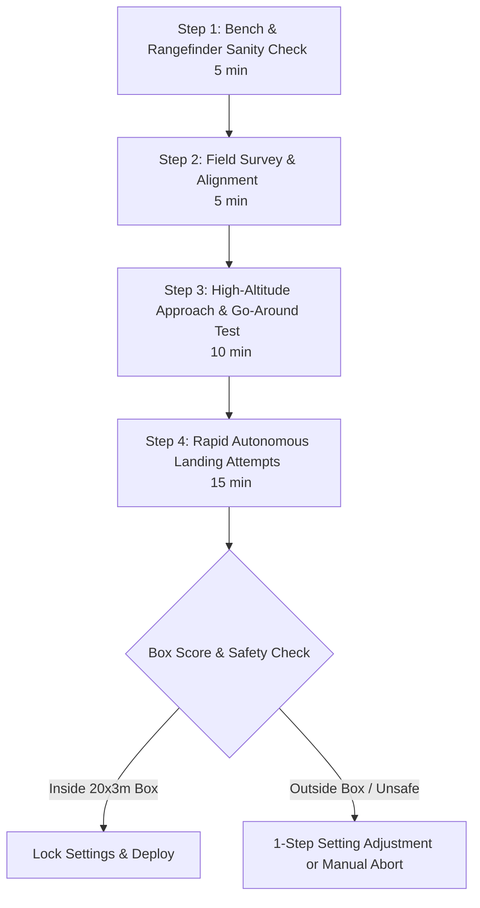

# Adam and EasyStar 3 Precision Landing Flight-Test Plan

This guide validates and tunes the autonomous precision landing developed for
the ZOHD Talon 250G aircraft **Adam** and the Multiplex **EasyStar 3**.

To accommodate varying field conditions, team schedules, and competition constraints, this document provides **two separate, complete flight-test plans**:

- **Part I: Option A — Minimal Express Test Plan (Time-Critical Protocol)**: A 4-step execution path designed for emergency field deployment when less than 30–45 minutes total remain before a flight window or competition deadline. It focuses exclusively on mandatory safety checks, simple geometry setup, one high-pass verification, and direct touchdown scoring.
- **Part II: Option B — Comprehensive Staged Validation Plan (Full Engineering Protocol)**: An 11-phase in-depth validation campaign (Phase 0 through Phase 10) for systematic sensor calibration, aerodynamic characterization, safety state-machine verification, parameter tuning, and wind envelope expansion when full testing time is available.

---

## Software validation status, 2026-09-13

This is a **simulation-tested development baseline, not flight or competition clearance**. Both aircraft complete the autonomous approach and land inside the 20 x 3 m box in the tested calm-air cases. The controller, telemetry, test plan, and reusable NPS harness are implemented in [sw/airborne/modules/nav/precision_landing.c](sw/airborne/modules/nav/precision_landing.c) and [sw/simulator/nps/nps_fixedwing_tuning.py](sw/simulator/nps/nps_fixedwing_tuning.py). M10 absolute position error, surveyed TD accuracy, real crow aerodynamics, sand contact, and sensor outages still require the staged flight tests below. The available evidence does not establish a probability of success or an operational wind envelope.

Representative first-contact measurements from the saved simulation runs:

| Aircraft / run under `var/nps_precision_landing/` | Along TD (m) | Across (m) | Sink (m/s) | Pitch (deg) |
| --- | ---: | ---: | ---: | ---: |
| Adam, final source `adam_release_check` | +1.60 | +1.06 | 1.22 | +0.90 |
| EasyStar, final source `easystar_release_check` | +4.09 | +0.77 | 0.70 | +3.73 |
| Adam, `adam_final_repeat` | +1.55 | +1.06 | 1.23 | +0.88 |
| Adam, `adam_crosswind1` | +1.33 | +1.01 | 1.24 | +0.82 |
| EasyStar, `easystar_baseline_final` | +4.09 | +0.77 | 0.71 | +3.71 |
| EasyStar, `easystar_repeat_final` | +4.09 | +0.77 | 0.71 | +3.71 |
| EasyStar, `easystar_crosswind1` | +4.24 | +0.61 | 0.72 | +3.69 |

Positive along-track error means beyond `TD`. Crosswind cases used the simulator wind setting of 1 m/s at 0 degrees. One earlier 2 m/s, 90-degree wind case landed +9.36 m along and +1.07 m across: inside the official box but outside the retained longitudinal margin. Do not interpret this as tailwind approval. Identical repeated results can reflect deterministic simulation, not independent real-world trials. Adam's roughly 1.2 m/s contact sink remains a particular bench/flight-validation concern.

The separate `easystar_reject_verified` run rejected an unsuitable 7.5 m/s, 10 m final-height configuration and climbed above 25 m without contact. Host tests in [tests/modules/test_precision_landing_controller.c](tests/modules/test_precision_landing_controller.c) and [sw/simulator/nps/test_fixedwing_landing.py](sw/simulator/nps/test_fixedwing_landing.py) exercise the actual controller for stale/future AGL timestamps, sensor-height handover, low/invalid airspeed, invalid state, degenerate final, prediction rejection, maximum-brake overshoot, retry reset, and brake cleanup. They do not replace flight validation of these failure cases.

First-contact positions are the **aircraft CG position at the first JSBSim structural contact**, not the footprint of the belly contact point. The log captures contact at the physics timestep, including wingtip contacts; scoring acceptance requires one of the two belly contacts in these two models. The harness requires this log for a successful precision-landing run. A height crossing alone is insufficient because it can be a sample after a bounce. Provisional contact gates are finite data, sink 0-1.5 m/s, absolute bank at most 8 degrees, and pitch 0-15 degrees; these are development gates, not proven airframe structural limits. Internal-margin results are reported separately.

### Reproduce the tests

From the Paparazzi repository root, build each aircraft with its own telemetry UDP pair. A separate Ivy bus alone does **not** isolate telemetry ports.

```sh
make -f Makefile.ac AIRCRAFT=Adam_Precision_Landing_Test \
  CONF_XML=conf/userconf/OPENUAS/openuas_precision_landing_test_conf.xml \
  MODEM_PORT_OUT=42258 MODEM_PORT_IN=42259 \
  USER_CFLAGS=-DNPS_JSBSIM_CONTACT_LOG=1 nps.compile

make -f Makefile.ac AIRCRAFT=Easystar_3_Precision_Landing_Test \
  CONF_XML=conf/userconf/OPENUAS/openuas_easystar3_precision_landing_test_conf.xml \
  MODEM_PORT_OUT=42270 MODEM_PORT_IN=42271 \
  USER_CFLAGS=-DNPS_JSBSIM_CONTACT_LOG=1 nps.compile

python3 sw/simulator/nps/nps_fixedwing_tuning.py \
  --aircraft Adam_Precision_Landing_Test --ac-id 129 --scenario precision-landing \
  --settle-seconds 20 --measure-seconds 4 --bus 127.255.255.255:2166 \
  --udp-port 42258 --udp-uplink-port 42259 --output-dir var/nps_precision_landing/adam_new

python3 sw/simulator/nps/nps_fixedwing_tuning.py \
  --aircraft Easystar_3_Precision_Landing_Test --ac-id 135 --scenario precision-landing \
  --settle-seconds 20 --measure-seconds 4 --bus 127.255.255.255:2165 \
  --udp-port 42270 --udp-uplink-port 42271 --output-dir var/nps_precision_landing/easystar_new
```

Use a new output directory per run. `--setting NAME=VALUE` supports controlled parameter trials; `--wind-speed` and `--wind-direction` set simulator wind. To reproduce rejection, add `--setting landing_airspeed=7.5 --setting final_height=10 --expect-go-around` to the EasyStar command. Do not lower the harness's 20 m climb gate to make a failed launch pass. Both models launch at 1.6 m and 10 m/s without a fabricated vertical throw. The flight plan converts the radian-valued `TAKEOFF_PITCH_ANGLE` to degrees before the flight-plan generator applies its normal degree-to-radian conversion.

The generator can retain a stale settings header when flight-plan variables change. If a known variable is absent, mark only the corresponding generated [var/aircrafts/Adam_Precision_Landing_Test/nps/generated/settings.h](var/aircrafts/Adam_Precision_Landing_Test/nps/generated/settings.h) or [var/aircrafts/Easystar_3_Precision_Landing_Test/nps/generated/settings.h](var/aircrafts/Easystar_3_Precision_Landing_Test/nps/generated/settings.h) older (for example with `touch -d '1970-01-02'`) and rebuild. The harness rejects unsupported settings before starting processes. Never reset the source harness to solve a build issue.

```sh
python3 -m unittest discover -s sw/simulator/nps -p test_fixedwing_landing.py -v
gcc -std=c11 -Wall -Wextra -Werror \
  -Itests/modules/precision_landing_stubs -Isw/airborne -Isw/include \
  tests/modules/test_precision_landing_controller.c \
  sw/airborne/modules/nav/precision_landing.c -lm -o /tmp/test_precision_landing_controller
/tmp/test_precision_landing_controller
```

Both `ap` hardware targets have also built successfully. The isolated test entries use the high-rate [conf/telemetry/OPENUAS/openuas_nps_fixedwing_tuning.xml](conf/telemetry/OPENUAS/openuas_nps_fixedwing_tuning.xml) telemetry profile; do not deploy that profile on a bandwidth-limited radio without a link budget.

### Landing telemetry

The test profile schedules `SONAR` at 20 Hz and `DEBUG_VECT` at 10 Hz. The landing module registers the sender; a schedule entry without a sender does not publish data. Vector name `precision_landing` has these float fields, in order: autopilot uptime (s), filtered AGL (m), filtered sink (m/s), remaining along-track distance (m), cross-track error (m), predicted longitudinal error (m), predicted cross-track error (m), brake fraction, AGL-fresh flag, abort flag, and commit-flare flag. Prediction fields are held once final is exited; use `NAVIGATION` block/stage to interpret them. `COMMANDS` records the actual brake demand, including flare. Test CSV column `airspeed` is historical naming for the NPS ground-velocity magnitude; use `measured_airspeed` for the pitot value. UDP device and ports belong to modem configuration, not the message schedule.

---

## Objective, Scoring Geometry, & System under Test

IMAV2026 section 5.2.1 defines two fixed-wing landing areas:

| Result | Area | Score |
| --- | --- | --- |
| Precision landing | 20 x 3 m | 2 points |
| Landing zone | 50 x 5 m | 1 point |
| Outside both areas | Outside 50 x 5 m | 0 points |

The rulebook does not specify an abort, go-around, or retry limit. It requires fully autonomous flight, safe return to the designated landing area, and work within the shared 30-minute slot. The test plan allows two automatic retries after the initial approach. Confirm with the organizers that an autonomous retry is accepted before competition day.

The waypoint `TD` marks the center of the 20 x 3 m precision box. The initial predicted first-contact aim is 6 m before `TD`, which is 4 m inside the entry edge and leaves 16 m for flare float. The controller rejects recoverably bad predictions outside these internal limits:

| Axis | Controller limit | Official half-size | Retained margin |
| --- | ---: | ---: | ---: |
| Along final | 8.0 m from `TD` | 10.0 m | 2.0 m |
| Across final | 1.2 m from centerline | 1.5 m | 0.3 m |

The scored quantity should be recorded as the first belly contact position. Both foam aircraft have no landing gear and little expected rollout on sand, but final rest position should also be recorded until competition judging practice is confirmed.

### System under test

Use one of these isolated aircraft entries with the shared flight plan [conf/flight_plans/TUDELFT/tudelft_imav2026_o_test_pricise_landing.xml](conf/flight_plans/TUDELFT/tudelft_imav2026_o_test_pricise_landing.xml):

| Aircraft | Test configuration |
| --- | --- |
| Adam | [conf/userconf/OPENUAS/openuas_precision_landing_test_conf.xml](conf/userconf/OPENUAS/openuas_precision_landing_test_conf.xml) |
| EasyStar 3 | [conf/userconf/OPENUAS/openuas_easystar3_precision_landing_test_conf.xml](conf/userconf/OPENUAS/openuas_easystar3_precision_landing_test_conf.xml) |

Competition aircraft bindings are intentionally unchanged.

The landing system assigns one clear role to each available capability:

| Capability | Landing role |
| --- | --- |
| u-blox M10, 13 Hz, three constellations, SBAS, Airborne &lt;1g | Position and ground-velocity projection along and across final |
| SDP33 airspeed | Maintain stall margin and reject an unsafe low-energy approach |
| DPS310 plus IMU/GNSS vertical fusion | Glide control above rangefinder range and fallback commit-height estimate |
| VB22A, 100 Hz | Primary 4-to-0 m height and range-derived sink rate |
| Tuned ETECS | Hold the geometric glide and approach airspeed |
| Aileron crow | Proportional drag when predicted touchdown would pass the aim point |
| Flight-plan logic | Flare, bounded go-around retries, and live tuning variables |

The VB22A is centered in body X and Y on both aircraft. Its sensor plane is 0.004 m above the belly contact plane; `RANGEFINDER_I2C_OFFSET=0.004` converts its reading to belly clearance. No horizontal lever-arm correction is required. Rotation compensation remains enabled.

### Controller behavior & Dual-Band Braking

During final, the controller projects GNSS ground velocity onto the AF-to-TD axis. This naturally handles crab: nose heading may differ from runway heading, but only motion along the runway advances the touchdown estimate. Cross-track velocity predicts lateral drift at contact.

Using filtered AGL height $h$, filtered range-derived sink rate $v_z$, remaining along-track distance $d$, along-track groundspeed $v_a$, current cross-track error $c$, and cross-track groundspeed $v_c$:

$$
t_{contact} = \frac{h}{\max(v_z, 0.25)}
$$

$$
e_{long} = d - v_a t_{contact}
$$

$$
e_{cross} = c - v_c t_{contact}
$$

Negative $e_{long}$ predicts touchdown beyond `TD`; positive values predict a short touchdown. Crow is proportional to predicted travel beyond the selected upstream aim point. It is rate-limited and capped by each airframe's mixer.

Both simulation baselines use a 17 m final height and 9 m/s approach airspeed. The AF-to-TD route uses existing glide/energy guidance, with vertical aim shifted upstream by `aim_before_td` without moving `TD`. Above the precision decision band, excess height relative to this path commands at most 50% brake demand using the fused navigation state. In the final decision band, fresh VB22A AGL and range rate drive prediction. Range-rate initialization uses fused vertical speed and resets after measurement gaps. Flare kills throttle and limits bank to 8 degrees. Actual mixer travel caps remain aircraft-specific.

### Configuration baseline

Do not optimize several values at once. Start every new test campaign from this baseline and record every departure:

| Parameter | Adam | EasyStar 3 | Allowed test range | Purpose |
| --- | ---: | ---: | ---: | --- |
| `landing_airspeed` | 9.0 m/s | 9.0 m/s | 7.0-12.0 m/s | Tested simulation approach, not flight-certified speed |
| `final_height` | 17.0 m | 17.0 m | 10.0-25.0 m | Energy-controlled path over the 149 m final |
| `brake_agl` | 3.5 m | 3.5 m | 2.5-4.0 m | Highest AGL where predictive crow may engage |
| `flare_agl` | 2.0 m | 1.2 m | 0.5-2.5 m | Start of fixed-pitch flare |
| `aim_before_td` | 6.0 m | 6.0 m | 2.0-7.0 m | First-contact target before box center |
| `touchdown_pitch` | 4.0 deg | 4.0 deg | -5.0 to 10.0 deg | Commanded flare pitch; measured contact pitch differs |
| `flare_brake` | 0.30 | 0.65 | 0.0-0.75 | Flare demand before mixer cap |
| `landing_max_retries` | 2 | 2 | 0-5 | Automatic retries after the initial attempt |
| Crow mixer cap | 75% | 70% | Build-time | Preserve roll authority |
| Predictor brake gain | 0.08 | 0.05 | Build-time | Initial response; replace from flight data |
| Flare bank limit | 8 deg | 8 deg | Build-time | Correct drift without wingtip strike risk |

---

## Part I: Option A — Minimal Express Flight-Test Plan (Time-Critical Protocol)

Use Option A **only** when total available testing time before competition or flight window is restricted to 30–45 minutes. It skips multi-speed aerodynamic characterization and long-field parameter sweeps, reducing field operations to four essential steps that maximize safety while providing an autonomous landing result.



---

### Step 1: Pre-Flight Hardware, Servos, & Rangefinder Sanity (5 minutes)

1. **Power-On & Control Check**:
   - Remove propeller or restrain aircraft securely.
   - Power radio and avionics. Verify control surfaces respond correctly in `MANUAL`, `AUTO1`, and `AUTO2`.
   - Verify motor kill switch (`autopilot.kill_throttle = 1`) immediately disarms throttle in all modes.
2. **Crow Brake Bench Test**:
   - Trigger block `Crow brake bench test` from GCS (or select via settings).
   - Observe 3-second extension: both ailerons must move **upward** together.
   - While crow is extended, apply manual roll input: verify differential travel remains for roll control (at least 25% remaining travel).
3. **Rangefinder Quick Readout**:
   - Move hand or flat surface in front of the downward Surertech VB22A sensor (0.2 m to 3.0 m).
   - Confirm `sonar_distance` on GCS or telemetry updates continuously with correct distance.

**Pass Criteria**: Motors disarm, crow moves ailerons up without ruddervator coupling, roll control remains active during full crow, and rangefinder reads distance smoothly.

---

### Step 2: Field Survey, Waypoints, & Wind Alignment (5 minutes)

1. **Precision Box Layout**:
   - Lay out the 20 x 3 m precision landing box and outer 50 x 5 m landing zone into wind.
   - Mark center waypoint `TD` (Touchdown) at exact box center $(0, 0)$.
2. **Approach Fix (AF) Setup**:
   - Position `AF` (Approach Fix) ~149 m directly upstream along the runway centerline into wind.
   - Set `AF` altitude to 17.0 m above ground level (`ground_alt + 17.0`).
3. **Safety Pilot Briefing**:
   - Assign safety pilot with manual takeover switch.
   - Establish hard manual takeover triggers: lateral drift > 1.2 m from centerline, pitch attitude > 15° or < -10°, or airspeed dropping below 8.2 m/s (Adam) / 7.0 m/s (EasyStar).

---

### Step 3: High-Altitude Approach & Go-Around Verification (10 minutes)

1. **Launch**: Hand-launch aircraft at full throttle into wind (`Takeoff` block). Airspeed reaches ~10 m/s.
2. **Approach Intercept**: Select `Land Right AF-TD` or `Land Left AF-TD`. Aircraft enters baseleg and aligns with AF-to-TD centerline.
3. **Forced High Go-Around**:
   - As aircraft passes `AF` at 17 m and begins descent, verify `precision_landing` telemetry updates (`remaining_m`, `predicted_error_m`).
   - Allow descent to ~5 m AGL, then switch to `Standby` or command `go-around` from GCS.
   - Verify aircraft immediately retracts crow, applies full throttle, climbs straight along final heading to 25 m AGL, and enters standby circle.

**Pass Criteria**: Aircraft tracks final centerline within 1.0 m, rangefinder acquires at 4 m AGL, and manual/commanded go-around smoothly aborts descent without stall or wing drop.

---

### Step 4: Rapid Autonomous Precision Landing Attempts (15 minutes)

1. **Attempt 1**:
   - Relaunch or command `Land Right AF-TD` from standby circle.
   - Allow autonomous approach, predictive crow braking (below 3.5 m AGL), and fixed-pitch flare (below 2.0 m Adam / 1.2 m EasyStar).
   - Safety pilot monitors flight path; takes manual control if hard limit is breached.
   - Record first belly contact location relative to `TD`.
2. **Attempt 2**:
   - Repeat approach and record second touchdown location.
3. **Express Decision Matrix**:

| Measured First Contact | Action |
| --- | --- |
| **Inside 20 x 3 m box** (both attempts) | **SUCCESS**: Lock settings, preserve logs, ready for competition. |
| **Long overshoot** (> +10 m past `TD`) | Increase `aim_before_td` by 1.0 m (max 7.0 m) or increase `flare_brake` by 0.10. Re-test once. |
| **Short contact** (> -10 m before `TD`) | Decrease `aim_before_td` by 1.0 m or lower `flare_agl` by 0.2 m. Re-test once. |
| **Lateral drift** (> 1.5 m off centerline) | Re-align `AF` to exact current wind vector. Check magnetometer/course alignment. |

---

## Part II: Option B — Comprehensive Staged Validation Plan (Full Engineering Protocol)

Use Option B when a full multi-session or 1–2 day testing campaign is available. This plan systematically isolates each sensor, actuator, aerodynamic, and algorithmic layer before committing to touchdown.

### Required test equipment and records

Bring:

- propeller removal tools and a restraint for actuator tests;
- tape measure, straight line, stakes, and visible markers for 20 x 3 m and 50 x 5 m rectangles;
- at least four surveyed reference marks, including both precision-box edges and `TD`;
- a phone or camera recording perpendicular to the touchdown line;
- charged flight and transmitter batteries;
- SD logging enabled when practical;
- a flight-test sheet for weather, parameters, results, and anomalies.

Log at minimum:

- GNSS position, velocity, fix, satellites, and ground speed;
- fused altitude and vertical speed;
- raw and filtered rangefinder distance;
- measured and commanded airspeed;
- attitude, desired attitude, and actuator commands;
- throttle and brake command;
- `precision_landing_remaining_m`;
- `precision_landing_cross_track_m`;
- `precision_landing_predicted_cross_track_m`;
- `precision_landing_predicted_error_m`;
- `precision_landing_brake_fraction`;
- abort, flare-commit, block, stage, and retry state.

For every flight, preserve the exact airframe, flight plan, settings, log, and weather note together. Do not compare landings from undocumented parameter sets.

---

## Phase 0: Software and geometry verification

### Phase 0 procedure

1. Build the selected hardware target. Use the EasyStar aircraft and configuration names for EasyStar tests:

   ```sh
   make -f Makefile.ac \
     AIRCRAFT=Adam_Precision_Landing_Test \
     CONF_XML=conf/userconf/OPENUAS/openuas_precision_landing_test_conf.xml \
     ap.compile
   ```

2. Build NPS:

   ```sh
   make -f Makefile.ac \
     AIRCRAFT=Adam_Precision_Landing_Test \
     CONF_XML=conf/userconf/OPENUAS/openuas_precision_landing_test_conf.xml \
     nps.compile
   ```

3. Run the projection tests:

   ```sh
   gcc -std=c11 -Wall -Wextra -Werror \
     -Isw/airborne -Isw/include \
     sw/airborne/modules/nav/test_precision_landing.c \
     -lm -o /tmp/test_precision_landing
   /tmp/test_precision_landing
   ```

4. Confirm `TD` is the surveyed center of the intended test rectangle.
5. Confirm AF-to-TD is aligned with the intended landing direction and wind.
6. Confirm AF is approximately 149 m from TD and has the aircraft-specific height from the baseline table.

### Phase 0 pass criteria

- AP and NPS builds complete without errors or warnings.
- Projection tests return exit status zero.
- `TD` survey uncertainty is substantially smaller than the 0.3 m retained lateral margin; otherwise increase the internal margin or improve surveying.
- The final has no obstacle and enough overrun space for early tests.

---

## Phase 1: Propeller-off actuator inspection

### Phase 1 procedure

1. Remove the propeller and power the selected aircraft normally.
2. Confirm control surfaces are neutral in MANUAL and AUTO modes.
3. Select `Crow brake bench test` once.
4. Observe the complete three-second extension and retraction.
5. While crow is extended, command small left and right roll inputs in an appropriate bench mode and verify differential authority remains.
6. Repeat five cycles while listening for servo binding and watching current.

### Phase 1 pass criteria

- Both ailerons move upward for positive brake demand.
- Travel is symmetric within visible/measured linkage tolerance.
- Extension and retraction are smooth; no surface snaps to its stop.
- At full crow, at least 25% command range remains for roll correction.
- Ruddervators remain responsive and do not move from brake command alone.
- No servo buzz, linkage flex, overheating, or excessive current occurs.

### Stop conditions

Stop immediately for reversed motion, binding, asymmetric travel, excessive current, or unexpected ruddervator movement. Correct mechanics or mixer signs before any powered test.

---

## Phase 2: Static VB22A characterization over sand

Use representative dry and, if relevant, damp competition-like sand.

### Phase 2 procedure

1. Hold the aircraft level at measured belly clearances of 4.0, 3.0, 2.0, 1.5, 1.0, 0.5, 0.2, 0.1, and 0.02 m.
2. Record at least 10 seconds at every height.
3. Repeat at +10 and -10 degrees pitch and roll to validate cosine correction.
4. Move smoothly from 4 m to contact at approximately 0.5, 1.0, and 1.5 m/s.
5. Repeat in direct sunlight and with the expected landing-area texture.

### Measurements

For each height calculate mean error, standard deviation, maximum excursion, dropout percentage, and update interval. For moving tests compare differentiated range rate with the imposed descent rate.

### Phase 2 pass criteria

- Valid data remains continuous from 4 m to the belly contact plane.
- Mean corrected AGL error is within 0.03 m.
- 95% of samples are within 0.05 m.
- No stale interval exceeds 0.25 s.
- Filtered range rate has the correct sign and no sustained error above 0.2 m/s during constant-rate motion.

If the sensor is more accurate than these limits, retain the measurements and tighten later acceptance bands only after flight vibration is included.

---

## Phase 3: GNSS, airspeed, and reference checks

### M10 verification

Before flight, confirm in u-center or a recorded configuration dump. Adam's known configuration is:

- navigation rate: 13 Hz;
- three constellations enabled;
- SBAS enabled;
- dynamic model: Airborne &lt;1g;
- UART4 and receiver baud: 460800;
- no unexpected fallback to a lower update rate.

Verify EasyStar 3 independently; its airframe notes currently state approximately 17 Hz with three constellations and SBAS. Do not silently assume it has Adam's 13 Hz profile.

With the selected aircraft stationary on `TD`, log at least five minutes. Calculate horizontal position spread and velocity noise. Repeat after moving to AF and back to TD.

### SDP33 verification

With motor off and pitot sheltered from wind, confirm plausible near-zero pressure without forcing a field zero in ambient wind. During a straight pass, confirm valid airspeed through the entire 8.2-12 m/s landing range.

### Phase 3 pass criteria

- GNSS fix remains valid and reported velocity does not show persistent lateral motion while stationary.
- Surveyed `TD` lies within the observed GNSS error budget plus the controller's 0.3 m lateral margin. If not, the 3 m scoring width cannot be guaranteed from standalone GNSS and the internal limit must not be relaxed to hide it.
- SDP33 remains valid with no zero values or dropouts during the approach-speed pass.
- Fused altitude changes smoothly and agrees with rangefinder trend through 4 m AGL.

---

## Phase 4: NPS rangefinder and state-machine test

Paparazzi NPS simulates the historical `sonar` sensor from JSBSim terrain AGL. Both targets use 100 Hz, 5 mm Gaussian noise, and 0.005-8 m limits. Adam uses a -0.02794 m CG-to-rear-belly correction; EasyStar 3 uses -0.0635 m. The AGL consumer accepts the simulated sender through ABI broadcast.

### Required scenarios

| Scenario | Input | Expected result |
| --- | --- | --- |
| Nominal | Zero wind, centered final | Range acquisition and flare at aircraft-specific settings |
| Headwind | Reduced along-track groundspeed | Prediction moves short; crow reduces or remains off |
| Tailwind | Increased along-track groundspeed | Prediction moves long; crow demand increases |
| Crosswind | Lateral ground velocity | Predicted cross-track reflects drift, not crab heading |
| Recoverable miss | Predicted miss outside limits above 2.5 m | Automatic go-around |
| Late AGL loss | Loss at/below 2.5 m fused height | Commit to flare, no powered go-around |
| Early AGL loss | Loss in decision band above 2.5 m | Automatic go-around |
| GNSS loss | Loss above 2.5 m fused height | Automatic go-around |
| Retry exhaustion | Three rejected approaches at default setting | Two retries, then Standby |

---

## Phase 5: High-altitude crow characterization

Perform this phase in calm conditions at an altitude that permits immediate retraction and recovery. Do not combine it with a landing.

### Phase 5 procedure

1. Stabilize straight and level at the aircraft's baseline landing airspeed with clean surfaces.
2. Record at least 10 seconds of baseline airspeed, sink rate, pitch, and power.
3. Apply approximately 25% brake for three seconds, retract, and recover.
4. Repeat at 50%, then 75%, only if the previous step is stable.
5. Repeat each setting at least three times.
6. Repeat at 10 and 11 m/s if sufficient altitude and control margin remain.

### Derive

- brake-command to achieved surface deflection;
- transient pitch moment and steady pitch-control demand;
- change in sink rate at constant airspeed;
- deceleration after throttle reduction;
- remaining roll-control authority;
- extension and retraction time constants.

### Phase 5 pass criteria

- No divergent pitch, roll, or Dutch-roll response.
- Airspeed remains above the aircraft-specific minimum throughout each pulse: 8.2 m/s for Adam and 7.0 m/s for EasyStar 3.
- Roll response remains adequate at maximum tested brake.
- Retraction restores clean-flight trim without a dangerous balloon.
- Repeated pulses produce consistent sink and deceleration within 15%.

Use these measurements to add crow aerodynamics to JSBSim and select the first flight `BRAKE_GAIN`. Do not add fixed ruddervator brake compensation until the measured pitch moment establishes its sign and magnitude.

---

## Phase 6: Approach-only flight tests

Fly the exact AF-to-TD approach but command go-around no lower than 8 m AGL. Crow remains disabled because the VB22A control window has not yet been entered.

### Test matrix

| Run | Wind | Airspeed | Purpose |
| --- | --- | ---: | --- |
| A1-A3 | Calm | Aircraft baseline | Centerline and glide repeatability |
| A4-A6 | Light crosswind | Aircraft baseline | Crab and predicted lateral drift |
| A7-A9 | Light headwind | Aircraft baseline | Along-track prediction sensitivity |

### Phase 6 pass criteria

- At 8 m AGL, cross-track error is below 1.0 m on every accepted approach.
- Airspeed remains above the aircraft-specific minimum and within 1.0 m/s of its commanded baseline.
- No persistent roll oscillation or saturation occurs.
- AF intercept settles before descent and does not overshoot centerline.
- Predicted error changes in the physically correct direction with wind.

Reject the approach geometry or course tuning before proceeding if three consecutive approaches cannot meet these limits.

---

## Phase 7: Range-acquisition and brake approaches

Use a long unobstructed strip. Configure the plan to go around before flare for the first runs, or have the safety pilot ready to intervene under the approved test procedure.

### Phase 7 procedure

1. Fly three clean approaches through 4 m AGL to verify range acquisition.
2. Enable 25% maximum effective crow and fly three approaches.
3. Compare predicted touchdown before brake, after brake, and at the go-around gate.
4. Increase maximum effective crow only after stable results.
5. Test one light crosswind direction at a time.

### Phase 7 pass criteria

- AGL is fresh before `brake_agl` on every accepted approach.
- Range-derived sink rate agrees with fused vertical speed within 0.3 m/s once settled.
- Brake demand is smooth and changes predicted touchdown toward the aim point.
- Crow does not drive airspeed below 8.2 m/s.
- Predicted lateral contact remains within 1.2 m.
- Go-around retracts crow before climb demand and restores normal roll limit.

---

## Phase 8: Long-field automatic landings

Begin with calm wind and a landing area much larger than the scoring zone. Mark the virtual 20 x 3 m and 50 x 5 m boxes but do not place obstacles at their edges.

### Per-run procedure

1. Record wind speed/direction, surface state, battery voltage, and parameters.
2. Survey or verify `TD`.
3. Start logging before takeoff.
4. Select the desired left/right autonomous landing once.
5. Do not manually alter the approach unless required for safety.
6. Mark first belly contact and final rest position before moving the aircraft.
7. Measure along-track and cross-track error relative to `TD`.
8. Record whether an automatic retry occurred and why.
9. Inspect belly, propeller, control surfaces, pitot, and rangefinder.

### Advancement gates

Advance only after at least five consecutive landings satisfy all of:

- first contact inside 20 x 3 m;
- absolute cross-track error no more than 1.0 m;
- airspeed never below the aircraft-specific minimum before flare;
- no manual intervention;
- no uncontrolled bounce, wingtip strike, or excessive pitch impact;
- no unexplained AGL, GNSS, or airspeed dropout;
- automatic retry behavior matches the logged rejection reason.

### Touchdown-pitch experiment

Only after five level-contact landings pass, compare `touchdown_pitch` values of 0, 2, and 4 degrees. Run at least three landings per value in comparable wind. A slight nose-up flare command is recommended for these foam belly landers with elevated pusher propellers to:

- reduce longitudinal touchdown spread or flare float;
- decrease measured sink rate at contact;
- prevent nose digging, bounce, or pitch oscillation;
- preserve the same lateral acceptance rate.

---

## Phase 9: Parameter tuning matrix

Change one parameter family per test set and retain at least three repeats.

### Long or floating touchdown

In order:

1. Increase `aim_before_td` in 0.5 m steps, no higher than 7 m.
2. If prediction remains long before flare, raise `brake_agl` by 0.25 m.
3. If crow is effective but too weak, increase `BRAKE_GAIN` conservatively after high-altitude characterization.
4. If touchdown prediction is correct but flare floats, lower `flare_agl` by 0.1-0.2 m.

### Short touchdown

In order:

1. Decrease `aim_before_td` by 0.5 m.
2. Lower `brake_agl` by 0.25 m.
3. Reduce `BRAKE_GAIN` if brake remains active despite a short trend.
4. Raise `flare_agl` only if sink arrest, not energy, caused the short contact.

### Lateral miss

1. Verify surveyed `TD`, AF alignment, and M10 repeatability.
2. Compare current and predicted cross-track errors. A growing predicted error indicates unresolved crosswind drift; heading/crab alone is not an error.
3. Inspect course-loop saturation and roll response before changing gains.
4. Improve final alignment or course control; do not simply widen the 1.2 m gate beyond the scoring box.

### Hard touchdown

1. Compare range-derived sink rate at flare with pitch response.
2. Raise `flare_agl` in 0.1 m steps if pitch response is too late.
3. Reduce crow near flare if sink cannot be arrested.
4. Do not reduce approach airspeed below the aircraft-specific minimum to soften impact.

---

## Phase 10: Wind envelope expansion

Expand only after calm-air repeatability. Test separate headwind and crosswind components because total wind speed alone does not describe landing risk.

For each wind bin, require at least five accepted approaches and report mean, standard deviation, and worst-case touchdown error:

| Bin | Headwind component | Crosswind component | Required evidence |
| --- | ---: | ---: | --- |
| W0 | 0-2 m/s | 0-1 m/s | Baseline repeatability |
| W1 | 2-4 m/s | 0-2 m/s | Groundspeed prediction and crab |
| W2 | 0-4 m/s | 2-3 m/s | Lateral convergence and 8 deg flare bank cap |
| W3 | Site-specific | Site-specific | Only after W0-W2 pass |

Set the operational competition wind limit from evidence, not the strongest single successful landing. Stop expanding when any safety or scoring gate fails.

---

## Abort and retry state-machine logic

In the precision decision band (above 2.5 m and at/below `brake_agl`), the controller rejects an approach for:

- invalid or low airspeed;
- predicted lateral contact outside 1.2 m persisting for 0.2 s;
- predicted short contact beyond 8 m persisting for 0.2 s;
- predicted overshoot beyond 8 m while approach brake demand is at least 95% of its controller maximum, persisting for 0.2 s;
- inadequate forward progress;
- rangefinder loss when fused height also requires the close-range decision.

Above this band, fused height and vertical speed support bounded braking; lack of AGL does not alone trigger rejection. At/below 2.5 m fused height, AGL loss commits to flare rather than a low powered turn. GNSS loss is checked throughout final with the same 2.5 m commit-height rule. These fallback heights depend on altitude-reference accuracy and need fault-injection flight validation. A go-around retracts crow, restores normal bank limits and nominal airspeed, climbs on the final heading to 25 m before turning back, rejoins the baseleg, and retries at most twice. Controller state is reset on final entry, before exceptions run. Passing TD while still high goes around, not straight into flare. Leaving final or flare clears crow and restores the bank limit. After commit, flare braking is a fixed tested demand, not a closed-loop touchdown predictor; do not treat the provisional stall/energy protection as a validated flare envelope.

The safety pilot may always intervene to prevent injury or damage. Record that intervention because competition scoring may apply the manual autonomy factor.

---

## Flight-test record template

| Field | Value |
| --- | --- |
| Date/time and pilot | |
| Aircraft | |
| Airframe/configuration revision | |
| Log name | |
| Surface and moisture | |
| Wind mean/gust/direction | |
| M10 rate/constellations/SBAS/model | |
| `landing_airspeed` | |
| `brake_agl` | |
| `flare_agl` | |
| `aim_before_td` | |
| `touchdown_pitch` | |
| Maximum brake fraction reached | |
| AGL acquired height | |
| AGL dropout count/max duration | |
| Airspeed minimum before flare | |
| Predicted error at flare, longitudinal/lateral | |
| First-contact error, longitudinal/lateral | |
| Final-rest error, longitudinal/lateral | |
| Retry count and reason | |
| Manual intervention | |
| Damage or anomaly | |
| Pass/fail and next single change | |

## Competition readiness gate

The landing is ready for competition integration only when all are true:

- crow bench and high-altitude tests pass;
- VB22A passes static and moving sand tests from 4 m to contact;
- at least ten consecutive autonomous landings are inside 20 x 3 m;
- the worst lateral first-contact error is at most 1.2 m;
- at least five of those landings cover the approved crosswind envelope;
- automatic abort/retry is demonstrated for GNSS, AGL, airspeed, and predicted boundary failures;
- no parameter has been changed since the validating test set;
- organizer interpretation of autonomous retry and judged contact/rest position is recorded;
- battery reserve supports the initial approach plus configured retries.

Only after this gate should the isolated test plan be integrated into the competition mission configuration.
